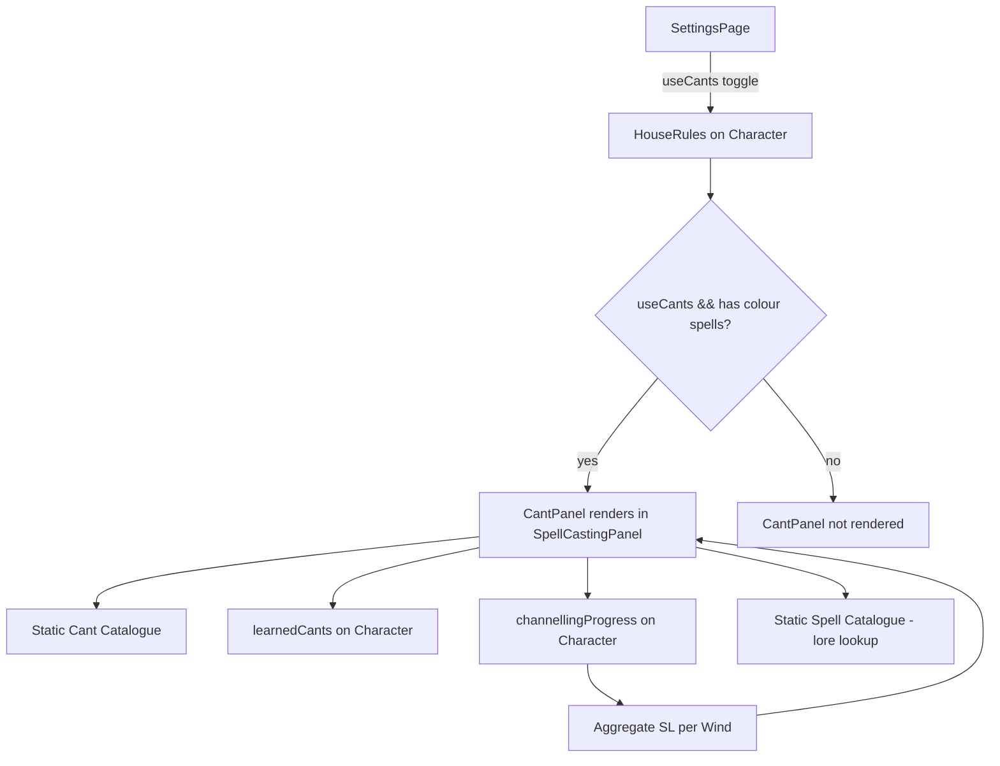

# Design Document: Alternative Channelling Cants

## Overview

This design introduces Alternative Channelling Cants—an optional house rule from Archives of the Empire Volume III—into the PWA character sheet. Cants are minor magical effects powered by expending gathered channelling SL (Success Levels). Each of the 8 Winds of Magic has 3 Cants costing 1, 2, or 3 SL respectively (24 total).

The feature follows the established house-rule toggle pattern (`useCants` on `HouseRules`) and integrates directly with the existing `channellingProgress` system. Because channelling progress is currently tracked per-spell, the Cant activation logic must aggregate SL across all channelling entries whose spell belongs to the same Wind, then deduct from a chosen entry when a Cant is activated.

### Key Design Decisions

| Decision | Rationale |
|----------|-----------|
| Static catalogue in `src/data/cants.ts` | Mirrors `spells.ts`, `rituals.ts` pattern; immutable at runtime, single source of truth |
| `learnedCants` as optional array on `Character` | Follows `learnedTechniques`, `knownRunes` pattern; backfill as `[]` on load |
| Aggregate SL per Wind from existing `channellingProgress` | No schema change to channelling; derive Wind from spell's `lore` field via static spell catalogue |
| SL deduction targets the spell with highest accumulated SL for that Wind | Deterministic, no user prompt needed; reduces the "most available" pool first |
| Cant panel rendered inside `SpellCastingPanel` per Lore group | Follows requirement 7.3; keeps channelling + cants co-located |
| One-Cant-per-round state stored in component state (not persisted) | Round-based constraint resets on round advance; no persistence needed |
| `useCants` toggle on `HouseRules` defaulting to `false` | Consistent with `usePsychologyTracker`, `useEnterprises` pattern |
| Spell count computed by matching character spell names to static catalogue | Handles custom/homebrew spells gracefully (excluded from count) |

## Architecture

The feature follows the existing data-driven, component-level architecture of the PWA. No new pages or major navigation changes are required.



### Data Flow for Cant Activation

```
User clicks "Activate" on a learned Cant
    │
    ├─ Validate: aggregated SL for Wind ≥ Cant's SL cost
    ├─ Validate: no Cant already activated this round
    ├─ (If variable SL) Show numeric input capped at min(available SL, WP Bonus)
    │
    ├─ Deduct SL cost from channellingProgress entries for that Wind
    │   └─ Strategy: deduct from entry with highest accumulatedSL first
    │       (split across entries if needed)
    │
    ├─ Set one-cant-per-round flag (component state)
    ├─ Show confirmation toast with Cant name, SL deducted, remaining SL
    └─ Re-render: update displayed SL, disable other Cant buttons
```

### Data Flow for Learning a Cant

```
User clicks "Learn" on an available (unlocked) Cant
    │
    ├─ Validate: spell count for that Lore meets threshold
    ├─ Validate: current learned cant count for Lore < permitted max
    ├─ Validate: Cant not already in learnedCants
    │
    ├─ updateCharacter: append { lore, cantName } to learnedCants
    └─ Re-render: Cant moves from "available" to "learned" visual state
```

## Components and Interfaces

### New Components

#### `CantPanel` (`src/components/shared/CantPanel.tsx`)

The primary UI component rendering learned and available Cants grouped by Lore.

**Props:**
```typescript
interface CantPanelProps {
  character: Character;
  updateCharacter: (mutator: (c: Character) => Character) => void;
  currentRound: number;  // from combatState.currentRound
}
```

**Responsibilities:**
- Compute spell counts per Lore (via catalogue lookup)
- Compute permitted Cant slots per Lore (1/3/6 spell thresholds → 1/2/3 slots)
- Aggregate channelling SL per Wind from `channellingProgress`
- Render Cant groups (learned, available, locked) per Lore
- Handle Cant learning/unlearning
- Handle Cant activation with SL deduction
- Enforce one-Cant-per-round limit
- Display validation warnings for over-limit states

#### `CantActivationDialog` (`src/components/shared/CantActivationDialog.tsx`)

A small modal/inline input for variable-SL Cants (where cost can range from minimum to WP Bonus).

**Props:**
```typescript
interface CantActivationDialogProps {
  cant: CantEntry;
  availableSL: number;
  wpBonus: number;
  onConfirm: (slSpent: number) => void;
  onCancel: () => void;
}
```

### New Logic Module

#### `src/logic/cants.ts`

Pure functions for Cant business logic, fully testable without UI:

```typescript
// Types
interface CantEntry {
  id: string;            // e.g. "beasts-face-of-the-wild"
  lore: string;          // e.g. "Lore of Beasts"
  name: string;          // e.g. "Face of the Wild"
  slCost: number;        // 1, 2, or 3
  effect: string;        // Full rules text
  variableSL?: boolean;  // true if Cant allows spending more SL (capped at WP Bonus)
}

interface LearnedCant {
  lore: string;    // Must match a COLOUR_LORES entry
  cantName: string; // Must match a CantEntry.name for that lore
}

// Core functions
function getSpellCountByLore(character: Character, spellCatalogue: SpellData[]): Map<string, number>;
function getPermittedCantSlots(spellCount: number): number;  // 0→0, 1-2→1, 3-5→2, 6+→3
function getAggregatedSLByWind(character: Character, spellCatalogue: SpellData[]): Map<string, number>;
function canActivateCant(cant: CantEntry, aggregatedSL: number, alreadyActivatedThisRound: boolean): boolean;
function deductSLFromProgress(
  channellingProgress: ChannellingProgress[],
  lore: string,
  slCost: number,
  spellCatalogue: SpellData[]
): ChannellingProgress[];
function validateLearnedCants(learnedCants: LearnedCant[], cantCatalogue: CantEntry[]): LearnedCant[];
function getCantsForLore(lore: string, cantCatalogue: CantEntry[]): CantEntry[];
function computeCantState(
  character: Character,
  cantCatalogue: CantEntry[],
  spellCatalogue: SpellData[]
): CantPanelState;
```

### New Data File

#### `src/data/cants.ts`

Static catalogue of all 24 Cants:

```typescript
export const COLOUR_LORES = [
  "Lore of Beasts",
  "Lore of Death",
  "Lore of Fire",
  "Lore of Heavens",
  "Lore of Metal",
  "Lore of Life",
  "Lore of Light",
  "Lore of Shadows",
] as const;

export type ColourLore = typeof COLOUR_LORES[number];

export interface CantEntry {
  id: string;
  lore: ColourLore;
  name: string;
  slCost: number;
  effect: string;
  variableSL?: boolean;
}

export const CANT_CATALOGUE: readonly CantEntry[] = [
  // Lore of Beasts (Ghur)
  { id: "beasts-face-of-the-wild", lore: "Lore of Beasts", name: "Face of the Wild", slCost: 1, effect: "..." },
  { id: "beasts-talons-of-ghur", lore: "Lore of Beasts", name: "Talons of Ghur", slCost: 2, effect: "..." },
  { id: "beasts-thick-hide", lore: "Lore of Beasts", name: "Thick Hide", slCost: 3, effect: "..." },
  // ... 21 more entries (3 per remaining 7 Lores)
] as const;
```

### Modified Types

#### `Character` type additions (`src/types/character.ts`)

```typescript
// Add to HouseRules interface:
export interface HouseRules {
  // ... existing fields ...
  useCants: boolean;
}

// Add to Character interface:
export interface Character {
  // ... existing fields ...
  learnedCants?: LearnedCant[];
}

// Add new type:
export interface LearnedCant {
  lore: string;
  cantName: string;
}
```

#### `BLANK_CHARACTER` default additions

```typescript
// HouseRules default:
houseRules: {
  // ... existing ...
  useCants: false,
}

// Character-level (optional field, backfilled on load):
learnedCants: [],
```

### Integration Points

| Existing Component | Change |
|---|---|
| `SettingsPage.tsx` | Add "Alternative Channelling Cants" toggle in house rules section |
| `SpellCastingPanel.tsx` | Conditionally render `CantPanel` after memorized spells per Lore group |
| `migration.ts` (`deepMerge`) | No change needed — `deepMerge` with `BLANK_CHARACTER` handles backfill automatically |
| `export-import.ts` | No change needed — array replacement merge handles `learnedCants` |
| `PrintLayout.tsx` | Conditionally include Cants section when `useCants` is true and `learnedCants` is non-empty |

## Data Models

### LearnedCant

```typescript
interface LearnedCant {
  lore: string;      // One of COLOUR_LORES values
  cantName: string;  // Must match a CantEntry.name in the catalogue for that lore
}
```

**Constraints:**
- Maximum 24 entries (3 per Lore × 8 Lores)
- No duplicate `{ lore, cantName }` pairs
- Each entry must reference a valid catalogue entry
- Invalid entries discarded on load

### CantEntry (Static Catalogue)

```typescript
interface CantEntry {
  id: string;           // Composite key: kebab-case "{lore-key}-{cant-name-slug}"
  lore: ColourLore;     // One of the 8 colour magic Lore strings
  name: string;         // Display name of the Cant
  slCost: number;       // 1, 2, or 3
  effect: string;       // Full mechanical rules text
  variableSL?: boolean; // If true, user can spend between slCost and WP Bonus
}
```

**Invariants:**
- Exactly 24 entries: 3 per Lore
- Each Lore has exactly one 1-SL, one 2-SL, and one 3-SL Cant
- Immutable at runtime

### CantPanelState (Derived, not persisted)

```typescript
interface CantLoreGroup {
  lore: ColourLore;
  windDisplayName: string;       // e.g. "Beasts (Ghur)"
  spellCount: number;            // Character's spells from this Lore
  permittedSlots: number;        // 0, 1, 2, or 3
  learnedCants: CantEntry[];     // Resolved from learnedCants refs
  availableCants: CantEntry[];   // Unlocked but not yet learned
  lockedCants: CantEntry[];      // Prerequisite not met
  aggregatedSL: number;          // Total SL across all channelling entries for this Wind
  canActivate: boolean;          // !alreadyActivatedThisRound && aggregatedSL > 0
}

interface CantPanelState {
  loreGroups: CantLoreGroup[];   // Only Lores where character has ≥1 spell
  hasOverLimitViolation: boolean; // True if any Lore has more learned Cants than permitted
  violationMessages: string[];   // Per-Lore messages about excess Cants
}
```

### Spell Count Thresholds

| Spells from Lore | Permitted Cants |
|---|---|
| 0 | 0 (Lore group not shown) |
| 1–2 | 1 |
| 3–5 | 2 |
| 6+ | 3 |

### Wind Display Names

| Lore String | Display Name |
|---|---|
| Lore of Beasts | Beasts (Ghur) |
| Lore of Death | Death (Shyish) |
| Lore of Fire | Fire (Aqshy) |
| Lore of Heavens | Heavens (Azyr) |
| Lore of Metal | Metal (Chamon) |
| Lore of Life | Life (Ghyran) |
| Lore of Light | Light (Hysh) |
| Lore of Shadows | Shadows (Ulgu) |


## Correctness Properties

*A property is a characteristic or behavior that should hold true across all valid executions of a system—essentially, a formal statement about what the system should do. Properties serve as the bridge between human-readable specifications and machine-verifiable correctness guarantees.*

### Property 1: CantPanel visibility biconditional

*For any* character, the CantPanel renders in the DOM if and only if `houseRules.useCants` is `true` AND the character has at least one spell whose lore matches one of the 8 colour magic Lore strings in the static spell catalogue.

**Validates: Requirements 1.2, 1.3, 1.6**

### Property 2: Backfill defaults on load

*For any* character JSON that is missing either the `useCants` field on `houseRules` or the `learnedCants` field, after deep-merging with `BLANK_CHARACTER`, `houseRules.useCants` shall be `false` and `learnedCants` shall be an empty array.

**Validates: Requirements 1.4, 8.2**

### Property 3: Toggle off retains learned Cants

*For any* character with a non-empty `learnedCants` array, setting `houseRules.useCants` to `false` and saving/loading the character shall produce a character whose `learnedCants` array is identical to the original.

**Validates: Requirements 1.5, 8.6**

### Property 4: Permitted Cant slots threshold

*For any* non-negative integer spell count from a colour magic Lore, `getPermittedCantSlots(spellCount)` shall return: 0 when spellCount is 0, 1 when spellCount is 1–2, 2 when spellCount is 3–5, and 3 when spellCount is 6 or greater.

**Validates: Requirements 3.1, 3.2, 3.3, 3.7**

### Property 5: Over-limit violation detection

*For any* character where the number of learned Cants for a given Lore exceeds `getPermittedCantSlots(spellCountForThatLore)`, the system shall detect a violation, prevent adding further Cants from any Lore, and include that Lore in violation messages.

**Validates: Requirements 3.4, 3.6**

### Property 6: Spell count excludes non-catalogue spells

*For any* character with arbitrary spells (including custom/homebrew entries), `getSpellCountByLore` shall count only those spells whose name exactly matches an entry in the static spell catalogue for a colour magic Lore.

**Validates: Requirements 3.5**

### Property 7: Cant activation gating

*For any* learned Cant and character state, `canActivateCant` returns `true` if and only if the aggregated SL for the Cant's Wind is greater than or equal to the Cant's SL cost AND no other Cant has been activated during the current round.

**Validates: Requirements 4.2, 4.4, 5.5**

### Property 8: SL deduction correctness

*For any* valid Cant activation (where canActivateCant returns true), after deducting the Cant's SL cost from the channelling progress entries for that Wind, the new aggregated SL for that Wind shall equal the previous aggregated SL minus the Cant's SL cost, and all other Winds' aggregated SL shall remain unchanged.

**Validates: Requirements 4.1**

### Property 9: Variable SL expenditure bounds

*For any* variable-SL Cant, the permitted expenditure range shall be `[cant.slCost, min(aggregatedSLForWind, wpBonus)]`, where wpBonus is derived from the character's Willpower characteristic.

**Validates: Requirements 4.6**

### Property 10: Cant categorization correctness

*For any* Cant in a Lore the character has access to (spellCount ≥ 1), the Cant shall be categorized as: "learned" if it appears in `learnedCants`, "available" if it does not appear in `learnedCants` but the character's learned Cant count for that Lore is below the permitted maximum, or "locked" if the character's learned Cant count for that Lore equals the permitted maximum and the Cant is not learned.

**Validates: Requirements 5.2, 5.3**

### Property 11: Lore groups match spell presence

*For any* character, the set of Lore groups displayed by the CantPanel shall exactly equal the set of colour magic Lores for which the character has at least 1 matching spell in the static catalogue.

**Validates: Requirements 5.4**

### Property 12: Lore groups ordered alphabetically

*For any* rendered CantPanel with multiple Lore groups, the groups shall appear in ascending alphabetical order by the Wind's common display name.

**Validates: Requirements 5.6**

### Property 13: Catalogue structural integrity

*For all* entries in `CANT_CATALOGUE`, each entry shall have a non-empty `id`, a `lore` matching one of the 8 colour lore strings, a non-empty `name`, an `slCost` in the set {1, 2, 3}, and a non-empty `effect` string.

**Validates: Requirements 6.2**

### Property 14: Catalogue lookup correctness

*For any* valid `{lore, cantName}` pair that exists in `CANT_CATALOGUE`, querying the catalogue by that pair shall return exactly one matching `CantEntry` with the correct id, slCost, and effect.

**Validates: Requirements 6.11**

### Property 15: SL aggregation per Wind

*For any* set of `channellingProgress` entries and a static spell catalogue, the aggregated SL for a given Wind shall equal the sum of `accumulatedSL` across all entries whose `spellName` maps to that Wind's Lore in the spell catalogue. Each Wind's aggregation shall be independent of other Winds.

**Validates: Requirements 7.1, 7.5**

### Property 16: learnedCants serialization round-trip

*For any* valid `learnedCants` array (entries exist in catalogue, no duplicates, length ≤ 24), serialising the character to JSON and deserialising it shall produce a `learnedCants` array with identical entries in the same order.

**Validates: Requirements 8.1, 8.3, 8.4**

### Property 17: Invalid entry filtering on load

*For any* `learnedCants` array containing a mix of valid and invalid entries (where invalid means the `{lore, cantName}` pair does not match any catalogue entry), `validateLearnedCants` shall return an array containing exactly the valid entries in their original order, with all invalid entries removed.

**Validates: Requirements 2.4, 2.5, 8.5**

### Property 18: Learned Cant display completeness

*For any* learned Cant rendered in the CantPanel, the rendered output shall contain the Cant's name, SL cost value, and full effect description text.

**Validates: Requirements 5.1**

## Error Handling

| Scenario | Handling |
|----------|----------|
| `learnedCants` contains invalid entries on load | `validateLearnedCants` silently discards invalid entries; no user-facing error |
| Character's spell count drops creating an over-limit violation | Warning banner displayed in CantPanel listing affected Lores; all "Learn" actions disabled globally until resolved |
| Cant activation attempted with insufficient SL | Activation button pre-disabled; if somehow triggered, activation is a no-op (defensive guard) |
| Cant activation attempted after one-per-round limit reached | All activation buttons pre-disabled; if somehow triggered, activation is a no-op |
| Variable SL input receives value outside valid range | Constrain input via `min`/`max` attributes; `onConfirm` clamps value before applying |
| `channellingProgress` references a spell not in the catalogue | That entry's SL is excluded from Wind aggregation (cannot determine Wind); entry itself is not modified |
| Static catalogue fails to load (impossible in bundled app) | TypeScript import ensures compile-time presence; no runtime fallback needed |
| Concurrent updates (e.g., round advance during activation) | React's batched state updates ensure consistency; component state resets on round change |

## Testing Strategy

### Unit Tests (Example-Based)

- **Settings toggle rendering**: Verify the "Alternative Channelling Cants" toggle appears in the house rules section with correct ON/OFF state
- **Catalogue data correctness**: Assert exact Cant names and SL costs for each of the 8 Lores (Requirements 6.3–6.10)
- **Round advance resets activation flag**: Verify advancing combatState.currentRound re-enables activation
- **Confirmation display after activation**: Verify toast/banner shows correct Cant name, SL cost, remaining SL
- **CantPanel within SpellCastingPanel**: Verify DOM positioning (Requirement 7.3)
- **Empty channelling state**: All activation buttons disabled when no channelling progress exists

### Property-Based Tests (fast-check)

Each property test runs a minimum of 100 iterations and uses generators for:
- Arbitrary `Character` states (with random spells from catalogue, random channellingProgress, random learnedCants)
- Arbitrary `learnedCants` arrays (valid and invalid entries)
- Random spell counts per Lore (0–20+)
- Random SL values (0–30+)

**Property test library**: `fast-check` (already in devDependencies)
**Test runner**: `vitest` (already configured)
**Minimum iterations**: 100 per property

Each property test will be tagged with:
```
// Feature: alternative-channelling-cants, Property {N}: {property_text}
```

**Key property tests to implement:**
1. Permitted slots threshold (Property 4)
2. Cant activation gating (Property 7)
3. SL deduction correctness (Property 8)
4. SL aggregation per Wind (Property 15)
5. learnedCants round-trip serialization (Property 16)
6. Invalid entry filtering (Property 17)
7. Cant categorization (Property 10)
8. Spell count excludes non-catalogue spells (Property 6)
9. Catalogue lookup correctness (Property 14)
10. Variable SL bounds (Property 9)

### Integration Tests

- **End-to-end Cant learning flow**: Render full SpellCastingPanel, learn a Cant, verify state updates
- **End-to-end Cant activation flow**: Render with channelling progress, activate a Cant, verify SL deduction and UI update
- **Save/load round-trip**: Save character with learned Cants, reload, verify data integrity
- **Over-limit recovery flow**: Remove a spell, verify violation warning, remove excess Cant, verify recovery
