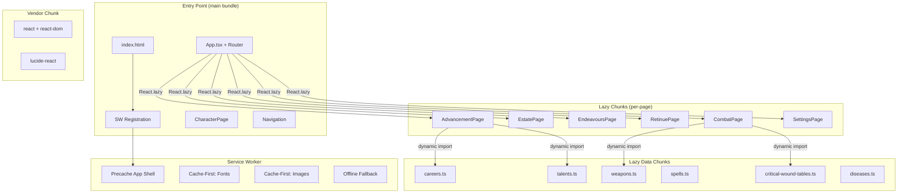

# Design Document: App Cleanup and Optimization

## Overview

This design covers a comprehensive codebase cleanup, housekeeping, and optimization pass for the WFRP 4e PWA Character Sheet. The work is organized into independent, parallelizable workstreams:

1. **Dead code & artifact removal** — Delete unused files, remove stale build artifacts from VCS, update `.gitignore`
2. **Logic consolidation** — Unify duplicate armour-point and wound calculations in `calculators.ts`; eliminate duplicated winner-determination in `dice-roller.ts`
3. **Performance optimization** — Code-split non-default pages via `React.lazy`, lazy-load static data modules, self-host fonts via `@fontsource`
4. **PWA hardening** — Implement a versioned service worker with precaching and offline fallback; improve manifest icons for installability
5. **Code quality** — Remove `as any` casts, add accessibility landmarks, clean up CSS, organize root directory

The guiding principle is **zero behavioral regression**: existing tests must continue to pass, public API signatures remain unchanged, and the user-facing application behaves identically (faster).

## Architecture



### Key Architectural Decisions

| Decision | Rationale |
|----------|-----------|
| Keep CharacterPage in main bundle | It's the default route (>90% of first-load navigations land here) |
| `manualChunks` for vendor split | Vendor code changes rarely; separate chunk maximizes cache hits |
| Versioned SW with `CACHE_VERSION` constant | Simple cache-busting on deploy without workbox dependency |
| `@fontsource` instead of CDN | Zero external network dependency offline; fonts bundled as ES imports |
| Unified AP function with options object | Single implementation, caller chooses worn-filter and shield via options |
| `resolveOpposedTest` delegates to `calculateOpposedResult` | Single source of truth for winner logic; easier to test and maintain |

## Components and Interfaces

### 1. Calculator Module — Unified Armour Point Interface

```typescript
// src/logic/calculators.ts

export interface ArmourPointOptions {
  /** If true, only include items where worn === true. Default: false (all items). */
  filterByWorn?: boolean;
  /** If true, include shield AP in the result. Default: false. */
  includeShield?: boolean;
}

export interface APResult {
  head: number;
  leftArm: number;
  rightArm: number;
  body: number;
  leftLeg: number;
  rightLeg: number;
  shield: number;
}

/**
 * Unified armour-point calculation.
 * Replaces both calculateArmourPoints and computeAPByLocation.
 */
export function calculateArmourPointsUnified(
  armourItems: ArmourItem[],
  options?: ArmourPointOptions
): APResult;

// Legacy wrappers (preserved for backward compatibility)
export function calculateArmourPoints(armourList: ArmourItem[]): ArmourPoints;
export function computeAPByLocation(armourItems: ArmourItem[]): APByLocation;
```

**Design decision**: The unified function uses an options object for extensibility. The two legacy functions become thin wrappers that delegate to `calculateArmourPointsUnified` with appropriate options, then map the result to their existing return types.

### 2. Calculator Module — Wound Calculation Core

```typescript
// src/logic/calculators.ts

/**
 * Core wound calculation — single source of truth.
 * Both syncWoundFields and computeWoundMaximum delegate here.
 */
function calculateWoundsCore(
  strength: number,
  toughness: number,
  willpower: number,
  hardyLevel: number,
  woundsUseSB: boolean
): { total: number; sb: number; tb: number; wpb: number; hardy: number };
```

`syncWoundFields` extracts characteristic totals from the Character object, calls `calculateWoundsCore`, and returns the updated character. `computeWoundMaximum` passes raw numeric values directly and returns the `WoundMaxResult` shape. Neither contains independent calculation logic.

### 3. Dice Roller Module — Opposed Test Delegation

```typescript
// src/logic/dice-roller.ts

export function resolveOpposedTest(
  playerTarget: number,
  playerRoll: number,
  opponentTarget: number,
  opponentRoll: number
): OpposedTestResult {
  const playerResolution = resolveRoll(playerRoll, playerTarget);
  const opponentResolution = resolveRoll(opponentRoll, opponentTarget);

  // Delegate winner determination to calculateOpposedResult
  const opposed = calculateOpposedResult(
    playerResolution.sl,
    opponentResolution.sl,
    playerTarget,
    opponentTarget
  );

  return {
    playerRoll: Math.min(100, Math.max(1, playerRoll)),
    playerSL: playerResolution.sl,
    opponentRoll: Math.min(100, Math.max(1, opponentRoll)),
    opponentSL: opponentResolution.sl,
    netSL: opposed.netSL,
    winner: opposed.winner,
  };
}
```

### 4. React.lazy Router with Error Boundary

```typescript
// src/App.tsx (router section)
import { lazy, Suspense } from 'react';

const CombatPage = lazy(() => import('./components/pages/CombatPage'));
const EstatePage = lazy(() => import('./components/pages/EstatePage'));
const EndeavoursPage = lazy(() => import('./components/pages/EndeavoursPage'));
const RetinuePage = lazy(() => import('./components/pages/RetinuePage'));
const AdvancementPage = lazy(() => import('./components/pages/AdvancementPage'));
const SettingsPage = lazy(() => import('./components/pages/SettingsPage'));

// Suspense wrapper with accessible loading state
function PageLoader({ children }: { children: ReactNode }) {
  return (
    <Suspense fallback={<LoadingIndicator />}>
      <LazyErrorBoundary>
        {children}
      </LazyErrorBoundary>
    </Suspense>
  );
}

function LoadingIndicator() {
  return (
    <div role="status" aria-label="Loading page content">
      <span className={styles.spinner} />
      <span>Loading…</span>
    </div>
  );
}
```

**LazyErrorBoundary**: A specialized error boundary that catches chunk-load failures (`ChunkLoadError`) and renders a retry button that calls `window.location.reload()` or re-triggers the lazy import.

### 5. Service Worker (`public/sw.js`)

```javascript
const CACHE_VERSION = 'v1';
const SHELL_CACHE = `app-shell-${CACHE_VERSION}`;
const FONT_CACHE = `fonts-${CACHE_VERSION}`;
const IMAGE_CACHE = `images-${CACHE_VERSION}`;

const SHELL_URLS = [
  '/PWACharSheet/',
  '/PWACharSheet/index.html',
  '/PWACharSheet/offline.html',
  // JS and CSS chunks populated at build time or matched via pattern
];

self.addEventListener('install', (event) => {
  event.waitUntil(
    caches.open(SHELL_CACHE).then(cache => cache.addAll(SHELL_URLS))
  );
  self.skipWaiting();
});

self.addEventListener('activate', (event) => {
  event.waitUntil(
    caches.keys().then(keys =>
      Promise.all(
        keys.filter(k => !k.endsWith(CACHE_VERSION)).map(k => caches.delete(k))
      )
    ).then(() => self.clients.claim())
  );
});

self.addEventListener('fetch', (event) => {
  const { request } = event;
  const url = new URL(request.url);

  // Cache-first for fonts
  if (url.pathname.match(/\.(woff2?|ttf|otf)$/)) {
    event.respondWith(cacheFirst(request, FONT_CACHE));
    return;
  }

  // Cache-first for images
  if (url.pathname.match(/\.(svg|png|jpg|webp)$/)) {
    event.respondWith(cacheFirst(request, IMAGE_CACHE));
    return;
  }

  // Network-first for navigation, fallback to offline page
  if (request.mode === 'navigate') {
    event.respondWith(networkFirstWithOfflineFallback(request));
    return;
  }

  // Stale-while-revalidate for JS/CSS (app shell)
  event.respondWith(staleWhileRevalidate(request, SHELL_CACHE));
});
```

### 6. Vite Build Configuration

```typescript
// vite.config.ts — build section
build: {
  chunkSizeWarningLimit: 600,
  rollupOptions: {
    output: {
      manualChunks(id) {
        if (id.includes('node_modules')) {
          return 'vendor';
        }
        if (id.includes('src/data/')) {
          // Group small data modules; large ones get own chunk via dynamic import
          const file = id.split('src/data/')[1]?.split('.')[0];
          if (['careers', 'talents', 'weapons', 'spells', 'critical-wound-tables', 'diseases'].includes(file)) {
            return `data-${file}`;
          }
        }
      },
    },
  },
},
```

### 7. Font Self-Hosting

```typescript
// src/main.tsx or src/styles/fonts.ts
import '@fontsource/cinzel/400.css';
import '@fontsource/cinzel/600.css';
import '@fontsource/cinzel/700.css';
import '@fontsource/inter/300.css';
import '@fontsource/inter/400.css';
import '@fontsource/inter/500.css';
import '@fontsource/inter/600.css';
```

The Google Fonts `@import` in `global.css` is removed. The `@fontsource` packages include the font files which Vite bundles into the output.

### 8. Accessibility Additions

```html
<!-- index.html — skip-to-content link -->
<body>
  <a href="#main-content" class="skip-link">Skip to content</a>
  <div id="root"></div>
  ...
</body>
```

```css
/* global.css */
.skip-link {
  position: absolute;
  left: -9999px;
  top: auto;
  width: 1px;
  height: 1px;
  overflow: hidden;
  z-index: 9999;
}
.skip-link:focus {
  position: fixed;
  top: 8px;
  left: 8px;
  width: auto;
  height: auto;
  padding: 8px 16px;
  background: var(--bg-secondary);
  color: var(--parchment);
  border: 2px solid var(--accent-gold);
  border-radius: var(--radius-sm);
  text-decoration: none;
  font-family: var(--font-body);
}
```

The `PageContainer` component receives `id="main-content"` on its `<main>` element.

### 9. TypeScript Strictness Fixes

**talents.ts** — Replace `{} as any` with `Object.fromEntries`:
```typescript
const bonuses: Record<CharacteristicKey, number> = Object.fromEntries(
  ALL_CHAR_KEYS.map(key => [key, 0])
) as Record<CharacteristicKey, number>;
```
(The `as Record<...>` is acceptable — it's not `as any` — but we can use a typed helper if preferred.)

**migration.ts** — Add a generic signature to `deepMerge` that returns `T` directly:
```typescript
function deepMerge<T extends Record<string, unknown>>(target: T, source: Record<string, unknown>): T {
  // ... same logic ...
  return result as T; // safe: T is the target shape, source only adds known keys
}
```
The call sites become:
```typescript
const character = deepMerge(structuredClone(BLANK_CHARACTER), legacyData);
// Returns Character directly — no cast chain needed
```

### 10. Root Directory Organization

Files moved to `docs/`:
- `dwarfguide.md` → `docs/dwarfguide.md`
- `highelfguide.md` → `docs/highelfguide.md`
- `PLAYER-GUIDE.md` → `docs/PLAYER-GUIDE.md`
- `GAP_ANALYSIS.md` → `docs/GAP_ANALYSIS.md`
- `RULES_COMPLIANCE_AUDIT.md` → `docs/RULES_COMPLIANCE_AUDIT.md`
- `Errata.pdf` → `docs/Errata.pdf`

`.gitignore` updates: root-relative paths like `/dwarfguide.md` become `/docs/dwarfguide.md`. Glob patterns like `*.pdf` remain unchanged.

## Data Models

No new data models are introduced. Existing types remain unchanged:

- `ArmourItem`, `ArmourPoints`, `Character`, `CharacteristicKey`, `CharacteristicValue` — unchanged
- `APByLocation` — unchanged (returned by compatibility wrapper)
- `WoundMaxResult` — unchanged
- `OpposedResult`, `OpposedTestResult` — unchanged
- `RollResult` — unchanged

New interface added:
- `ArmourPointOptions` — options parameter for unified AP function
- `APResult` — unified return type with human-readable location names + shield

## Correctness Properties

*A property is a characteristic or behavior that should hold true across all valid executions of a system — essentially, a formal statement about what the system should do. Properties serve as the bridge between human-readable specifications and machine-verifiable correctness guarantees.*

### Property 1: Unified AP function equivalence (worn filter)

*For any* list of armour items, calling `calculateArmourPointsUnified(items, { filterByWorn: true })` SHALL produce AP values per location that are equivalent to the legacy `computeAPByLocation(items)` output for all six body locations.

**Validates: Requirements 3.1, 3.3**

### Property 2: Unified AP function equivalence (all items)

*For any* list of armour items, calling `calculateArmourPointsUnified(items, { filterByWorn: false })` SHALL produce AP values per location that are equivalent to the legacy `calculateArmourPoints(items)` output for all six body locations.

**Validates: Requirements 3.1, 3.4**

### Property 3: Wound calculation consistency

*For any* set of characteristic values (S, T, WP each in [0, 99]), hardy level in [0, 5], and woundsUseSB flag, `syncWoundFields` applied to a character with those characteristics SHALL produce wound component fields (wSB, wTB2, wWPB, wHardy) whose sum equals `computeWoundMaximum` called with the same raw values.

**Validates: Requirements 3.2, 3.3**

### Property 4: Opposed test delegation consistency

*For any* playerTarget in [1, 200], playerRoll in [1, 100], opponentTarget in [1, 200], and opponentRoll in [1, 100], the `winner` and `netSL` fields returned by `resolveOpposedTest(playerTarget, playerRoll, opponentTarget, opponentRoll)` SHALL equal the `winner` and `netSL` fields returned by `calculateOpposedResult(resolveRoll(playerRoll, playerTarget).sl, resolveRoll(opponentRoll, opponentTarget).sl, playerTarget, opponentTarget)`.

**Validates: Requirements 4.1, 4.3**

## Error Handling

| Scenario | Handling |
|----------|----------|
| Lazy page chunk fails to load | `LazyErrorBoundary` catches the error, displays "Page could not be loaded" with a Retry button |
| Lazy data module fails to load | Same pattern — error boundary within Suspense shows retry UI |
| Service Worker fetch fails (offline, no cache) | SW responds with `offline.html` fallback page |
| SW precache fails during install | `install` event rejects, browser retries on next navigation |
| Invalid armour data passed to unified AP function | Returns all-zeros `APResult` (non-negative floor ensures no negative values) |
| Migration encounters corrupted localStorage | Falls through to fresh-install path (existing behavior preserved) |

## Testing Strategy

### Testing Approach

This feature uses a **dual testing approach**:

- **Property-based tests** (fast-check): Verify universal correctness properties for the calculator and dice-roller consolidation logic (Requirements 3 & 4)
- **Unit tests** (vitest): Verify specific examples, error handling, UI rendering, and configuration checks
- **Smoke/integration tests**: Verify file structure, build output, and git state after cleanup

### Property-Based Testing Configuration

- Library: `fast-check` (already in devDependencies)
- Minimum iterations: 100 per property
- Test files:
  - `src/logic/__tests__/calculators.consolidation.property.test.ts`
  - `src/logic/__tests__/dice-roller.consolidation.property.test.ts`

Each property test is tagged with a comment referencing the design property:
```typescript
// Feature: app-cleanup-and-optimization, Property 1: Unified AP function equivalence (worn filter)
```

### Unit Test Coverage

| Area | Test Focus |
|------|-----------|
| LazyErrorBoundary | Renders error message on chunk failure; retry triggers reload |
| LoadingIndicator | Renders with `role="status"` and `aria-label` |
| ErrorBoundary | Renders with `role="alert"` |
| Skip-to-content | Link targets `#main-content`, visible on focus |
| Condition indicators | Text label present in badge |
| TypeScript strictness | Compile-time verification (tsc --noEmit) |

### Smoke/Configuration Tests

These can be implemented as a CI verification script or vitest test file that checks:
- No `as any` in `src/` (excluding test files if needed per Req 10)
- Build produces expected chunk count
- `.gitignore` contains required entries
- `manifest.json` has correct icon entries
- `offline.html` exists in `public/`
- Font files present in build output

### Test Execution

```bash
# Full test suite (unit + property)
npx vitest --run

# Property tests only
npx vitest --run src/logic/__tests__/*.property.test.ts

# Type check
npx tsc --noEmit -p tsconfig.app.json

# Build verification
npx vite build
```
