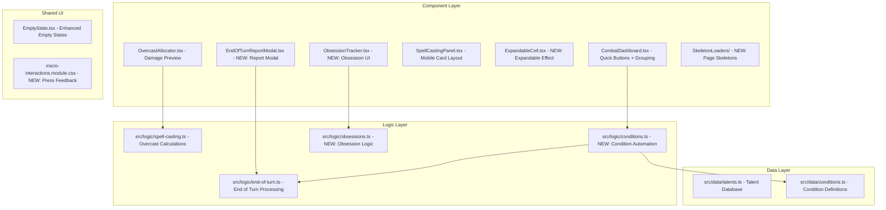

# Design Document: App Quality Improvements

## Overview

This design covers a comprehensive quality improvement pass for the WFRP 4e character sheet PWA, spanning four categories:

1. **Rules Compliance** (Req 1–4): Adding missing talent data from Up In Arms and Dwarf Player's Guide supplements, automating the Fatigued→Unconscious threshold rule, and documenting XP table extrapolation.
2. **Combat & Spell UX** (Req 5–9): Quick condition buttons, end-of-turn report modal, overcast damage preview, mobile spell card layout, and expandable effect cells.
3. **Feature Addition** (Req 10): Obsessions system for High Elf Yenlui mechanic.
4. **UI Polish** (Req 11–14): Skeleton loaders, empty state improvements, micro-interaction feedback, and combat dashboard visual grouping.

The implementation leverages the existing architecture: React 19 functional components, CSS Modules for styling, Zustand-compatible `useCharacter` hook for state, and the pure-function logic layer in `src/logic/`.

## Architecture

### High-Level Architecture

The changes fit into the existing layered architecture:



### Design Principles

- **Pure logic separation**: All business rules (condition thresholds, damage calculations, obsession state mapping) live in `src/logic/` as pure functions, testable without React.
- **Existing patterns**: New components follow established Card/Panel/Modal patterns. New data uses `{ name, max, desc }` talent format.
- **Progressive enhancement**: Mobile card layout and skeleton loaders degrade gracefully. Micro-interactions respect `prefers-reduced-motion`.
- **Minimal state additions**: Only the Obsession system adds new fields to the Character model. Other features use existing state or ephemeral component state.

## Components and Interfaces

### High-Level Component Design

#### 1. Talent Database Additions (Req 1–2)

**Approach**: Append new entries to `TALENT_DB` array in `src/data/talents.ts`. No new modules needed.

**Interface**: Unchanged — entries follow existing `TalentData` format:
```typescript
interface TalentData {
  name: string;  // Talent name
  max: string;   // Max level formula (e.g., "WS Bonus")
  desc: string;  // Rules description
}
```

#### 2. Fatigued-to-Unconscious Automation (Req 3)

**New module**: `src/logic/conditions.ts`

```typescript
export interface ConditionAutomationResult {
  conditions: Condition[];
  applied: string[];   // Names of conditions that were auto-applied
}

/**
 * Evaluate Fatigued→Unconscious threshold rule.
 * If Fatigued level >= TB, ensure Unconscious is present (add if missing, no duplicate).
 * If Fatigued < TB, do NOT remove Unconscious (GM discretion per RAW).
 */
export function evaluateFatiguedThreshold(
  conditions: Condition[],
  toughnessBonus: number
): ConditionAutomationResult;
```

**Integration point**: Called from `useCharacter` hook whenever conditions change (via effect or callback).

#### 3. Quick Condition Buttons (Req 5)

**Modified component**: `CombatDashboard.tsx`

```typescript
// New sub-component within CombatDashboard
interface QuickConditionButtonProps {
  conditionName: string;
  icon: LucideIcon;
  currentLevel: number;
  maxLevel: number;
  onApply: () => void;
}
```

**Conditions**: Bleeding, Stunned, Prone, Ablaze — positioned adjacent to existing condition badges.

#### 4. End-of-Turn Report Modal (Req 6)

**New component**: `src/components/combat/EndOfTurnReportModal.tsx`

```typescript
interface EndOfTurnReportModalProps {
  effects: EndOfTurnEffect[];
  result: EndOfTurnResult;
  onApply: () => void;
  onCancel: () => void;
}
```

**Flow**:
1. User presses "End Turn" → `processEndOfTurn()` called to compute effects (already exists)
2. Instead of immediately applying, results are passed to the new modal
3. Modal displays damage effects with breakdowns and reminder effects
4. "Apply" commits the pre-computed result; "Cancel" discards

**Integration**: Modify `CombatDashboard.tsx` End Turn handler to show modal before applying.

#### 5. Overcast Damage Preview (Req 7)

**Modified component**: `OvercastAllocator.tsx`

**New logic function** in `src/logic/spell-casting.ts`:

```typescript
/**
 * Compute overcast damage preview given base damage and allocation count.
 * Uses the OVERCAST_TABLE to determine the bonus damage for the allocated SL.
 */
export function computeOvercastDamagePreview(
  baseDamage: number,
  damageAllocation: number
): { base: number; bonus: number; total: number };
```

**UI addition**: A live-updating damage preview line below the damage allocation row showing "Base: X → Modified: Y".

#### 6. Mobile Spell Card Layout (Req 8)

**Modified component**: `SpellCastingPanel.tsx`

**Approach**: Use `useMediaQuery('(max-width: 767px)')` to conditionally render spell cards vs table rows. New CSS Module class `.spellCard` in `SpellCastingPanel.module.css`.

```typescript
// Conditional rendering within SpellCastingPanel
function SpellCard({ spell }: { spell: SpellItem }) {
  return (
    <article className={styles.spellCard} role="article" aria-label={`Spell: ${spell.name}`}>
      <header className={styles.cardHeader}>
        <span className={styles.spellName}>{spell.name}</span>
        <span className={styles.spellCN}>CN {spell.cn}</span>
      </header>
      <dl className={styles.cardFields}>
        <dt>Range</dt><dd>{spell.range}</dd>
        <dt>Target</dt><dd>{spell.target}</dd>
        <dt>Duration</dt><dd>{spell.duration}</dd>
        <dt>Effect</dt><dd>{spell.effect}</dd>
      </dl>
    </article>
  );
}
```

#### 7. Expandable Effect Cells (Req 9)

**New component**: `src/components/shared/ExpandableCell.tsx`

```typescript
interface ExpandableCellProps {
  text: string;
  maxWidth?: string;  // CSS max-width, defaults to responsive value
}

/**
 * Renders text with CSS truncation. Click toggles between truncated and expanded state.
 * Uses aria-expanded for accessibility.
 */
export function ExpandableCell({ text, maxWidth }: ExpandableCellProps): JSX.Element;
```

**CSS**: At viewport ≥ 1024px, `max-width` increases to reduce truncation frequency.

#### 8. Obsession Tracker (Req 10)

**New logic module**: `src/logic/obsessions.ts`

```typescript
export interface ObsessionData {
  description: string;     // Free-text obsession description
  relatedTests: string;    // Free-text related test types
}

export interface ObsessionDisplayState {
  showBenefit: boolean;
  showPenalty: boolean;
  benefitText: string;
  penaltyText: string;
}

/**
 * Determine display state for an obsession based on Yenlui state.
 * - Light: benefit only (+2 SL)
 * - Balanced: benefit + penalty warning
 * - Dark: penalty only (penalty applies even without benefit)
 */
export function getObsessionDisplayState(
  yenluiState: YenluiState | undefined,
  obsession: ObsessionData | undefined
): ObsessionDisplayState;
```

**New component**: `src/components/shared/ObsessionTracker.tsx`

```typescript
interface ObsessionTrackerProps {
  character: Character;
  updateCharacter: (mutator: (char: Character) => Character) => void;
}
```

**Integration**: Rendered within `YenluiPanel` when character is High Elf (species check using existing `isElf()` utility, refined to "High Elf" specifically).

#### 9. Skeleton Loaders (Req 11)

**New directory**: `src/components/skeletons/`

```typescript
// Per-page skeleton components
export function CombatSkeleton(): JSX.Element;
export function AdvancementSkeleton(): JSX.Element;
export function SettingsSkeleton(): JSX.Element;
```

**Integration**: Modify `PageLoader.tsx` to accept a `skeleton` prop and pass page-specific skeleton as the Suspense fallback instead of the generic `LoadingIndicator`.

```typescript
interface PageLoaderProps {
  children: ReactNode;
  skeleton?: ReactNode;  // NEW: page-specific skeleton fallback
}
```

#### 10. Empty State Improvements (Req 12)

**Modified component**: `EmptyState.tsx` (already exists with correct interface)

The existing `EmptyState` component already supports `icon`, `heading`, `description`, and `action` props. The work is ensuring all list panels (spells, weapons, talents, conditions) use it consistently with descriptive messages and CTA buttons.

**Panels to update**: SpellCastingPanel, WeaponCards, TalentsPanel (within CharacterPage), ConditionPicker area.

#### 11. Micro-interaction Feedback (Req 13)

**New CSS Module**: `src/styles/micro-interactions.module.css`

```css
.pressable {
  transition: transform 150ms ease;
}

.pressable:active {
  transform: scale(0.96);
}

@media (prefers-reduced-motion: reduce) {
  .pressable {
    transition: none;
  }
  .pressable:active {
    transform: none;
  }
}
```

**Integration**: Import and apply `.pressable` class to interactive buttons (dice roll, action buttons, condition buttons, quick-action bar).

#### 12. Combat Dashboard Visual Grouping (Req 14)

**Modified component**: `CombatDashboard.tsx`

**Approach**: Wrap existing elements in ARIA-labeled groups with CSS-based visual separation:

```tsx
<div role="group" aria-label="Status">
  {/* Wounds display, condition badges */}
</div>
<div className={styles.groupDivider} aria-hidden="true" />
<div role="group" aria-label="Actions">
  {/* Advantage counter, round counter, engaged toggle */}
</div>
```

**Responsive**: At `<768px`, groups stack vertically with consistent spacing. At `≥768px`, groups sit side-by-side with a subtle vertical divider.

#### 13. Extended XP Table Documentation (Req 4)

**Modified component**: `AdvancementPage.tsx` or advancement sub-component

**Approach**: Add an `InfoNote` (collapsible section or tooltip with ℹ️ icon) near the XP cost display that explains:
- Advances 1–50: costs match Core Rulebook table exactly
- Advances 51+: costs are extrapolated using the established progression formula

No logic changes needed — this is purely an informational UI addition.

### Low-Level Design

#### Fatigued-to-Unconscious (`src/logic/conditions.ts`)

```typescript
import type { Condition } from '../types/character';

export interface ConditionAutomationResult {
  conditions: Condition[];
  applied: string[];
}

export function evaluateFatiguedThreshold(
  conditions: Condition[],
  toughnessBonus: number
): ConditionAutomationResult {
  const fatigued = conditions.find(c => c.name === 'Fatigued');
  const hasUnconscious = conditions.some(c => c.name === 'Unconscious');

  // Only trigger if Fatigued level >= TB
  if (fatigued && fatigued.level >= toughnessBonus && !hasUnconscious) {
    return {
      conditions: [...conditions, { name: 'Unconscious', level: 1 }],
      applied: ['Unconscious'],
    };
  }

  // No change needed
  return { conditions, applied: [] };
}
```

**Hook integration** (in `useCharacter.ts` or as a side-effect):
```typescript
// After any condition update:
const result = evaluateFatiguedThreshold(character.conditions, getToughnessBonus(character));
if (result.applied.length > 0) {
  updateCharacter(char => ({ ...char, conditions: result.conditions }));
}
```

#### Overcast Damage Preview (`src/logic/spell-casting.ts`)

```typescript
/**
 * Look up overcast damage bonus from OVERCAST_TABLE for given SL allocation.
 * Returns { base, bonus, total } for display.
 */
export function computeOvercastDamagePreview(
  baseDamage: number,
  damageAllocation: number
): { base: number; bonus: number; total: number } {
  if (damageAllocation <= 0) {
    return { base: baseDamage, bonus: 0, total: baseDamage };
  }

  // Find highest matching row in OVERCAST_TABLE
  let bonus = 0;
  for (const row of OVERCAST_TABLE) {
    if (damageAllocation >= row.sl) {
      bonus = row.damage;
    } else {
      break;
    }
  }

  return { base: baseDamage, bonus, total: baseDamage + bonus };
}
```

#### Obsession Logic (`src/logic/obsessions.ts`)

```typescript
import type { YenluiState } from '../types/character';

export interface ObsessionData {
  description: string;
  relatedTests: string;
}

export interface ObsessionDisplayState {
  showBenefit: boolean;
  showPenalty: boolean;
  benefitText: string;
  penaltyText: string;
}

const BENEFIT_TEXT = '+2 SL on related Tests';
const PENALTY_BALANCED = 'Must take benefit first; penalty then applies';
const PENALTY_DARK = 'Penalty applies even without benefit';

export function getObsessionDisplayState(
  yenluiState: YenluiState | undefined,
  obsession: ObsessionData | undefined
): ObsessionDisplayState {
  if (!obsession || !obsession.description) {
    return { showBenefit: false, showPenalty: false, benefitText: '', penaltyText: '' };
  }

  switch (yenluiState) {
    case 'light':
      return { showBenefit: true, showPenalty: false, benefitText: BENEFIT_TEXT, penaltyText: '' };
    case 'balanced':
      return { showBenefit: true, showPenalty: true, benefitText: BENEFIT_TEXT, penaltyText: PENALTY_BALANCED };
    case 'dark':
      return { showBenefit: false, showPenalty: true, benefitText: '', penaltyText: PENALTY_DARK };
    default:
      return { showBenefit: false, showPenalty: false, benefitText: '', penaltyText: '' };
  }
}
```

#### End-of-Turn Report Modal (`src/components/combat/EndOfTurnReportModal.tsx`)

```typescript
import type { EndOfTurnEffect, EndOfTurnResult } from '../../logic/end-of-turn';

interface EndOfTurnReportModalProps {
  effects: EndOfTurnEffect[];
  result: EndOfTurnResult;
  onApply: () => void;
  onCancel: () => void;
}

/**
 * Displays computed end-of-turn effects for user review before committing.
 * 
 * Layout:
 * ┌─────────────────────────────────┐
 * │ End of Turn — Round X           │
 * ├─────────────────────────────────┤
 * │ ⚔️ Damage Effects               │
 * │   Bleeding 2: -2 wounds        │
 * │   Ablaze 1: rolled 7...        │
 * ├─────────────────────────────────┤
 * │ 📋 Reminders                    │
 * │   Stunned: Endurance Test req.  │
 * ├─────────────────────────────────┤
 * │ 🗑️ Auto-Removed                 │
 * │   Surprised                     │
 * ├─────────────────────────────────┤
 * │   [Cancel]        [Apply ✓]    │
 * └─────────────────────────────────┘
 */
```

#### Quick Condition Buttons (within `CombatDashboard.tsx`)

```typescript
const QUICK_CONDITIONS = [
  { name: 'Bleeding', icon: Droplets, stackable: true, maxLevel: 10 },
  { name: 'Stunned', icon: Zap, stackable: true, maxLevel: 10 },
  { name: 'Prone', icon: ArrowDown, stackable: false, maxLevel: 1 },
  { name: 'Ablaze', icon: Flame, stackable: true, maxLevel: 10 },
] as const;

function QuickConditionButton({ config, currentLevel, onApply }: {
  config: typeof QUICK_CONDITIONS[number];
  currentLevel: number;
  onApply: () => void;
}) {
  const atMax = currentLevel >= config.maxLevel;
  return (
    <button
      type="button"
      className={`${styles.quickCondBtn} ${pressableStyles.pressable}`}
      disabled={atMax}
      onClick={onApply}
      aria-label={`Add ${config.name}${currentLevel > 0 ? ` (currently ${currentLevel})` : ''}`}
    >
      <config.icon size={16} />
      <span>{config.name}</span>
      {currentLevel > 0 && <span className={styles.quickCondLevel}>{currentLevel}</span>}
    </button>
  );
}
```

**Apply logic**: Reuses existing condition-add logic from `ConditionPicker` — increment level if stackable and present, add at level 1 if not present.

#### Skeleton Loaders

Each skeleton matches the approximate layout of its target page using CSS shimmer rectangles:

```typescript
// src/components/skeletons/CombatSkeleton.tsx
export function CombatSkeleton() {
  return (
    <div className={styles.skeleton} role="status" aria-label="Loading page content">
      <div className={styles.shimmer} style={{ height: '80px' }} /> {/* Dashboard area */}
      <div className={styles.shimmer} style={{ height: '200px' }} /> {/* Weapon cards */}
      <div className={styles.shimmer} style={{ height: '150px' }} /> {/* Actions area */}
    </div>
  );
}
```

Shimmer animation uses CSS `@keyframes` with a linear gradient sweep.

#### ExpandableCell

```typescript
export function ExpandableCell({ text, maxWidth }: ExpandableCellProps) {
  const [expanded, setExpanded] = useState(false);

  return (
    <button
      type="button"
      className={`${styles.cell} ${expanded ? styles.expanded : styles.truncated}`}
      style={{ maxWidth: expanded ? 'none' : maxWidth }}
      onClick={() => setExpanded(!expanded)}
      aria-expanded={expanded}
      title={expanded ? 'Click to collapse' : text}
    >
      {text}
    </button>
  );
}
```

## Data Models

### Character Model Additions

The following fields are added to the `Character` interface in `src/types/character.ts`:

```typescript
// Add to Character interface:
export interface Character {
  // ... existing fields ...
  obsession?: ObsessionData;  // High Elf Obsession mechanic
}
```

`ObsessionData` is defined in `src/logic/obsessions.ts` (see Components section above).

### Talent Database Additions

New entries appended to `TALENT_DB` in `src/data/talents.ts`:

**Up In Arms talents** (Req 1):
- Beat Blade, Distract, Reversal, Shieldsman, Strike to Injure, Drilled (updated), Flee!, Gunner, Rapid Reload, Relentless, Roughrider, Crew Commander

**Dwarf Player's Guide talents** (Req 2):
- Ancestral Grudge, Bludgeoner, Demolisher, Dragon Belcher, Entrenchment, Forgefire, Glorious Demise, Harpooner, Kingsguard, Liquid Fortification, Long Memory, Magic Defiance, Master Rune Magic, Maverick, Rune Magic, Short Fuse, Tireless, Underminer, Whirlwind of Death

All entries use the established format: `{ name: string, max: string, desc: string }`.

### Condition Data

No changes to `CONDITIONS` array in `src/data/conditions.ts`. The Fatigued-to-Unconscious automation reads existing Fatigued/Unconscious definitions.

### Storage Impact

- `obsession` field persists via existing `saveCharacter()` → localStorage/IndexedDB path
- Migration: not required (optional field, defaults to `undefined`)
- Version bump: not required (additive change, existing characters load fine without it)

## Correctness Properties

*A property is a characteristic or behavior that should hold true across all valid executions of a system — essentially, a formal statement about what the system should do. Properties serve as the bridge between human-readable specifications and machine-verifiable correctness guarantees.*

### Property 1: Talent database structural consistency

*For any* entry in the `TALENT_DB` array, the entry shall have a non-empty `name` string, a non-empty `max` string, and a non-empty `desc` string.

**Validates: Requirements 2.3**

### Property 2: Fatigued-to-Unconscious automation correctness

*For any* character with a Toughness Bonus in [1..10] and any set of conditions containing Fatigued, after evaluating the Fatigued threshold: Unconscious is present in the result if and only if Fatigued level ≥ TB, and Unconscious appears at most once regardless of how many times the evaluation is repeated.

**Validates: Requirements 3.1, 3.2**

### Property 3: Quick condition application equivalence

*For any* character condition state and any of the four quick-conditions (Bleeding, Stunned, Prone, Ablaze), applying the condition via the quick-button logic shall produce the same resulting condition list as applying it via the full Condition_Picker logic (increment if stackable and present, add at level 1 if absent, no increment beyond maxLevel).

**Validates: Requirements 5.2, 5.4**

### Property 4: End-of-turn report completeness

*For any* `EndOfTurnResult` containing damage effects and reminder effects, the formatted report shall contain one entry per effect including: the condition name, the damage amount (for damage effects), and the description text (for all effects).

**Validates: Requirements 6.2, 6.3**

### Property 5: End-of-turn apply correctness

*For any* valid `EndOfTurnResult` and character state, applying the result shall set wounds to `result.newWounds`, remove all conditions in `result.removedConditions` from the character, and set the round counter to `result.roundAdvanced`.

**Validates: Requirements 6.6**

### Property 6: Overcast damage preview correctness

*For any* base spell damage ≥ 0 and damage allocation count ≥ 0, the computed damage preview shall equal the base damage plus the bonus from the highest matching OVERCAST_TABLE row, and the display shall contain both the base and total values.

**Validates: Requirements 7.2, 7.3, 7.4**

### Property 7: Spell card field completeness

*For any* spell data with non-empty fields, the rendered mobile card shall contain the spell name, CN value, range, target, duration, and effect text.

**Validates: Requirements 8.2, 8.3**

### Property 8: Effect cell toggle idempotence

*For any* effect text, clicking the expandable cell twice (expand then collapse) shall return the cell to its original truncated state. Formally: for any initial state S, toggle(toggle(S)) = S.

**Validates: Requirements 9.2, 9.3**

### Property 9: Obsession state-dependent display

*For any* obsession data and Yenlui state, `getObsessionDisplayState` shall return: benefit shown and no penalty when Light; benefit and penalty shown when Balanced; only penalty shown when Dark; nothing shown when state is undefined.

**Validates: Requirements 10.3, 10.4, 10.5**

### Property 10: Obsession data persistence round-trip

*For any* valid `ObsessionData` (description and relatedTests as non-empty strings), serializing to JSON and deserializing shall produce an equivalent object.

**Validates: Requirements 10.6**

## Error Handling

### Fatigued-to-Unconscious
- If `toughnessBonus` is 0 or negative (malformed data), treat as TB=1 to avoid divide-by-zero edge cases. Any Fatigued level ≥ 1 triggers Unconscious.
- If conditions array is undefined/null, return empty result with no applied conditions.

### End-of-Turn Report Modal
- If `processEndOfTurn` throws (unexpected), catch at the CombatDashboard level and show a Toast error. Do not apply partial effects.
- If effects array is empty (no conditions), show modal with "No end-of-turn effects" message and auto-advance round.

### Overcast Damage Preview
- If `baseDamage` is NaN or undefined, display "—" instead of a number.
- If `damageAllocation` exceeds available slots (shouldn't happen due to UI guards), clamp to available slots.

### Skeleton Loaders
- If skeleton component itself errors, fall back to the generic `LoadingIndicator` (unchanged behavior).
- Skeleton rendering must not access character data (it's shown before data is available).

### Obsession Tracker
- If character species is not "High Elf" but `obsession` data exists on model, silently retain data (don't delete) but don't render tracker. This supports species changes without data loss.

### Empty States
- If `action.onClick` handler throws, surface error via existing Toast mechanism.

### Talent Database
- No runtime error handling needed — this is static data. Validated at test time.

## Testing Strategy

### Property-Based Tests (fast-check)

Property-based testing applies to the pure logic functions in this feature. The project already uses `fast-check` with `vitest`. Each property test runs a minimum of 100 iterations.

**Test file locations** (following existing convention):
- `src/data/__tests__/talents.property.test.ts` — Property 1 (structural consistency)
- `src/logic/__tests__/conditions.property.test.ts` — Property 2 (Fatigued threshold), Property 3 (quick condition equivalence)
- `src/logic/__tests__/end-of-turn.property.test.ts` — Property 4 (report completeness), Property 5 (apply correctness)
- `src/logic/__tests__/spell-casting.property.test.ts` — Property 6 (overcast damage preview)
- `src/logic/__tests__/obsessions.property.test.ts` — Property 9 (state-dependent display), Property 10 (round-trip)

**Tag format**: Each property test includes a comment: `// Feature: app-quality-improvements, Property N: <title>`

**Configuration**: Each `fc.assert(fc.property(...))` call uses `{ numRuns: 100 }` minimum.

### Unit Tests (vitest + @testing-library/react)

Unit tests cover specific examples, UI interactions, and edge cases:

- **Talent entries** (Req 1–2): Verify each expected talent exists in TALENT_DB with correct name/max/desc
- **Fatigued edge cases** (Req 3): TB=0 handling, already-unconscious state, reduce-below-TB retention
- **XP note rendering** (Req 4): Verify info note appears in advancement UI
- **Quick condition buttons** (Req 5): Render test in combat mode, verify 4 buttons present, verify disabled when at max
- **End-of-turn modal** (Req 6): Render with sample effects, verify sections visible, Apply/Cancel behavior
- **Overcast preview** (Req 7): Render allocator with damage enabled, verify preview updates
- **Mobile spell cards** (Req 8): Render at mobile viewport, verify card layout; render at desktop, verify table
- **Expandable cell** (Req 9): Click to expand, click to collapse, verify aria-expanded
- **Obsession tracker** (Req 10): Conditional rendering based on species/house rules
- **Skeleton loaders** (Req 11): Verify aria-label, role="status", distinct layouts
- **Empty states** (Req 12): Render panels with empty data, verify EmptyState usage
- **Micro-interactions** (Req 13): Verify CSS class applied, prefers-reduced-motion respected
- **Dashboard grouping** (Req 14): Verify ARIA groups, responsive layout

### Integration Tests

- Full End-of-Turn flow: Press End Turn → Modal appears → Apply → Character state updated
- Obsession persistence: Set obsession → Reload → Obsession data preserved
- Quick condition in combat flow: Enter combat → Tap quick button → Condition appears in badge area

### Test Coverage Goals

- Pure logic functions: 100% branch coverage via property + unit tests
- UI components: Key interactions covered, not exhaustive snapshot testing
- Accessibility: ARIA attributes verified in component tests
