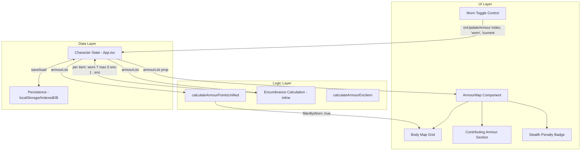
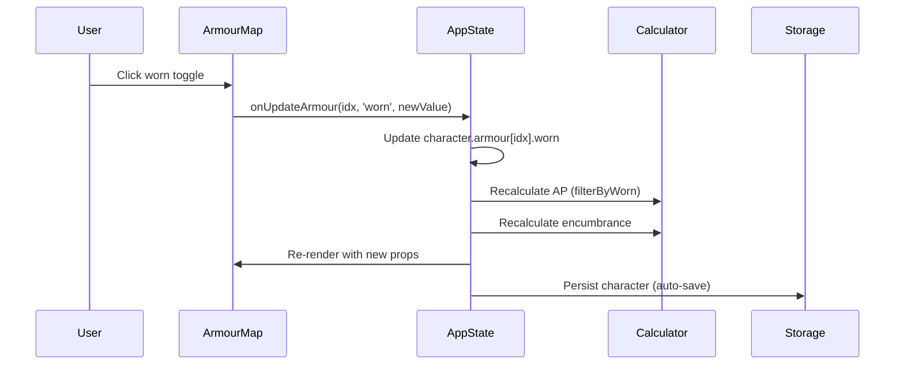

# Design Document: Armour Worn Toggle

## Overview

This feature adds a user-facing toggle control to each armour piece in the ArmourMap component, enabling players to mark armour as worn or unworn. The toggle drives two WFRP4e Core p.293 mechanics:

1. **Encumbrance reduction**: Worn armour has Enc reduced by 1 (minimum 0); unworn armour uses full Enc.
2. **AP filtering**: Only worn armour contributes Armour Points to body locations.

The `worn` boolean already exists on `ArmourItem` and is partially used in existing calculations. This feature surfaces a UI control and ensures consistent application throughout the app.

## Architecture



The data flows unidirectionally: user clicks toggle → `onUpdateArmour` callback fires → character state updates → React re-renders ArmourMap with new worn states → AP and encumbrance recalculate from the updated list.

## Components and Interfaces

### Worn Toggle Control (New)

A checkbox-style control rendered inline with each armour item row in the ArmourMap armour list section.

```typescript
// Inside ArmourMap — rendered per armour item in the list
<input
  type="checkbox"
  checked={item.worn !== false}
  onChange={() => onUpdateArmour(index, 'worn', !(item.worn !== false))}
  aria-label={`${item.name} — ${item.worn !== false ? 'worn' : 'unworn'}`}
  className={styles.wornToggle}
/>
```

**Design decision**: Use a native `<input type="checkbox">` rather than a custom switch component. Rationale: the existing ArmourMap uses minimal custom controls (buttons, native inputs), and a checkbox provides built-in keyboard and screen reader support with no extra libraries.

### ArmourMap Component Changes

The existing `ArmourMap` component already receives `onUpdateArmour` which supports toggling boolean fields (used for `visorOpen`). The same callback handles `worn`:

```typescript
onUpdateArmour(armourIndex, 'worn', newValue: boolean)
```

**Changes to ArmourMap:**

1. **Armour list row**: Add the worn toggle checkbox before the armour name in each `armourRow`.
2. **Contributing armour section**: Filter to only show items where `worn !== false` for the selected location.
3. **Section label**: Change "Worn Armour" to show worn/unworn sections or visually distinguish unworn items (dimmed styling).

### Encumbrance Calculation Helper (New)

Extract the inline enc calculation into a pure utility function for testability:

```typescript
// src/logic/encumbrance.ts (add to existing file)

/**
 * Calculates effective encumbrance for a single armour item.
 * Per WFRP4e Core p.293: worn items have Enc reduced by 1, minimum 0.
 * Unworn items contribute their full Enc value.
 */
export function calculateArmourEncumbrance(enc: string, worn: boolean | undefined): number {
  const baseEnc = parseFloat(enc) || 0;
  if (worn === false) return baseEnc;
  return Math.max(0, baseEnc - 1);
}
```

This replaces the repeated inline calculation in `CharacterPage.tsx` and `PrintLayout.tsx`.

### AP Calculation (Existing)

The existing `calculateArmourPointsUnified` function already supports `filterByWorn: true`. The integration point is ensuring all call sites that compute displayed AP use this option:

```typescript
// Already exists in calculators.ts:
calculateArmourPointsUnified(armourItems, { filterByWorn: true })
```

The `filterByWorn` option filters to `item.worn === true`, but per requirements, `undefined` should also be treated as worn. The current filter (`item.worn === true`) needs adjustment to `item.worn !== false`.

## Data Models

### ArmourItem (Existing — No Schema Change)

```typescript
export interface ArmourItem {
  name: string;
  locations: string;
  enc: string;
  ap: number;
  qualities: string;
  worn?: boolean;        // ← Already exists. true/undefined = worn, false = unworn
  runes?: string[];
  armourType?: ArmourType;
  currentAp?: number;
  visorOpen?: boolean;
}
```

No migration needed — the `worn` field is already optional with `undefined` treated as worn (backward compatible with existing saved characters).

### State Flow



## Correctness Properties

*A property is a characteristic or behavior that should hold true across all valid executions of a system — essentially, a formal statement about what the system should do. Properties serve as the bridge between human-readable specifications and machine-verifiable correctness guarantees.*

### Property 1: Toggle inverts worn state

*For any* armour item with any current worn state (true, false, or undefined), activating the worn toggle SHALL produce the logical negation of the effective worn state — if the item was effectively worn (worn !== false), it becomes unworn (false); if it was unworn (false), it becomes worn (true).

**Validates: Requirements 1.2**

### Property 2: Aria-label contains item name and worn state

*For any* armour item with any name string and any worn state, the worn toggle's aria-label SHALL contain both the item name and a worn/unworn text indicator.

**Validates: Requirements 1.5**

### Property 3: Encumbrance calculation respects worn state

*For any* armour item with any non-negative Enc value and any armour type, the effective encumbrance contribution SHALL be `max(0, Enc - 1)` when the item is worn (worn !== false) and the full Enc value when the item is unworn (worn === false).

**Validates: Requirements 2.1, 2.2, 2.3**

### Property 4: AP calculation uses only worn items

*For any* list of armour items with mixed worn states, the AP computed per body location SHALL equal the AP computed from only the subset of items where `worn !== false`, using the standard stacking rules (highest non-flexible + highest flexible per location).

**Validates: Requirements 3.1, 3.2, 3.3**

### Property 5: Contributing armour section filters by worn status

*For any* armour list and any selected body location, the contributing armour items displayed SHALL include only items where `worn !== false` AND the item covers the selected location.

**Validates: Requirements 4.1**

### Property 6: Stealth penalty badge reflects worn heavy armour

*For any* armour list, the stealth penalty badge SHALL be visible if and only if at least one item has `worn !== false` AND `armourType` is "Chainmail" or "Plate".

**Validates: Requirements 4.2**

## Error Handling

| Scenario | Handling |
|----------|----------|
| `worn` field missing from saved data | Default to `true` (backward compatible) |
| `enc` field is non-numeric string (e.g., "—") | `parseFloat` returns NaN, `\|\| 0` fallback gives 0 enc |
| `worn` field is a non-boolean value (corrupt data) | Use strict `=== false` check; anything else treated as worn |
| Toggle callback (`onUpdateArmour`) not provided | Toggle control is not rendered (read-only view) |

## Testing Strategy

### Property-Based Tests (fast-check + Vitest)

Each correctness property maps to a single property-based test with minimum 100 iterations.

| Property | Test File | Generator Strategy |
|----------|-----------|-------------------|
| 1: Toggle inverts | `__tests__/ArmourMap.wornToggle.property.test.tsx` | Random armour items with worn ∈ {true, false, undefined} |
| 2: Aria-label | `__tests__/ArmourMap.wornToggle.property.test.tsx` | Random item names (alphanumeric + special chars) × worn states |
| 3: Encumbrance | `__tests__/encumbrance.wornToggle.property.test.ts` | Random enc values (0–10) × worn states × armour types |
| 4: AP filtering | `__tests__/calculators.wornToggle.property.test.ts` | Random armour lists (1–8 items) with random worn states, locations, AP values |
| 5: Contributing filter | `__tests__/ArmourMap.wornToggle.property.test.tsx` | Random armour lists × random selected locations |
| 6: Stealth badge | `__tests__/ArmourMap.wornToggle.property.test.tsx` | Random armour lists with random armourTypes and worn states |

**Tag format**: `Feature: armour-worn-toggle, Property {N}: {title}`

### Example-Based Tests (Vitest)

- Requirement 1.1: Render ArmourMap with 3 items → assert 3 toggle checkboxes present
- Requirement 1.3: Render with worn=true/false → verify checked attribute matches
- Requirement 1.4: Render with worn=undefined → verify treated as checked
- Requirement 3.4: Integration test with mixed worn/unworn → verify displayed AP values
- Requirement 4.3: All items unworn → verify 0 AP across all locations

### Integration Tests

- Requirement 5.1/5.2: Toggle → save → reload → verify persisted state
- Requirement 5.3: Load legacy data (no worn field) → verify default to worn

### Accessibility Testing

- Verify keyboard navigation (Tab to toggle, Space/Enter to activate)
- Verify screen reader announces item name and state
- Verify focus ring is visible on the toggle control
