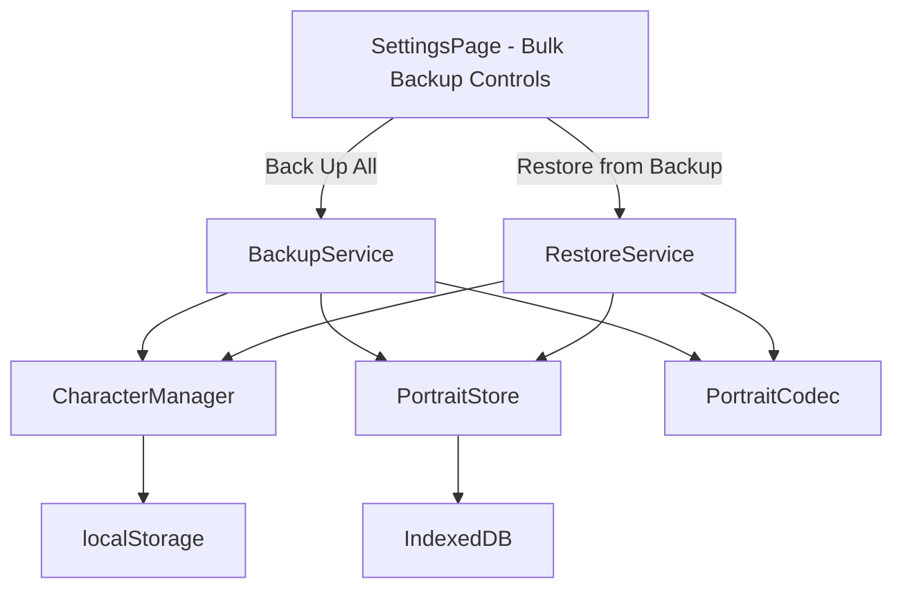
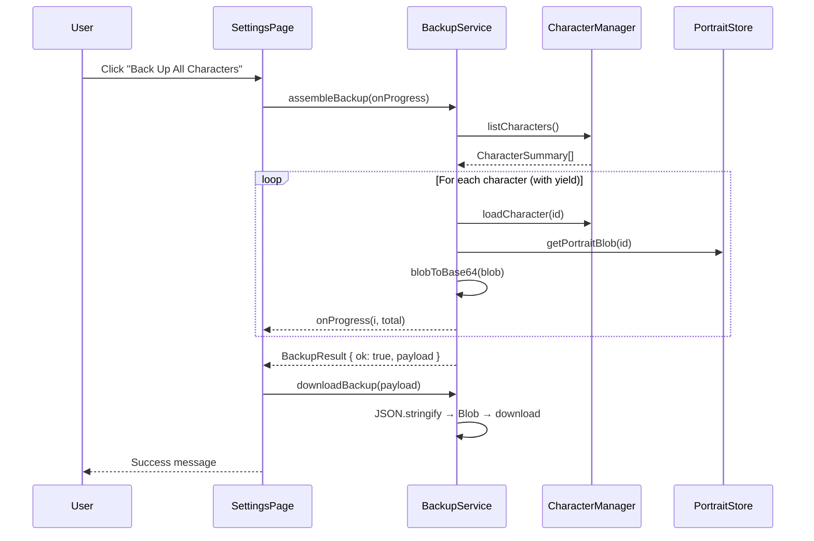
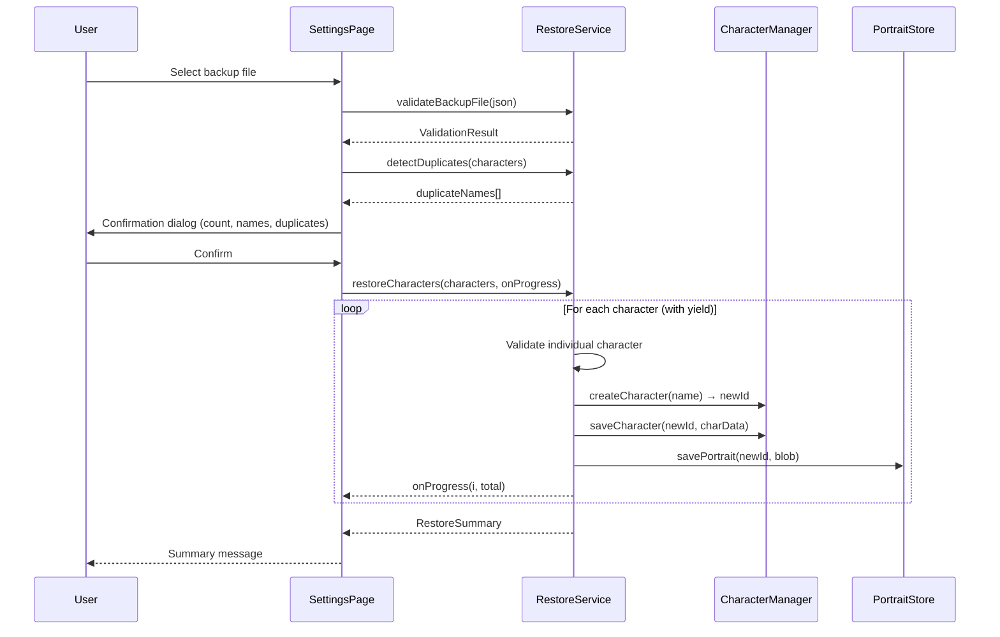

# Design Document

## Overview

This feature adds bulk backup and restore capabilities to the PWA Character Sheet, enabling users to export all characters (with portraits) as a single JSON file and import them back in one operation. The implementation builds on the existing `export-import.ts` and `character-manager.ts` modules, adding a new `backup-service.ts` module for assembling/disassembling bulk backup payloads and a new `restore-service.ts` module for validation and sequential import.

The design prioritizes:
- **Non-blocking UI**: Async processing with yielding to keep the main thread responsive
- **Fault tolerance**: Individual character failures don't abort the entire operation
- **Round-trip integrity**: Export → Import produces equivalent data for all user-authored fields
- **No data destruction**: Import never overwrites or deletes existing characters

## Architecture



The architecture follows the existing pattern of thin service modules that orchestrate calls to the Character Manager and Portrait Store. The new services are purely functional (stateless) — they accept dependencies as parameters for testability, and report progress via callbacks.

## Components and Interfaces

### BackupService (`src/storage/backup-service.ts`)

```typescript
/** Progress callback for bulk operations */
export type ProgressCallback = (current: number, total: number) => void;

/** Result of a single character's backup assembly */
export interface CharacterBackupEntry {
  id: string;
  character: Character;
  portrait: string; // base64 data-URL or empty string
}

/** Result of the backup assembly operation */
export type BackupResult =
  | { ok: true; payload: BackupFile }
  | { ok: false; error: string; skipped?: SkippedCharacter[] };

/** A character that was skipped during backup */
export interface SkippedCharacter {
  name: string;
  reason: string;
}

/**
 * Collect all characters and portraits, assembling a BackupFile payload.
 * Yields to the event loop between characters to avoid blocking the UI.
 */
export async function assembleBackup(
  onProgress?: ProgressCallback
): Promise<BackupResult>;

/**
 * Trigger a file download of the assembled backup payload.
 */
export function downloadBackup(payload: BackupFile): void;
```

### RestoreService (`src/storage/restore-service.ts`)

```typescript
/** Validation result for a backup file */
export type ValidationResult =
  | { ok: true; metadata: BackupMetadata; characters: BackupCharacterEntry[] }
  | { ok: false; error: string };

/** Summary of a completed restore operation */
export interface RestoreSummary {
  imported: number;
  skipped: number;
  skippedDetails: Array<{ nameOrIndex: string; reason: string }>;
  duplicateNames: string[];
  stoppedByQuota: boolean;
}

/**
 * Parse and validate a backup file string.
 * Checks JSON validity, version compatibility, structure, and metadata consistency.
 */
export function validateBackupFile(json: string): ValidationResult;

/**
 * Check which character names in the backup already exist locally.
 */
export function detectDuplicates(
  backupCharacters: BackupCharacterEntry[]
): string[];

/**
 * Import all characters from a validated backup, sequentially.
 * Yields to the event loop between characters.
 * Stops on quota errors, retaining already-saved characters.
 */
export async function restoreCharacters(
  characters: BackupCharacterEntry[],
  onProgress?: ProgressCallback
): Promise<RestoreSummary>;
```

### BackupFile Format (`src/storage/backup-types.ts`)

```typescript
/** Top-level backup file structure */
export interface BackupFile {
  version: number;
  exportedAt: string; // ISO-8601
  characterCount: number;
  characters: BackupCharacterEntry[];
}

/** A single character entry within a backup file */
export interface BackupCharacterEntry {
  id: string;
  character: Record<string, unknown>; // Full character JSON (single-export format)
  portrait: string; // base64 data-URL or empty string
}

/** Metadata extracted during validation */
export interface BackupMetadata {
  version: number;
  exportedAt: string;
  characterCount: number;
}
```

### UI Components

The existing `SettingsPage` gains a new section or extension within the Export/Import card:

- **BackUpAllButton**: Triggers `assembleBackup()` → `downloadBackup()`, shows spinner + progress text
- **RestoreFromBackupInput**: File input (`.json` only) → `validateBackupFile()` → confirmation dialog → `restoreCharacters()`
- **RestoreConfirmDialog**: Shows character count, names (capped at 50), and duplicate warnings

## Data Models

### BackupFile JSON Schema

```json
{
  "version": 1,
  "exportedAt": "2025-01-15T14:30:00.000Z",
  "characterCount": 3,
  "characters": [
    {
      "id": "original-uuid-here",
      "character": { /* full Character object matching single-export format */ },
      "portrait": "data:image/png;base64,iVBOR..." 
    }
  ]
}
```

Key constraints:
- `version` is always integer `1` for this release
- `characterCount` MUST equal `characters.length`
- Each `character` object must contain at minimum: `name`, `species`, `chars` (matching existing `importFromJSON` validation)
- `portrait` is either a valid `data:image/(jpeg|png|webp);base64,...` string or `""`
- The `id` field preserves the original ID for provenance but is NOT used during import (new IDs are generated)

### State Flow During Backup



### State Flow During Restore




## Correctness Properties

*A property is a characteristic or behavior that should hold true across all valid executions of a system — essentially, a formal statement about what the system should do. Properties serve as the bridge between human-readable specifications and machine-verifiable correctness guarantees.*

### Property 1: Backup structural integrity

*For any* non-empty set of characters (each with or without a portrait), the assembled BackupFile SHALL have `version === 1`, `exportedAt` as a valid ISO-8601 string, `characterCount` equal to the length of `characters`, and each entry SHALL contain a string `id`, a `character` object, and a `portrait` field that is either a valid base64 data-URL or an empty string.

**Validates: Requirements 1.2, 1.3, 1.4, 3.1, 3.2**

### Property 2: Validation rejects invalid backup files

*For any* string input that is either (a) not valid JSON, (b) valid JSON but not an object, (c) a JSON object missing the `version` field or `characters` array, (d) has `version > 1`, or (e) has `characterCount` not matching `characters.length`, the `validateBackupFile` function SHALL return `{ ok: false }` with a descriptive error message.

**Validates: Requirements 2.1, 2.2, 2.3, 3.5**

### Property 3: Export-Import round-trip preservation

*For any* set of valid characters with portraits, exporting all characters via the BackupService then importing the resulting BackupFile into an empty application SHALL produce characters where each imported character is field-by-field equal to the original for all user-authored fields (name, species, chars, skills, talents, inventory, etc.), excluding system-generated identifiers.

**Validates: Requirements 3.3**

### Property 4: Import correctness with partial failures

*For any* BackupFile containing a mix of valid characters (having name, species, chars fields) and invalid characters (missing one or more required fields), the RestoreService SHALL import exactly the valid characters and skip the invalid ones, and the resulting `RestoreSummary` SHALL satisfy `imported + skipped === total characters in file`.

**Validates: Requirements 2.5, 2.6, 2.7**

### Property 5: Import non-destruction of existing data

*For any* set of existing characters in the application and any valid BackupFile being imported, after the restore operation completes, all pre-existing characters SHALL be identical (field-by-field) to their state before the import, and every imported character SHALL have a newly generated unique ID distinct from all pre-existing IDs.

**Validates: Requirements 4.1, 4.3, 4.4**

### Property 6: Backup fault tolerance on portrait failure

*For any* set of characters where some portraits fail to load from the PortraitStore, the BackupService SHALL still include those characters in the output with `portrait === ""`, and all other characters with successful portrait retrieval SHALL have their portrait data correctly encoded.

**Validates: Requirements 1.6, 6.6**

### Property 7: Progress reporting completeness

*For any* backup or restore operation processing N characters, the progress callback SHALL be invoked exactly N times with arguments `(1, N), (2, N), ..., (N, N)` in strictly increasing order.

**Validates: Requirements 6.3, 6.4**

## Error Handling

| Error Condition | Module | Response |
|---|---|---|
| No characters exist | BackupService | Return error result with message; no file produced |
| Portrait retrieval fails | BackupService | Skip portrait (set to `""`), continue with remaining characters |
| Character serialization fails | BackupService | Skip character, include in skipped report, continue |
| Blob construction fails (file too large) | BackupService | Return error with "backup too large" message |
| Invalid JSON input | RestoreService | Reject with parse error message |
| Unsupported version | RestoreService | Reject with version mismatch message |
| characterCount mismatch | RestoreService | Reject with metadata mismatch message |
| Individual character validation failure | RestoreService | Skip character, add to failure report, continue |
| Storage quota exceeded during import | RestoreService | Stop importing, retain already-saved characters, report how many succeeded |
| IndexedDB unavailable for portrait save | RestoreService | Save character without portrait (fallback), continue |

### Error Message Guidelines

- Error messages are user-facing and should be clear and actionable
- Include specific counts where applicable ("3 of 12 characters could not be imported")
- For version errors, state the maximum supported version number
- For quota errors, state how many characters were saved before the limit

## Testing Strategy

### Property-Based Tests (fast-check)

The project already uses `fast-check` (v4.8.0) with `vitest`. Property tests will live in `src/storage/__tests__/` following the existing naming convention (`*.property.test.ts`).

**Configuration:**
- Minimum 100 iterations per property test (`{ numRuns: 100 }`)
- Each test tagged with: `Feature: bulk-character-backup, Property {N}: {title}`

**Generators needed:**
- `arbCharacter`: Generates a valid Character object with randomized fields (name, species, chars at minimum, plus random optional fields)
- `arbPortraitDataUrl`: Generates a valid `data:image/(jpeg|png|webp);base64,...` string with random small payloads
- `arbBackupFile`: Generates a structurally valid BackupFile with random characters and portraits
- `arbInvalidBackupFile`: Generates various invalid backup inputs (bad JSON, wrong structure, bad version, count mismatch)

**Test files:**
- `src/storage/__tests__/backup-service.property.test.ts` — Properties 1, 3, 6, 7
- `src/storage/__tests__/restore-service.property.test.ts` — Properties 2, 4, 5, 7

### Unit Tests (example-based)

- Filename format verification (Requirement 1.5)
- Empty character list handling (Requirement 1.7)
- Confirmation dialog data extraction (Requirement 2.4)
- Duplicate detection (Requirement 4.2)
- Quota error handling mid-import (Requirement 2.8)
- UI component state transitions (Requirement 5.x) via Testing Library

### Integration Tests

- Full backup → file download flow with mocked DOM APIs
- Full restore flow from file input through confirmation to completion
- Large backup assembly with performance assertions (yielding behavior)

### Test Dependencies

- `vitest` — test runner (already installed)
- `fast-check` — property-based testing (already installed)
- `fake-indexeddb` — IndexedDB mock for portrait operations (already installed)
- `@testing-library/react` — component testing (already installed)
