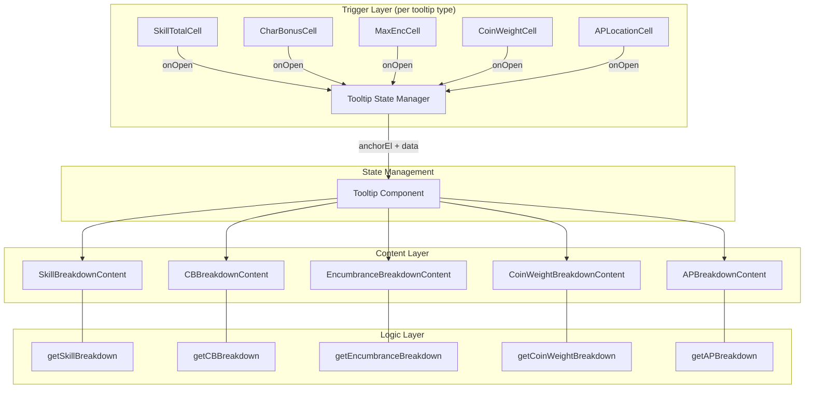

# Design Document: Calculated Total Tooltips

## Overview

This feature adds breakdown tooltips to five types of calculated totals in the WFRP4e character sheet: Skill Totals, Characteristic Bonuses, Max Encumbrance, Coin Weight, and Armour Points Per Location. Each tooltip reveals the formula and contributing values that produce the displayed number.

The design reuses the established tooltip interaction pattern from `CharCurrentCell` (click, Enter/Space keyboard activation, 300ms hover-open / 200ms hover-close delay) and renders content via the existing portal-based `Tooltip` component. New presentational "breakdown content" components provide the formatted formula display, while pure helper functions compute the breakdown data from character state.

## Architecture



**Key architectural decisions:**

1. **Reuse the `CharCurrentCell` interaction pattern** — A generic `TooltipTriggerCell` component encapsulates hover delays, click/keyboard handling, and `aria-describedby` binding. Each tooltip type wraps this with its specific data.
2. **Single-tooltip state** — Each page/tab manages a single `openTooltip` state slot so that opening any new tooltip automatically closes the previous one.
3. **Pure breakdown helper functions** — Computation logic is separated from rendering, enabling property-based testing of correctness without DOM dependencies.

## Components and Interfaces

### TooltipTriggerCell (Generic reusable trigger)

Extracted from the existing `CharCurrentCell` pattern to avoid duplication across 5+ tooltip types.

```typescript
// src/components/shared/TooltipTriggerCell.tsx

export interface TooltipTriggerCellProps {
  /** Unique identifier used for the tooltip id and aria-describedby */
  tooltipId: string;
  /** Display value shown in the cell */
  displayValue: string | number;
  /** Whether this cell's tooltip is currently open */
  isTooltipOpen: boolean;
  /** Called with the anchor element when the tooltip should open */
  onOpen: (anchorEl: HTMLElement) => void;
  /** Called when the tooltip should close */
  onClose: () => void;
  /** Additional CSS class for styling */
  className?: string;
  /** Accessible label for the button role */
  ariaLabel?: string;
}
```

Behavior (identical to `CharCurrentCell`):
- `onClick` → immediate open (cancels any pending hover timeout)
- `onKeyDown` (Enter/Space) → open
- `onMouseEnter` → 300ms delayed open
- `onMouseLeave` → 200ms delayed close
- Sets `aria-describedby={tooltipId}` when `isTooltipOpen` is true
- `role="button"`, `tabIndex={0}`

### Breakdown Content Components

Each is a simple presentational component receiving pre-computed data.

#### SkillBreakdownContent

```typescript
// src/components/pages/SkillBreakdownContent.tsx

export interface SkillBreakdownContentProps {
  charName: string;        // e.g. "Agility"
  charValue: number;       // linked characteristic current value
  advances: number;        // skill advances
  total: number;           // charValue + advances
}
```

Renders:
```
Agility  35
Advances 10
──────────
Total    45
```

#### CBBreakdownContent

```typescript
// src/components/pages/CBBreakdownContent.tsx

export interface CBBreakdownContentProps {
  charName: string;       // e.g. "Strength"
  currentValue: number;   // characteristic current value
  bonus: number;          // floor(currentValue / 10)
}
```

Renders:
```
Current  43
──────────
CB       4
```

#### EncumbranceBreakdownContent

```typescript
// src/components/pages/EncumbranceBreakdownContent.tsx

export interface EncumbranceBreakdownContentProps {
  sb: number;
  tb: number;
  strongBackLevel: number;  // 0 if no talent
  sturdyLevel: number;      // 0 if no talent (display-only note, not added to total)
  total: number;
}
```

Renders (with talents):
```
SB            4
TB            3
Strong Back  +2
──────────────
Total         9
```

Renders (without talents):
```
SB     4
TB     3
────────
Total  7
```

Note: Sturdy does not contribute to max encumbrance numerically (it halves overburdened penalties), so it's shown as an informational note if present: "Sturdy: halves overburdened penalties".

#### CoinWeightBreakdownContent

```typescript
// src/components/pages/CoinWeightBreakdownContent.tsx

export interface CoinWeightBreakdownContentProps {
  gc: number;
  ss: number;
  d: number;
  total: number;   // floor((gc + ss + d) / 200)
}
```

Renders (with coins):
```
GC     120
SS      45
D       30
Sum    195
÷ 200
────────
Weight  0
```

Renders (no coins):
```
No coins carried
```

#### APBreakdownContent

```typescript
// src/components/pages/APBreakdownContent.tsx

export interface APBreakdownItem {
  name: string;
  ap: number;
}

export interface APBreakdownContentProps {
  locationLabel: string;    // e.g. "Head", "Body"
  items: APBreakdownItem[];
  total: number;
}
```

Renders (with armour):
```
Leather Cap     1
Mail Coif       2
──────────────
Total           3
```

Renders (empty):
```
No armour covers this location
Total  0
```

### Pure Helper Functions (Logic Layer)

```typescript
// src/logic/breakdown-helpers.ts

export interface SkillBreakdown {
  charName: string;
  charValue: number;
  advances: number;
  total: number;
}

export function getSkillBreakdown(
  charKey: CharacteristicKey,
  chars: Record<CharacteristicKey, CharacteristicValue>,
  advances: number
): SkillBreakdown;

export interface CBBreakdown {
  charName: string;
  currentValue: number;
  bonus: number;
}

export function getCBBreakdown(
  charKey: CharacteristicKey,
  chars: Record<CharacteristicKey, CharacteristicValue>
): CBBreakdown;

export interface EncumbranceBreakdown {
  sb: number;
  tb: number;
  strongBackLevel: number;
  sturdyLevel: number;
  total: number;
}

export function getEncumbranceBreakdown(
  chars: Record<CharacteristicKey, CharacteristicValue>,
  strongBackLevel: number,
  sturdyLevel: number
): EncumbranceBreakdown;

export interface CoinWeightBreakdown {
  gc: number;
  ss: number;
  d: number;
  total: number;
  isEmpty: boolean;
}

export function getCoinWeightBreakdown(
  gc: number,
  ss: number,
  d: number
): CoinWeightBreakdown;

export interface APBreakdown {
  locationLabel: string;
  items: { name: string; ap: number }[];
  total: number;
}

export function getAPBreakdown(
  armourItems: ArmourItem[],
  location: LocationKey,
  locationLabel: string
): APBreakdown;
```

## Data Models

No new persistent data models are introduced. All breakdown data is computed on-the-fly from existing character state:

| Tooltip Type | Source Data | Computation |
|---|---|---|
| Skill Total | `character.chars[skill.c]`, `skill.a` | `charCurrent + advances` |
| Characteristic Bonus | `character.chars[key]` | `floor(current / 10)` |
| Max Encumbrance | `character.chars.S`, `character.chars.T`, talents | `SB + TB + strongBackLevel` |
| Coin Weight | `character.wGC`, `character.wSS`, `character.wD` | `floor((gc + ss + d) / 200)` |
| AP Per Location | `character.armour` | Sum of AP from worn items covering location |

### Tooltip State Shape

Each page/tab uses a discriminated union state:

```typescript
type TooltipState =
  | null
  | { type: 'skill'; index: number; anchorEl: HTMLElement }
  | { type: 'cb'; key: CharacteristicKey; anchorEl: HTMLElement }
  | { type: 'encumbrance'; anchorEl: HTMLElement }
  | { type: 'coinWeight'; anchorEl: HTMLElement }
  | { type: 'ap'; location: LocationKey; anchorEl: HTMLElement };
```

Setting any value automatically replaces the previous (enforcing single-tooltip-at-a-time).

## Correctness Properties

*A property is a characteristic or behavior that should hold true across all valid executions of a system — essentially, a formal statement about what the system should do. Properties serve as the bridge between human-readable specifications and machine-verifiable correctness guarantees.*

### Property 1: Skill breakdown total equals characteristic current plus advances

*For any* valid characteristic current value (initial + advances + talent bonus) and any non-negative skill advance value, the `getSkillBreakdown` function SHALL return a total equal to `charValue + advances`, and the charValue SHALL equal `initial + advance + talentBonus` of the linked characteristic.

**Validates: Requirements 1.2**

### Property 2: Characteristic bonus breakdown produces correct floor division

*For any* non-negative characteristic current value, the `getCBBreakdown` function SHALL return a bonus equal to `floor(currentValue / 10)`.

**Validates: Requirements 2.2**

### Property 3: Encumbrance breakdown total equals SB + TB + Strong Back level

*For any* valid Strength and Toughness values (0–99) and any Strong Back talent level (0–5), the `getEncumbranceBreakdown` function SHALL return `sb = floor(S/10)`, `tb = floor(T/10)`, and `total = sb + tb + strongBackLevel`. When `strongBackLevel` is 0, the breakdown SHALL not include a Strong Back contribution line.

**Validates: Requirements 3.2, 3.3**

### Property 4: Coin weight breakdown produces correct floor division

*For any* non-negative GC, SS, and D values, the `getCoinWeightBreakdown` function SHALL return `total = floor((gc + ss + d) / 200)`. When all three values are 0, `isEmpty` SHALL be `true`.

**Validates: Requirements 4.2, 4.3**

### Property 5: AP breakdown lists all covering items and total equals their AP sum

*For any* set of armour items and any body location, the `getAPBreakdown` function SHALL return an items array containing exactly those worn armour items that cover the specified location, and the total SHALL equal the sum of their AP values (using `currentAp` if set, otherwise `ap`).

**Validates: Requirements 5.2, 5.3**

## Error Handling

| Scenario | Handling |
|---|---|
| Skill has unknown characteristic key | `getSkillBreakdown` returns charValue of 0, total = advances only |
| Negative characteristic values (data corruption) | Clamp to 0 before computing bonus |
| Armour item with `undefined` name | Display "Unnamed" in breakdown |
| Tooltip anchor removed from DOM before render | `computePosition` gracefully returns top-left fallback; existing Tooltip logic handles this |
| Very long armour name in breakdown | CSS truncates with ellipsis; full name available in title attribute |

## Testing Strategy

### Property-Based Tests

Library: **fast-check** (already available in the project's test dependencies with Vitest)

Each property test runs a minimum of **100 iterations** with randomly generated inputs.

| Property | Generator Strategy |
|---|---|
| Property 1 (Skill Breakdown) | Generate `charValue` ∈ [0, 99], `advances` ∈ [0, 99], random `CharacteristicKey` |
| Property 2 (CB Breakdown) | Generate `currentValue` ∈ [0, 199] covering single/double digit bonuses |
| Property 3 (Encumbrance Breakdown) | Generate S ∈ [0, 99], T ∈ [0, 99], strongBackLevel ∈ [0, 5], sturdyLevel ∈ [0, 3] |
| Property 4 (Coin Weight Breakdown) | Generate gc ∈ [0, 9999], ss ∈ [0, 9999], d ∈ [0, 9999] |
| Property 5 (AP Breakdown) | Generate 0–6 armour items with random AP (1–5), random location coverage, random worn state |

Tag format: `Feature: calculated-total-tooltips, Property N: <description>`

### Unit Tests (Example-Based)

- Skill tooltip appears on click for basic and advanced skills (Req 1.1, 1.4)
- CB tooltip appears on click (Req 2.1)
- Encumbrance tooltip appears on click (Req 3.1)
- Coin weight tooltip appears on click (Req 4.1)
- AP location tooltip appears on click (Req 5.1)
- Only one tooltip visible at a time (Req 6.3)
- Keyboard activation with Enter and Space (Req 6.4)
- `aria-describedby` set correctly when tooltip open (Req 6.5)
- Hover with 300ms open delay / 200ms close delay (Req 6.2)

### Integration Tests

- Opening a skill tooltip, then clicking a CB cell, dismisses the skill tooltip and shows CB tooltip
- Existing `CharCurrentCell` tooltips and new breakdown tooltips coexist without conflict
