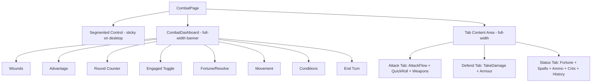

# Design Document: Combat Layout Cleanup

## Overview

This design eliminates the problematic two-column sticky sidebar layout on the Combat Page and replaces it with a single-column vertical flow: Segmented Control → Combat Dashboard (full-width header) → Tab Content Area (full-width). The redesign resolves clipping, overflow, and overlap issues caused by the current fixed-width (320px) left column on desktop viewports.

The key architectural change is that `CombatPage` no longer renders `CombatDashboard` in a separate grid column. Instead, the dashboard becomes a full-width banner above the tab content on all viewport sizes. The Segmented Control becomes the only sticky element on desktop, providing persistent tab-switching access.

### Design Decisions

1. **Remove two-column grid entirely** — Rather than adjusting column widths, the two-column approach is eliminated. This avoids future overlap/clipping issues regardless of content size.
2. **Dashboard as horizontal banner** — The dashboard subsections (wounds, advantage, round, engaged, fortune/resolve, movement, conditions) use a horizontal flex-wrap layout on desktop, distributing content across the full width while keeping vertical height compact.
3. **Segmented Control is the only sticky element on desktop** — The dashboard scrolls away with content, but the tab switcher remains accessible. This balances information density with scrolling ergonomics.
4. **Mobile/tablet behaviour preserved** — Below 1025px, the existing compact sticky dashboard strip and single-column layout remain unchanged.

## Architecture



### Layout Flow (Desktop, Combat Active)

```
┌─────────────────────────────────────────────────┐
│  Segmented Control (sticky top: 0, z-index: 20) │
├─────────────────────────────────────────────────┤
│  Combat Dashboard (full-width, horizontal flow)  │
│  [Wounds][Adv][Round][Engaged][F/R][Move][End]   │
│  [Conditions row - wraps as needed]              │
├─────────────────────────────────────────────────┤
│  Tab Content Area (full-width, vertical stack)   │
│  ┌─────────────────────────────────────────────┐ │
│  │  Panel 1 (e.g., Attack Flow)                │ │
│  ├─────────────────────────────────────────────┤ │
│  │  Panel 2 (e.g., Quick Roll)                 │ │
│  ├─────────────────────────────────────────────┤ │
│  │  Panel 3 (e.g., Weapons)                    │ │
│  └─────────────────────────────────────────────┘ │
└─────────────────────────────────────────────────┘
```

## Components and Interfaces

### CombatPage (`src/components/pages/CombatPage.tsx`)

**Changes:**
- Remove the `combatTwoColumn` grid wrapper from the JSX
- Remove the `combatLeftColumn` wrapper element
- Remove the `combatRightColumn` wrapper element
- Always render CombatDashboard inline (not conditionally per column)
- Render order: Segmented Control → CombatDashboard → Tab Content
- Remove the `isDesktop && inCombat` conditional branching that creates separate left/right column renders
- The `CombatDashboard` is rendered once (not duplicated for desktop left column vs other contexts)

**Interface:** No prop changes. The component API remains the same.

### CombatPage.module.css (`src/components/pages/CombatPage.module.css`)

**Changes:**
- Remove `.combatTwoColumn` grid styles (the `grid-template-columns: 320px 1fr` rule)
- Remove `.combatLeftColumn` styles (including `position: sticky`)
- Remove `.combatRightColumn` styles
- Add `.segmentedControlSticky` with `position: sticky; top: 0; z-index: 20`
- Scope sticky segmented control to desktop only (`@media (min-width: 1025px)`)

### CombatDashboard.module.css (`src/components/combat/CombatDashboard.module.css`)

**Changes:**
- Add a desktop-specific layout mode that arranges `.dashboardGroups` in a compact horizontal multi-row layout at full width
- Ensure `.conditionRow` / `.conditionRowSpaced` use `flex-wrap: wrap` and are not constrained to a fixed width
- Add a max-height guideline (~250px excluding conditions) enforced by compact spacing (reduced padding/gaps) on desktop
- Add a bottom border/separator class for visual separation from content below
- No changes to existing mobile styles (< 1025px)

### CombatDashboard.tsx (`src/components/combat/CombatDashboard.tsx`)

**Changes:**
- No structural changes to the component itself. It already renders all subsections in a flex layout.
- The component will receive full width from its parent naturally once the grid constraint is removed.
- May add a `desktopBanner` prop or CSS class name to enable the compact horizontal mode (optional — could be handled purely via CSS media queries).

## Data Models

No data model changes are required. This refactoring is purely presentational (CSS + JSX structure). The `Character`, `CombatState`, and `Condition` types remain unchanged.

## Error Handling

No new error handling is required. This is a layout-only change with no new data flows or failure modes.

## Testing Strategy

### Why Property-Based Testing Does Not Apply

This feature is a pure CSS/layout refactoring. The acceptance criteria are about:
- Visual positioning (no overlap, no clipping)
- CSS properties (flex-wrap, sticky positioning, z-index)
- Responsive breakpoints
- DOM structure (single-column vs grid)

There are no pure functions, data transformations, or algorithmically-varying inputs that benefit from property-based testing. The "inputs" are viewport widths and combat state booleans, which have a small, enumerable set of meaningful values.

### Testing Approach

**Integration tests (Vitest + Testing Library):**
1. Verify that when `inCombat=true` on desktop viewport, the DOM does not contain the two-column grid wrapper (`.combatTwoColumn` class is absent or removed)
2. Verify the render order: Segmented Control appears before CombatDashboard, which appears before tab content panels
3. Verify that the CombatDashboard renders only once in the component tree (no duplicate instances for left-column vs inline)
4. Verify mobile/tablet layout remains unchanged (compact sticky dashboard still renders below 1025px)

**Visual/manual testing:**
- Confirm no clipping or overflow at various desktop widths (1025px, 1280px, 1920px)
- Confirm condition badges wrap properly at full width
- Confirm Segmented Control remains sticky while scrolling
- Confirm CombatDashboard scrolls away on desktop
- Confirm compact sticky dashboard behaviour is preserved on mobile

**Regression tests:**
- Existing combat integration tests (`CombatPage.integration.test.tsx`, `CombatDashboard.mobile.test.tsx`) should continue passing to confirm no mobile regression
