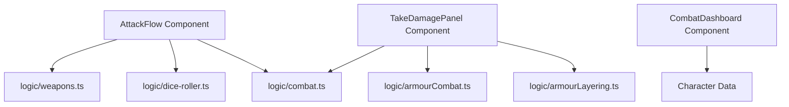
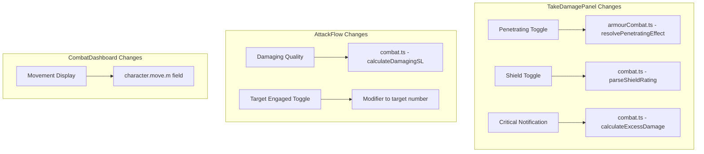

# Design Document: Combat Rules Compliance

## Overview

This design addresses six combat rules compliance gaps in the WFRP4e character sheet application. The changes span three existing components (TakeDamagePanel, AttackFlow, CombatDashboard) and two logic modules (armourCombat, combat). The approach integrates new mechanics into the existing architecture patterns: toggles in the UI panels feed into pure-function calculations in the logic layer, with results displayed as breakdown notes.

**Design Principles:**
- Follow the existing pattern of toggle-driven combat modifiers (like Impale, To-Hit Parity)
- Keep calculation logic in pure functions for testability
- Reuse existing armour combat effects infrastructure where possible
- All new UI controls follow existing accessibility patterns (labels, test-ids, ARIA)

## Architecture

The existing combat architecture follows a clean separation:



Changes integrate into this existing structure:



## Components and Interfaces

### 1. Penetrating Quality (TakeDamagePanel + armourCombat.ts)

**New UI Control:** A "Penetrating" checkbox toggle in TakeDamagePanel, positioned after the existing Impale toggle.

**Logic Function** (in `src/logic/armourCombat.ts`):

```typescript
export interface PenetratingResult {
  effectiveAP: number;
  notes: string[];
}

/**
 * Apply Penetrating weapon quality to armour items at a hit location.
 * - Non-metallic (SoftKit, BoiledLeather): AP set to 0
 * - Metallic (Chainmail, Brigandine, Plate): AP reduced by 1 (min 0 per item)
 */
export function resolvePenetratingEffect(
  armourItems: ArmourItem[],
  baseEffectiveAP: number,
  penetratingEnabled: boolean,
): PenetratingResult;
```

**Classification helper** (in `src/logic/armourCombat.ts`):

```typescript
export function isMetallicArmour(armourType: ArmourType | undefined): boolean;
```

**Integration:** Called within TakeDamagePanel's effective AP calculation, after `resolveArmourCombatEffects` but before the final netWounds calculation. When enabled, the Penetrating result replaces the standard effective AP.

### 2. Damaging Quality (AttackFlow + combat.ts)

**New Logic Function** (in `src/logic/combat.ts`):

```typescript
/**
 * Calculate effective SL for a Damaging weapon.
 * Returns max(unitsDigit, sl) per Core Rulebook p.297.
 */
export function calculateDamagingSL(roll: number, sl: number): {
  effectiveSL: number;
  unitsDigit: number;
  originalSL: number;
  used: 'units' | 'sl';
};
```

**Quality Detection** (in `src/logic/weapons.ts`):

```typescript
/**
 * Check if a weapon has a specific quality (case-insensitive).
 */
export function hasWeaponQuality(weapon: WeaponItem, quality: string): boolean;
```

**Integration:** In AttackFlow's Step 4 (damage calculation), after the roll result is available:
1. Detect "Damaging" quality on the selected weapon using `hasWeaponQuality`
2. If present and hit is successful, call `calculateDamagingSL(roll, sl)`
3. Use `effectiveSL` instead of raw `sl` for damage calculation
4. Display breakdown showing original SL, units digit, and chosen effective SL

### 3. Shield Rating as AP (TakeDamagePanel + combat.ts)

**New Logic Function** (in `src/logic/combat.ts`):

```typescript
/**
 * Parse Shield Rating from a shield weapon's qualities string.
 * Looks for "Shield Rating X" or "Rating X" pattern.
 * Returns the numeric rating, or 0 if not found.
 */
export function parseShieldRating(weapon: WeaponItem): number;

/**
 * Find the equipped shield weapon from the character's weapon list.
 * A shield is a weapon with "Shield" in its group field.
 */
export function findEquippedShield(weapons: WeaponItem[]): WeaponItem | null;
```

**New UI Control:** A "Defended with Shield" checkbox toggle in TakeDamagePanel, conditionally rendered only when an equipped shield is found. Positioned before the AP/TB stat chips.

**Integration:** When toggle is enabled, shield rating is added to `effectiveAP` in the damage reduction calculation. The AP breakdown displays the shield contribution separately.

### 4. Ranged into Melee (AttackFlow)

**New UI Control:** A "Target Engaged in Melee" checkbox toggle in AttackFlow Step 2, visible only when a ranged weapon is selected. Positioned after the difficulty selector.

**Modifier Logic:** When enabled, applies a flat -20 modifier to the hit target number. This is independent of the character's own `combatState.engaged` flag (which triggers the "Hard" difficulty for firing while engaged).

**Integration:** The modifier is added to `modifiedTarget` alongside the existing off-hand penalty and difficulty modifier. The existing "Hard" difficulty default for firing-while-engaged remains unchanged.

### 5. Movement Display (CombatDashboard)

**New UI Section:** A compact movement display row in CombatDashboard showing Walk and Run distances. Positioned in the stats area alongside the existing round/advantage display.

**Calculation:** Pure derivation from `character.move.m`:
- Walk = `move.m × 2` yards
- Run = `move.m × 4` yards

**Conditional Rendering:** Only displayed when `inCombat === true`.

**Props:** The CombatDashboard already receives the `character` prop which contains `move.m`.

### 6. Critical Wound Excess Damage Modifier (TakeDamagePanel)

**New Logic Function** (in `src/logic/combat.ts`):

```typescript
export interface CriticalWoundModifier {
  excessDamage: number;
  toughnessBonus: number;
  modifier: -20 | 0;
  description: string;
}

/**
 * Calculate the Critical Wound table roll modifier based on excess damage vs TB.
 * Per Core Rulebook p.172:
 * - If excess damage < TB: -20 modifier
 * - If excess damage >= TB: no modifier
 */
export function calculateCriticalModifier(
  netWounds: number,
  currentWounds: number,
  toughnessBonus: number,
): CriticalWoundModifier | null;
```

**Integration:** After netWounds calculation in TakeDamagePanel, if `netWounds > wCur` (critical wound triggered), call `calculateCriticalModifier`. Display the result as a notification box below the net wounds display, before the Apply button.

## Data Models

### Existing Types (No Changes Required)

The existing data model already supports all needed information:

- **`ArmourItem.armourType`** — Already has `ArmourType = 'SoftKit' | 'BoiledLeather' | 'Chainmail' | 'Brigandine' | 'Plate'` for metallic/non-metallic classification
- **`WeaponItem.qualities`** — Comma-separated string already used for quality parsing (Impale, etc.)
- **`WeaponItem.group`** — Already used to detect ranged weapons (`RANGED_GROUPS`)
- **`Character.move.m`** — Movement value already stored
- **`Character.combatState.engaged`** — Engaged state already tracked
- **`CombatState.inCombat`** — Combat status already tracked

### State Additions (Component-Level Only)

New `useState` hooks in TakeDamagePanel:
```typescript
const [penetratingEnabled, setPenetratingEnabled] = useState(false);
const [defendedWithShield, setDefendedWithShield] = useState(false);
```

New `useState` hook in AttackFlow:
```typescript
const [targetEngagedInMelee, setTargetEngagedInMelee] = useState(false);
```

No changes to the persisted Character interface or storage schema.

## Correctness Properties

*A property is a characteristic or behavior that should hold true across all valid executions of a system — essentially, a formal statement about what the system should do. Properties serve as the bridge between human-readable specifications and machine-verifiable correctness guarantees.*

### Property 1: Penetrating zeroes non-metallic and reduces metallic AP

*For any* set of armour items at a hit location with varying armourTypes and AP values, when Penetrating is enabled, the effective AP contribution of items with armourType "SoftKit" or "BoiledLeather" SHALL be 0, and the effective AP contribution of items with armourType "Chainmail", "Brigandine", or "Plate" SHALL be reduced by 1 per item (minimum 0 per item).

**Validates: Requirements 1.1, 1.2, 1.3, 1.4**

### Property 2: Penetrating disabled preserves standard AP

*For any* set of armour items at a hit location, when Penetrating is disabled, the effective AP SHALL equal the sum of each item's `currentAp ?? ap` values (the standard calculation without modification).

**Validates: Requirements 1.5**

### Property 3: Damaging effective SL equals max of units digit and SL

*For any* successful attack roll with a Damaging weapon, the effective SL used for damage calculation SHALL equal `max(roll % 10, sl)` where `roll % 10` is the units digit of the d100 roll and `sl` is the standard Success Levels.

**Validates: Requirements 2.1, 2.2, 2.3, 2.5**

### Property 4: Non-Damaging weapons use unmodified SL

*For any* weapon that does not have the "Damaging" quality in its qualities string, the effective SL for damage calculation SHALL equal the standard SL without modification.

**Validates: Requirements 2.6**

### Property 5: Shield toggle adds Rating to effective AP

*For any* equipped shield weapon with a numeric Rating R in its qualities string, when the "Defended with Shield" toggle is enabled, the effective AP at the hit location SHALL include an additional R points. When the toggle is disabled, the shield rating SHALL not be included.

**Validates: Requirements 3.2, 3.3, 3.5**

### Property 6: Ranged-into-melee penalty depends only on target toggle

*For any* ranged attack, the -20 ranged-into-melee modifier SHALL be applied if and only if the "Target Engaged in Melee" toggle is enabled, regardless of the player character's own `combatState.engaged` state.

**Validates: Requirements 4.2, 4.3, 4.5**

### Property 7: Movement distances are correct multiples

*For any* character Movement value M (from `move.m`), the displayed Walk distance SHALL equal M × 2 and the displayed Run distance SHALL equal M × 4.

**Validates: Requirements 5.1, 5.2**

### Property 8: Critical wound modifier determined by excess vs TB

*For any* damage scenario where net wounds applied exceeds the character's current wounds, the excess damage SHALL equal `netWounds - currentWounds`, and: if excess < TB the modifier SHALL be -20, if excess >= TB the modifier SHALL be 0. If no critical wound is triggered (character remains above 0 wounds), no modifier notification SHALL be displayed.

**Validates: Requirements 6.1, 6.2, 6.3, 6.5**

## Error Handling

| Scenario | Handling |
|----------|----------|
| Armour item missing `armourType` field | Treat as non-metallic (conservative — no AP reduction from Penetrating for unclassified items) |
| Shield weapon has no parseable Rating | Default to 0 (toggle hidden since effective rating is 0) |
| Multiple shields equipped | Use the first equipped shield found |
| Movement value is 0 or undefined | Display "0 yards" for both Walk and Run |
| Roll value edge cases for Damaging (roll=100) | Units digit of 100 is 0 (100 % 10 = 0), so SL is always used |
| Net wounds exactly equals wCur | Character goes to exactly 0 wounds — critical wound IS triggered, excess = 0, so modifier = -20 (since 0 < TB for any TB > 0) |
| TB is 0 and excess is 0 | excess (0) >= TB (0), so no modifier applies |

## Testing Strategy

### Property-Based Testing (fast-check)

The project already uses `fast-check` (v4.8.0) with `vitest` for property-based testing. Each correctness property maps to a property-based test with minimum 100 iterations.

**Test files:**
- `src/logic/__tests__/penetrating.property.test.ts` — Properties 1, 2
- `src/logic/__tests__/damaging.property.test.ts` — Properties 3, 4
- `src/logic/__tests__/shieldRating.property.test.ts` — Property 5
- `src/logic/__tests__/rangedIntoMelee.property.test.ts` — Property 6
- `src/logic/__tests__/movement.property.test.ts` — Property 7
- `src/logic/__tests__/criticalModifier.property.test.ts` — Property 8

**Tag format:** Each test is annotated with:
```typescript
// Feature: combat-rules-compliance, Property N: <property text>
```

**Minimum iterations:** 100 per property test (fast-check default `numRuns: 100`).

### Example-Based Unit Tests

- TakeDamagePanel rendering tests: toggle visibility, notes display, breakdown text
- AttackFlow rendering tests: Damaging breakdown display, target engaged label
- CombatDashboard rendering tests: movement section visibility in/out of combat

### Integration Tests

- Full attack flow with Damaging weapon: weapon selection → roll → damage calculation with modified SL
- Full take damage flow with Penetrating + Shield: toggle combination → correct net wounds
- Critical wound flow: damage application → excess calculation → modifier display
