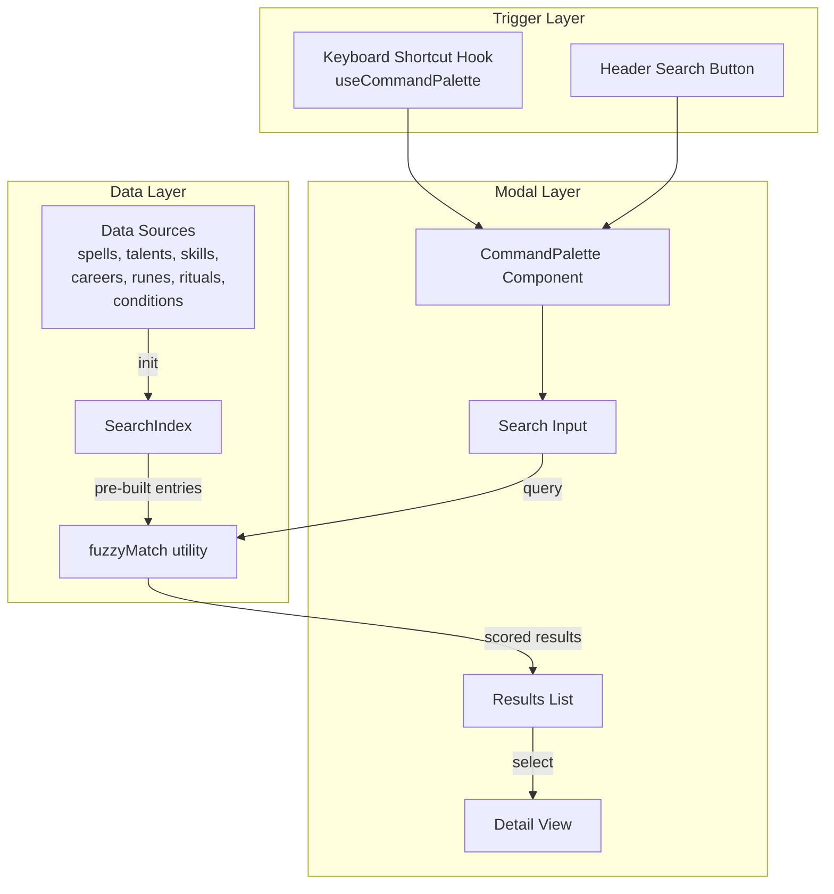

# Design Document: Command Palette Search

## Overview

The command palette search provides a global, instant-access reference tool for looking up WFRP 4e game entities within the PWA. It renders as a modal overlay triggered by keyboard shortcut (Ctrl/Cmd+K) or a header button, supporting fuzzy search across spells, talents, skills, careers, runes, rituals, and conditions. Results are grouped by entity type, ranked by relevance, and expandable into a detail view — all operating purely client-side against a pre-built search index.

### Design Decisions

1. **Client-side fuzzy search (no server)**: All game data is already bundled as static imports. A lightweight client-side fuzzy matcher avoids network dependency, enabling offline PWA use and sub-16ms query performance.

2. **Single modal component with internal state machine**: Rather than multiple routes or portals, the palette uses an internal state (closed → results list → detail view) managed via `useReducer`. This keeps the feature self-contained and avoids polluting the app's hash-based routing.

3. **Composable search index built at app init**: The search index is constructed once from all static data sources during initialization, then reused across palette opens. This avoids repeated computation and keeps per-keystroke work to a simple filter/score operation.

4. **CSS Modules + existing design tokens**: Consistent with the project's styling approach (CSS Modules, `lucide-react` icons, existing color variables).

## Architecture



### Component Hierarchy

```
App
├── Navigation (adds search button)
├── CommandPaletteProvider (context for open/close state)
│   └── CommandPalette (portal-rendered modal)
│       ├── SearchInput
│       ├── ResultsList
│       │   ├── ResultGroup (per entity type)
│       │   │   └── ResultCard[]
│       └── DetailView
│           ├── SpellDetail
│           ├── TalentDetail
│           ├── SkillDetail
│           ├── CareerDetail
│           ├── RuneDetail
│           ├── RitualDetail
│           └── ConditionDetail
└── useCommandPalette (keyboard shortcut hook)
```

## Components and Interfaces

### CommandPaletteProvider

A React context provider mounted near the app root that exposes palette open/close state to both the keyboard shortcut hook and the header button.

```typescript
interface CommandPaletteContextValue {
  isOpen: boolean;
  open: () => void;
  close: () => void;
  toggle: () => void;
}
```

### useCommandPalette Hook

Registers the global Ctrl/Cmd+K listener. Prevents default browser behavior. Calls `toggle()` from the context regardless of which element has focus.

### CommandPalette Component

The modal overlay itself, rendered via a React portal to `document.body`.

```typescript
interface CommandPaletteProps {
  // No props needed — reads from context
}

type PaletteView = 'results' | 'detail';

interface PaletteState {
  view: PaletteView;
  query: string;
  selectedIndex: number;
  selectedEntity: SearchResultEntry | null;
  scrollPosition: number;
}
```

**State transitions:**
- `OPEN` → view: 'results', query: '', focus input
- `TYPE` → update query, recompute results, reset selectedIndex to 0
- `ARROW_DOWN/UP` → adjust selectedIndex, scroll into view
- `ENTER` / `CLICK_RESULT` → view: 'detail', store selectedEntity + scrollPosition
- `BACK` / `ESCAPE_IN_DETAIL` → view: 'results', restore scrollPosition
- `ESCAPE_IN_RESULTS` / `CLICK_BACKDROP` → close palette, clear state

### SearchInput

```typescript
interface SearchInputProps {
  value: string;
  onChange: (query: string) => void;
  inputRef: React.RefObject<HTMLInputElement>;
}
```

Placeholder: `"Search spells, talents, skills, careers..."`
ARIA: `aria-controls="palette-results"`, `aria-activedescendant` referencing highlighted option.

### ResultsList / ResultCard

```typescript
interface ResultsListProps {
  results: GroupedResults;
  selectedIndex: number;
  onSelect: (entry: SearchResultEntry) => void;
  onSelectedIndexChange: (index: number) => void;
  listRef: React.RefObject<HTMLDivElement>;
}

interface GroupedResults {
  groups: ResultGroup[];
  totalCount: number;
}

interface ResultGroup {
  type: EntityType;
  label: string;
  entries: SearchResultEntry[];
}
```

Each `ResultCard` uses `role="option"` with `aria-selected` for the highlighted item. Touch targets are minimum 44px height.

### DetailView

Renders full entity information based on entity type. Includes a back button to return to results.

```typescript
interface DetailViewProps {
  entity: SearchResultEntry;
  onBack: () => void;
}
```

## Data Models

### Search Index Types

```typescript
type EntityType = 'spell' | 'talent' | 'skill' | 'career' | 'rune' | 'ritual' | 'condition';

interface SearchableEntity {
  id: string;
  name: string;
  type: EntityType;
  searchText: string;       // pre-computed: name + description concatenated, lowercased
  displayData: EntityDisplayData;
}

type EntityDisplayData =
  | SpellDisplayData
  | TalentDisplayData
  | SkillDisplayData
  | CareerDisplayData
  | RuneDisplayData
  | RitualDisplayData
  | ConditionDisplayData;

interface SpellDisplayData {
  type: 'spell';
  cn: string;
  lore: string;
  range: string;
  target: string;
  duration: string;
  effect: string;
}

interface TalentDisplayData {
  type: 'talent';
  max: string;
  desc: string;
}

interface SkillDisplayData {
  type: 'skill';
  characteristic: string;
  description: string;
}

interface CareerDisplayData {
  type: 'career';
  class: string;
  levels: CareerLevelSummary[];
}

interface CareerLevelSummary {
  title: string;
  status: string;
  characteristics: string[];
  skills: string[];
  talents: string[];
}

interface RuneDisplayData {
  type: 'rune';
  category: string;
  isMaster: boolean;
  maxPerItem: number;
  xpCost: number;
  effects: string;
  description: string;
}

interface RitualDisplayData {
  type: 'ritual';
  cn: number;
  ritualType: string;
  learningXP: number;
  ingredients: string;
  conditions: string;
  description: string;
}

interface ConditionDisplayData {
  type: 'condition';
  stackable: boolean;
  description: string;
  effects: string;
  duration: string;
  removedBy: string;
}
```

### Search Result Types

```typescript
interface SearchResultEntry {
  entity: SearchableEntity;
  score: number;            // relevance score from fuzzy match (higher = better)
  nameMatchRanges: [number, number][];  // character ranges for highlighting
}
```

### Search Index Construction

The index is built once at app startup by iterating over each data source and creating `SearchableEntity` records:

```typescript
function buildSearchIndex(): SearchableEntity[] {
  return [
    ...SPELL_DB.map(spellToSearchable),
    ...TALENT_DB.map(talentToSearchable),
    ...buildSkillEntries(),       // combines basic + advanced skills with descriptions
    ...Object.entries(CAREER_SCHEMES).map(careerToSearchable),
    ...RUNE_CATALOGUE.map(runeToSearchable),
    ...RITUAL_LIST.map(ritualToSearchable),
    ...CONDITIONS.map(conditionToSearchable),
  ];
}
```

### Fuzzy Match Algorithm

A lightweight scoring function that:
1. Checks if query characters appear in order within the target (subsequence match)
2. Scores based on: consecutive character matches, word-boundary bonuses, prefix matches
3. Searches name field first (2x score multiplier), then description/effect field

This is simpler than a full fuzzy library (no Levenshtein needed) but handles partial matches and minor omissions effectively. The algorithm operates on pre-lowercased `searchText` strings for performance.

```typescript
function fuzzyMatch(query: string, text: string): { score: number; ranges: [number, number][] } | null
```

Returns `null` for no match, or a score + highlight ranges for matches.

### Query Execution

```typescript
function searchEntities(index: SearchableEntity[], query: string, maxResults = 50): GroupedResults {
  // 1. Score all entries against query
  // 2. Filter out null matches
  // 3. Sort by score descending
  // 4. Take top maxResults
  // 5. Group by entity type
  // 6. Sort groups by: spells, talents, skills, careers, runes, rituals, conditions
}
```


## Correctness Properties

*A property is a characteristic or behavior that should hold true across all valid executions of a system — essentially, a formal statement about what the system should do. Properties serve as the bridge between human-readable specifications and machine-verifiable correctness guarantees.*

### Property 1: Search index completeness

*For any* entity present in any of the static data sources (SPELL_DB, TALENT_DB, ADV_SKILL_DB, basic skills, CAREER_SCHEMES, RUNE_CATALOGUE, RITUAL_LIST, CONDITIONS), that entity SHALL appear in the built search index with a matching name and correct entity type.

**Validates: Requirements 5.1, 10.1**

### Property 2: Name prefix match guarantee

*For any* entity in the search index and any prefix of that entity's name (length ≥ 1), searching with that prefix SHALL return that entity in the results.

**Validates: Requirements 5.2, 5.4**

### Property 3: Description search returns entity

*For any* entity in the search index whose description/effect field contains a word of 4+ characters, searching for that word SHALL include that entity in the results.

**Validates: Requirements 5.3**

### Property 4: Fuzzy tolerance for character omission

*For any* entity in the search index whose name is longer than 3 characters, searching with the name minus one arbitrary character SHALL still return that entity in the results.

**Validates: Requirements 5.5**

### Property 5: Results grouped by correct entity type

*For any* search query that returns results containing multiple entity types, every result in a given type group SHALL have an entity type matching that group's type heading.

**Validates: Requirements 6.1**

### Property 6: Results ranked in descending score order

*For any* search query producing results, within each type group the sequence of match scores SHALL be monotonically non-increasing (each score ≥ the next).

**Validates: Requirements 6.2**

### Property 7: Result count cap

*For any* search query against the full index, the total number of returned results SHALL be at most 50.

**Validates: Requirements 6.3**

### Property 8: ResultCard displays name, type badge, and type-specific summary

*For any* SearchResultEntry, the rendered ResultCard SHALL contain the entity name text, a type badge matching the entity type, and the type-specific summary field (CN+lore for spells, max for talents, characteristic for skills, class for careers, category for runes, stackable for conditions).

**Validates: Requirements 6.4, 6.5, 6.6, 6.7, 6.8, 6.9, 6.10**

### Property 9: DetailView renders all required fields per entity type

*For any* entity, the rendered DetailView SHALL contain every required field for that entity's type: spells (name, CN, range, target, duration, effect, lore), talents (name, max, description), skills (name, characteristic), careers (name, class, level titles with status/characteristics/skills/talents), runes (name, category, master status, maxPerItem, xpCost, effects, description), rituals (name, CN, type, learningXP, ingredients, conditions, description), conditions (name, stackable, description, effects, duration, removedBy).

**Validates: Requirements 7.2, 7.3, 7.4, 7.5, 7.6, 7.7, 7.8**

## Error Handling

### Empty/Invalid Queries
- Empty string or whitespace-only query: return empty results (no error state)
- Very long query strings (>200 chars): truncate to 200 before matching to prevent performance degradation

### Missing Data Fields
- If an entity has a missing or undefined field (e.g., a spell with no `effect` text), display "—" as placeholder in both ResultCard summary and DetailView
- The search index construction should handle `undefined`/`null` gracefully by treating missing fields as empty strings for searchText

### Focus Management Failures
- If `previouslyFocusedElement` has been removed from DOM while palette was open, focus document.body on close instead of throwing

### Index Construction
- If a data source export is empty or malformed, log a console warning during index build but continue with remaining sources (graceful degradation)

## Testing Strategy

### Property-Based Tests (fast-check)

The project already uses `fast-check` (v4.8.0) with `vitest`. Property-based tests will be used to verify the core search logic — the pure functions that have universal properties holding across all valid inputs.

**Configuration:**
- Minimum 100 iterations per property test
- Each test tagged with: `Feature: command-palette-search, Property {N}: {title}`
- Tests located at: `src/components/command-palette/__tests__/*.property.test.ts`

**Properties to implement:**
- Properties 1–7 test the search index and fuzzy match algorithm (pure functions, no DOM)
- Properties 8–9 test rendering output (use `@testing-library/react` with generated entity data)

**Generators needed:**
- `arbitraryEntityType`: one of the 7 entity types
- `arbitrarySearchableEntity`: generates valid SearchableEntity with realistic field data
- `arbitraryQuery`: generates query strings (prefixes of names, random strings, partial matches)
- `arbitrarySpellData`, `arbitraryTalentData`, etc.: type-specific entity generators

### Unit Tests (example-based)

Example-based tests cover specific UI interactions, accessibility attributes, and keyboard navigation:

- Keyboard shortcut registration (Ctrl+K opens/closes)
- Escape/backdrop click dismissal
- Focus management (auto-focus on open, restore on close)
- Arrow key navigation (selectedIndex changes)
- ARIA attributes (role, aria-modal, aria-controls, aria-selected)
- Mobile responsive layout measurements
- Empty state display

### Integration Tests

- Performance benchmarks (index build < 100ms, search < 16ms)
- Full flow: open → type → select result → view detail → back → close
- Virtual keyboard scrollability (manual on device)

### Test File Organization

```
src/components/command-palette/
├── __tests__/
│   ├── searchIndex.property.test.ts       (Properties 1-7)
│   ├── searchGenerators.ts                (fast-check generators)
│   ├── ResultCard.property.test.tsx        (Property 8)
│   ├── DetailView.property.test.tsx        (Property 9)
│   ├── CommandPalette.test.tsx             (UI interaction examples)
│   ├── CommandPalette.accessibility.test.tsx (ARIA tests)
│   └── CommandPalette.keyboard.test.tsx    (keyboard navigation)
```
