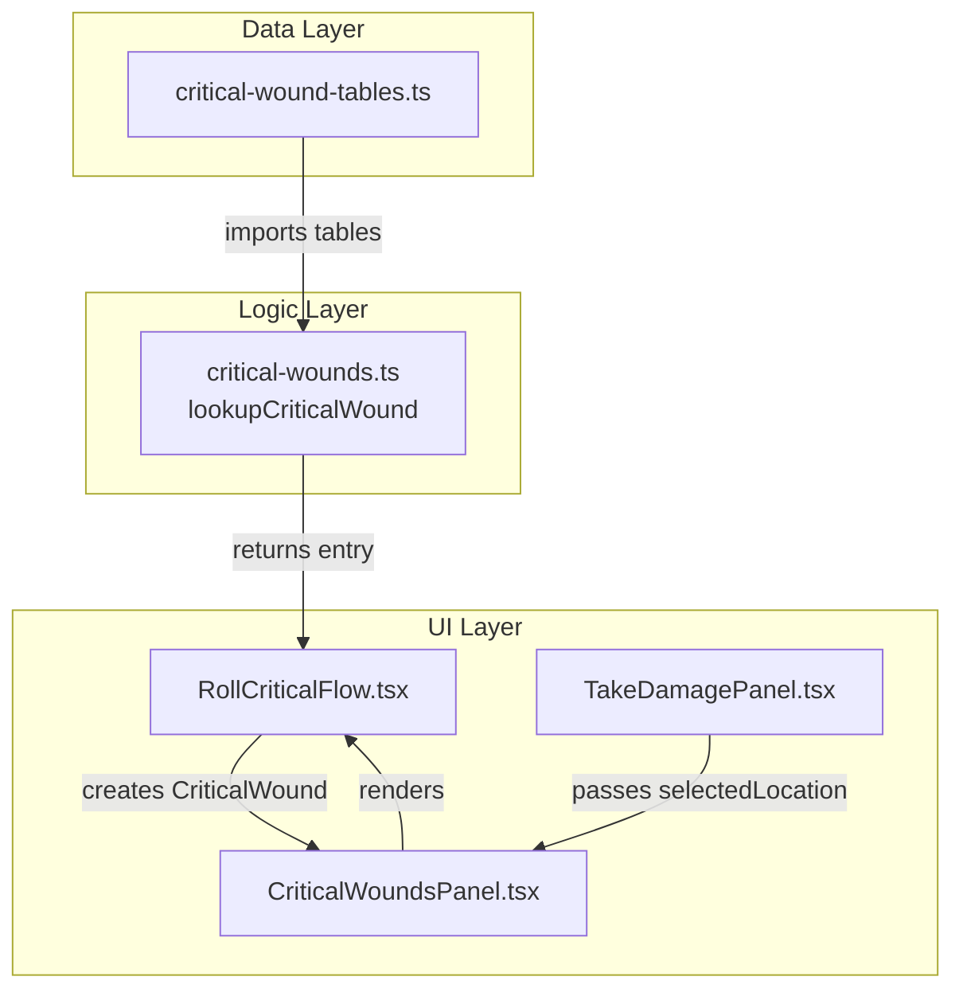

# Design Document: Critical Wound Tables

## Overview

This feature adds structured critical wound reference tables to the WFRP 4e character sheet PWA, enabling players to quickly look up and record critical wounds by hit location and d100 roll. The design follows the established patterns in the codebase: a data file exports typed table arrays, a pure logic function performs the lookup, and a UI component orchestrates the flow.

The architecture mirrors the existing mutation table system (`mutation-tables.ts` → `corruption.ts` → UI), adapting it for the four body location groups (Head, Arm, Body, Leg) with an additional severity field. The Roll Critical UI flow integrates into the existing `CriticalWoundsPanel` and optionally receives a pre-selected hit location from `TakeDamagePanel`.

## Architecture



**Data flow:**
1. `critical-wound-tables.ts` exports four typed arrays (HEAD, ARM, BODY, LEG) of `CriticalWoundTableEntry`
2. `lookupCriticalWound(location, roll)` in `critical-wounds.ts` maps the HitLocation to the correct table and performs the range lookup
3. `RollCriticalFlow` component calls the lookup function and previews results
4. On confirm, the flow creates a `CriticalWound` record via the existing `recordCriticalWound` helper

## Components and Interfaces

### Data Layer: `src/data/critical-wound-tables.ts`

```typescript
/**
 * Extends the existing MutationTableEntry pattern with a severity field.
 */
export interface CriticalWoundTableEntry {
  min: number;       // Lower bound of d100 roll range (inclusive)
  max: number;       // Upper bound of d100 roll range (inclusive)
  name: string;      // Wound name (e.g. "Lacerated Ear")
  effect: string;    // Effect description
  severity: number;  // Integer 1–5
}

export const HEAD_CRITICAL_TABLE: CriticalWoundTableEntry[] = [/* 10+ entries covering 1-100 */];
export const ARM_CRITICAL_TABLE: CriticalWoundTableEntry[] = [/* 10+ entries covering 1-100 */];
export const BODY_CRITICAL_TABLE: CriticalWoundTableEntry[] = [/* 10+ entries covering 1-100 */];
export const LEG_CRITICAL_TABLE: CriticalWoundTableEntry[] = [/* 10+ entries covering 1-100 */];
```

**Design decisions:**
- Extends `MutationTableEntry` pattern rather than inheriting, because `severity` is integral and a separate interface is clearer
- Four separate named exports (not a map) for tree-shaking and explicit imports
- Each array sorted by `min` ascending, with severity values non-decreasing within each table

### Logic Layer: `src/logic/critical-wounds.ts` (extended)

```typescript
import type { HitLocation } from '../components/combat/hitLocationTable';
import type { CriticalWoundTableEntry } from '../data/critical-wound-tables';

/**
 * Maps a HitLocation to its Body Location Group and returns the matching entry.
 * Returns undefined if roll is outside 1-100.
 * Pure function — no side effects.
 */
export function lookupCriticalWound(
  location: HitLocation,
  roll: number
): CriticalWoundTableEntry | undefined;
```

**Location mapping logic:**
- `'Head'` → `HEAD_CRITICAL_TABLE`
- `'Left Arm'` | `'Right Arm'` → `ARM_CRITICAL_TABLE`
- `'Body'` → `BODY_CRITICAL_TABLE`
- `'Left Leg'` | `'Right Leg'` → `LEG_CRITICAL_TABLE`

**Lookup algorithm:** Linear scan matching `entry.min <= roll && roll <= entry.max`. Given tables are ≤20 entries, linear scan is sufficient (consistent with `lookupMutation` pattern).

**Boundary handling:** Returns `undefined` for `roll < 1` or `roll > 100`. Does not clamp — unlike `lookupMutation` which clamps, this function uses explicit undefined return per requirements (Req 2.6).

### UI Layer: `src/components/combat/RollCriticalFlow.tsx`

```typescript
export interface RollCriticalFlowProps {
  /** Pre-selected hit location (from TakeDamagePanel "Character is Down" context) */
  preselectedLocation?: HitLocation;
  /** Called when user confirms the wound */
  onConfirm: (wound: Omit<CriticalWound, 'id' | 'timestamp'>) => void;
  /** Called when user cancels the flow */
  onCancel: () => void;
}
```

**Component states:**
1. **Input state** — Location selector + roll input field visible, no result shown
2. **Preview state** — Lookup result displayed with Confirm/Cancel buttons
3. **Error state** — Invalid roll value, lookup button disabled, inline error message

**UI elements:**
- Location `<select>` pre-populated with all 6 HitLocation values
- Numeric `<input>` for d100 roll (type="number", min=1, max=100, integer validation)
- "Roll" button — generates random 1–100 integer using `Math.floor(Math.random() * 100) + 1`
- "Look Up" button — calls `lookupCriticalWound`, transitions to preview state
- Preview card showing wound name, effect, severity
- "Confirm" button — creates wound record, calls `onConfirm`
- "Cancel" button — calls `onCancel` at any point

### Integration: `CriticalWoundsPanel` modifications

```typescript
interface CriticalWoundsPanelProps {
  criticalWounds: CriticalWound[];
  onAdd: () => void;
  onHeal: (woundId: number) => void;
  onUpdate: (index: number, field: string, value: string | number) => void;
  defaultCollapsed?: boolean;
  /** New: pre-selected location from TakeDamagePanel for Roll Critical flow */
  preselectedLocation?: HitLocation;
}
```

**Changes to existing component:**
- Add "Roll Critical" button next to existing "Add" button in the header
- Internal state `showRollFlow: boolean` controls whether `RollCriticalFlow` is rendered
- When `showRollFlow` is true, renders `RollCriticalFlow` inline below the header
- On confirm: calls `onAdd`-like handler that creates a pre-filled wound (uses `recordCriticalWound` from logic)
- On cancel: hides the flow, returns to default state
- Existing "Add" button and all edit/heal functionality remain unchanged

### Integration: `TakeDamagePanel` → `CriticalWoundsPanel` location passing

The `TakeDamagePanel` already maintains `selectedLocation` state and shows a "Character is Down" alert. The parent component (`CombatPage` or `CombatDashboard`) will pass the `selectedLocation` from `TakeDamagePanel` to `CriticalWoundsPanel` as the `preselectedLocation` prop when the down alert is active.

**Approach:** Lift the `selectedLocation` state to the parent component or expose it via a callback. The simplest approach is to add an `onDown` callback to `TakeDamagePanel` that fires with the current `selectedLocation` when the character goes down:

```typescript
// New optional prop on TakeDamagePanel
onDown?: (location: HitLocation) => void;
```

The parent stores this in state and passes it to `CriticalWoundsPanel.preselectedLocation`.

## Data Models

### CriticalWoundTableEntry

| Field | Type | Constraints |
|-------|------|-------------|
| min | number | Integer, 1–100 |
| max | number | Integer, ≥ min, ≤ 100 |
| name | string | Non-empty |
| effect | string | Non-empty |
| severity | number | Integer, 1–5 |

### Table structural invariants

- Each table has ≥10 entries
- Entries sorted by `min` ascending
- `table[0].min === 1`
- `table[last].max === 100`
- `table[i].max + 1 === table[i+1].min` (no gaps, no overlaps)
- `table[i].severity <= table[i+1].severity` (non-decreasing severity)

### Wound record creation (from Roll Critical flow)

When confirming a looked-up critical wound, the following `CriticalWound` fields are set:

| Field | Source |
|-------|--------|
| location | Selected HitLocation (e.g. "Left Arm") |
| description | `entry.name` |
| effects | `entry.effect` |
| severity | `entry.severity` |
| duration | `""` (empty string) |
| healed | `false` |
| id | Auto-assigned by `recordCriticalWound` |
| timestamp | Auto-assigned by `recordCriticalWound` |

## Correctness Properties

*A property is a characteristic or behavior that should hold true across all valid executions of a system — essentially, a formal statement about what the system should do. Properties serve as the bridge between human-readable specifications and machine-verifiable correctness guarantees.*

### Property 1: Entry structural validity

*For any* entry in any of the four critical wound tables, the entry SHALL have a `min` and `max` that are positive integers with `min <= max`, a non-empty `name` string, a non-empty `effect` string, and a `severity` that is an integer between 1 and 5 inclusive.

**Validates: Requirements 1.2, 5.1**

### Property 2: Lookup returns correct entry for all valid inputs

*For any* HitLocation and *for any* integer roll value between 1 and 100 inclusive, `lookupCriticalWound(location, roll)` SHALL return a defined `CriticalWoundTableEntry` where `entry.min <= roll` and `roll <= entry.max`.

**Validates: Requirements 1.3, 2.5**

### Property 3: Symmetric location mapping

*For any* d100 roll value between 1 and 100 inclusive, `lookupCriticalWound("Left Arm", roll)` SHALL return a deeply equal result to `lookupCriticalWound("Right Arm", roll)`, and `lookupCriticalWound("Left Leg", roll)` SHALL return a deeply equal result to `lookupCriticalWound("Right Leg", roll)`.

**Validates: Requirements 2.1, 2.2**

### Property 4: Out-of-range rolls return undefined

*For any* HitLocation and *for any* numeric roll value that is less than 1 or greater than 100, `lookupCriticalWound(location, roll)` SHALL return `undefined`.

**Validates: Requirements 2.6**

### Property 5: Non-decreasing severity ordering

*For any* critical wound table and *for any* pair of consecutive entries at indices `i` and `i+1`, `table[i].severity` SHALL be less than or equal to `table[i+1].severity`.

**Validates: Requirements 5.4**

## Error Handling

### Lookup Function

| Scenario | Behavior |
|----------|----------|
| Roll < 1 or > 100 | Returns `undefined` |
| Valid location + valid roll | Always returns an entry (tables guarantee full coverage) |
| Non-integer roll (e.g. 5.5) | Returns `undefined` (only integers 1-100 are valid d100 rolls) |

The function does NOT throw exceptions. Callers check for `undefined` and handle accordingly.

### Roll Critical UI Flow

| Scenario | Behavior |
|----------|----------|
| Empty input field | Lookup button disabled |
| Non-integer input | Inline error: "Enter a whole number between 1 and 100" |
| Value < 1 or > 100 | Inline error: "Roll must be between 1 and 100" |
| Valid input, lookup succeeds | Preview displayed |
| Cancel at any point | Flow dismissed, no wound created |

### Data Integrity

If table data is corrupted (hypothetically missing an entry for a roll), `lookupCriticalWound` returns `undefined`. The UI treats this as a failed lookup and shows an error message rather than crashing. This is a defensive measure — the data tests ensure this cannot happen in production.

## Testing Strategy

### Property-Based Tests (using fast-check)

The project will use `fast-check` for property-based testing, integrated with the existing `vitest` test runner.

**Configuration:**
- Minimum 100 iterations per property test
- Each test tagged with: `Feature: critical-wound-tables, Property {N}: {description}`

**Property tests to implement:**
1. Entry structural validity — generate random (table, index) pairs, verify field constraints
2. Lookup correctness — generate random (HitLocation, roll 1-100) pairs, verify returned entry range contains roll
3. Symmetric location mapping — generate random rolls, verify Left/Right pairs return equal results
4. Out-of-range returns undefined — generate rolls outside [1, 100], verify undefined
5. Non-decreasing severity — iterate all consecutive pairs in each table, verify ordering

### Unit Tests (example-based)

**Data layer (`src/data/__tests__/critical-wound-tables.test.ts`):**
- Each table has ≥10 entries
- First entry min=1, last entry max=100
- No gaps between consecutive entries (same pattern as `mutation-tables.test.ts`)
- Known entries spot-checked (e.g., Head table roll 1-10 is a specific mild wound)

**Logic layer (`src/logic/__tests__/critical-wounds.test.ts`):**
- `lookupCriticalWound("Head", 1)` returns first Head table entry
- `lookupCriticalWound("Head", 100)` returns last Head table entry
- `lookupCriticalWound("Left Arm", 50)` matches `lookupCriticalWound("Right Arm", 50)`
- `lookupCriticalWound("Body", 0)` returns undefined
- `lookupCriticalWound("Body", 101)` returns undefined

**UI layer (`src/components/combat/__tests__/RollCriticalFlow.test.tsx`):**
- Renders location selector with 6 options
- Pre-selects location from prop
- Disables lookup for invalid input
- Shows error message for out-of-range values
- Displays preview on successful lookup
- Calls onConfirm with correct CriticalWound shape
- Calls onCancel without creating wound

### Integration Tests

- TakeDamagePanel "Character is Down" passes location to CriticalWoundsPanel
- Both "Add" and "Roll Critical" buttons visible simultaneously
- Wounds created via Roll Critical are editable and healable

## File Structure

```
src/
├── data/
│   ├── critical-wound-tables.ts          # NEW: Table data + CriticalWoundTableEntry interface
│   └── __tests__/
│       └── critical-wound-tables.test.ts  # NEW: d100 coverage + structure tests
├── logic/
│   ├── critical-wounds.ts                 # MODIFIED: Add lookupCriticalWound function
│   └── __tests__/
│       └── critical-wounds.test.ts        # NEW: Lookup logic unit + property tests
├── components/
│   └── combat/
│       ├── RollCriticalFlow.tsx           # NEW: Roll Critical UI flow component
│       ├── RollCriticalFlow.module.css    # NEW: Styles for Roll Critical flow
│       ├── CriticalWoundsPanel.tsx        # MODIFIED: Add Roll Critical button + integration
│       ├── TakeDamagePanel.tsx            # MODIFIED: Add onDown callback prop
│       └── __tests__/
│           └── RollCriticalFlow.test.tsx  # NEW: Component tests
```

