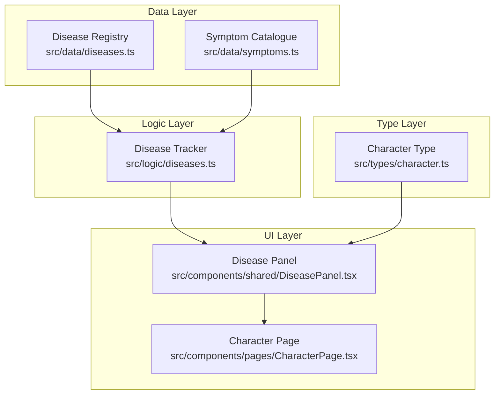

# Design Document: Disease System

## Overview

The Disease System adds WFRP 4e Core Rulebook disease tracking to the character sheet PWA. It introduces two static data modules (Disease Registry and Symptom Catalogue), a logic module for lookups and active disease management, a Character type extension, and a UI panel for viewing and managing active diseases.

This design follows the established data → logic → UI architecture pattern used by the mutations, critical wounds, and corruption systems already in the codebase.

### Key Design Decisions

1. **Static data as typed constant arrays** — Mirrors the pattern in `critical-wound-tables.ts` and `mutation-tables.ts`. No runtime fetching needed.
2. **Immutable logic functions** — All disease management functions return new arrays without mutating inputs, consistent with `critical-wounds.ts` patterns.
3. **Deep-merge migration** — Existing characters missing the `diseases` field will get `[]` via the `deepMerge` with `BLANK_CHARACTER` pattern already in `migration.ts`.
4. **Symptom references by name string** — Diseases reference symptoms by exact name match into the symptom catalogue, keeping data human-readable and cross-referenceable.

## Architecture



### Data Flow

1. **Character Page** renders the **Disease Panel**, passing `character.diseases` and an `updateCharacter` mutator.
2. **Disease Panel** uses **Disease Tracker** logic functions to add/remove diseases and resolve symptom details.
3. **Disease Tracker** reads from the static **Disease Registry** and **Symptom Catalogue** for lookups.
4. State changes flow back up via `updateCharacter` → `useCharacter` hook → localStorage auto-save.

## Components and Interfaces

### Data Module: Disease Registry (`src/data/diseases.ts`)

```typescript
export interface DiseaseEntry {
  name: string;
  contraction: string;
  incubation: string;   // e.g. "1d10 days"
  duration: string;     // e.g. "1d10 days"
  symptoms: string[];   // references Symptom names
}

export const DISEASE_REGISTRY: readonly DiseaseEntry[] = [
  // 9 diseases: Blood Rot, The Bloody Flux, Galloping Trots,
  // Itching Pox, Neiglish Rot, Packer's Pox, Ratte Fever,
  // The Shakes, Black Plague
];
```

### Data Module: Symptom Catalogue (`src/data/symptoms.ts`)

```typescript
export interface SymptomEntry {
  name: string;
  description: string;
  effects: string;
}

export const SYMPTOM_CATALOGUE: readonly SymptomEntry[] = [
  // 12 symptoms: Blight, Convulsions, Coughs and Sneezes,
  // Delirium, Fever, Flux, Gangrene, Lingering, Malaise,
  // Nausea, Pox, Wounded
];
```

### Logic Module: Disease Tracker (`src/logic/diseases.ts`)

```typescript
import type { DiseaseEntry } from '../data/diseases';
import type { SymptomEntry } from '../data/symptoms';
import { DISEASE_REGISTRY } from '../data/diseases';
import { SYMPTOM_CATALOGUE } from '../data/symptoms';

export interface ActiveDisease {
  id: number;
  diseaseName: string;
  contracted: number;   // Date.now() timestamp
  notes: string;
}

// Lookup functions
export function findDisease(name: string): DiseaseEntry | undefined;
export function findSymptom(name: string): SymptomEntry | undefined;
export function getDiseaseSymptoms(diseaseName: string): SymptomEntry[] | undefined;

// Active disease management (immutable)
export function addDisease(diseases: ActiveDisease[], diseaseName: string): ActiveDisease[];
export function removeDisease(diseases: ActiveDisease[], id: number): ActiveDisease[];
export function updateDiseaseNotes(diseases: ActiveDisease[], id: number, notes: string): ActiveDisease[];
```

### UI Component: Disease Panel (`src/components/shared/DiseasePanel.tsx`)

```typescript
interface DiseasePanelProps {
  character: Character;
  updateCharacter: (mutator: (char: Character) => Character) => void;
}
```

The panel follows the same structure as `CorruptionCard`:
- Uses `Card`, `SectionHeader`, `AddButton` shared components
- Collapsible disease entries with expand/collapse on tap
- Picker modal for disease selection (similar to spell/talent pickers)
- Empty state message when no diseases are active

### Character Type Extension

Add to `Character` interface in `src/types/character.ts`:

```typescript
diseases?: ActiveDisease[];
```

Add to `BLANK_CHARACTER`:

```typescript
diseases: [],
```

Using optional (`?`) ensures backward compatibility — the `deepMerge` in migration.ts will default missing fields. The `backfillCharacter` function in `useCharacter.ts` will also handle this with a simple fallback.

## Data Models

### ActiveDisease Record

| Field | Type | Description |
|-------|------|-------------|
| `id` | `number` | Auto-incrementing ID (max existing + 1, or 1) |
| `diseaseName` | `string` | Exact name matching Disease Registry entry |
| `contracted` | `number` | `Date.now()` timestamp when added |
| `notes` | `string` | Free-text notes, initialized to `""` |

### DiseaseEntry (Static)

| Field | Type | Description |
|-------|------|-------------|
| `name` | `string` | Disease name (unique) |
| `contraction` | `string` | How the disease is contracted |
| `incubation` | `string` | Dice expression + time unit |
| `duration` | `string` | Dice expression + time unit |
| `symptoms` | `string[]` | Array of symptom name references (≥1) |

### SymptomEntry (Static)

| Field | Type | Description |
|-------|------|-------------|
| `name` | `string` | Symptom name (unique) |
| `description` | `string` | Non-empty description text |
| `effects` | `string` | Non-empty mechanical effects text |


## Correctness Properties

*A property is a characteristic or behavior that should hold true across all valid executions of a system — essentially, a formal statement about what the system should do. Properties serve as the bridge between human-readable specifications and machine-verifiable correctness guarantees.*

### Property 1: Data completeness invariant

*For any* disease entry in the Disease Registry, all fields (name, contraction, incubation, duration) SHALL be non-empty strings and the symptoms array SHALL have length ≥ 1. *For any* symptom entry in the Symptom Catalogue, both description and effects SHALL be non-empty strings.

**Validates: Requirements 1.4, 1.5, 2.4**

### Property 2: Symptom reference round-trip resolution

*For any* disease in the Disease Registry, calling `getDiseaseSymptoms(disease.name)` SHALL return an array of SymptomEntry objects whose names match the disease's symptoms array in the same order, with each entry being a fully resolved symptom from the catalogue.

**Validates: Requirements 1.3, 3.5, 9.1**

### Property 3: Lookup returns correct entry for valid names

*For any* disease entry in the Disease Registry, `findDisease(entry.name)` SHALL return that exact entry. *For any* symptom entry in the Symptom Catalogue, `findSymptom(entry.name)` SHALL return that exact entry.

**Validates: Requirements 3.1, 3.3**

### Property 4: Lookup returns undefined for invalid names

*For any* string that does not exactly match a name in the Disease Registry, `findDisease(str)` SHALL return undefined. *For any* string that does not exactly match a name in the Symptom Catalogue, `findSymptom(str)` SHALL return undefined. *For any* string that does not match a disease name, `getDiseaseSymptoms(str)` SHALL return undefined.

**Validates: Requirements 3.2, 3.4, 3.6**

### Property 5: No duplicate names in registries

*For any* pair of entries in the Disease Registry, their names SHALL be distinct. *For any* pair of entries in the Symptom Catalogue, their names SHALL be distinct.

**Validates: Requirements 9.2, 9.3**

### Property 6: Add disease produces correctly structured record

*For any* existing diseases array and any valid disease name, `addDisease(diseases, name)` SHALL produce a new array where the last element has: id equal to max(existing ids) + 1 (or 1 if empty), diseaseName equal to the provided name, contracted as a positive number, and notes as an empty string.

**Validates: Requirements 4.1**

### Property 7: Remove disease correctness

*For any* diseases array containing at least one entry, `removeDisease(diseases, existingId)` SHALL return an array without that entry, preserving the relative order of remaining entries. *For any* diseases array and an ID not present in it, `removeDisease(diseases, missingId)` SHALL return an array deep-equal to the input.

**Validates: Requirements 4.2, 4.3, 4.5**

### Property 8: Immutability of add and remove operations

*For any* diseases array, calling `addDisease` or `removeDisease` SHALL not mutate the original input array — the original array's length and contents SHALL remain unchanged after the operation.

**Validates: Requirements 4.4, 4.5**

### Property 9: Notes update persistence

*For any* diseases array containing an entry with a given ID, and *for any* string value, `updateDiseaseNotes(diseases, id, notes)` SHALL return an array where the entry with that ID has its notes field equal to the provided string, and all other entries remain unchanged.

**Validates: Requirements 8.1**

### Property 10: Migration backfill preserves existing data

*For any* character object that lacks a diseases field, after backfill/loading, the character SHALL have `diseases` equal to `[]` and all other pre-existing fields SHALL be unchanged.

**Validates: Requirements 5.3**

## Error Handling

| Scenario | Handling |
|----------|----------|
| `findDisease` called with non-existent name | Returns `undefined` — caller checks before use |
| `findSymptom` called with non-existent name | Returns `undefined` — caller checks before use |
| `getDiseaseSymptoms` with invalid disease | Returns `undefined` — UI shows nothing |
| `removeDisease` with non-existent ID | No-op, returns original array unchanged |
| `updateDiseaseNotes` with non-existent ID | No-op, returns original array unchanged |
| Character loaded without `diseases` field | `backfillCharacter` defaults to `[]` |
| Disease with symptom reference that somehow doesn't resolve | `getDiseaseSymptoms` filters undefined entries (defensive) — should never happen with valid data per Property 2 |

No exceptions are thrown — all error cases return safe defaults (`undefined` or unchanged arrays). This matches the defensive patterns used throughout the codebase.

## Testing Strategy

### Property-Based Tests (fast-check)

The project already uses `fast-check` (v4.8.0) with `vitest` for property-based testing. Each correctness property above will be implemented as a property-based test with a minimum of 100 iterations.

**Test file locations:**
- `src/data/__tests__/diseases.property.test.ts` — Properties 1, 2, 3, 4, 5 (static data integrity and lookups)
- `src/logic/__tests__/diseases.property.test.ts` — Properties 6, 7, 8, 9, 10 (active disease management)

**Generators needed:**
- `arbitraryActiveDisease`: generates ActiveDisease records with random ids, names from registry, timestamps, and notes strings
- `arbitraryDiseasesArray`: generates arrays of 0–10 ActiveDisease records with unique IDs
- `arbitraryInvalidName`: generates random strings filtered to exclude actual disease/symptom names

**Configuration:**
- Each test runs with `{ numRuns: 100 }`
- Each test is tagged with: `Feature: disease-system, Property {N}: {title}`

### Unit Tests (Example-Based)

**Test file locations:**
- `src/data/__tests__/diseases.test.ts` — Static counts (9 diseases, 12 symptoms), specific disease lookups
- `src/logic/__tests__/diseases.test.ts` — Edge cases for add/remove, notes update
- `src/components/shared/__tests__/DiseasePanel.test.tsx` — UI interaction tests (add flow, remove flow, expand/collapse, empty state, picker)

**Key example-based tests:**
- Requirement 1.2: Registry has exactly 9 entries
- Requirement 2.2/2.3: Catalogue has exactly 12 entries
- Requirement 5.2: `BLANK_CHARACTER.diseases` is `[]`
- Requirement 6.2: Tapping a disease expands it (user-event test)
- Requirement 6.3: Add button shows picker with 9 diseases
- Requirement 6.4: Selecting from picker adds to character
- Requirement 6.5: Remove button removes disease
- Requirement 6.6: Empty state shows when no diseases
- Requirement 8.2: Expanded disease shows textarea for notes

### Test Balance Rationale

- **Property tests** cover the logic layer comprehensively — data integrity, lookup correctness, immutable operations, and migration safety
- **Unit tests** cover specific counts, UI interactions (which require user-event simulation), and edge cases
- UI rendering with arbitrary data is possible but the core value is in testing the pure logic layer, matching the project's existing pattern where property tests focus on logic/data modules
