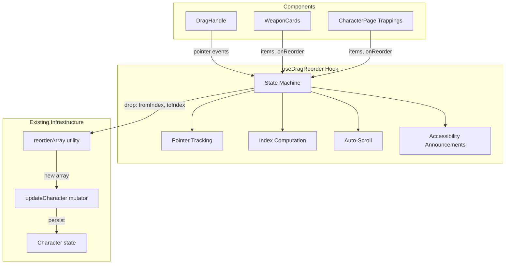
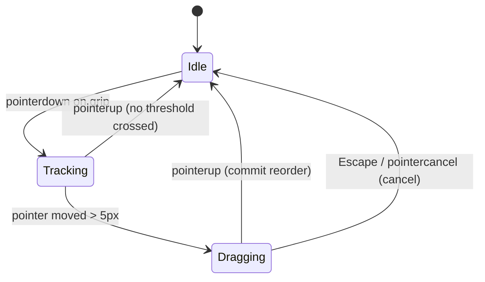

# Design Document: Drag-Reorder Equipment

## Overview

This feature enhances the existing button-based reordering of weapon cards and trapping cards with a pointer-event-driven drag-and-drop system. The implementation uses the browser's PointerEvent API (unified mouse, touch, and pen) to provide a smooth, accessible drag experience without any third-party libraries.

The core logic lives in a custom React hook (`useDragReorder`) that encapsulates all pointer tracking, state transitions, drop index computation, and accessibility announcements. The hook is integrated into both `WeaponCards.tsx` and the trapping card section of `CharacterPage.tsx` by augmenting the existing `DragHandle` component with pointer event handlers.

### Key Design Decisions

1. **Custom hook over external library**: The project already has zero drag-and-drop dependencies. A custom ~200-line hook keeps bundle size unchanged and provides exact control over the interaction model (5px threshold, pointer capture, auto-scroll).

2. **PointerEvent API**: Unifies mouse, touch, and pen under a single event model. All modern browsers support it, and it integrates naturally with `setPointerCapture` for cross-boundary tracking.

3. **CSS transforms for movement**: The dragged item's position follows the pointer via `transform: translateY(...)`, avoiding layout reflow. DOM reorder only happens on drop.

4. **State machine approach**: The drag lifecycle is modeled as a finite state machine (idle → tracking → dragging → idle) which makes transitions predictable and testable.

## Architecture



### State Machine



## Components and Interfaces

### `useDragReorder` Hook

The primary new abstraction. Returns event handlers and state for a single sortable list.

```typescript
interface UseDragReorderOptions<T> {
  items: T[];
  onReorder: (fromIndex: number, toIndex: number) => void;
  containerRef: React.RefObject<HTMLElement | null>;
  axis?: 'vertical' | 'horizontal'; // default: 'vertical'
}

interface DragState {
  status: 'idle' | 'tracking' | 'dragging';
  dragIndex: number | null;      // index of the item being dragged
  dropIndex: number | null;      // current insertion target
  offsetY: number;               // transform offset for the dragged item
}

interface UseDragReorderResult {
  dragState: DragState;
  getGripProps: (index: number) => {
    onPointerDown: (e: React.PointerEvent) => void;
    'aria-roledescription': string;
    style?: React.CSSProperties;
  };
  getItemProps: (index: number) => {
    className?: string;
    style?: React.CSSProperties;
    'aria-grabbed'?: boolean;
  };
  dropIndicatorIndex: number | null;
  announcementText: string;       // for aria-live region
}
```

### Updated `DragHandle` Component

The existing `DragHandle` gains pointer event handlers on the grip icon via the hook's `getGripProps`:

```typescript
export interface DragHandleProps {
  onMoveUp: () => void;
  onMoveDown: () => void;
  isFirst: boolean;
  isLast: boolean;
  itemLabel: string;
  // New: pointer event props from useDragReorder
  gripProps?: {
    onPointerDown: (e: React.PointerEvent) => void;
    'aria-roledescription': string;
    style?: React.CSSProperties;
  };
}
```

### `DropIndicator` Component

A small presentational component rendered between items to show the drop target:

```typescript
interface DropIndicatorProps {
  visible: boolean;
}

// Renders a horizontal line with accent color, 2px height, full width
```

### `AriaLiveAnnouncer` Component

A visually-hidden aria-live region that announces reorder completions:

```typescript
interface AriaLiveAnnouncerProps {
  message: string;  // e.g., "Sword moved to position 3 of 5"
}
```

### Integration Points

| Consumer | Container | onReorder Implementation |
|----------|-----------|--------------------------|
| `WeaponCards.tsx` | `.cardGrid` div | Calls `onReorderWeapon(from, to)` prop |
| `CharacterPage.tsx` trappings | `.trappingsGrid` div | Calls `updateCharacter(c => ({...c, trappings: reorderArray(c.trappings, from, to)}))` |

## Data Models

No new persistent data models are introduced. The feature operates on the existing `Character.weapons: WeaponItem[]` and `Character.trappings: Trapping[]` arrays. Reordering produces a new array via the existing `reorderArray<T>()` utility and persists through the existing `updateCharacter` mutator (debounced auto-save via `useCharacter` hook).

### Transient State (Hook Internal)

```typescript
// Internal to useDragReorder — not persisted
interface InternalDragState {
  status: 'idle' | 'tracking' | 'dragging';
  dragIndex: number;
  startY: number;          // pointer Y at pointerdown
  startX: number;          // pointer X at pointerdown
  currentY: number;        // current pointer Y
  dropIndex: number;       // computed insertion target
  pointerId: number;       // for pointer capture
  itemRects: DOMRect[];    // cached bounding rects of list items
  containerRect: DOMRect;  // cached container bounds
  scrollTimerId: number | null; // auto-scroll RAF id
}
```

## Correctness Properties

*A property is a characteristic or behavior that should hold true across all valid executions of a system — essentially, a formal statement about what the system should do. Properties serve as the bridge between human-readable specifications and machine-verifiable correctness guarantees.*

### Property 1: Drag Initiation Discrimination

*For any* pointer event target element within the card list, the drag system SHALL begin tracking if and only if the target is the grip icon element (or a descendant of it). Pointer events on any other element (card body, buttons, inputs) SHALL NOT initiate drag.

**Validates: Requirements 1.1, 1.5**

### Property 2: Movement Threshold Activation

*For any* pointer movement delta (dx, dy) from the pointerdown origin, the drag system SHALL transition to active dragging state if and only if `Math.sqrt(dx² + dy²) > 5`. Movements at or below the 5-pixel threshold SHALL remain in the tracking state.

**Validates: Requirements 1.2**

### Property 3: Insertion Index Correctness

*For any* pointer Y position within or near a list of N items with known bounding rectangles, the computed insertion index SHALL equal the index of the gap closest to the pointer's vertical center. Specifically, for items with midpoints `m[0]...m[N-1]`, the insertion index is the count of midpoints above the pointer position, clamped to `[0, N]`.

**Validates: Requirements 2.1, 2.2, 2.4**

### Property 4: Cancellation Resets State

*For any* active drag operation (any item index, any current drop position), a cancellation event (Escape keydown or pointercancel) SHALL return the drag system to idle state with `dragIndex = null`, `dropIndex = null`, and `offsetY = 0`, and SHALL NOT invoke the `onReorder` callback.

**Validates: Requirements 4.1, 4.2, 4.3**

### Property 5: Aria-Live Announcement Correctness

*For any* completed reorder operation moving an item from index `fromIndex` to index `toIndex` in a list of length N, the announcement text SHALL contain the substring `"position ${toIndex + 1} of ${N}"`.

**Validates: Requirements 6.5**

### Property 6: Throttled Index Updates

*For any* sequence of pointer positions that all resolve to the same insertion index (i.e., pointer stays within the same inter-item gap), the drop indicator index SHALL be set exactly once and not re-set for subsequent positions mapping to the same index.

**Validates: Requirements 10.3**

## Error Handling

| Scenario | Handling |
|----------|----------|
| `setPointerCapture` throws (e.g., invalid pointerId) | Wrap in try/catch; fall back to tracking without capture (drag still works but may lose tracking at element boundaries) |
| Container ref is null when drag starts | Abort drag initiation; remain in idle state |
| Item rects cannot be computed (hidden container) | Abort drag; return to idle |
| `reorderArray` returns same array (invalid indices) | Hook detects no change and does not call `onReorder` |
| Rapid pointer events during scroll | `requestAnimationFrame` ensures at most one visual update per frame; stale events are discarded |
| Browser fires pointercancel during scroll | Treated as cancellation; drag is cleanly aborted |
| Touch device fires contextmenu during drag | `contextmenu` event listener calls `preventDefault()` while drag is active |

## Testing Strategy

### Unit Tests (Example-Based)

- `DragHandle` renders grip, ChevronUp, ChevronDown with correct aria attributes
- `DragHandle` grip has `aria-roledescription="sortable"`
- Chevron buttons remain keyboard-operable (Enter/Space fire callbacks)
- `DropIndicator` renders with accent color styling when `visible={true}`
- `AriaLiveAnnouncer` renders message in visually-hidden aria-live region
- Visual styles (elevated class) applied during active drag
- Pointer capture is called/released at correct lifecycle points
- Expand/collapse on WeaponCard is suppressed during drag
- Edit/checkbox on TrappingCard is suppressed during drag
- Trapping card horse icon/label renders with correct tooltip text
- Touch target size CSS applied under `@media (hover: none)`

### Property-Based Tests (fast-check)

Property-based testing is appropriate here because the drag system contains pure computational logic (threshold detection, insertion index calculation, announcement formatting) that varies meaningfully with input and benefits from exhaustive input exploration.

- **Library**: `fast-check` (already in devDependencies)
- **Minimum iterations**: 100 per property
- **Tag format**: `Feature: drag-reorder-equipment, Property {N}: {title}`

Each correctness property above maps to one property-based test:

1. **Drag Initiation Discrimination** — Generate random element identifiers (grip vs non-grip), verify tracking starts iff target is grip
2. **Movement Threshold Activation** — Generate random (dx, dy) pairs, verify state transition matches threshold condition
3. **Insertion Index Correctness** — Generate random list heights and pointer positions, verify computed index matches expected geometric calculation
4. **Cancellation Resets State** — Generate random drag states (various indices, offsets), apply cancel, verify state is fully reset
5. **Aria-Live Announcement Correctness** — Generate random (fromIndex, toIndex, listLength) triples, verify announcement string format
6. **Throttled Index Updates** — Generate sequences of pointer positions resolving to same index, verify update count is exactly 1

### Integration Tests

- Full drag lifecycle on `WeaponCards`: pointerdown → move → pointerup verifies `onReorderWeapon` called with correct indices
- Full drag lifecycle on trapping cards: verifies `updateCharacter` called with `reorderArray` result
- Cancel via Escape mid-drag: verifies no state mutation
- Touch drag with scroll prevention: verifies `preventDefault` on touchmove events during drag
