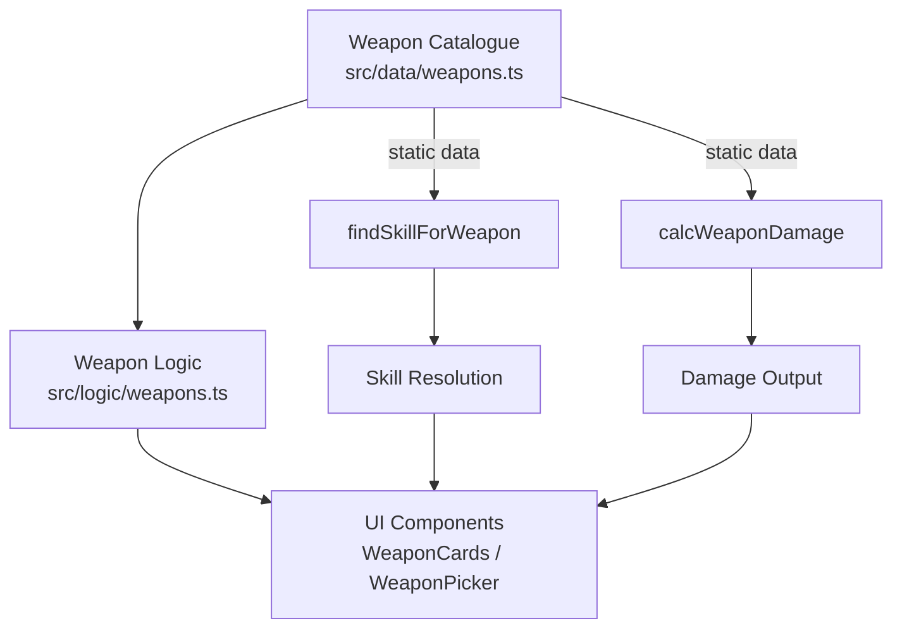

# Design Document: Dwarf Weapons

## Overview

This feature updates the weapon catalogue, skill resolution logic, and damage calculation to support Dwarf Engineering weapons and updated Dwarf weapon profiles from the Dwarf Players Guide. It introduces three new weapon qualities/flaws (Crewed, Salvo, Spread), updates existing Dwarf weapon stats, adds new Engineering-group weapons (both melee and ranged), and ensures the damage calculator correctly classifies Engineering weapons by their melee/ranged nature based on the presence of a `maxR` property.

The key design challenge is that "Engineering" is a single weapon group that contains both melee and ranged weapons. Unlike other groups (which are wholly melee or wholly ranged), an Engineering weapon's melee/ranged classification must be determined per-weapon by checking for the `maxR` property. This affects skill resolution, talent bonus application, and house rule processing.

## Architecture

The feature touches three layers of the application:



**Data Flow:**
1. **Catalogue → Picker**: User selects a weapon from `WEAPONS[]`, picker copies all fields to a `WeaponItem` on the character.
2. **WeaponItem → Skill Resolution**: `findSkillForWeapon` determines the attack skill based on group + `maxR` presence.
3. **WeaponItem → Damage Calculation**: `calcWeaponDamage` computes total damage using the formula, SB, talents, runes, and house rules.
4. **WeaponItem → Card Rendering**: `WeaponCards` displays name, group, damage total, range/reach, and qualities string.

## Components and Interfaces

### Modified: `src/data/weapons.ts`

The `WEAPONS` array is updated with corrected Dwarf weapon profiles and new Engineering entries. No structural changes to the `WeaponData` interface are needed — the existing fields (`name`, `group`, `enc`, `rangeReach`, `damage`, `qualities`, `maxR`, `optR`, `rangeMod`, `reload`) already accommodate the new weapons.

**Changes:**
- Update existing Dwarf melee weapon entries (Dwarf Axe, Dwarf Warhammer, Whirling Blades of Death, Dwarf Greataxe, Dwarf Greathammer, Dwarf Pick) with corrected stats from the Dwarf Players Guide
- Update existing Engineering melee entries (Steam Drill, Cog Axe, Steam Gauntlet) with corrected stats
- Update existing Dwarf ranged entries (Dwarf Handgun, Dwarf Pistol, Dwarf Crossbow, Dwarf Throwing Axe, Drakegun, Drakefire Pistol, Trollhammer Torpedo) with corrected stats
- Add new entries: Repeating Dwarf Handgun, Grudge-raker (Engineering group), Blasting Charge, Cinderblast Bomb (Explosives group)
- Add "BP" quality to all Blackpowder-group weapons and Drakefire weapons
- Move Repeating Dwarf Handgun and Grudge-raker from Blackpowder to Engineering group

### Modified: `src/logic/weapons.ts`

**`RANGED_GROUPS` constant** — No change needed. Engineering is already excluded (confirmed by existing tests). The per-weapon `maxR` check is the mechanism for Engineering weapon classification.

**`findSkillForWeapon` function** — Must be updated to handle Engineering weapons specially:
- If `weapon.group === 'Engineering'` and `weapon.maxR` is defined → look for `Ranged (Engineering)` skill, return null if not found
- If `weapon.group === 'Engineering'` and `weapon.maxR` is not defined → look for `Melee (Engineering)` skill, fall back to `Melee (Basic)` if not found

Current implementation treats all non-RANGED_GROUPS weapons as melee and searches for `Melee(<group>)`. This already works for melee Engineering weapons. The update adds a special case for ranged Engineering weapons (those with `maxR`).

**`calcWeaponDamage` function** — Must be updated to classify Engineering weapons with `maxR` as ranged for talent bonus and house rule purposes:
- Current: `const ranged = RANGED_GROUPS.includes(weapon.group)` — this misses Engineering ranged weapons
- Updated: `const ranged = RANGED_GROUPS.includes(weapon.group) || (weapon.group === 'Engineering' && !!weapon.maxR)`

This single-line change ensures:
- Engineering weapons with `maxR` receive Accurate Shot + Sure Shot bonuses
- Engineering weapons with `maxR` are affected by `rangedDamageSBMode` house rule
- Engineering weapons without `maxR` receive Strike Mighty Blow bonus (unchanged)

### Unchanged: `src/components/combat/WeaponCards.tsx`

The `WeaponCards` component already renders qualities as-is from the weapon's `qualities` string. New qualities like "Salvo 2", "Spread 3", and "Crewed 2" are plain text within the qualities string and display correctly without code changes. The existing logic:
- Shows qualities when `w.qualities && w.qualities !== '—'`
- Displays the full `w.qualities` string as comma-separated text

No UI component changes are required.

### Unchanged: `src/types/character.ts`

The `WeaponData` and `WeaponItem` interfaces already support all needed fields. No type changes required.

## Data Models

### WeaponData / WeaponItem (unchanged interface)

```typescript
interface WeaponData {
  name: string;        // Display name, e.g. "(2H) Drakegun"
  group: string;       // Weapon group, e.g. "Engineering", "Blackpowder"
  enc: string;         // Encumbrance as string integer, e.g. "3"
  rangeReach?: string; // Melee reach, e.g. "Average", "Short"
  damage: string;      // Damage formula, e.g. "+SB+6", "+12"
  qualities: string;   // Comma-separated qualities, e.g. "Blast 6, Damaging, BP"
  maxR?: string;       // Max range (ranged weapons), e.g. "30", "SBx2"
  optR?: string;       // Optimal range (derived: floor(maxR/3))
  rangeMod?: string;   // Range modifier (derived: floor(maxR/5))
  reload?: string;     // Reload value
}
```

### Engineering Weapon Classification Rule

```
isRangedEngineering(weapon) = weapon.group === 'Engineering' && weapon.maxR !== undefined
isMeleeEngineering(weapon)  = weapon.group === 'Engineering' && weapon.maxR === undefined
```

### Range Derivation Rule (for numeric maxR values)

```
optR  = Math.floor(parseInt(maxR) / 3)
rangeMod = Math.floor(parseInt(maxR) / 5)
```

Weapons with non-numeric maxR (e.g., "SB", "SBx2") retain manual optR/rangeMod values.

### BP Quality Invariant

A weapon has "BP" in its qualities string if and only if:
- `weapon.group === 'Blackpowder'`, OR
- `weapon.name` is "(2H) Drakegun" or "Drakefire Pistol"

## Correctness Properties

*A property is a characteristic or behavior that should hold true across all valid executions of a system — essentially, a formal statement about what the system should do. Properties serve as the bridge between human-readable specifications and machine-verifiable correctness guarantees.*

### Property 1: Weapon picker field copy correctness

*For any* weapon entry in the WEAPONS catalogue, when selected via the weapon picker, the resulting WeaponItem on the character SHALL have name, group, enc, rangeReach, damage, and qualities fields identical to the catalogue entry.

**Validates: Requirements 1.3**

### Property 2: Encumbrance string invariant

*For any* weapon entry in the WEAPONS catalogue, the `enc` field SHALL be a string that parses to a non-negative integer (matches pattern `/^\d+$/`).

**Validates: Requirements 2.4**

### Property 3: Range derivation correctness

*For any* weapon entry in the WEAPONS catalogue whose `maxR` field is a purely numeric string, the `optR` field SHALL equal `Math.floor(parseInt(maxR) / 3)` converted to string, and the `rangeMod` field SHALL equal `Math.floor(parseInt(maxR) / 5)` converted to string.

**Validates: Requirements 2.5**

### Property 4: Quality rendering faithfulness

*For any* weapon with a non-empty, non-"—" qualities string, the rendered Weapon_Card SHALL display the exact qualities text from the weapon data as a comma-and-space-separated string, preserving all quality names and their numeric ratings (including Salvo, Spread, Crewed, BP, and all others).

**Validates: Requirements 3.1, 3.2, 3.3, 3.4, 6.3**

### Property 5: Engineering weapon skill resolution

*For any* weapon with group "Engineering", skill resolution SHALL be determined by the presence of `maxR`: if `maxR` is defined, the system resolves against Ranged (Engineering) (returning null if the character lacks it); if `maxR` is not defined, the system resolves against Melee (Engineering) with fallback to Melee (Basic).

**Validates: Requirements 4.1, 4.2, 4.4**

### Property 6: Damage calculation correctness

*For any* weapon, SB value, talent list, rune list, and rangedDamageSBMode setting, `calcWeaponDamage` SHALL compute the total as: (SB contribution per formula and mode) + (flat bonus N) + (Strike Mighty Blow if melee, Accurate Shot + Sure Shot if ranged) + (rune bonus), where Engineering weapons with `maxR` are classified as ranged and Engineering weapons without `maxR` are classified as melee.

**Validates: Requirements 5.1, 5.2, 5.3, 5.4, 5.5, 4.5**

### Property 7: BP quality annotation invariant

*For any* weapon entry in the WEAPONS catalogue, the qualities string SHALL contain "BP" if and only if the weapon's group is "Blackpowder" OR the weapon's name is "(2H) Drakegun" or "Drakefire Pistol".

**Validates: Requirements 6.1, 6.4**

## Error Handling

| Scenario | Handling |
|----------|----------|
| Weapon damage is "—" or empty string | `calcWeaponDamage` returns `{ num: null, breakdown: '' }` — no crash, UI shows "—" |
| Engineering weapon with no matching skill on character | `findSkillForWeapon` returns `null` for ranged, or falls back to Melee (Basic) for melee |
| Non-numeric `maxR` (e.g., "SBx2") | optR/rangeMod are manually specified in catalogue data; derivation rule only applies to numeric values |
| Weapon qualities string is "—" | WeaponCards component hides the qualities section entirely |
| Unknown weapon group | `findSkillForWeapon` treats it as melee, falls back to Melee (Basic) |

## Testing Strategy

### Property-Based Tests (fast-check, vitest)

The project already uses `fast-check` for property-based testing with `vitest`. Each correctness property above maps to a property-based test with a minimum of 100 iterations.

**Test file**: `src/logic/__tests__/weapons.property.test.ts`

- **Property 1**: Generate random weapon entries from the catalogue, simulate picker selection, verify field equality
- **Property 2**: Iterate all catalogue entries, verify enc matches `/^\d+$/`
- **Property 3**: Filter catalogue to numeric-maxR weapons, verify optR and rangeMod derivations
- **Property 4**: Generate random weapons with rated qualities (e.g., "Salvo 3, Spread 2, Damaging"), render WeaponCards, verify qualities text matches source data
- **Property 5**: Generate Engineering weapons with/without maxR, generate random skill lists, verify skill resolution correctness
- **Property 6**: Generate random (SB, damage formula, talents, runes, mode) combinations, compute expected damage manually, verify calcWeaponDamage output matches
- **Property 7**: Iterate all catalogue entries, verify BP presence ↔ (Blackpowder group OR Drakefire weapon)

**Tag format**: `Feature: dwarf-weapons, Property {N}: {title}`

**Configuration**: Each property test runs minimum 100 iterations (`{ numRuns: 100 }`).

### Unit Tests (example-based)

**Test file**: `src/logic/__tests__/weapons.test.ts` (extend existing)

- Verify specific Dwarf weapon catalogue entries have correct values (Requirements 1.1, 1.2, 2.1, 2.2, 2.3)
- Verify RANGED_GROUPS does not contain "Engineering" (Requirement 4.3)
- Verify specific Drakefire weapons have "BP" quality (Requirement 6.2)
- Verify damage returns null for "—" and empty damage strings (Requirement 5.6)
- Verify weapon with "—" qualities doesn't render qualities section (Requirement 3.5)

### Test Library

- **Property-based testing**: `fast-check` (already installed, v4.8.0)
- **Test runner**: `vitest` (already installed, v4.1.2)
- **Component testing**: `@testing-library/react` (already installed)
