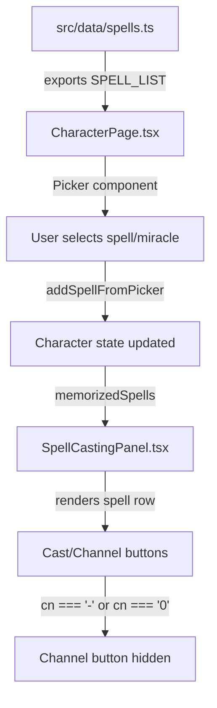

# Design Document: Empire Deity Miracles

## Overview

This feature adds 54 miracles (6 per deity × 9 deities) for the remaining Empire deities from the WFRP 4th Edition core rulebook to the existing `SPELL_LIST` array in `src/data/spells.ts`. It also corrects the `cn` field for all existing Blessings (currently `"0"`) and Myrmidia Miracles (currently numeric) to use `"-"`, which accurately represents that these divine abilities use a flat Pray test rather than a Language (Magick) CN threshold.

The deities being added: Manann, Morr, Ranald, Rhya, Shallya, Sigmar, Taal, Ulric, Verena.

### Design Rationale

The approach is minimal and additive:
- No new files, interfaces, or components are needed
- Miracle data is appended to the existing `SPELL_LIST` array using the established `SpellData` interface
- The existing Picker component and SpellCastingPanel already render these entries
- The only behavioral change is fixing channelling logic to properly handle `cn:"-"` entries

## Architecture



The data flows from the static `SPELL_LIST` through the Picker into the character's spell array, then renders in the SpellCastingPanel. No architectural changes are needed — only data additions and a small logic fix.

## Components and Interfaces

### Existing Interface (No Changes)

```typescript
// src/types/character.ts
export interface SpellData {
  name: string;
  cn: string;
  range: string;
  target: string;
  duration: string;
  effect: string;
}
```

### Data Module Changes (`src/data/spells.ts`)

**Additions:**
- 9 new deity miracle sections (6 entries each = 54 new entries)
- Each section preceded by a `// MIRACLES OF [DEITY]` comment header

**Modifications:**
- All 19 Blessing entries: `cn:"0"` → `cn:"-"`
- All 9 Myrmidia Miracle entries: `cn:"4"|"6"|"8"` → `cn:"-"`

### SpellCastingPanel Logic Fix (`src/components/shared/SpellCastingPanel.tsx`)

The current code hides the Channel button only when `spell.cn === '0'` (petty spells). After this change, miracles/blessings will have `cn:"-"`, which is not `'0'`, so the Channel button would incorrectly appear.

**Current logic:**
```typescript
const isPetty = spell.cn === '0';
// Channel button hidden when isPetty is true
```

**Updated logic:**
```typescript
const isPetty = spell.cn === '0' || spell.cn === '-';
// Channel button hidden for petty spells AND divine abilities (blessings/miracles)
```

This works because `parseInt("-", 10)` returns `NaN`, so `cn = parseInt(spell.cn, 10) || 0` evaluates to `0`, and `isReady = cp != null && cp.accumulatedSL >= cn && cn > 0` will always be `false` — meaning channelling progress can never complete. Hiding the button prevents user confusion.

### Picker Display

The existing Picker uses:
```typescript
getLabel={(s) => `${s.name} (CN ${s.cn})`}
```

This will display miracles as `"Becalm (CN -)"` which is acceptable — it clearly indicates no CN threshold. No change needed.

## Data Models

### Miracle Entry Format

Each miracle follows the single-line format established by existing entries:

```typescript
{name:"Miracle Name",cn:"-",range:"Range",target:"Target",duration:"Duration",effect:"Effect summary"}
```

### Deity Section Ordering

Sections are ordered alphabetically by deity name within the miracles block:

1. `// MIRACLES OF MANANN`
2. `// MIRACLES OF MORR`
3. `// MIRACLES OF MYRMIDIA` (existing, cn values updated)
4. `// MIRACLES OF RANALD`
5. `// MIRACLES OF RHYA`
6. `// MIRACLES OF SHALLYA`
7. `// MIRACLES OF SIGMAR`
8. `// MIRACLES OF TAAL`
9. `// MIRACLES OF ULRIC`
10. `// MIRACLES OF VERENA`

### Data Source

All miracle data is transcribed from `WarhammerFantasyRoleplay4e.md` (pages 222-228). The `effect` field contains a concise summary of the miracle's mechanical effect, consistent with how existing spells summarize their effects in the SPELL_LIST.

## Correctness Properties

*A property is a characteristic or behavior that should hold true across all valid executions of a system — essentially, a formal statement about what the system should do. Properties serve as the bridge between human-readable specifications and machine-verifiable correctness guarantees.*

### Property 1: All canonical miracles exist in SPELL_LIST

*For any* deity in the set {Manann, Morr, Myrmidia, Ranald, Rhya, Shallya, Sigmar, Taal, Ulric, Verena} and *for any* miracle name in that deity's canonical miracle list, there SHALL exist an entry in SPELL_LIST with that exact name.

**Validates: Requirements 1.1, 2.1, 3.1, 4.1, 5.1, 6.1, 7.1, 8.1, 9.1**

### Property 2: All miracle and blessing entries have non-empty fields

*For any* entry in SPELL_LIST that is a blessing or miracle (identified by belonging to the canonical blessing/miracle name sets), all SpellData fields (name, cn, range, target, duration, effect) SHALL be non-empty strings.

**Validates: Requirements 1.3, 2.3, 3.3, 4.3, 5.3, 6.3, 7.3, 8.3, 9.3**

### Property 3: All blessings and miracles use cn:"-"

*For any* entry in SPELL_LIST whose name belongs to the canonical blessings set or any deity's miracle set, the cn field SHALL equal `"-"`.

**Validates: Requirements 1.4, 2.4, 3.4, 4.4, 5.4, 6.4, 7.4, 8.4, 9.4, 10.1, 10.2**

### Property 4: Non-divine spells retain numeric CN values

*For any* entry in SPELL_LIST that is NOT a blessing or miracle (i.e., petty spells, arcane spells, lore spells), the cn field SHALL be a string that parses to a valid non-negative integer.

**Validates: Requirements 11.2**

## Error Handling

This feature is purely additive static data. There are no runtime error paths introduced. The key defensive considerations are:

1. **Invalid cn parsing**: The SpellCastingPanel already uses `parseInt(spell.cn, 10) || 0` which gracefully handles `"-"` by falling back to `0`. The Channel button visibility fix ensures users never see a non-functional Channel button.

2. **Missing miracle data**: If a miracle entry were accidentally omitted, the property tests would catch it immediately since they verify all canonical miracle names exist.

3. **TypeScript compilation**: The `SpellData` interface requires all fields to be strings, so any missing or wrong-typed field will be caught at compile time.

## Testing Strategy

### Property-Based Tests (fast-check + vitest)

The project already uses `fast-check` for property-based testing. A new test file `src/data/__tests__/spells.property.test.ts` will contain property tests that verify the correctness properties above.

**Configuration:**
- Minimum 100 iterations per property test
- Each test tagged with: `Feature: empire-deity-miracles, Property {N}: {title}`
- Uses `fc.constantFrom()` to select from deity/miracle name sets

**Test approach:**
- Define canonical miracle name sets per deity as test constants
- Use `fc.constantFrom(...allMiracleNames)` to generate random miracle selections
- Assert structural invariants hold for every generated selection

### Unit Tests (example-based)

- **SpellCastingPanel**: Verify Channel button does NOT render for a spell with `cn:"-"`
- **Picker label**: Verify miracle displays as `"Name (CN -)"` in picker

### Smoke Tests

- TypeScript compilation passes (`vite build`)
- Full test suite passes without regression
- Source code visual inspection confirms:
  - Comment headers present and correctly formatted
  - Sections ordered alphabetically by deity
  - Single-line object format used consistently

### Test File Location

```
src/data/__tests__/spells.property.test.ts    (new - property tests)
```

Existing test files that may need cn assertion updates:
- `src/components/__tests__/SpellCastingPanel.gating.test.tsx`
- `src/components/__tests__/spell-casting-ui.test.tsx`
