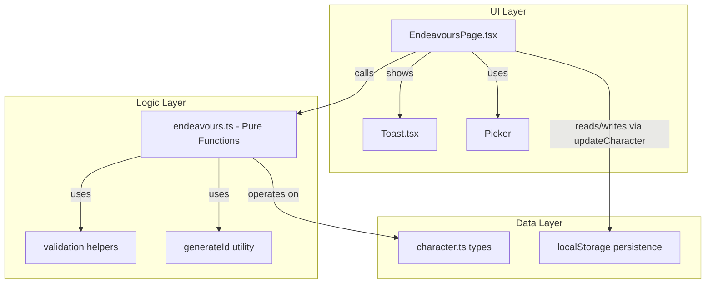

# Design Document: Endeavours Improvements

## Overview

This design extends the existing Endeavours tracking system with expanded class coverage, richer data models (progress states, dates, costs), improved ID generation, reorder support, better mobile UX, and comprehensive property-based test coverage.

The changes are predominantly in the pure logic module (`src/logic/endeavours.ts`), the type definitions (`src/types/character.ts`), and the page component (`src/components/pages/EndeavoursPage.tsx`). A new shared Toast component is introduced for save feedback.

All state transformations remain pure functions, enabling straightforward property-based testing with fast-check.

## Architecture



**Key architectural decisions:**
- All new logic (reorder, status cycling, cost summary, session validation) lives as pure functions in `src/logic/endeavours.ts` — no logic in the component.
- The `generateId()` utility follows the existing pattern from `src/logic/grudges.ts` (crypto.randomUUID with Math.random fallback).
- A shared `Toast` component is created in `src/components/shared/` since no toast exists in the project yet, and it may be reused by other pages.
- Data migration from old format (numeric IDs, boolean `completed`) is handled inline via defensive coercion rather than a separate migration step, keeping backward compatibility seamless.

## Components and Interfaces

### Modified Components

**EndeavoursPage.tsx** — Extended with:
- Status cycling control (replaces the checkbox)
- Date and session number fields in period header
- Cost input field on each entry row
- Move-up/move-down buttons for periods and entries
- Unmatched class info message in picker items
- Toast notifications on add/remove actions
- Enlarged touch targets (CSS)

### New Components

**Toast.tsx** (`src/components/shared/Toast.tsx`)
- Lightweight auto-dismissing notification
- Props: `message: string | null`, `duration?: number` (default 3000ms)
- Uses `aria-live="polite"` for accessibility
- Fixed position bottom-centre, outside document flow
- Internally manages visibility timer

### Modified Logic Functions

| Function | Change |
|----------|--------|
| `createDowntimePeriod` | Uses `generateId()` for string ID; adds `date: undefined`, `sessionNumber: undefined` |
| `addEndeavourEntry` | Entry ID generation delegated to caller or new `createEndeavourEntry` helper |
| `updateEndeavourEntry` | Accepts new fields: `status`, `cost` |
| `updateDowntimePeriod` | Accepts new fields: `date`, `sessionNumber` |

### New Logic Functions

| Function | Signature | Purpose |
|----------|-----------|---------|
| `generateId` | `() => string` | UUID generation with fallback |
| `cycleStatus` | `(current: EntryStatus) => EntryStatus` | Cycles pending → in_progress → completed → pending |
| `migrateEntryStatus` | `(entry: LegacyEntry) => EndeavourEntry` | Converts boolean completed to status field |
| `validateSessionNumber` | `(value: string) => number \| null` | Parses and validates 1-9999, returns null on invalid |
| `movePeriodUp` | `(periods: DowntimePeriod[], id: string) => DowntimePeriod[]` | Swaps period with predecessor |
| `movePeriodDown` | `(periods: DowntimePeriod[], id: string) => DowntimePeriod[]` | Swaps period with successor |
| `moveEntryUp` | `(periods: DowntimePeriod[], periodId: string, entryId: string) => DowntimePeriod[]` | Swaps entry within period |
| `moveEntryDown` | `(periods: DowntimePeriod[], periodId: string, entryId: string) => DowntimePeriod[]` | Swaps entry within period |
| `getCostSummary` | `(entries: EndeavourEntry[]) => string \| null` | Returns comma-separated costs or null |
| `buildPickerItems` | `(className: string, isElfChar: boolean) => PickerItem[]` | Extracted from component, adds info message for unmatched class |
| `createEndeavourEntry` | `(type: string) => EndeavourEntry` | Creates entry with UUID id, default status "pending", empty cost |

## Data Models

### Updated `EndeavourEntry`

```typescript
export type EntryStatus = 'pending' | 'in_progress' | 'completed';

export interface EndeavourEntry {
  id: string;                    // Changed from number to string (UUID)
  type: string;
  notes: string;
  status: EntryStatus;           // Replaces boolean `completed`
  cost?: string;                 // Optional, max 50 chars
}
```

### Updated `DowntimePeriod`

```typescript
export interface DowntimePeriod {
  id: string;                    // Changed from number to string (UUID)
  label: string;
  slots: number;
  entries: EndeavourEntry[];
  statusWarning: boolean;
  date?: string;                 // Optional, "YYYY-MM-DD"
  sessionNumber?: number;        // Optional, 1-9999
}
```

### Updated `CLASS_ENDEAVOURS`

```typescript
export const CLASS_ENDEAVOURS: Record<string, string[]> = {
  Academics: ['Research Lore', 'Reputation'],
  Burghers: ['Foment Dissent', 'Reputation'],
  Courtiers: ['Reputation'],
  Peasants: ['Foment Dissent'],
  Rangers: ['Combat Training', 'Latest News'],
  Riverfolk: ['Latest News'],
  Rogues: ['Study a Mark'],
  Warriors: ['Combat Training', 'Drill', 'Challenge', 'Seek Patronage', 'Establish Contacts', 'Tournament'],
  Priests: ['Preach Sermon', 'Pray for Guidance'],
  Doctors: ['Treat Patients', 'Research Remedy'],
  Wizards: ['Study Arcane Lore', 'Brew Potion'],
  Entertainers: ['Perform', 'Compose'],
  Soldiers: ['Combat Training', 'Drill'],
  Servants: ['Serve Master', 'Gather Rumours'],
  Nobles: ['Reputation', 'Seek Patronage'],
};
```

### Backward Compatibility

Legacy entries with numeric `id` or boolean `completed` field are handled via:
```typescript
// At read time, coerce ids:
const effectiveId = String(entry.id);  // works for both number and string

// At read time, derive status from legacy completed field:
function resolveStatus(entry: unknown): EntryStatus {
  if ('status' in entry) return entry.status;
  return entry.completed ? 'completed' : 'pending';
}
```

## Correctness Properties

*A property is a characteristic or behavior that should hold true across all valid executions of a system — essentially, a formal statement about what the system should do. Properties serve as the bridge between human-readable specifications and machine-verifiable correctness guarantees.*

### Property 1: CLASS_ENDEAVOURS map constraint

*For any* key in the CLASS_ENDEAVOURS map, the associated string array SHALL have a length between 1 and 10 inclusive, and the total number of keys SHALL be at least 15.

**Validates: Requirements 1.1**

### Property 2: Status cycle determinism

*For any* valid EntryStatus value, applying cycleStatus once SHALL produce the next value in the sequence (pending → in_progress → completed → pending), and applying cycleStatus three times SHALL return the original status.

**Validates: Requirements 2.6**

### Property 3: Legacy migration compatibility

*For any* entry object containing a boolean `completed` field (true or false) instead of a `status` field, the migration function SHALL produce status "completed" when completed is true and status "pending" when completed is false, preserving all other fields unchanged.

**Validates: Requirements 2.7**

### Property 4: Session number validation

*For any* string input, the validateSessionNumber function SHALL return a positive integer if and only if the input represents an integer in the range [1, 9999], and SHALL return null for all other inputs (non-numeric, out-of-range, empty, whitespace, decimal).

**Validates: Requirements 3.5, 3.6**

### Property 5: Generated IDs are valid UUID format

*For any* call to generateId, the returned string SHALL match the UUID v4 pattern (`/^[0-9a-f]{8}-[0-9a-f]{4}-4[0-9a-f]{3}-[89ab][0-9a-f]{3}-[0-9a-f]{12}$/i`).

**Validates: Requirements 4.1, 4.3**

### Property 6: Mixed ID compatibility

*For any* array of DowntimePeriods containing a mix of numeric-string IDs (e.g., "1700000000000") and UUID-format IDs, the removeDowntimePeriod, updateDowntimePeriod, addEndeavourEntry, removeEndeavourEntry, and updateEndeavourEntry functions SHALL correctly locate and operate on items by their ID regardless of format.

**Validates: Requirements 4.6**

### Property 7: Move operations swap exactly two adjacent elements

*For any* array of length ≥ 2 and any valid index, movePeriodUp (index > 0) or movePeriodDown (index < length-1) SHALL produce an array where only the element at the target index and its neighbor have exchanged positions, and all other elements remain in their original positions. For boundary indices (first for up, last for down), the array SHALL be returned unchanged.

**Validates: Requirements 5.1, 5.2, 5.3, 5.4, 5.5, 5.6**

### Property 8: Reorder preserves collection membership

*For any* array and any move operation (up or down, on periods or entries), the resulting array SHALL have the same length as the input and contain exactly the same set of elements (verified by ID set equality).

**Validates: Requirements 5.7**

### Property 9: Cost summary correctness

*For any* array of EndeavourEntry objects, getCostSummary SHALL return null when no entry has a non-empty, non-whitespace-only cost, and SHALL return a comma-separated string of exactly those entries' cost values (in order) when at least one entry has a non-empty, non-whitespace-only cost.

**Validates: Requirements 9.3, 9.4, 9.5**

### Property 10: Add/remove period round-trip

*For any* array of 0 to 20 DowntimePeriods with unique IDs, adding a new period via addDowntimePeriod and then removing it via removeDowntimePeriod with that period's ID SHALL produce an array deep-equal to the original.

**Validates: Requirements 10.1**

### Property 11: Add/remove entry round-trip

*For any* DowntimePeriod containing 0 to 20 entries with unique IDs, adding a new entry via addEndeavourEntry and then removing it via removeEndeavourEntry with the same period and entry IDs SHALL produce a period whose entries array is deep-equal to the original.

**Validates: Requirements 10.2**

### Property 12: updateEndeavourEntry preserves entry count

*For any* array of DowntimePeriods and any valid period ID, entry ID, field, and value, calling updateEndeavourEntry SHALL produce a result where the targeted period's entries array has the same length as the original.

**Validates: Requirements 10.3**

### Property 13: updateDowntimePeriod preserves period count

*For any* array of DowntimePeriods and any valid period ID, field, and value, calling updateDowntimePeriod SHALL produce an array of the same length as the input.

**Validates: Requirements 10.4**

### Property 14: parseStatusTier output range

*For any* string of length 0 to 200, parseStatusTier SHALL return a value in the set {"gold", "silver", "brass", null}.

**Validates: Requirements 10.6**

### Property 15: getDefaultSlots invariant

*For any* tier value in {"brass", "silver", "gold", null}, getDefaultSlots SHALL return a positive integer greater than or equal to 1.

**Validates: Requirements 10.7**

### Property 16: createDowntimePeriod structure validity

*For any* input string of length 0 to 200 and existingCount in range 0 to 1000, createDowntimePeriod SHALL produce a DowntimePeriod with: entries as an empty array, label matching "Downtime #N" where N = existingCount + 1, slots ≥ 1, id as a valid UUID string, date as undefined, and sessionNumber as undefined.

**Validates: Requirements 10.8, 2.2, 3.3**

## Error Handling

| Scenario | Handling |
|----------|----------|
| `crypto.randomUUID` unavailable | Fallback to Math.random-based UUID v4 generation |
| Invalid session number input | `validateSessionNumber` returns null; UI retains previous value |
| Cost exceeds 50 chars | UI truncates input at 50 chars via `maxLength` attribute |
| Move at boundary (first/last) | Functions return array unchanged (no-op) |
| Legacy numeric IDs in stored data | `String(id)` coercion in comparison operations |
| Legacy `completed` boolean field | `resolveStatus()` derives correct EntryStatus |
| Missing `status` field on stored entry | Defaults to "pending" via migration |
| Empty class string | Picker omits class group silently |
| Unmatched class string | Picker shows non-selectable info message |

## Testing Strategy

### Property-Based Tests (fast-check + vitest)

All 16 correctness properties above will be implemented as property-based tests in `src/logic/__tests__/endeavours.property.test.ts`.

**Configuration:**
- Library: `fast-check` (already installed, v4.8.0)
- Runner: `vitest` (already installed, v4.1.2)
- Minimum iterations: `numRuns: 100` per property
- Each test tagged with: `Feature: endeavours-improvements, Property N: <title>`

**Generators required:**
- `arbEntryStatus`: `fc.constantFrom('pending', 'in_progress', 'completed')`
- `arbEndeavourEntry`: Record with UUID id, string type/notes/cost, status
- `arbDowntimePeriod`: Record with UUID id, label, slots, entries array, optional date/sessionNumber
- `arbDowntimePeriodArray`: `fc.array(arbDowntimePeriod, { maxLength: 20 })`
- `arbStatusString`: `fc.string({ maxLength: 200 })` for parseStatusTier
- `arbTier`: `fc.constantFrom('brass', 'silver', 'gold', null)`

### Unit Tests (vitest)

Example-based tests for:
- Specific class entries (Requirements 1.2–1.8)
- UI rendering states (Requirements 2.3–2.5)
- Date/session display logic (Requirements 3.8, 3.9)
- Toast behaviour (Requirements 8.1–8.8)
- Touch target sizing (Requirements 7.1–7.4) via CSS class assertions

### Component Tests (@testing-library/react)

- EndeavoursPage renders periods and entries
- Status cycling updates on click
- Picker shows info message for unmatched class
- Toast appears and auto-dismisses
- Move buttons reorder visually

### Accessibility

- Toast uses `aria-live="polite"`
- All interactive controls have accessible labels/titles
- Touch targets meet 44×44px WCAG minimum
