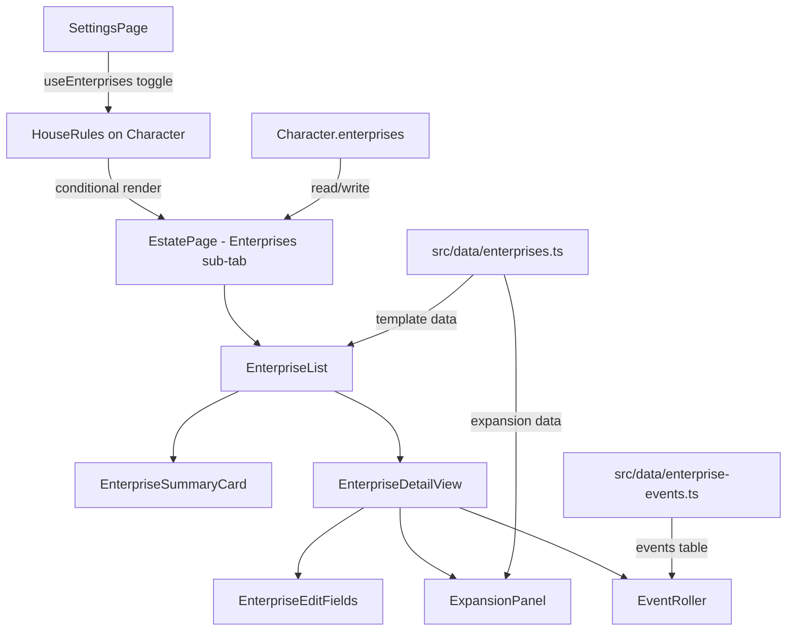

# Design Document: Enterprise Tracker

## Overview

The Enterprise Tracker adds a business ownership and management system to the WFRP 4e character sheet PWA, implementing the rules from "Archives of the Empire Vol. III". It allows players to create, expand, and manage business ventures (enterprises) that generate income between adventures. The feature is gated behind a `useEnterprises` house rule toggle and integrates with the existing Estate page as a new sub-tab.

### Key Design Decisions

1. **Sub-tab on Estate page**: Enterprises are rendered as a new sub-tab on the existing EstatePage rather than a standalone top-level page. This keeps related financial/property management together and follows the established pattern (wealth, estate, holdings sub-tabs).

2. **Static template data file**: Enterprise templates are stored as a static TypeScript data file in `src/data/enterprises.ts`, following the same pattern as `src/data/hirelings.ts`, `src/data/runes.ts`, etc.

3. **Flat array on Character object**: Enterprises are stored as an optional `enterprises?: Enterprise[]` field on the Character interface, consistent with how `grudges`, `diseases`, `consumables`, and `psychologyTraits` are stored.

4. **Immediate persistence via `updateCharacter`**: All edits persist immediately using the existing `updateCharacter` mutator pattern (no separate save action), matching the behavior of EstatePage holdings and other editable sections.

5. **Summary/detail navigation pattern**: A list view shows enterprise summaries; tapping one reveals a detail view. This mirrors how Holdings cards work but with a dedicated navigation flow for the richer data model.

## Architecture



### Integration Points

- **Character type** (`src/types/character.ts`): Add `Enterprise` interface, `EnterpriseType` type, `useEnterprises` to `HouseRules`, and `enterprises?` field to `Character`.
- **BLANK_CHARACTER** (`src/types/character.ts`): Add `useEnterprises: false` to houseRules defaults.
- **SettingsPage** (`src/components/pages/SettingsPage.tsx`): Add an "Enterprises" toggle in the Optional Mechanics collapsible section.
- **EstatePage** (`src/components/pages/EstatePage.tsx`): Conditionally add an "Enterprises" sub-tab when `useEnterprises` is `true`.
- **useTabOrder hook**: Register the new sub-tab in the estate page's tab ordering system.

## Components and Interfaces

### New Components

| Component | Location | Responsibility |
|-----------|----------|---------------|
| `EnterpriseList` | `src/components/enterprise/EnterpriseList.tsx` | Summary view: lists all enterprises, empty state, create action |
| `EnterpriseSummaryCard` | `src/components/enterprise/EnterpriseSummaryCard.tsx` | Compact card showing name, type, expansion level, debt |
| `EnterpriseDetailView` | `src/components/enterprise/EnterpriseDetailView.tsx` | Full detail view with edit capabilities |
| `EnterpriseCreateFlow` | `src/components/enterprise/EnterpriseCreateFlow.tsx` | Template selection + name input dialog |
| `ExpansionPanel` | `src/components/enterprise/ExpansionPanel.tsx` | Shows next expansion info, confirms expansion |
| `EnterpriseEventRoller` | `src/components/enterprise/EnterpriseEventRoller.tsx` | Roll Event button + result display |
| `IncomeSourceEditor` | `src/components/enterprise/IncomeSourceEditor.tsx` | CRUD for income source entries |

### Modified Components

| Component | Change |
|-----------|--------|
| `SettingsPage` | Add "Enterprises" toggle in Optional Mechanics section |
| `EstatePage` | Conditionally add "Enterprises" sub-tab, render `EnterpriseList` |
| `Character` type | Add enterprise-related types and fields |

### Component Props Interfaces

```typescript
interface EnterpriseListProps {
  character: Character;
  updateCharacter: (mutator: (char: Character) => Character) => void;
}

interface EnterpriseDetailViewProps {
  enterprise: Enterprise;
  enterpriseIndex: number;
  updateCharacter: (mutator: (char: Character) => Character) => void;
  onBack: () => void;
}

interface EnterpriseCreateFlowProps {
  onConfirm: (templateType: EnterpriseType, name: string) => void;
  onCancel: () => void;
}

interface ExpansionPanelProps {
  enterprise: Enterprise;
  onExpand: () => void;
}

interface EnterpriseEventRollerProps {
  enterprise: Enterprise;
  onRoll: (result: EnterpriseEventResult) => void;
  lastResult: EnterpriseEventResult | null;
  onDismiss: () => void;
}
```

## Data Models

### Enterprise Type Enum

```typescript
export type EnterpriseType =
  | 'Courier Service'
  | 'Crafting Workshop'
  | 'Criminal Gang'
  | 'Holy Temple'
  | 'Knightly Order'
  | 'Tavern'
  | 'Market Parlour'
  | 'Noble Estate'
  | 'Performance Troupe'
  | 'Publishing House';
```

### Enterprise Interface

```typescript
export interface EnterpriseIncomeSource {
  id: string;
  description: string;      // max 200 characters
  earningSkill: string;     // max 100 characters
  effectiveStatus: string;  // max 50 characters, e.g. "Silver 2"
}

export interface EnterpriseCurrency {
  gc: number;  // gold crowns (0-999)
  ss: number;  // silver shillings (0-999)
  d: number;   // brass pennies (0-999)
}

export interface Enterprise {
  id: string;                          // crypto.randomUUID()
  name: string;                        // max 100 characters
  type: EnterpriseType;
  expansionLevel: number;              // 1-4
  debt: EnterpriseCurrency;
  creditorName: string;                // max 100 characters
  interestPayment: EnterpriseCurrency;
  incomeSources: EnterpriseIncomeSource[];  // max 20
  trappings: string[];                 // max 50 entries, each max 200 chars
  specialRules: string[];              // max 20 entries, each max 500 chars
  notes: string;                       // max 2000 characters
}
```

### Enterprise Template Data Structure

```typescript
export interface EnterpriseTemplateIncomeSource {
  description: string;
  earningSkill: string;
  effectiveStatus: string;
  activeAtBase: boolean;  // true if available at level 1
}

export interface EnterpriseExpansionLevel {
  cost: EnterpriseCurrency;
  minOwnerContribution: EnterpriseCurrency;
  interestPayment: EnterpriseCurrency;
  benefits: string;
  additionalTrappings: string[];
  additionalIncomeSources: EnterpriseTemplateIncomeSource[];
  additionalSpecialRules: string[];
}

export interface EnterpriseTemplate {
  type: EnterpriseType;
  displayName: string;
  incomeSources: EnterpriseTemplateIncomeSource[];
  trappings: string[];
  specialRules: string[];
  startUpCost: EnterpriseCurrency;
  minOwnerContribution: EnterpriseCurrency;
  baseInterestPayment: EnterpriseCurrency;
  expansions: {
    level2: EnterpriseExpansionLevel;
    level3: EnterpriseExpansionLevel;
    level4: EnterpriseExpansionLevel;
  };
  alternateEvent1: { title: string; description: string };
  alternateEvent2: { title: string; description: string };
}
```

### Enterprise Events Table Structure

```typescript
export interface EnterpriseEvent {
  rangeStart: number;  // inclusive
  rangeEnd: number;    // inclusive
  title: string;
  description: string;
  isAlternate?: boolean;  // true for 55-57 and 58-60 ranges
}

export interface EnterpriseEventResult {
  roll: number;
  title: string;
  description: string;
}
```

### Character Interface Changes

```typescript
// In HouseRules interface:
export interface HouseRules {
  // ... existing fields ...
  useEnterprises: boolean;
}

// In Character interface:
export interface Character {
  // ... existing fields ...
  enterprises?: Enterprise[];
}
```

### BLANK_CHARACTER Defaults

```typescript
// In houseRules:
useEnterprises: false,

// enterprises field is intentionally omitted (treated as empty array when missing)
```

### State Management

Enterprise event roll results are stored in component-local state (`useState` within `EnterpriseDetailView`), not persisted to the character. This keeps the data model clean — the roll result is ephemeral UI state, dismissed when navigating away or explicitly cleared.

The "currently viewed enterprise" index is also component-local state managed by `EnterpriseList`, with `null` meaning the summary view is shown.


## Correctness Properties

*A property is a characteristic or behavior that should hold true across all valid executions of a system — essentially, a formal statement about what the system should do. Properties serve as the bridge between human-readable specifications and machine-verifiable correctness guarantees.*

### Property 1: Defaults merging for missing enterprise fields

*For any* partial character object that is missing the `houseRules.useEnterprises` field, missing the `enterprises` field, or has enterprise entries with missing sub-fields (`incomeSources`, `trappings`, `specialRules`), the defaults merging logic SHALL produce `useEnterprises === false`, `enterprises` resolving to an empty array, and all missing array sub-fields resolving to empty arrays.

**Validates: Requirements 1.3, 3.4, 3.5**

### Property 2: Enterprise data serialization round-trip

*For any* valid character object containing an `enterprises` array (with any number of entries and any combination of field values within constraints) and any value of `useEnterprises`, serializing and then deserializing the character SHALL produce an `enterprises` array with identical field values for every enterprise, income source, trapping, special rule, and notes field.

**Validates: Requirements 1.4, 10.3**

### Property 3: Enterprise template data structural validity

*For any* enterprise template in the static data file, the template SHALL have a non-empty displayName, at least one income source (each with description, earningSkill, effectiveStatus, and a boolean activeAtBase), at least one trapping, non-negative start-up costs, a minOwnerContribution equal to 10% of start-up costs, a base interest payment, and expansion definitions for levels 2, 3, and 4 (each with cost, minOwnerContribution at 10% of cost, interest payment, benefits text, and arrays for additional trappings/income sources/special rules).

**Validates: Requirements 4.2, 4.3, 4.4**

### Property 4: Enterprise creation from template produces correct defaults

*For any* enterprise template type, creating a new enterprise from that template SHALL produce an enterprise with `expansionLevel === 1`, `debt` of `{gc: 0, ss: 0, d: 0}`, empty `creditorName`, `interestPayment` equal to the template's base interest payment, `incomeSources` containing exactly the template's level-1 active income sources, `trappings` equal to the template's base trappings, and `specialRules` equal to the template's base special rules.

**Validates: Requirements 5.2**

### Property 5: Empty or whitespace enterprise name rejection

*For any* string composed entirely of whitespace characters (including the empty string), attempting to create an enterprise with that name SHALL be rejected, and the character's enterprises array SHALL remain unchanged.

**Validates: Requirements 5.4**

### Property 6: Enterprise field edit round-trip

*For any* valid enterprise and any valid field edit (name ≤ 100 chars, creditorName ≤ 100 chars, debt/interestPayment fields 0–999, income source fields within length constraints, trapping entries ≤ 200 chars, special rule entries ≤ 500 chars, notes ≤ 2000 chars), applying the edit and then reading back the enterprise SHALL yield the edited value at the targeted field.

**Validates: Requirements 6.1, 6.2, 6.3, 6.4, 6.5, 6.6, 6.7, 6.8**

### Property 7: Non-numeric monetary input sanitization

*For any* string that does not represent a valid non-negative integer (including empty strings, strings with letters, decimal numbers, negative numbers), the monetary field parser SHALL return 0.

**Validates: Requirements 6.10**

### Property 8: Expansion state transition correctness

*For any* enterprise at expansion level L (where 1 ≤ L ≤ 3) with zero debt, confirming expansion SHALL produce an enterprise with `expansionLevel === L + 1`, and the enterprise's trappings, income sources, and special rules arrays SHALL contain all items that were present before expansion plus the additional items defined by the template for level L + 1.

**Validates: Requirements 7.3, 7.4**

### Property 9: Debt blocks expansion

*For any* enterprise with outstanding debt greater than zero (where `debt.gc > 0 || debt.ss > 0 || debt.d > 0`), the expansion action SHALL be disabled regardless of the current expansion level.

**Validates: Requirements 7.6**

### Property 10: Event roll produces valid range

*For any* invocation of the event roll function, the returned integer SHALL be in the range [1, 100] inclusive.

**Validates: Requirements 8.1**

### Property 11: Event lookup completeness

*For any* integer N in [1, 100], looking up N in the Enterprise Events Table SHALL return a non-empty event title and a non-empty event description, with no gaps or overlaps in the table's range coverage.

**Validates: Requirements 8.2, 8.3**

### Property 12: Alternate event resolution by enterprise type

*For any* enterprise type and any roll value in [55, 57] or [58, 60], the event lookup SHALL return the title and description from that enterprise type's template-specific alternate event data rather than a generic placeholder.

**Validates: Requirements 8.4**

### Property 13: Toggle cycle data idempotence

*For any* character with a non-empty `enterprises` array, toggling `useEnterprises` from `true` to `false` and back to `true` any number of times SHALL leave the `enterprises` array byte-for-byte identical to its state before the toggle cycles began.

**Validates: Requirements 10.1, 10.2, 10.4**

### Property 14: Delete removes exactly one enterprise

*For any* character with N enterprises (N ≥ 1), deleting an enterprise by its `id` SHALL produce an enterprises array of length N − 1 that does not contain an enterprise with the deleted `id`, and all other enterprises SHALL remain unchanged.

**Validates: Requirements 11.3**

## Error Handling

### Input Validation

| Field | Constraint | Handling |
|-------|-----------|----------|
| Enterprise name | 1–100 non-whitespace characters | Reject empty/whitespace-only, truncate at 100 |
| Creditor name | 0–100 characters | Truncate at 100 |
| Monetary fields (gc, ss, d) | Integer 0–999 | Non-numeric → 0, clamp to [0, 999] |
| Income source description | 0–200 characters | Truncate at 200 |
| Earning skill | 0–100 characters | Truncate at 100 |
| Effective status | 0–50 characters | Truncate at 50 |
| Trapping entry | 0–200 characters | Truncate at 200 |
| Special rule entry | 0–500 characters | Truncate at 500 |
| Notes | 0–2000 characters | Truncate at 2000 |
| Income sources count | max 20 | Disable "add" at 20 |
| Trappings count | max 50 | Disable "add" at 50 |
| Special rules count | max 20 | Disable "add" at 20 |

### Data Integrity

- **Missing `enterprises` field**: Treat as empty array (no migration needed). The loading logic uses `character.enterprises ?? []`.
- **Missing sub-fields on enterprise entries**: Normalize on read: `enterprise.incomeSources ?? []`, `enterprise.trappings ?? []`, `enterprise.specialRules ?? []`.
- **Invalid `expansionLevel`**: Clamp to [1, 4] on read.
- **Invalid `type`**: If an enterprise has an unrecognized type (e.g., from future templates), display it as-is but disable template-dependent operations (expansion, alternate events).

### Edge Cases

- **Expansion at level 4**: Expand button is hidden/disabled. No error message needed since the UI prevents it.
- **Expansion with debt**: Expand button is disabled with tooltip "Repay all debt before expanding".
- **Empty enterprises array**: Show `EmptyState` component with "No enterprises yet" message and a prominent "Create Enterprise" action.
- **Very long text inputs**: Use `maxLength` attributes on input/textarea elements for browser-level enforcement as a first line of defense, with programmatic truncation as a fallback.

## Testing Strategy

### Property-Based Tests (fast-check)

The project already uses `fast-check` (v4.8.0) with `vitest` (v4.1.2). Property-based tests will be placed in `src/components/enterprise/__tests__/` and `src/data/__tests__/`.

**Configuration:**
- Minimum 100 iterations per property test (`{ numRuns: 100 }`)
- Each test tagged with the design property it validates
- Tag format: `Feature: enterprise-tracker, Property {N}: {title}`

**Property test files:**
- `src/data/__tests__/enterprise-templates.property.test.ts` — Properties 3, 4
- `src/components/enterprise/__tests__/enterprise-defaults.property.test.ts` — Property 1
- `src/components/enterprise/__tests__/enterprise-serialization.property.test.ts` — Property 2
- `src/components/enterprise/__tests__/enterprise-crud.property.test.ts` — Properties 5, 6, 7, 13, 14
- `src/components/enterprise/__tests__/enterprise-expansion.property.test.ts` — Properties 8, 9
- `src/components/enterprise/__tests__/enterprise-events.property.test.ts` — Properties 10, 11, 12

### Unit Tests (example-based)

Example-based tests cover:
- UI rendering (toggle states, summary display, detail view, empty state)
- Specific UI interactions (toggle click, create flow, delete confirmation, navigation)
- Settings page integration (toggle presence, label text, ON/OFF display)

**Unit test files:**
- `src/components/__tests__/SettingsPage.enterprises.test.tsx` — Requirements 2.1–2.6
- `src/components/enterprise/__tests__/EnterpriseList.test.tsx` — Requirements 9.1–9.4, 12.1–12.6
- `src/components/enterprise/__tests__/EnterpriseCreateFlow.test.tsx` — Requirements 5.1, 5.3, 5.5, 5.6
- `src/components/enterprise/__tests__/EnterpriseDetailView.test.tsx` — Requirements 6.9, 7.1, 7.2, 7.5, 7.7
- `src/components/enterprise/__tests__/EnterpriseEventRoller.test.tsx` — Requirements 8.5, 8.6
- `src/components/enterprise/__tests__/EnterpriseDelete.test.tsx` — Requirements 11.1, 11.2, 11.4

### Test Generators (for fast-check)

Key generators needed:
- `arbitraryEnterpriseCurrency()` — `{gc, ss, d}` with each field in [0, 999]
- `arbitraryEnterpriseType()` — one of the 10 valid enum values
- `arbitraryIncomeSource()` — valid income source within field length constraints
- `arbitraryEnterprise()` — full enterprise with all fields within valid ranges
- `arbitraryPartialCharacter()` — character objects with random fields missing
- `arbitraryNonNumericString()` — strings that are not valid non-negative integers
- `arbitraryWhitespaceString()` — strings composed entirely of whitespace
