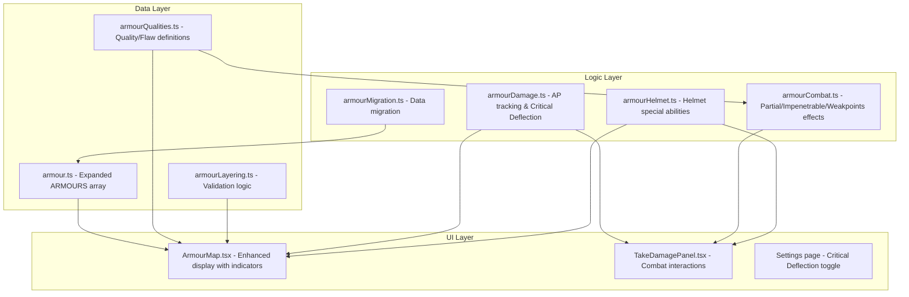

# Design Document: Expanded Armour System

## Overview

This feature extends the existing WFRP 4e character sheet PWA with the expanded armour rules from Archives of the Empire Vol. III ("Suits of Steel" chapter). The current implementation uses a simple flat list of armour pieces with basic AP values per location. The expanded system introduces:

- **Material categories** (Soft Kit, Boiled Leather, Chainmail, Brigandine, Plate) with distinct mechanical properties
- **Armour Qualities** (Impenetrable, Overcoat, Reinforced, Visor) with active combat effects
- **Armour Flaws** (Partial, Weakpoints, Requires Kit) with vulnerability mechanics
- **Armour Damage tracking** (current AP vs max AP per piece)
- **Critical Deflection** as an opt-in house rule mechanic
- **Helmet special abilities** for named helmet types (Bascinet, Armet, Sallet)
- **Layering validation** with stacking rules
- **Stealth penalty** display for metal armour
- **Repair reference** information

The design preserves backward compatibility through graceful data migration of existing characters while replacing the core rulebook's simplified armour entries with the richer Archives Vol. III system.

## Architecture

The feature extends three primary layers of the application:



**Design Decision**: Logic is separated into pure function modules (`armourDamage`, `armourCombat`, `armourLayering`) to enable property-based testing of the combat mechanics independently from React component rendering. The UI components consume these functions.

## Components and Interfaces

### Data Module: `src/data/armour.ts` (Modified)

The existing `ARMOURS` array is replaced with the expanded set. Each entry gains an `armourType` field.

### Data Module: `src/data/armourQualities.ts` (New)

Provides definitions and descriptions for all armour qualities and flaws.

```typescript
export type ArmourQuality = 'Impenetrable' | 'Overcoat' | 'Reinforced' | 'Visor';
export type ArmourFlaw = 'Partial' | 'Requires Kit' | 'Weakpoints';
export type ArmourType = 'SoftKit' | 'BoiledLeather' | 'Chainmail' | 'Brigandine' | 'Plate';

export interface QualityDefinition {
  name: ArmourQuality | ArmourFlaw;
  type: 'quality' | 'flaw';
  description: string;       // Tooltip text explaining the mechanic
  combatEffect?: string;     // Brief combat-relevant summary
}

export const QUALITY_DEFINITIONS: QualityDefinition[];
```

### Logic Module: `src/logic/armourLayering.ts` (New)

Pure functions for validating armour layering combinations.

```typescript
export interface LayeringResult {
  valid: boolean;
  warnings: string[];  // e.g., "Requires Kit: No Soft Kit in this location"
}

/** Validate whether a set of armour items can be layered at a given location */
export function validateLayering(items: ArmourItem[], location: LocationKey): LayeringResult;

/** Check if a specific piece can be added to existing worn armour at a location */
export function canLayerOver(existing: ArmourItem[], newPiece: ArmourItem, location: LocationKey): boolean;

/** Calculate total effective AP at a location from validly layered pieces */
export function calculateEffectiveAP(items: ArmourItem[], location: LocationKey): number;

/** Check if Weakpoints flaw is suppressed by Reinforced Soft Kit */
export function isWeakpointsSuppressed(items: ArmourItem[], location: LocationKey): boolean;
```

### Logic Module: `src/logic/armourCombat.ts` (New)

Pure functions for armour-related combat mechanics.

```typescript
export interface CombatArmourContext {
  armourItems: ArmourItem[];       // Items covering the hit location
  toHitRollEven: boolean;          // Whether the to-hit roll was even
  isCriticalHit: boolean;          // Whether a critical hit was scored
  attackerHasImpale: boolean;      // Whether attacking weapon has Impale
  isMissileFrontal?: boolean;      // For Bascinet bonus
}

export interface ArmourCombatResult {
  effectiveAP: number;             // AP after quality/flaw adjustments
  partialBypassed: boolean;        // Partial flaw caused AP to be ignored
  impenetrableNegatesCrit: boolean; // Impenetrable negates critical wound
  weakpointsBypassed: boolean;     // Weakpoints caused all AP to be ignored
  notes: string[];                 // Display notes (e.g., "Impenetrable: Critical ignored")
}

/** Apply armour quality/flaw combat effects to determine effective AP */
export function resolveArmourCombatEffects(context: CombatArmourContext): ArmourCombatResult;

/** Check if Critical Deflection is available */
export function canDeflectCritical(
  armourItems: ArmourItem[],
  location: LocationKey,
  useCriticalDeflection: boolean,
): boolean;

/** Apply Critical Deflection: reduce AP by 1, return updated item */
export function applyDeflection(item: ArmourItem): ArmourItem;
```

### Logic Module: `src/logic/armourMigration.ts` (New)

Handles data migration for existing characters loading into the expanded system.

```typescript
/** Name mapping from old core rulebook entries to Archives Vol. III entries */
export const ARMOUR_NAME_MAP: Record<string, string>;

/** Migrate a single armour item to expanded format */
export function migrateArmourItem(item: ArmourItem): ArmourItem;

/** Migrate all armour items on a character */
export function migrateCharacterArmour(armour: ArmourItem[]): ArmourItem[];
```

### UI Component: `src/components/combat/ArmourMap.tsx` (Modified)

Enhanced with:
- Quality/flaw indicator badges per location
- Visor toggle control for visored helmets
- AP damage display (current/max format)
- AP +/- controls per piece
- Layering warnings
- Stealth penalty badge
- Repair info expandable section
- Helmet special ability labels

### UI Component: `src/components/combat/TakeDamagePanel.tsx` (Modified)

Enhanced with:
- Even/Odd to-hit roll selector (or numeric input)
- Impale weapon toggle
- Partial flaw bypass indicator
- Impenetrable critical negation indicator
- Weakpoints bypass indicator
- Critical Deflection button (when house rule enabled)
- Helmet special ability notes (Sallet wound reduction, Bascinet bonus AP)

### Type Extensions: `src/types/character.ts` (Modified)

```typescript
export interface ArmourData {
  name: string;
  locations: string;
  enc: string;
  ap: number;
  qualities: string;
  armourType: ArmourType;  // NEW
}

export interface ArmourItem {
  name: string;
  locations: string;
  enc: string;
  ap: number;
  qualities: string;
  worn?: boolean;
  runes?: string[];
  armourType?: ArmourType;   // NEW
  currentAp?: number;        // NEW - defaults to ap if missing
  visorOpen?: boolean;       // NEW - only for Visor items, defaults to false
}

export interface HouseRules {
  // ... existing fields ...
  useCriticalDeflection: boolean;  // NEW - defaults to false
}
```

## Data Models

### Expanded Armour Database Schema

Each armour entry in the `ARMOURS` array follows this structure:

| Field | Type | Description |
|-------|------|-------------|
| name | string | Display name (e.g., "Chainmail Coat") |
| locations | string | Covered locations (e.g., "Arms, Body") |
| enc | string | Encumbrance value |
| ap | number | Base Armour Points |
| qualities | string | Comma-separated qualities/flaws (e.g., "Impenetrable, Weakpoints") |
| armourType | ArmourType | Material category enum value |

### Armour Type Hierarchy (for layering)

```
Layer 0 (innermost): Soft Kit
Layer 1: Boiled Leather
Layer 2: Chainmail
Layer 3 (outermost): Brigandine (Overcoat), Plate (some have Overcoat)
```

**Layering Rules Matrix:**

| Under \ Over | Soft Kit | Boiled Leather | Chainmail | Brigandine | Plate (Overcoat) | Plate (no Overcoat) |
|---|---|---|---|---|---|---|
| Soft Kit | ❌ | ✅ | ✅ | ✅ | ✅ | ✅ |
| Boiled Leather | ❌ | ❌ | ❌ | ✅ | ✅ | ❌ |
| Chainmail | ❌ | ❌ | ❌ | ✅ | ✅ | ❌ |
| Brigandine | ❌ | ❌ | ❌ | ❌ | ❌ | ❌ |
| Plate | ❌ | ❌ | ❌ | ❌ | ❌ | ❌ |

### Character State Changes

The `character.armour` items gain optional fields (`currentAp`, `visorOpen`, `armourType`) that are populated on first access via migration. The `character.houseRules` gains `useCriticalDeflection: boolean`.

### Repair Reference Data

| Armour Type | Trade Skill | SLs per AP | NPC Cost |
|---|---|---|---|
| Boiled Leather | Trade (Tailor) | 5 | 10% per AP lost; 30% if section broken |
| Brigandine | Trade (Tailor) | 7 | 10% per AP lost; 30% if section broken |
| Chainmail | Trade (Smith) | 10 | 10% per AP lost; 30% if section broken |
| Reinforced Soft Kit | Trade (Smith) | 10 | 10% per AP lost; 30% if section broken |
| Plate | Trade (Smith) | 15 | 10% per AP lost; 30% if section broken |

### Helmet Special Abilities

| Helmet | Ability | Condition |
|---|---|---|
| Bascinet | +1 AP vs frontal missile fire (total 4 AP) | Visor closed |
| Armet | Damage resistance (d10: 1-5 damaged, 6-9 not damaged, 10 jammed) | Always |
| Sallet | Critical Hits deal 1 less Wound | Always |

## Correctness Properties

*A property is a characteristic or behavior that should hold true across all valid executions of a system — essentially, a formal statement about what the system should do. Properties serve as the bridge between human-readable specifications and machine-verifiable correctness guarantees.*

### Property 1: Quality and Flaw Indicator Completeness

*For any* armour item with one or more qualities or flaws in its `qualities` string, and *for any* location that item covers, the rendered ArmourMap output SHALL contain a visible indicator (icon, badge, or label) for each quality and flaw present on that item.

**Validates: Requirements 2.2, 2.3, 2.4, 2.5, 3.1, 3.2, 3.3**

### Property 2: Quality and Flaw Tooltip Availability

*For any* quality or flaw present on any worn armour item, the system SHALL have a non-empty description string available that explains the mechanical effect of that quality or flaw.

**Validates: Requirements 2.6, 3.4**

### Property 3: Visor State Modifies Armour Display

*For any* visored helmet (Bascinet, Armet, or Sallet), when the visor is open the system SHALL apply the Partial flaw to that helmet AND hide any helmet special ability display; when the visor is closed the system SHALL display the full unmodified AP and all original qualities including the special ability.

**Validates: Requirements 4.2, 4.3, 4.5**

### Property 4: Damaged AP Display Format

*For any* armour item where `currentAp` differs from `ap` (max), the display SHALL show the format "currentAp/ap"; and *for any* armour item where `currentAp` equals 0, the display SHALL show a destroyed visual indicator.

**Validates: Requirements 5.2, 5.3**

### Property 5: Damage Calculation Uses Current AP

*For any* incoming damage value and *for any* armour configuration at a hit location, the net wound calculation SHALL use the `currentAp` value (not the base `ap`) when computing damage reduction. Specifically: `netWounds = max(0, damage + SL - TB - effectiveCurrentAP)`.

**Validates: Requirements 5.6**

### Property 6: Critical Deflection Reduces AP By Exactly 1

*For any* armour piece with `currentAp > 0` at a hit location, when Critical Deflection is activated, the resulting `currentAp` SHALL be exactly `previousCurrentAp - 1`.

**Validates: Requirements 6.5**

### Property 7: Layering Validity - Valid Combinations Accepted

*For any* Soft Kit piece and *for any* other armour type piece in the same location, the layering validation SHALL accept the combination. *For any* Brigandine piece and *for any* Boiled Leather or Chainmail piece in the same location, the layering validation SHALL accept the combination.

**Validates: Requirements 8.1, 8.2**

### Property 8: Layering Invalidity - Invalid Combinations Rejected

*For any* Boiled Leather piece combined with *any* Chainmail or non-Overcoat Plate piece in the same location, the layering validation SHALL reject the combination. *For any* Chainmail piece combined with *any* non-Overcoat Plate piece in the same location, the layering validation SHALL reject the combination.

**Validates: Requirements 8.4, 8.5**

### Property 9: Reinforced Soft Kit Suppresses Weakpoints

*For any* Plate armour piece with the Weakpoints flaw, when a Reinforced Soft Kit is worn underneath in the same location, the Weakpoints flaw SHALL be suppressed (not displayed in the UI and not applied in combat calculations).

**Validates: Requirements 8.7, 13.3**

### Property 10: AP Summation for Layered Armour

*For any* valid set of layered armour pieces at a given location, the total effective AP displayed SHALL equal the sum of the `currentAp` values of all validly layered pieces at that location.

**Validates: Requirements 8.8**

### Property 11: Stealth Penalty Display Logic

*For any* set of worn armour items, the stealth penalty note ("-10 Stealth") SHALL be displayed if and only if at least one worn item has `armourType` of `Chainmail` or `Plate`.

**Validates: Requirements 9.1, 9.2**

### Property 12: Partial Flaw Combat Bypass

*For any* hit on a location protected only by armour with the Partial flaw, when the to-hit roll is even OR a Critical Hit is scored, the Partial armour's AP SHALL be ignored (effective AP contribution from that piece is 0).

**Validates: Requirements 11.1, 11.2**

### Property 13: Impenetrable Quality Critical Negation

*For any* Critical Wound on a location protected by armour with the Impenetrable quality, the Critical Wound SHALL be negated if and only if the to-hit roll is odd.

**Validates: Requirements 12.1, 12.2**

### Property 14: Weakpoints + Impale Ignores AP

*For any* Critical Hit scored with a weapon possessing the Impale quality on a location protected by armour with the Weakpoints flaw (not suppressed by Reinforced Soft Kit), all AP from that armour piece SHALL be ignored.

**Validates: Requirements 13.1**

### Property 15: Data Migration Integrity

*For any* armour item loaded without a `currentAp` field, the migration SHALL set `currentAp` equal to the item's base `ap`. *For any* armour item with the Visor quality loaded without a `visorOpen` field, the migration SHALL set `visorOpen` to `false`. *For any* armour item with existing fields (name, locations, enc, ap, qualities, worn, runes), the migration SHALL preserve all those fields unchanged.

**Validates: Requirements 14.1, 14.2, 14.4**

## Error Handling

### Data Migration Errors
- If an armour item has an unrecognized name during migration, preserve it as-is without modification (no data loss)
- If `currentAp` is somehow negative or greater than `ap`, clamp to valid range `[0, ap]`
- If `visorOpen` is present on an item without the Visor quality, ignore it silently

### Layering Validation
- Invalid combinations display warnings but do NOT prevent equipping (players may have house-ruled exceptions)
- Warnings are non-blocking visual indicators, not error modals

### Combat Calculations
- If to-hit roll parity is not specified, default to odd (no Partial bypass, Impenetrable active) — the safe/conservative default
- If armour data is inconsistent (e.g., `currentAp` > `ap`), clamp values before calculation
- Critical Deflection button is disabled (not hidden-then-erroring) when conditions aren't met

### Helmet Special Abilities
- Armet damage table is informational only — the app does not force the d10 roll result but provides controls for the player to indicate the outcome
- Bascinet frontal missile bonus requires player to indicate "frontal missile" context; defaults to normal AP otherwise

### House Rule Default
- `useCriticalDeflection` defaults to `false` — no surprise mechanics for existing users
- Missing house rule fields in loaded data are treated as their default values

## Testing Strategy

### Unit Tests (Vitest)

Unit tests cover specific examples, edge cases, and UI component rendering:

- **Armour database correctness**: Verify each specific entry exists with correct values (Req 1.1–1.7)
- **Visor toggle**: Verify toggle button appears, persists state, shows correct display (Req 4.1, 4.4, 4.6, 4.7)
- **AP controls**: Verify +/- buttons function, disabled state at boundaries (Req 5.4, 5.5, 5.7)
- **Critical Deflection UI**: Verify button appears/hides based on house rule and AP state (Req 6.3, 6.4, 6.6, 6.8, 6.9)
- **Helmet special abilities**: Verify each named helmet shows correct ability (Req 7.1–7.6)
- **Repair reference**: Verify correct data is displayed (Req 10.1–10.4)
- **To-hit roll input**: Verify Even/Odd selector and Impale toggle exist (Req 11.3, 12.3, 13.2)
- **Data migration name mapping**: Verify "Mail Coat" → "Chainmail Coat" etc. (Req 14.5)

### Property-Based Tests (fast-check + Vitest)

Property tests verify universal correctness across generated inputs. Each property test runs a minimum of 100 iterations.

- **Property 1–15** as defined in the Correctness Properties section above
- Tag format: `Feature: expanded-armour-system, Property {N}: {title}`
- Primary focus on pure logic functions (`armourLayering`, `armourCombat`, `armourMigration`) where input space is large
- Component rendering properties (Properties 1–4, 11) use generated armour items rendered via Testing Library

### Integration Tests

- Full combat flow: damage with layered armour → correct wound calculation
- Critical Deflection end-to-end: house rule enabled → take critical → deflect → AP reduced + critical cancelled
- Migration on character load: old format character → correct expanded format with no data loss

### Test Libraries

- **Vitest**: Test runner (already configured)
- **fast-check**: Property-based testing (already in devDependencies)
- **@testing-library/react**: Component rendering tests (already configured)
