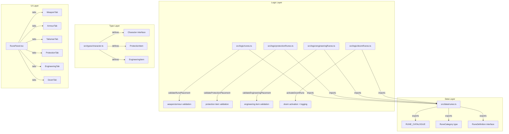

# Design Document: Expanded Rune Categories

## Overview

This design extends the existing Dwarf Runesmith rune system to support three new rune categories: Protection Runes, Engineering Runes, and Doom Runes. The current system manages weapon, armour, and talisman runes with a shared `RuneCategory` type, a flat `RUNE_CATALOGUE` array, placement validation logic, and a learning flow. The expansion introduces category-specific placement targets (communal items for Protection, artillery for Engineering, Anvil of Doom for Doom), new item tracking structures (`ProtectionItem`, `EngineeringItem`), auto-learning mechanics for Doom Runes, charge tracking for the Rune of Forging, and a tabbed UI to present all six categories clearly.

The design preserves full backward compatibility: existing `validateRunePlacement` and `getAvailableRunesForItem` functions continue to handle weapon/armour items identically. New validation functions are added alongside existing ones rather than modifying them.

## Architecture



**Key architectural decisions:**

1. **Separate validation modules per category** rather than extending `validateRunePlacement` — keeps the existing function untouched for backward compatibility and keeps each category's rules self-contained.
2. **Flat catalogue with extended type** — all runes remain in one `RUNE_CATALOGUE` array, filtered by the existing `getRunesByCategory` function. The `RuneCategory` union is widened.
3. **New item arrays on Character** — `protectionItems` and `engineeringItems` are optional arrays defaulting to `[]` on load, ensuring old saved characters deserialize without error.
4. **Session-scoped Doom Rune tracking** — activations stored in a `doomRuneActivations` array that resets per session, separate from the persistent `log` array.

## Components and Interfaces

### Logic Modules

#### `src/logic/protectionRunes.ts`

```typescript
export function validateProtectionPlacement(
  runeId: string,
  item: ProtectionItem
): RuneValidationResult;

export function getAvailableProtectionRunes(
  knownRunes: string[]
): RuneDefinition[];
```

#### `src/logic/engineeringRunes.ts`

```typescript
export function validateEngineeringPlacement(
  runeId: string,
  item: EngineeringItem
): RuneValidationResult;

export function getAvailableEngineeringRunes(
  knownRunes: string[]
): RuneDefinition[];

export function activateRuneOfForging(
  item: EngineeringItem,
  forgingCharges: Record<string, number>
): { success: boolean; error?: string; updatedCharges: Record<string, number> };

export function resetForgingCharges(
  items: EngineeringItem[]
): Record<string, number>;

export function calculateForgingCharges(item: EngineeringItem): number;
```

#### `src/logic/doomRunes.ts`

```typescript
export function getDoomRunesForCharacter(
  knownRunes: string[]
): RuneDefinition[];

export function shouldAutoLearnDoomRunes(
  knownRunes: string[],
  talents: Talent[]
): boolean;

export function activateDoomRune(
  runeId: string,
  currentActivations: DoomRuneActivation[]
): { success: boolean; error?: string; activation?: DoomRuneActivation };

export function isDoomRuneUsedThisSession(
  runeId: string,
  activations: DoomRuneActivation[]
): boolean;
```

#### `src/logic/runes.ts` (modified)

The existing `canLearnRune` function is extended with additional checks for protection/engineering talent prerequisites and rejection of direct Doom Rune learning. The `validateRunePlacement` and `getAvailableRunesForItem` functions remain unchanged for weapon/armour item types.

### UI Components

#### `src/components/runes/RunePanel.tsx`

Top-level tabbed container with six tabs. Uses a controlled tab state.

#### `src/components/runes/ProtectionRuneSection.tsx`

Displays known Protection Runes with SLs Required, manages Protection Items list with add/edit/remove, and handles rune inscription via drag-to-slot or select interaction.

#### `src/components/runes/EngineeringRuneSection.tsx`

Displays known Engineering Runes, manages Engineering Items, shows Rune of Forging charge counters, and provides charge activation and reset controls.

#### `src/components/runes/DoomRuneSection.tsx`

Displays three Doom Runes with activation buttons, test difficulty info, and Anvil requirement note. Locked state shown when no Master Rune is known.

## Data Models

### Extended `RuneCategory` Type

```typescript
export type RuneCategory = 'weapon' | 'armour' | 'talisman' | 'protection' | 'engineering' | 'doom';
```

### Extended `RuneDefinition` Interface

```typescript
export interface RuneDefinition {
  id: string;
  name: string;
  category: RuneCategory;
  isMaster: boolean;
  maxPerItem: number;
  xpCost: number;
  effects: RuneEffect[];
  description: string;
  slsRequired?: number;       // NEW: Success Levels required (1-10), used by protection/engineering
  isAutoLearned?: boolean;    // NEW: true for Doom Runes (auto-granted with Master Rune Magic)
}
```

### `ProtectionItem` Interface

```typescript
export interface ProtectionItem {
  id: string;
  name: string;                // 1-100 characters
  type: 'banner' | 'shrine' | 'gatehouse' | 'oathstone' | 'icon' | 'other';
  location: string;            // 0-200 characters
  runes: string[];             // Max 3 rune IDs from catalogue (category: 'protection')
}
```

### `EngineeringItem` Interface

```typescript
export interface EngineeringItem {
  id: string;
  name: string;                // 1-100 characters
  type: 'Grudge Thrower' | 'Bolt Thrower' | 'Blackpowder Cannon';
  runes: string[];             // Max 3 rune IDs from catalogue (category: 'engineering')
}
```

### `DoomRuneActivation` Interface

```typescript
export interface DoomRuneActivation {
  runeId: string;
  timestamp: number;           // milliseconds since epoch
  label: string;               // e.g. "Doom Rune activation: Rune of Hearth and Home"
}
```

### Character Interface Extensions

```typescript
export interface Character {
  // ... existing fields ...
  protectionItems?: ProtectionItem[];
  engineeringItems?: EngineeringItem[];
  doomRuneActivations?: DoomRuneActivation[];
  forgingCharges?: Record<string, number>;  // key: engineeringItem.id, value: remaining charges
}
```

On load, missing fields default to `[]` or `{}`.


## Correctness Properties

*A property is a characteristic or behavior that should hold true across all valid executions of a system — essentially, a formal statement about what the system should do. Properties serve as the bridge between human-readable specifications and machine-verifiable correctness guarantees.*

### Property 1: Category filtering correctness

*For any* valid `RuneCategory` value, `getRunesByCategory(category)` SHALL return only runes whose `category` field exactly equals the requested category, and SHALL never include runes from any other category.

**Validates: Requirements 1.5, 13.4**

### Property 2: Protection rune structural invariants

*For any* rune in the RUNE_CATALOGUE with `category === 'protection'`, the rune SHALL have: an `id` starting with `'protection-'`, a non-empty `name`, `maxPerItem === 1`, `slsRequired` as an integer in range 1–10, `xpCost === 50` when `isMaster === false` or `xpCost === 100` when `isMaster === true`, at least one entry in its `effects` array, and a non-empty `description`.

**Validates: Requirements 2.2, 2.3**

### Property 3: Engineering rune structural invariants

*For any* rune in the RUNE_CATALOGUE with `category === 'engineering'`, the rune SHALL have: a non-empty `id`, a non-empty `name`, `maxPerItem === 1`, `slsRequired` as an integer in range 1–10, `xpCost === 50` when `isMaster === false` or `xpCost === 100` when `isMaster === true`, at least one entry in its `effects` array, and a non-empty `description`.

**Validates: Requirements 3.2, 3.3, 3.4**

### Property 4: Doom rune structural invariants

*For any* rune in the RUNE_CATALOGUE with `category === 'doom'`, the rune SHALL have: `isMaster === false`, `xpCost === 0`, `maxPerItem === 0`, `isAutoLearned === true`, exactly one entry in its `effects` array with `type === 'special'`, and a non-empty `description`.

**Validates: Requirements 4.3, 4.4**

### Property 5: Protection placement capacity and master-rune limit

*For any* protection-category rune and any `ProtectionItem`, `validateProtectionPlacement` SHALL return `valid: true` if and only if: the item currently has fewer than 3 inscribed runes, AND (the rune is not a master rune OR the item does not already have a master rune inscribed), AND the rune ID exists in the catalogue with category 'protection'.

**Validates: Requirements 5.1, 5.2, 5.4, 5.6**

### Property 6: Protection item category exclusivity

*For any* rune whose category is NOT 'protection', `validateProtectionPlacement` SHALL reject placement on a `ProtectionItem`. Conversely, *for any* protection-category rune, `validateRunePlacement` on a weapon or armour item type SHALL reject it.

**Validates: Requirements 5.3, 5.5**

### Property 7: Engineering placement capacity and master-rune limit

*For any* engineering-category rune and any `EngineeringItem`, `validateEngineeringPlacement` SHALL return `valid: true` if and only if: the item currently has fewer than 3 inscribed runes, AND (the rune is not a master rune OR the item does not already have a master rune inscribed), AND the rune ID exists in the catalogue with category 'engineering'.

**Validates: Requirements 6.1, 6.2, 6.4**

### Property 8: Engineering item category exclusivity

*For any* rune whose category is NOT 'engineering', `validateEngineeringPlacement` SHALL reject placement on an `EngineeringItem`. Conversely, *for any* engineering-category rune, `validateRunePlacement` on a weapon or armour item type SHALL reject it.

**Validates: Requirements 6.3, 6.5**

### Property 9: Doom Rune availability follows master rune knowledge

*For any* character whose `knownRunes` array contains at least one rune ID where the corresponding `RuneDefinition` has `isMaster === true`, `getDoomRunesForCharacter` SHALL return exactly 3 runes (all doom-category runes). For any character with no master runes known, it SHALL return an empty array.

**Validates: Requirements 7.1**

### Property 10: Doom Rune single-activation enforcement

*For any* doom rune ID and any `DoomRuneActivation[]` array, if the array already contains an entry with that rune ID, then `activateDoomRune` SHALL return `{ success: false }` and SHALL NOT modify the activations array. If the array does NOT contain that rune ID, `activateDoomRune` SHALL return `{ success: true }` with a valid activation entry containing the rune ID, a positive timestamp, and a non-empty label.

**Validates: Requirements 7.2, 7.3, 7.5**

### Property 11: Learning prerequisites for Protection and Engineering runes

*For any* non-master protection rune, `canLearnRune` SHALL return `canLearn: true` only if the character has a talent starting with "Rune Magic" whose parenthetical contains "Protection Runes" or "All Forms". *For any* non-master engineering rune, the same applies with "Engineering Runes" or "All Forms". *For any* master protection rune, the character must have "Master Rune Magic" with "Protection Runes", "Protective Runes", or "All Forms". *For any* master engineering rune, the character must have "Master Rune Magic" with "Engineering Runes" or "All Forms". A bare "Rune Magic" talent (no parenthetical) SHALL NOT satisfy protection or engineering prerequisites.

**Validates: Requirements 8.1, 8.2, 8.3, 8.4, 8.7**

### Property 12: Doom Runes cannot be learned individually

*For any* doom-category rune ID and *any* character (regardless of talents or XP), `canLearnRune` SHALL return `{ canLearn: false }` with an error indicating Doom Runes are auto-granted.

**Validates: Requirements 8.6**

### Property 13: Doom Rune auto-learning trigger

*For any* character who has a "Master Rune Magic" talent and whose `knownRunes` does not already contain all three doom rune IDs, `shouldAutoLearnDoomRunes` SHALL return `true`. For any character without the talent, it SHALL return `false`.

**Validates: Requirements 8.5**

### Property 14: Rune of Forging charge calculation

*For any* `EngineeringItem`, `calculateForgingCharges(item)` SHALL return the count of rune entries in `item.runes` whose ID matches the Engineering Rune of Forging. After `resetForgingCharges(items)`, every item's charges in the returned record SHALL equal `calculateForgingCharges(item)`.

**Validates: Requirements 11.1, 11.4, 11.5**

### Property 15: Rune of Forging activation and depletion

*For any* `EngineeringItem` with `n` Forging charges remaining where `n > 0`, `activateRuneOfForging` SHALL succeed and return `updatedCharges` with exactly `n - 1` for that item. For any item with 0 charges, activation SHALL fail with the message "All Runes of Forging on this item have been used this adventure."

**Validates: Requirements 11.2, 11.3**

### Property 16: Item creation name validation

*For any* string that is empty, whitespace-only, or exceeds 100 characters, creating a `ProtectionItem` or `EngineeringItem` SHALL be rejected. *For any* non-empty, non-whitespace string of 1–100 characters with a valid type, creation SHALL succeed and produce an item with a generated unique ID and an empty runes array.

**Validates: Requirements 9.2, 9.3, 10.2, 10.3**

### Property 17: Item edit preserves identity and runes

*For any* `ProtectionItem` and any valid edit (changing name, type, or location), the resulting item SHALL have the same `id` and the same `runes` array as before the edit.

**Validates: Requirements 9.4**

### Property 18: Engineering item removal preserves knownRunes

*For any* character and any `EngineeringItem` removal, the character's `knownRunes` array SHALL remain unchanged (rune IDs inscribed on the removed item are retained in the character's known list).

**Validates: Requirements 10.4**

### Property 19: Backward-compatible character loading

*For any* valid pre-expansion character object (missing `protectionItems`, `engineeringItems`, `doomRuneActivations`, `forgingCharges` fields), loading SHALL produce a character with those fields initialised to empty arrays/objects AND all existing fields (`knownRunes`, `weapons[].runes`, `armour[].runes`, and all other fields) preserved with identical values.

**Validates: Requirements 13.1, 13.5**

### Property 20: getAvailableRunesForItem excludes new categories

*For any* weapon or armour item type, `getAvailableRunesForItem` SHALL never return a rune whose category is 'protection', 'engineering', or 'doom'.

**Validates: Requirements 13.3**

## Error Handling

| Scenario | Error Message | Recovery |
|----------|--------------|----------|
| Protection rune on weapon/armour | "Protection runes can only be inscribed on communal items and installations." | User redirected to Protection Items section |
| Engineering rune on non-artillery | "Engineering runes can only be inscribed on Dwarf artillery weapons." | User redirected to Engineering Items section |
| Non-protection rune on Protection_Item | "Only protection runes can be inscribed on this item." | Rune picker filtered to show only protection runes |
| Non-engineering rune on Engineering_Item | "Only engineering runes can be inscribed on artillery weapons." | Rune picker filtered |
| Max 3 runes reached | "This item already has the maximum of 3 runes." | Disable add-rune control |
| Second Master Rune attempt | "Only one Master Rune is allowed per item." | Filter master runes from available list |
| Unknown rune ID | "Unknown rune." | Log warning, display item without that rune's name |
| Doom Rune already activated | "This Doom Rune has already been activated this session." | Button remains disabled |
| Rune of Forging no charges | "All Runes of Forging on this item have been used this adventure." | Disable activation button, show 0 charges |
| Missing talent for Protection/Engineering | "Requires Rune Magic ({category} Runes) talent." | Display talent requirement in learn UI |
| Doom Rune manual learn attempt | "Doom Runes are only granted automatically upon acquiring the Master Rune Magic talent." | Hide learn button for doom runes |
| Item name empty/too long | "Name is required and must be between 1 and 100 characters." | Focus name input with validation message |
| Max 20 items reached | "Maximum of 20 items reached for this category." | Disable add-item button |
| Unresolvable rune ID on load | Retain ID silently; render as "(Unknown Rune)" in UI | No crash; rune treated as having no active effects |

All validation functions return structured `{ valid: boolean; error?: string }` objects. UI components display errors inline near the triggering control. No thrown exceptions for validation failures — errors are data, not control flow.

## Testing Strategy

### Unit Tests (Example-Based)

- Catalogue content assertions: exact Protection Rune count (16), Engineering Rune count (12), Doom Rune count (3), master/non-master splits
- UI rendering: tabbed interface renders 6 tabs, Doom section locked state, empty state messages
- Integration: character loading migration, deity filter interaction with new categories
- Removal confirmation flow (UI interaction test)

### Property-Based Tests (fast-check, vitest)

The project already uses `fast-check` v4.8.0 with `vitest` v4.1.2. Each correctness property above maps to one property-based test.

**Configuration:**
- Minimum 100 iterations per property (`{ numRuns: 100 }`)
- Each test tagged with: `Feature: expanded-rune-categories, Property {N}: {title}`
- Generators for:
  - `arbitraryProtectionItem()` — random valid ProtectionItem with 0-3 runes
  - `arbitraryEngineeringItem()` — random valid EngineeringItem with 0-3 runes
  - `arbitraryRuneId(category)` — random rune ID from catalogue filtered by category
  - `arbitraryCharacterWithTalents(talents)` — character with specific talent configurations
  - `arbitraryDoomActivations()` — 0-3 random DoomRuneActivation entries

**Test file locations:**
- `src/logic/__tests__/protectionRunes.property.test.ts`
- `src/logic/__tests__/engineeringRunes.property.test.ts`
- `src/logic/__tests__/doomRunes.property.test.ts`
- `src/logic/__tests__/runeCategories.property.test.ts` (catalogue invariants, backward compat)
- `src/logic/__tests__/canLearnRune.property.test.ts` (prerequisite properties)

**Key property groupings:**
| Properties | Test File | What's Tested |
|-----------|-----------|---------------|
| 1, 2, 3, 4, 19, 20 | runeCategories.property.test.ts | Catalogue structure, filtering, backward compat |
| 5, 6 | protectionRunes.property.test.ts | Protection placement validation |
| 7, 8 | engineeringRunes.property.test.ts | Engineering placement validation |
| 9, 10, 12, 13 | doomRunes.property.test.ts | Doom availability, activation, auto-learn |
| 11 | canLearnRune.property.test.ts | Talent prerequisite enforcement |
| 14, 15 | engineeringRunes.property.test.ts | Forging charge tracking |
| 16, 17, 18 | runeCategories.property.test.ts | Item creation/edit/removal invariants |
