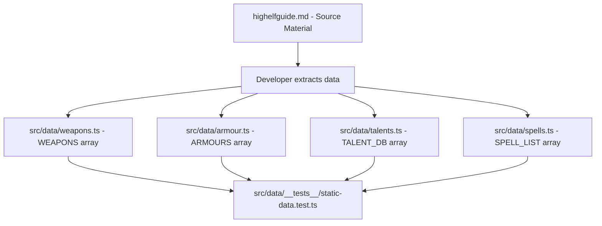

# Design Document: High Elf Equipment & Talents

## Overview

This feature adds High Elf static data from the High Elf Player's Guide into the existing WFRP 4e character sheet PWA. The scope covers:

- **8 melee weapons** (Elven Sword, Elven Dagger, Elven Shield, Elven Lance, Elven Halberd, Elven Spear, (2H) Elven Great Axe, (2H) Greatsword of Hoeth)
- **5 Ithilmar armour pieces** (Breastplate, Open Helm, Bracers, Plate Leggings, Helm)
- **9 talents** (Blood of Aenarion, Uncouth Uranai, Martial Arts, Sword-dancing, Sanctuary of the Mind, Blessed by Isha, High Magic, Mind over Body, Eye of the Storm)
- **~50 spells** across 6 lores (Elven Petty Magic, Elven Arcane, High Magic, Magic of Vaul, Magic of Mathlann, Magic of Hoeth)

All data conforms to existing TypeScript interfaces (`WeaponData`, `ArmourData`, `TalentData`, `SpellData`) and is appended to existing arrays. No new components, interfaces, or architectural changes are required.

### Design Rationale

The approach is purely additive — new entries are inserted into existing sorted arrays following established patterns. This minimises risk of regression and keeps the implementation straightforward.

## Architecture

No architectural changes are needed. The existing module structure handles all new data:



The data flows from the source PDF (converted to markdown) through manual extraction into the static TypeScript arrays. Tests validate correctness.

## Components and Interfaces

### Existing Interfaces (No Changes Required)

```typescript
// src/types/character.ts — all interfaces remain unchanged

interface WeaponData {
  name: string;
  group: string;
  enc: string;
  rangeReach?: string;   // melee weapons
  damage: string;
  qualities: string;
  maxR?: string;         // ranged weapons
  optR?: string;
  rangeMod?: string;
  reload?: string;
}

interface ArmourData {
  name: string;
  locations: string;
  enc: string;
  ap: number;
  qualities: string;
}

interface TalentData {
  name: string;
  max: string;
  desc: string;
}

interface SpellData {
  name: string;
  cn: string;
  range: string;
  target: string;
  duration: string;
  effect: string;
}
```

### Placement Strategy

- **Weapons**: Elven melee weapons are inserted into the appropriate group sections of the `WEAPONS` array (Basic, Cavalry, Polearm, Two-Handed), following the existing pattern where Dwarf weapons were added after their standard counterparts.
- **Armour**: Ithilmar entries are appended after the existing Gromril entries, maintaining the pattern of racial armour groupings.
- **Talents**: New talents are inserted in alphabetical order within the `TALENT_DB` array.
- **Spells**: New spells are appended as new comment-delimited sections at the end of the `SPELL_LIST` array (e.g., `// ELVEN PETTY SPELLS`, `// ELVEN ARCANE SPELLS`, `// HIGH MAGIC`, `// MAGIC OF VAUL`, `// MAGIC OF MATHLANN`, `// MAGIC OF HOETH`).

## Data Models

### Weapons Data

| Name | Group | Enc | Range/Reach | Damage | Qualities |
|------|-------|-----|-------------|--------|-----------|
| Elven Sword | Basic | 1 | Average | +SB+4 | Fast |
| Elven Dagger | Basic | 0 | Very Short | +SB+2 | Fast |
| Elven Shield | Basic | 1 | Very Short | +SB+2 | Shield 2, Defensive, Undamaging |
| Elven Lance | Cavalry | 3 | Very Long | +SB+6 | Impact, Impale |
| Elven Halberd | Polearm | 3 | Long | +SB+4 | Defensive, Hack, Impale |
| Elven Spear | Polearm | 2 | Very Long | +SB+4 | Impale, Fast |
| (2H) Elven Great Axe | Two-Handed | 3 | Long | +SB+6 | Hack, Impact |
| (2H) Greatsword of Hoeth | Two-Handed | 3 | Long | +SB+5 | Damaging, Defensive, Fast |

### Armour Data

| Name | Locations | Enc | AP | Qualities |
|------|-----------|-----|----|-----------|
| Ithilmar Breastplate | Body | 1 | 2 | Impenetrable |
| Ithilmar Open Helm | Head | 0 | 2 | Impenetrable, Partial |
| Ithilmar Bracers | Arms | 1 | 2 | Impenetrable |
| Ithilmar Plate Leggings | Legs | 1 | 2 | Impenetrable |
| Ithilmar Helm | Head | 1 | 2 | Impenetrable |

### Talents Data

| Name | Max | Description Summary |
|------|-----|---------------------|
| Blessed by Isha | 1 | Prerequisite for High Magic; Elves only, requires Everqueen's blessing |
| Blood of Aenarion | 1 | Additional Fate Point, choice of Magical or Martial Prodigy, weekly Cool Test or gain Madness of Khaine |
| Eye of the Storm | 3 | Storm Weaver meditative technique; requires Pray Test, improves focus and weather influence |
| High Magic | 1 | Enables drawing upon all Winds of Magic (Qhaysh); adds to Overcasting SL for High Magic spells |
| Martial Arts | WS Bonus | Unarmed combat improvements; lose Undamaging, gain qualities per level |
| Mind over Body | 3 | Smith-Priest meditative technique; requires Pray Test, endure physical suffering |
| Sanctuary of the Mind | 3 | Hoeth's meditative shielding techniques; requires Pray Test, grants mental protection |
| Sword-dancing | 1 | Enables learning Sword-dancing techniques, starting with Ritual of Cleansing |
| Uncouth Uranai | 1 | Reduced standing with inner kingdom High Elves |

### Spells Data

Spells are grouped by lore. Each entry follows the `SpellData` interface with `name`, `cn`, `range`, `target`, `duration`, and `effect` fields.

**Elven Petty Magic (6 spells):** Bless Arrow, Calm, Greenfinger, Identify Disease, Remove Dirt, Reveal Magic

**Elven Arcane (8 spells):** Enchant Plant, Lesser Banishment, Magic Alarm, Masking the Mind, Purify Body, Speak with Animal, Voice of Iron, Zone of Comfort

**High Magic (16 spells):** Apotheosis, Arcane Unforging, Coruscation of Finreir, Curse of Arrow Attraction, Deadlock, Drain Magic, Fiery Convocation, Fortune is Fickle, Glamour of Teclis, Greater Banishment, Hand of Glory, Invisible Eye, Shield of Saphery, Soul Quench, Tempest, Walk between Worlds

**Magic of Vaul (9 spells):** Artist's Touch, Patience of Vaul, Vaul's Grace, Vaul's Rage, Divination of Flames, Divination of Stones, Fires of Perfection, Wisdom of the Skysteel, Fortress of Hotek

**Magic of Mathlann (9 spells):** Fishbonding, Stormsense, Ocean's Fury, Spirits of the Waves, Call of the Seas, Cloak of Mathlann, Mistress of the Deep, Waterlungs, Writhing Mists

**Magic of Hoeth (3+ spells):** Divine Stylus, Enlightenment, Arcane Insight (plus any additional spells found in source material)

All spell `effect` fields contain a concise summary of the spell's mechanical effect, following the existing pattern in `SPELL_LIST` (typically one sentence, focusing on game mechanics).

## Error Handling

No runtime error handling is needed for this feature. The data is static and validated at build time by TypeScript's type system. If any entry is malformed (missing a required field or wrong type), the TypeScript compiler will catch it.

The test suite provides an additional safety net — if data is accidentally modified or deleted, the tests will fail.

## Testing Strategy

### Why Property-Based Testing Does NOT Apply

This feature is purely static data addition — hardcoded arrays of objects conforming to fixed interfaces. There are:
- No functions to test
- No transformations or algorithms
- No input/output behaviour that varies with input
- No parsers, serializers, or business logic

PBT requires a meaningful "for all inputs X, property P(X) holds" statement, which is impossible for static data. The appropriate testing approach is **example-based unit tests** (spot-checks) that verify specific entries exist with correct field values.

### Testing Approach

Following the established pattern in `src/data/__tests__/static-data.test.ts`:

1. **Existence tests**: Verify each new entry exists in its respective array by name
2. **Field correctness tests**: Spot-check specific field values (group, damage, AP, CN, etc.)
3. **Structural integrity tests**: Verify all entries have required fields (non-empty name, valid types)
4. **Ordering tests**: Verify talents are in alphabetical order
5. **Non-regression tests**: Verify existing entries (e.g., `(2H) Elfbow`) remain unchanged

### Test Structure

```typescript
// New describe blocks to add to src/data/__tests__/static-data.test.ts

describe('High Elf Players Guide — Melee Weapons', () => {
  // Verify all 8 weapons exist with correct fields
});

describe('High Elf Players Guide — Armour', () => {
  // Verify all 5 Ithilmar entries exist with correct AP and qualities
});

describe('High Elf Players Guide — Talents', () => {
  // Verify all 9 talents exist with name, max, and desc
});

describe('High Elf Players Guide — Spells', () => {
  // Verify all ~50 spells exist across all 6 lores
  // Spot-check CN values and effect summaries
});
```

### Test Configuration

- Framework: Vitest (already configured in the project)
- Run command: `npx vitest --run src/data/__tests__/static-data.test.ts`
- No minimum iteration count needed (not PBT)
- Tests follow the exact same patterns as existing Dwarf Players Guide tests in the same file
