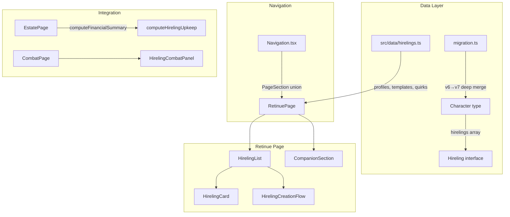

# Design Document: Hirelings

## Overview

This feature adds a hireling NPC tracking system to the WFRP 4e character sheet PWA, based on the "Hire 'Em - Fire 'Em" chapter from the Up in Arms expansion. The implementation introduces:

- A `Hireling` interface and `hirelings` array on the `Character` type
- A new "Retinue" top-level page combining hirelings and existing animal companions
- A static data module (`src/data/hirelings.ts`) for profiles, templates, and d100 quirk tables
- Integration with the Estate page financial system (upkeep costs deducted on "collect month")
- Integration with the Combat page (hireling wound/condition tracking)
- A data version bump from `_v: 6` to `_v: 7` with backward-compatible migration

The design follows existing project conventions: CSS Modules for styling, localStorage persistence, `EditableField`/`Card`/`SectionHeader` shared components, state-based page switching via `PageSection` union type, and static data modules exporting typed arrays.

## Architecture

### System Architecture Changes



### Key Architectural Decisions

1. **Hirelings stored on Character, not separately** — Follows the existing pattern where all character-related data (companions, estate, endeavours) lives on the `Character` interface. No new localStorage keys needed.

2. **Static data file for profiles** — Matches the pattern of `animals.ts`, `careers.ts`, `weapons.ts`. Keeps profile data maintainable and extensible without touching component code.

3. **Template as reference-only** — Templates store only a name string on the hireling. Modifiers are displayed as reference text but NOT auto-applied to stored values. This avoids complex undo logic and matches how the book expects players to apply templates manually.

4. **Retinue page absorbs companions** — Animal companions move from the Character page "notes" tab to the new Retinue page. The companion data stays in `character.companions` — only the UI location changes.

5. **Version bump to 7** — The `_v` field increments. The existing `deepMerge` migration pattern ensures old characters without a `hirelings` field get it defaulted to `[]` from `BLANK_CHARACTER`.

## Components and Interfaces

### Component Hierarchy

```mermaid
graph TD
    APP[App.tsx] --> RETINUE_PAGE[RetinuePage]
    RETINUE_PAGE --> SUB_TABS[Sub-tab bar: Hirelings | Companions]
    SUB_TABS --> HIRELING_SECTION[Hirelings Section]
    SUB_TABS --> COMPANION_SECTION[CompanionSection]
    
    HIRELING_SECTION --> ADD_BTN[AddButton: Add Hireling]
    HIRELING_SECTION --> EMPTY_STATE[Empty state message]
    HIRELING_SECTION --> HIRELING_CARD_LIST[HirelingCard × N]
    
    HIRELING_CARD_LIST --> HC_COLLAPSED[Collapsed: name, role, status, wounds]
    HIRELING_CARD_LIST --> HC_EXPANDED[Expanded: full stat block, quirks, upkeep, notes]
    
    ADD_BTN --> CREATION_FLOW[HirelingCreationFlow]
    CREATION_FLOW --> PROFILE_PICKER[Profile selection picker]
    CREATION_FLOW --> TEMPLATE_PICKER[Template selection]
    CREATION_FLOW --> QUIRK_ROLLER[Roll Random Quirks button]
```

### New File Structure

```
src/
├── components/
│   └── pages/
│       ├── RetinuePage.tsx          # New top-level page
│       └── RetinuePage.module.css   # Page styles
│   └── retinue/
│       ├── HirelingCard.tsx         # Expandable hireling card
│       ├── HirelingCard.module.css
│       ├── HirelingCreationFlow.tsx # Profile/custom creation dialog
│       ├── HirelingCreationFlow.module.css
│       ├── HirelingCombatPanel.tsx  # Combat page integration section
│       └── HirelingCombatPanel.module.css
├── data/
│   └── hirelings.ts                # Static profiles, templates, quirk tables
├── logic/
│   └── hirelings.ts                # Pure functions: upkeep calc, ID generation, quirk rolling
└── types/
    └── character.ts                 # Updated: Hireling interface, Character._v: 7
```

### Component Props Interfaces

```typescript
// RetinuePage.tsx
interface RetinuePageProps {
  character: Character;
  update: (field: string, value: unknown) => void;
  updateCharacter: (mutator: (char: Character) => Character) => void;
}

// HirelingCard.tsx
interface HirelingCardProps {
  hireling: Hireling;
  onUpdate: (id: number, field: string, value: unknown) => void;
  onDelete: (id: number) => void;
}

// HirelingCreationFlow.tsx
interface HirelingCreationFlowProps {
  onConfirm: (hireling: Hireling) => void;
  onCancel: () => void;
}

// HirelingCombatPanel.tsx (used in CombatPage)
interface HirelingCombatPanelProps {
  hirelings: Hireling[];
  onUpdateWounds: (id: number, wCur: number) => void;
  onAddCondition: (id: number, condition: { name: string; level: number }) => void;
  onRemoveCondition: (id: number, conditionIndex: number) => void;
}
```

## Data Models

### Hireling Interface

```typescript
// Added to src/types/character.ts

export interface Hireling {
  id: number;               // Unique numeric ID (timestamp-based)
  name: string;
  role: string;             // e.g., "Mercenary", "Scout", "Lawyer"
  status: string;           // Social tier, e.g., "Silver 3"
  
  // Characteristics (matching Companion layout)
  M: number;
  WS: number;
  BS: number;
  S: number;
  T: number;
  I: number;
  Ag: number;
  Dex: number;
  Int: number;
  WP: number;
  Fel: number;
  W: number;                // Max wounds
  wCur: number;             // Current wounds
  
  // Text block fields
  skills: string;
  talents: string;
  traits: string;
  trappings: string;
  
  // Flavour
  template: string;         // Template name or empty string
  physicalQuirk: string;
  workEthic: string;
  personalityQuirk: string;
  
  // Financial
  upkeep: { gc: number; ss: number; d: number };
  
  // Combat state
  conditions: { name: string; level: number }[];
  
  // General
  notes: string;
}
```

### Character Interface Changes

```typescript
export interface Character {
  _v: 7;                    // Bumped from 6
  // ... existing fields ...
  hirelings: Hireling[];    // New field, default: []
}
```

### BLANK_CHARACTER Update

```typescript
export const BLANK_CHARACTER: Character = {
  _v: 7,
  // ... existing fields ...
  hirelings: [],
};
```

### Static Data Types (src/data/hirelings.ts)

```typescript
export interface HirelingProfile {
  name: string;
  role: string;
  status: string;
  M: number;
  WS: number;
  BS: number;
  S: number;
  T: number;
  I: number;
  Ag: number;
  Dex: number;
  Int: number;
  WP: number;
  Fel: number;
  W: number;
  skills: string;
  talents: string;
  traits: string;
  trappings: string;
}

export interface HirelingTemplate {
  name: string;
  description: string;
  modifiers: string;        // Human-readable modifier summary
  additionalSkills: string;
  additionalTalents: string;
  additionalTrappings: string;
}

export const HIRELING_PROFILES: HirelingProfile[] = [ /* 6 profiles */ ];
export const HIRELING_TEMPLATES: HirelingTemplate[] = [ /* 7 entries including "None" */ ];
export const PHYSICAL_QUIRKS: string[] = [ /* 100 entries */ ];
export const WORK_ETHICS: string[] = [ /* 100 entries */ ];
export const PERSONALITY_QUIRKS: string[] = [ /* 100 entries */ ];
```

### Estate Integration

The `computeFinancialSummary` function in `EstatePage.tsx` will be extended to include hireling upkeep. A new pure function `computeHirelingUpkeep` will be added to `src/logic/hirelings.ts`:

```typescript
// src/logic/hirelings.ts

export function computeHirelingUpkeep(hirelings: Hireling[]): { gc: number; ss: number; d: number } {
  return hirelings.reduce(
    (total, h) => ({
      gc: total.gc + (h.upkeep.gc || 0),
      ss: total.ss + (h.upkeep.ss || 0),
      d: total.d + (h.upkeep.d || 0),
    }),
    { gc: 0, ss: 0, d: 0 }
  );
}

export function generateHirelingId(): number {
  return Date.now() + Math.floor(Math.random() * 1000);
}

export function rollRandomQuirk(table: string[]): string {
  const index = Math.floor(Math.random() * table.length);
  return table[index];
}

export function isIncapacitated(hireling: Hireling): boolean {
  return hireling.wCur <= 0;
}

export function clampWounds(wCur: number, maxW: number): number {
  return Math.max(0, Math.min(wCur, maxW));
}
```

### Navigation Update

```typescript
// Navigation.tsx
export type PageSection = 'character' | 'combat' | 'retinue' | 'estate' | 'endeavours' | 'advancement' | 'settings';
```

The `NAV_ITEMS` array will include a new entry:
```typescript
{ id: 'retinue', label: 'Retinue', icon: Users, shortcut: '3' }
```

### Migration Strategy

The existing `deepMerge` migration in `migration.ts` handles backward compatibility automatically:

1. When a v6 character is loaded, `deepMerge(BLANK_CHARACTER, loadedData)` fills in the missing `hirelings: []` field from BLANK_CHARACTER.
2. The `_v` field will read as `6` from storage but the type expects `7`. The migration doesn't need to explicitly check `_v` because `deepMerge` uses the source value (loaded data) for scalar fields — so `_v` stays as loaded.
3. The `loadCharacter` function (in `character-manager.ts`) already performs `deepMerge` with BLANK_CHARACTER on load, ensuring any missing fields are filled.
4. No explicit migration step is needed beyond updating BLANK_CHARACTER and the Character type.

For robustness, any code reading `character.hirelings` should use optional chaining or default: `character.hirelings || []`.

## Correctness Properties

*A property is a characteristic or behavior that should hold true across all valid executions of a system — essentially, a formal statement about what the system should do. Properties serve as the bridge between human-readable specifications and machine-verifiable correctness guarantees.*

### Property 1: Hireling serialization round-trip

*For any* valid Hireling object, serializing it to JSON and deserializing back should produce an object with identical field values for all hireling fields (name, role, status, characteristics, wounds, skills, talents, traits, trappings, template, quirks, upkeep, conditions, notes).

**Validates: Requirements 1.2, 1.4**

### Property 2: Hireling IDs are unique

*For any* sequence of hireling additions to a character, all hireling `id` values in the resulting `hirelings` array shall be pairwise distinct.

**Validates: Requirements 1.3**

### Property 3: Maximum hireling count invariant

*For any* character and any sequence of "add hireling" operations, the length of `character.hirelings` shall never exceed 10.

**Validates: Requirements 1.5**

### Property 4: Profile creation populates correct characteristics

*For any* pre-defined HirelingProfile, creating a hireling from that profile shall produce a hireling whose characteristic values (M, WS, BS, S, T, I, Ag, Dex, Int, WP, Fel, W) exactly match the profile definition.

**Validates: Requirements 2.3**

### Property 5: Template selection does not modify characteristics

*For any* hireling and any template selection (including "None"), setting the template field shall not change any of the hireling's stored characteristic values.

**Validates: Requirements 3.4**

### Property 6: Random quirk output is a valid table entry

*For any* invocation of the random quirk roller, the returned string shall be a member of the corresponding d100 table array (PHYSICAL_QUIRKS, WORK_ETHICS, or PERSONALITY_QUIRKS).

**Validates: Requirements 4.2**

### Property 7: Total upkeep is correct sum

*For any* array of hirelings, `computeHirelingUpkeep(hirelings)` shall return an object where each currency field (gc, ss, d) equals the sum of the corresponding field across all hirelings' `upkeep` objects.

**Validates: Requirements 5.2, 5.4**

### Property 8: Treasury deduction includes hireling upkeep

*For any* estate treasury state and any set of hirelings with upkeep costs, executing the "collect month" action shall reduce the treasury by exactly the sum of all monthly expenses (existing estate expenses + property expenses + total hireling upkeep).

**Validates: Requirements 5.3**

### Property 9: Wound increment/decrement respects bounds

*For any* hireling with current wounds `wCur` and max wounds `W`, incrementing wounds shall yield `min(wCur + 1, W)` and decrementing shall yield `max(wCur - 1, 0)`.

**Validates: Requirements 6.3**

### Property 10: Incapacitated state iff wounds are zero

*For any* hireling, `isIncapacitated(hireling)` shall return `true` if and only if `hireling.wCur <= 0`.

**Validates: Requirements 6.6**

### Property 11: Migration defaults missing hirelings to empty array

*For any* character object that does not contain a `hirelings` field, after deep-merging with BLANK_CHARACTER, the result shall have `hirelings` as an empty array `[]`.

**Validates: Requirements 9.1, 9.4**

## Error Handling

| Scenario | Handling |
|----------|----------|
| Loading character without `hirelings` field | `deepMerge` fills default `[]` from BLANK_CHARACTER |
| Adding hireling when at max (10) | UI disables "Add Hireling" button; logic rejects the addition |
| Invalid wound adjustment (below 0 or above max) | `clampWounds` function enforces bounds |
| Corrupted hireling data in localStorage | `deepMerge` fills missing sub-fields from defaults; malformed entries render with fallback values |
| Empty upkeep fields | Treated as `0` via `|| 0` pattern in summation |
| Duplicate IDs (edge case from rapid creation) | `generateHirelingId` uses timestamp + random offset; UI operations are sequential so collision is near-impossible |
| Profile data file import failure | TypeScript compile-time guarantee; profiles are statically defined |

## Testing Strategy

### Property-Based Tests (fast-check)

The project already uses `fast-check` (v4.8.0) and `vitest` (v4.1.2). Property tests will live in `src/logic/__tests__/hirelings.property.test.ts`.

- **Library**: fast-check
- **Runner**: vitest
- **Minimum iterations**: 100 per property
- **Tag format**: `Feature: hirelings, Property {N}: {title}`
- Each correctness property above maps to one property-based test
- Generators will produce random `Hireling` objects with valid ranges for characteristics (0–99), wounds (0–max), and currency fields (0–999)

### Unit Tests (example-based)

Located in `src/logic/__tests__/hirelings.test.ts` and `src/components/retinue/__tests__/`:

- Profile creation produces correct values for each specific profile
- Blank hireling creation yields all zeros/empty strings
- Template list contains all 7 options
- Static data file exports correct number of profiles, templates, and quirk table entries
- Quirk tables have exactly 100 entries each
- Combat panel renders incapacitated styling when wCur = 0
- Empty state message shown when no hirelings exist

### Integration Tests

- Estate "collect month" correctly deducts hireling upkeep from treasury
- Navigation includes "Retinue" page and renders RetinuePage component
- Animal companions display on Retinue page (moved from Character page)
- Hireling creation flow end-to-end: select profile → apply template → roll quirks → save

### Test File Structure

```
src/
├── logic/__tests__/
│   ├── hirelings.test.ts            # Unit tests for pure functions
│   └── hirelings.property.test.ts   # Property-based tests
├── components/retinue/__tests__/
│   ├── HirelingCard.test.tsx         # Component unit tests
│   └── RetinuePage.test.tsx          # Page integration tests
└── data/__tests__/
    └── hirelings.test.ts            # Static data validation
```
