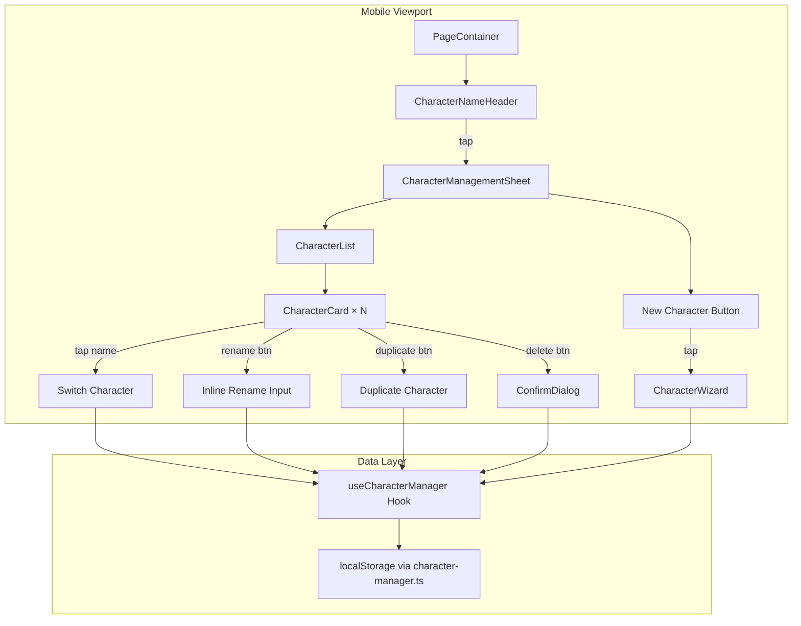

# Design Document: Mobile Character Management

## Overview

This feature provides a mobile-friendly character management interface for the WFRP 4e PWA. On mobile viewports (below 768px), the desktop sidebar—which contains all character switching, creation, renaming, duplication, and deletion functions—is hidden. This design introduces two new components:

1. **Character Name Header** — A tappable element rendered at the top of the PageContainer on mobile, showing the current character name and opening the management sheet.
2. **Character Management Bottom Sheet** — A modal overlay that slides up from the bottom, presenting a scrollable character list with inline actions (switch, rename, duplicate, delete) and a "New Character" button.

Both components integrate with the existing `useCharacterManager` hook for data operations and follow the established mobile design patterns (44px minimum touch targets, CSS Modules, `accent-gold` theming, accessibility standards).

### Design Decisions

- **Bottom sheet over full-page modal**: A bottom sheet keeps context visible (dimmed background), feels native on mobile, and supports swipe-to-dismiss. This matches platform conventions users expect on phones.
- **Inline rename editing**: Rather than opening a separate dialog, renaming happens inline within the character card. This reduces navigation steps and keeps the user oriented in the list.
- **Reuse existing hooks**: All data operations flow through `useCharacterManager`, which already handles localStorage persistence, character switching with save-before-switch, and index management. No new storage layer is needed.
- **CSS Modules for styling**: Consistent with the rest of the project. No new styling libraries.
- **No external animation library**: CSS transitions and `@keyframes` handle the sheet slide-up and backdrop fade. This avoids adding dependencies for a single interaction.

## Architecture



### Component Hierarchy

```
AppWithCharacter
├── Navigation (existing, sidebar hidden on mobile)
├── PageContainer (existing)
│   ├── CharacterNameHeader (NEW, mobile-only)
│   │   └── triggers CharacterManagementSheet
│   └── {page content}
├── CharacterManagementSheet (NEW, portal to body)
│   ├── Backdrop overlay
│   ├── Sheet container
│   │   ├── Drag handle
│   │   ├── CharacterList
│   │   │   └── CharacterCard × N
│   │   │       ├── Name (tap to switch)
│   │   │       ├── Career subtitle
│   │   │       ├── Rename button → Inline input
│   │   │       ├── Duplicate button
│   │   │       └── Delete button → ConfirmDialog
│   │   └── New Character button
│   └── ARIA live region
└── CharacterWizard (existing, shown on demand)
```

### Rendering Strategy

- **CharacterNameHeader** renders inside `PageContainer` as the first child, conditionally shown via a CSS media query (`display: none` above 767px). This avoids JS-based viewport detection for the header itself.
- **CharacterManagementSheet** renders via a React portal to `document.body` to escape any `overflow: hidden` ancestors and position correctly over the fixed bottom nav.
- **Focus trap** is implemented within the sheet using a custom hook that captures Tab/Shift+Tab at the boundaries.

## Components and Interfaces

### CharacterNameHeader

```typescript
interface CharacterNameHeaderProps {
  characterName: string;
  onOpen: () => void;
}
```

**Location**: `src/components/shared/CharacterNameHeader.tsx`

- Renders a `<button>` with `role="button"` and `aria-label="Character management"`
- Displays character name truncated with CSS `text-overflow: ellipsis`, max 30 characters via CSS `max-width` on the text span
- Shows a chevron-down icon (lucide-react `ChevronDown`) as the tappable affordance
- Falls back to "Unnamed Character" when name is empty or whitespace-only
- Minimum height: 44px (via CSS)
- Hidden on desktop via CSS media query

### CharacterManagementSheet

```typescript
interface CharacterManagementSheetProps {
  isOpen: boolean;
  onClose: () => void;
  characters: CharacterSummary[];
  activeId: string;
  onSwitchCharacter: (id: string) => void;
  onCreateCharacter: () => void;
  onRenameCharacter: (id: string, name: string) => void;
  onDuplicateCharacter: (id: string) => void;
  onDeleteCharacter: (id: string) => void;
  triggerRef: React.RefObject<HTMLButtonElement | null>;
}
```

**Location**: `src/components/shared/CharacterManagementSheet.tsx`

- Rendered via `createPortal` to `document.body`
- Manages open/close animation state with CSS transitions
- Implements focus trap and Escape key handling
- Prevents background scroll via `document.body.style.overflow = 'hidden'` while open
- Contains an ARIA live region (`aria-live="polite"`) for announcing action results
- Sheet has `role="dialog"` and `aria-label="Character management"`

### CharacterCard

```typescript
interface CharacterCardProps {
  character: CharacterSummary;
  isActive: boolean;
  onSwitch: () => void;
  onRename: (newName: string) => void;
  onDuplicate: () => void;
  onDelete: () => void;
}
```

**Location**: Defined within `CharacterManagementSheet.tsx` (internal component)

- Renders character name as a tappable button (full width minus action buttons area, min-height 44px)
- Shows career as secondary text
- Active character highlighted with `accent-gold` border and text color
- Action buttons (rename, duplicate, delete) each 44×44px minimum
- Rename transitions card into inline edit mode with a text input

### useFocusTrap Hook

```typescript
function useFocusTrap(containerRef: React.RefObject<HTMLElement | null>, isActive: boolean): void
```

**Location**: `src/hooks/useFocusTrap.ts`

- When active, intercepts Tab and Shift+Tab keypresses
- Wraps focus from last focusable element to first, and vice versa
- On activation, moves focus to the first focusable element in the container

### useBodyScrollLock Hook

```typescript
function useBodyScrollLock(isLocked: boolean): void
```

**Location**: `src/hooks/useBodyScrollLock.ts`

- Sets `document.body.style.overflow = 'hidden'` when locked
- Restores previous overflow value on cleanup

## Data Models

No new data models are introduced. The feature operates on existing types:

- **`CharacterSummary`** — Used to render each card in the list (`id`, `name`, `species`, `career`, `careerLevel`, `lastModified`)
- **`Character`** — Full character object loaded/saved during switch operations
- **`CharacterIndex`** — The index of all characters with `activeId`, managed by `character-manager.ts`

### State Management

The `CharacterManagementSheet` component manages local UI state:

```typescript
// Sheet-level state
const [isRenaming, setIsRenaming] = useState<string | null>(null); // id of character being renamed
const [renameValue, setRenameValue] = useState('');
const [errorMessage, setErrorMessage] = useState<string | null>(null);
const [announcement, setAnnouncement] = useState(''); // for ARIA live region
```

All persistent data operations delegate to the `useCharacterManager` hook passed via props. The character list is always derived from `manager.characters` sorted by `lastModified` descending.


## Correctness Properties

*A property is a characteristic or behavior that should hold true across all valid executions of a system—essentially, a formal statement about what the system should do. Properties serve as the bridge between human-readable specifications and machine-verifiable correctness guarantees.*

### Property 1: Empty or whitespace-only names display fallback text

*For any* string that is empty or composed entirely of whitespace characters (spaces, tabs, newlines), the CharacterNameHeader SHALL display "Unnamed Character" as the visible text. Conversely, for any string that contains at least one non-whitespace character, the component SHALL display that string (or a truncation of it).

**Validates: Requirements 1.7**

### Property 2: Character list is sorted by most recently modified first

*For any* array of CharacterSummary objects with distinct `lastModified` timestamps, the rendered Character_List SHALL display them in strictly descending order of `lastModified` value.

**Validates: Requirements 3.1**

### Property 3: Rename validation accepts trimmed values of 1–50 characters

*For any* string input to the rename field, if the trimmed string length is between 1 and 50 characters (inclusive), the rename SHALL be accepted and the saved value SHALL equal the trimmed input. If the trimmed string is empty (length 0), the rename SHALL be cancelled and the original name restored.

**Validates: Requirements 6.3, 6.4, 6.6**

### Property 4: Duplicate character name is original name with " (Copy)" appended

*For any* character with a given name, when the duplicate action is invoked, the newly created character's name SHALL equal the original character's name concatenated with the string " (Copy)".

**Validates: Requirements 7.2**

### Property 5: Focus trap wraps at sheet boundaries

*For any* CharacterManagementSheet containing N focusable elements (where N ≥ 1), pressing Tab while the last focusable element is focused SHALL move focus to the first focusable element, and pressing Shift+Tab while the first focusable element is focused SHALL move focus to the last focusable element.

**Validates: Requirements 9.1**

### Property 6: Action button accessible names include action type and character name

*For any* character name in the Character_List, each action button (rename, duplicate, delete) within that character's card SHALL have an accessible name that contains both the action type word and the character's name.

**Validates: Requirements 9.5**

### Property 7: Focus moves to correct element after card deletion

*For any* Character_List with N cards (N ≥ 1), when a card at position P is removed: if P < N-1, focus SHALL move to the card at position P (the next card); if P = N-1 and N > 1, focus SHALL move to the card at position P-1 (the previous card); if N = 1 (last card removed), focus SHALL move to the "New Character" button.

**Validates: Requirements 9.7**

## Error Handling

| Scenario | Behavior | User Feedback |
|----------|----------|---------------|
| Character switch fails (target not found in localStorage) | Sheet remains open, active character unchanged | Error message displayed within the sheet: "Could not load character. It may have been deleted." |
| Duplicate fails (source character not found) | List unchanged, sheet remains open | Error message: "Could not duplicate character." |
| Rename with invalid input (empty/whitespace after trim) | Rename cancelled, original name restored | No error message — silent cancellation to display state |
| Rename with value > 50 characters | Input prevents further entry (maxLength attribute) | Visual: input stops accepting characters |
| localStorage quota exceeded on save | Operation fails gracefully | Error message: "Could not save. Storage may be full." |

Error messages are displayed within the sheet in a styled error banner and cleared when the user takes another action. Critical errors are also announced via the ARIA live region.

## Testing Strategy

### Unit Tests (Example-Based)

Unit tests cover specific interactions and rendering:

- CharacterNameHeader renders with name, truncation class, chevron icon, aria-label
- CharacterNameHeader calls onOpen when clicked
- CharacterManagementSheet renders as dialog with correct ARIA attributes
- Sheet opens/closes with backdrop, prevents background scroll
- Tapping a non-active character calls onSwitchCharacter and closes sheet
- Tapping active character closes sheet without switching
- New Character button calls onCreateCharacter
- Rename button enters edit mode with pre-filled input
- Escape key cancels rename
- Input has maxLength=50 and font-size 16px
- Delete button opens ConfirmDialog with character name
- Confirm delete calls onDeleteCharacter
- Cancel delete leaves list unchanged
- Focus moves to first element on sheet open
- Escape key closes sheet and returns focus to trigger

### Property-Based Tests (fast-check)

Property-based tests validate universal invariants using `fast-check` with minimum 100 iterations:

| Property | What's Generated | What's Verified |
|----------|-----------------|-----------------|
| 1: Fallback display | Random whitespace strings + non-whitespace strings | Whitespace → "Unnamed Character"; non-whitespace → actual name shown |
| 2: Sort order | Random arrays of CharacterSummary with varying lastModified | Rendered order matches descending sort |
| 3: Rename validation | Random strings of varying lengths including whitespace | Trimmed 1-50 → saved as trimmed; empty/whitespace → cancelled |
| 4: Duplicate naming | Random character names | New name = original + " (Copy)" |
| 5: Focus trap | Sheets with varying character counts (1-20) | Tab from last → first; Shift+Tab from first → last |
| 6: Accessible names | Random character names (including special characters) | Each action button label contains action word + character name |
| 7: Focus after deletion | Lists of varying length, deletion at varying positions | Focus lands on correct element per position rules |

**Test Configuration:**
- Library: `fast-check` (already in devDependencies)
- Runner: `vitest`
- Minimum iterations: 100 per property
- Tag format: `Feature: mobile-character-management, Property {N}: {title}`

### Integration Tests

- Full flow: open sheet → switch character → verify page updates with new character data
- Full flow: open sheet → create via wizard → verify new character appears in list
- Full flow: open sheet → delete active character → verify switch to next character

### Edge Case Tests

- Empty character list shows message + New Character button
- Deleting active character when it's the only one → welcome screen
- Character switch failure → error message + sheet stays open
- Duplicate failure → error message + list unchanged
