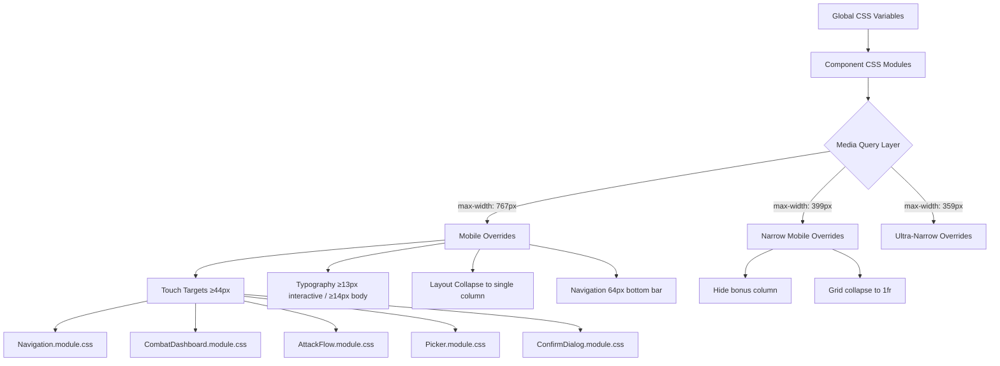

# Design Document: Mobile UI Optimization

## Overview

This design optimizes the PWA Character Sheet for mobile phone use during tabletop gaming sessions. The optimization targets viewports between 320px–428px and addresses touch targets, navigation, typography, layout density, combat UX, and input handling.

The approach uses a **CSS-first strategy with CSS Modules media queries** — the existing component architecture (React + CSS Modules + Vite) remains unchanged. All mobile optimizations are implemented as `@media (max-width: 767px)` and `@media (max-width: 399px)` overrides within existing `.module.css` files, with minimal TypeScript changes for behavioral requirements (sticky positioning, default collapse states, keyboard attributes).

### Design Decisions

1. **Breakpoint strategy**: Primary mobile breakpoint at `max-width: 767px` (aligns with existing Navigation.module.css). Secondary narrow breakpoint at `max-width: 399px` for extreme cases (hide bonus column, single-column grids). A tertiary breakpoint at `max-width: 359px` for sub-tab horizontal scroll.

2. **No new dependencies**: All changes use standard CSS and existing React patterns. No CSS-in-JS, no utility frameworks.

3. **CSS custom properties for mobile values**: Define `--mobile-touch-min: 44px`, `--mobile-touch-lg: 48px`, `--mobile-font-min: 13px` as overrides inside the mobile media query on `:root` to centralize values.

4. **Behavioral changes via existing patterns**: The `AttackFlow` component already has mobile detection via `window.innerWidth < 768`. We extend this approach for default-collapsed panels.

5. **Safe area handling**: Use `env(safe-area-inset-bottom)` for devices with gesture indicators, adding it to the navigation bar padding.

## Architecture

### File Change Map

| File | Change Type | Requirements Addressed |
|------|-------------|----------------------|
| `src/index.css` (or global variables file) | Add mobile CSS custom properties | 15 |
| `src/components/layout/Navigation.module.css` | Increase height, touch targets, icon/label sizing | 1, 2 |
| `src/components/layout/PageContainer.module.css` | Bottom padding, scroll-to-top positioning | 2, 16 |
| `src/components/pages/CharacterPage.module.css` | Sub-tab sticky, table scroll, grid collapse, font sizes | 3, 5, 6, 21 |
| `src/components/shared/Card.module.css` | Reduced padding/gap on mobile | 4 |
| `src/components/combat/CombatDashboard.module.css` | Touch targets, font sizes, sticky, layout | 7, 17 |
| `src/components/combat/AttackFlow.module.css` | Weapon button layout, roll button sizing | 8 |
| `src/components/combat/AttackFlow.tsx` | Default collapse behavior for non-essential panels | 8, 17 |
| `src/components/combat/QuickRollBar.module.css` | Touch targets, scroll affordance | 9 |
| `src/components/combat/TakeDamagePanel.module.css` | Input/button sizing | 10 |
| `src/components/combat/WeaponCards.module.css` | Single-column grid, button sizing | 11 |
| `src/components/combat/ArmourMap.module.css` | Cell sizing, font size | 12 |
| `src/components/shared/Picker.module.css` | Modal sizing, item height, search input | 13 |
| `src/components/shared/EditableField.module.css` | Tap target, font size, keyboard type | 14, 18 |
| `src/components/shared/EditableField.tsx` | inputmode attribute, select-all on focus | 14, 18 |
| `src/components/shared/ConfirmDialog.module.css` | Button stacking, sizing | 22 |
| `src/components/shared/FortuneResolvePanel.module.css` | Button sizing, grid collapse | 19 |
| `src/components/combat/ConditionPicker.module.css` | Grid sizing, modal dimensions | 20 |
| `src/components/pages/CombatPage.tsx` | Default collapse for Ammo/Critical/History panels | 17 |

## Components and Interfaces

### Modified Components

No new components are introduced. All changes are modifications to existing components:

#### Navigation (layout)
- CSS change: increase `--nav-height-mobile` from 60px to 64px
- CSS change: min-height 48px per nav item
- CSS change: icon size 22px minimum, label font 11px minimum
- CSS change: active state uses top border + color differentiation
- CSS change: add `padding-bottom: env(safe-area-inset-bottom)`

#### PageContainer (layout)
- CSS change: add `padding-bottom: calc(64px + 8px + env(safe-area-inset-bottom))` on mobile
- CSS change: scroll-to-top button positioned above nav bar
- No nested vertical scrolling enforcement (already single scroll container)

#### CharacterPage (pages)
- CSS change: sub-tab bar sticky, min-height 44px, font 12px+
- CSS change: horizontal scroll on wide tables with overscroll-behavior
- CSS change: table cell font-size 13px, input min 44px wide × 36px tall
- CSS change: dice button 40×40px touch target
- CSS change: characteristic abbreviations 13px bold, current value 15px
- CSS change: hide Bonus column below 360px
- CSS change: grid collapse to 1fr below 400px for identity/movement/ambitions/wealth grids
- CSS change: sub-tab horizontal scroll below 360px

#### Card (shared)
- CSS change: 10px padding, 8px gap between cards, 6px border-radius on mobile

#### CombatDashboard (combat)
- Already has sticky positioning logic in TSX (inline style)
- CSS change: wound/advantage/round in single row without wrapping
- CSS change: ± buttons 44×44px with 8px gap
- CSS change: condition badges min-height 40px
- CSS change: wound count font-size 28px (already present, ensure on mobile)

#### AttackFlow (combat)
- CSS change: weapon buttons vertical stack (full-width) when >2 weapons on mobile
- CSS change: roll button min-height 48px, full width
- CSS change: result header font 14px
- TSX change: already has mobile collapse logic, ensure it's active

#### QuickRollBar (combat)
- CSS change: skill buttons min-height 44px, padding 14px horizontal
- CSS change: add scroll affordance (gradient fade on edges)
- CSS change: font-size 13px

#### TakeDamagePanel (combat)
- CSS change: damage input 48×48px, font 18px
- CSS change: location select full-width, min-height 44px
- CSS change: apply button full-width, min-height 48px
- CSS change: net wounds font 28px (already present)

#### WeaponCards (combat)
- CSS change: grid-template-columns: 1fr on mobile (single column)
- CSS change: roll button 48×48px
- CSS change: weapon name 14px, stat values 15px

#### ArmourMap (combat)
- CSS change: location cells 56×56px
- CSS change: AP value font 20px
- CSS change: grid max-width 320px, centered

#### Picker (shared)
- CSS change: modal 95% width, 85% height
- CSS change: list items min-height 44px with separator
- CSS change: search input min-height 44px, font 16px
- CSS change: close button 44×44px top-right

#### EditableField (shared)
- CSS change: display state min-height 44px, read-only font 14px
- CSS change: edit state min-height 40px, font 16px
- CSS change: visible tap affordance (border) on display state, hidden in edit
- TSX change: add `inputMode="numeric"` for number type fields
- TSX change: select all text on focus (already implemented)

#### ConfirmDialog (shared)
- CSS change: buttons full-width, vertical stack, min-height 44px
- CSS change: 10px gap between buttons
- CSS change: message font 15px

#### FortuneResolvePanel (shared)
- CSS change: buttons min-height 40px, min-width 80px
- CSS change: single-column below 360px
- CSS change: values font 20px

#### ConditionPicker (combat)
- CSS change: grid with min 2 columns, buttons min-height 48px
- CSS change: modal 95% width, 80% height

#### CombatPage (pages)
- CSS change: start/end button full-width, min-height 48px (already present)
- TSX change: collapse AmmoTracker, CriticalWoundsPanel, RollHistoryPanel by default on mobile

## Data Models

No data model changes. This feature is purely presentational and behavioral at the UI layer.

## Error Handling

No new error states are introduced. Existing error handling (ErrorBoundary in App.tsx) continues to apply. If CSS media queries fail to load, the desktop layout remains functional as a fallback.

Edge cases:
- **Viewport resize** (e.g., orientation change): CSS media queries handle this automatically
- **Safe area insets unavailable**: `env(safe-area-inset-bottom)` gracefully falls back to 0
- **CSS clamp() unsupported**: Fallback static values should be declared before the clamp() rule

## Testing Strategy

### Why PBT Does Not Apply

This feature is entirely about **UI rendering and layout** — CSS sizing, media query breakpoints, visual states, and touch target dimensions. There are no pure functions with varied inputs, no data transformations, no business logic to verify across a range of generated inputs. The requirements specify concrete CSS values (44px, 48px, 64px, etc.) that either are applied or are not at specific viewport widths.

### Testing Approach

**Visual regression testing** and **example-based integration tests** are the appropriate strategies:

1. **Component render tests** (vitest + @testing-library/react + jsdom):
   - Render components at mobile viewport width (375px)
   - Assert CSS classes are applied correctly
   - Assert DOM structure changes (e.g., button stacking in ConfirmDialog)
   - Test behavioral changes (default collapse states, inputMode attributes)

2. **CSS module verification**:
   - Verify media queries exist with correct breakpoints
   - Verify minimum sizes are declared in the mobile overrides

3. **Manual testing matrix** (documented in test plan):
   - iPhone SE (375px) — minimum supported viewport
   - iPhone 14 (390px) — typical viewport
   - iPhone 14 Pro Max (428px) — upper bound
   - Samsung Galaxy S21 (360px) — narrow Android
   - Pixel 7 (412px) — standard Android

4. **Accessibility testing**:
   - Verify touch targets meet WCAG 2.5.5 (44×44 CSS pixels minimum)
   - Verify font sizes meet readability thresholds
   - Test with screen reader at mobile viewport

### Test Files

- `src/components/layout/__tests__/Navigation.mobile.test.tsx` — nav touch targets, height, safe area
- `src/components/pages/__tests__/CharacterPage.mobile.test.tsx` — sub-tab sticky, grid collapse, table scroll
- `src/components/combat/__tests__/CombatDashboard.mobile.test.tsx` — sticky, button sizes, layout
- `src/components/combat/__tests__/AttackFlow.mobile.test.tsx` — weapon button layout, collapse
- `src/components/shared/__tests__/EditableField.mobile.test.tsx` — inputMode, tap target, select-all
- `src/components/shared/__tests__/ConfirmDialog.mobile.test.tsx` — button stacking
- `src/components/shared/__tests__/Picker.mobile.test.tsx` — modal sizing, item height

### Test Configuration

- Use `@testing-library/react` with jsdom
- Mock `window.matchMedia` to simulate mobile viewports
- Mock `window.innerWidth` for components using JS-based detection (AttackFlow)
- Use `getComputedStyle` assertions where CSS Module classes are applied
