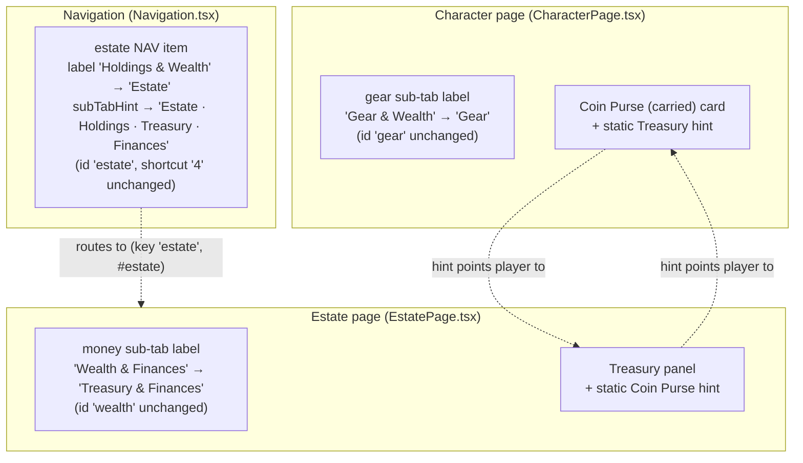

# Design Document

## Overview

This feature is a **display-label and information-architecture change only**. It renames three UI labels and one navigation sub-tab hint, and adds two small static cross-reference hints so players can find the "other" money pool. There is **no new data model, no new logic, and no new game mechanic** — nothing in `src/logic`, `src/types`, `src/storage`, or the transfer/ledger/event-log code paths changes.

Concretely, the whole feature is:

- **Three label string edits** (Character gear sub-tab, Estate nav item + its sub-tab hint, Estate money sub-tab).
- **Two static inline hints** (one inside the Coin Purse card on the Character page, one inside the Treasury panel on the Estate page).

All routing keys, section ids, sub-tab ids, the `#estate` hash route, and the `wGC`/`wSS`/`wD`/`estate.treasury` data fields stay exactly as they are, so saved tab order, saved sub-tab preferences, and saved money data keep working unchanged (Req 7). This follows the precedent already established in `Navigation.tsx`, where display labels were chosen for readability (Navigation Req 16.x) while the routing key `estate` stayed stable — the new labels here simply supersede that display text under the same stability guarantee.

Because this is purely label/presence work over React components, **property-based testing does not apply** (no pure function over a large input space, no universal input-varying invariant). The Testing Strategy uses render/label tests instead, and no correctness-properties section is included (see Testing Strategy for the rationale).

## Requirements coverage map

| Design element | File / touch-point | Requirements satisfied |
| --- | --- | --- |
| Gear sub-tab label "Gear & Wealth" → "Gear" | `CharacterPage.tsx` `useTabOrder` defaultTabs | 1.1, 1.2, 1.3, 6.3, 7.2, 7.7 |
| Estate nav label "Holdings & Wealth" → "Estate" + `subTabHint` → "Estate · Holdings · Treasury · Finances" | `Navigation.tsx` `NAV_ITEMS` | 2.1, 2.2, 2.3, 2.4, 6.2, 6.3, 7.1, 7.7 |
| Estate money sub-tab label "Wealth & Finances" → "Treasury & Finances" | `EstatePage.tsx` `defaultTabsList` | 3.1, 3.2, 3.3, 6.2, 6.3, 7.2, 7.7 |
| Coin Purse → Treasury cross-reference hint | `CharacterPage.tsx` Coin Purse card | 4.1, 4.2, 4.3, 6.1, 6.2, 7.7 |
| Treasury → Coin Purse cross-reference hint | `EstatePage.tsx` Treasury panel | 5.1, 6.1, 6.2, 7.7 |
| Routing-key stability (ids/hash/fields untouched) | all of the above | 2.4, 2.5, 7.1, 7.2, 7.3, 7.4, 7.5, 7.6 |
| Consistent "Coin Purse"/"Treasury" terminology | all labels + hints | 6.1, 6.2, 6.3 |

## Architecture

No architectural change. The components involved keep their existing structure; only literal display strings change and two small presentational nodes are added.

## Components and Interfaces

The five touch-points below were verified against the current source. Each is a literal string edit or a small static node; no props, types, or handlers change.

### 1. Character gear sub-tab label (Req 1)

- **File:** `src/components/pages/CharacterPage.tsx`, inside the `defaultTabs` array passed to `useTabOrder`.
- **Before:** `{ id: 'gear', label: 'Gear & Wealth' }`
- **After:** `{ id: 'gear', label: 'Gear' }`
- The `id: 'gear'` is unchanged (Req 1.3, 7.2). Only the `label` string changes.
- The section comment banner `{/* ═══ GEAR & WEALTH ═══ */}` is a code comment, not display text; it may be left as-is or tidied, but it is out of scope for the requirements.

### 2. Estate navigation item label + sub-tab hint (Req 2)

- **File:** `src/components/layout/Navigation.tsx`, in `NAV_ITEMS`.
- **Before:** `{ id: 'estate', label: 'Holdings & Wealth', icon: Landmark, shortcut: '4', subTabHint: 'Estate · Holdings · Wealth' }`
- **After:** `{ id: 'estate', label: 'Estate', icon: Landmark, shortcut: '4', subTabHint: 'Estate · Holdings · Treasury · Finances' }`
- `id: 'estate'` (Req 2.4, 7.1) and `shortcut: '4'` are unchanged. `icon: Landmark` is unchanged.
- **Comment note:** the existing comment above this entry references the Navigation spec's Req 16.x rationale for "Holdings & Wealth" / "Estate · Holdings · Wealth". That comment should be updated to note that the money-locations-clarity spec supersedes the *display text* ("Estate" + "Estate · Holdings · Treasury · Finances") while **preserving the same routing-key-stability guarantee** (the `estate` section key and `#estate` hash route are still untouched). This keeps the historical rationale coherent rather than leaving a stale comment.
- The `#estate` hash route is produced from the `estate` id elsewhere and is unaffected by a label change (Req 2.5, 7.3).

### 3. Estate money sub-tab label (Req 3)

- **File:** `src/components/pages/EstatePage.tsx`, inside the `defaultTabsList` `useMemo`.
- **Before:** `{ id: 'wealth', label: 'Wealth & Finances' }`
- **After:** `{ id: 'wealth', label: 'Treasury & Finances' }`
- The `id: 'wealth'` is unchanged (Req 3.3, 7.2). Only the `label` string changes.

### 4. Coin Purse → Treasury cross-reference hint (Req 4)

- **File:** `src/components/pages/CharacterPage.tsx`, inside the "Coin Purse (carried)" card (the `
` that holds `<SectionHeader icon={Coins} title="Coin Purse (carried)" />`, the three `EditableField`s, the `CurrencyInput`, and the deposit `TransferControl`).
- **Placement:** a small hint rendered inside the coin-purse card, near the Deposit control (the `TransferControl` with `direction="deposit"`), so the player sees "where the other pool lives" right where they would deposit into it.
- **Copy (concise, factual):** `"Estate funds are stored in the Treasury (Estate page)."`
- **Card title unchanged:** the `"Coin Purse (carried)"` `SectionHeader` title is not touched (Req 4.3).
- **Styling:** reuse the existing muted-text idiom rather than inventing a new visual. There is **no dedicated `.hint`/`.caption` class** in `CharacterPage.module.css`, but the module consistently expresses subtle captions with `color: var(--text-muted)` at a small font size (e.g. `.woundFormulaCalculated` uses `font-size: 12px; color: var(--text-muted); font-style: italic;`). Add a small `.crossRefHint` class (small font, `var(--text-muted)`) mirroring that idiom, applied to a `
` — this keeps the hint visually consistent with the page's existing muted captions without adding a new shared component.
- **Conditionality / Req 4.2 (open design decision — flagged):** Req 4.2 gates the hint on "the character has an estate (the `character.estate` object is present)". Investigation of the data model shows this gate is **not meaningful in practice**: `Character.estate` is a **required, non-optional** field (`src/types/character.ts` line 749: `estate: Estate;`), and `BLANK_CHARACTER` always constructs an `estate` object (`src/types/character.ts` — the `estate: { ... }` literal around line 918). Load/import/migration paths all backfill it: `character-manager.test.ts` asserts `char.estate` equals `BLANK_CHARACTER.estate` on creation, `export-import.test.ts` asserts imported partials get `estate` filled from `BLANK_CHARACTER`, and `migration.test.ts` asserts `stored.estate` is truthy after migration. **Recommendation:** show the hint **unconditionally** — `character.estate` is always present, so gating on its presence would never hide the hint and adds dead branching. Keep the copy factual ("Estate funds are stored in the Treasury (Estate page).") so it reads correctly even when the treasury is empty. This satisfies both Req 4.1 (always display the hint) and Req 4.2 (the "has estate" condition is always true), while avoiding a misleading gate. If the team later makes estate genuinely optional, the gate can be reintroduced then.

### 5. Treasury → Coin Purse cross-reference hint (Req 5)

- **File:** `src/components/pages/EstatePage.tsx`, inside the `styles.treasuryPanel` block (the panel with `styles.treasuryTitle` "Treasury", `styles.treasuryBalance`, `CurrencyInput`, `treasuryError`, and the withdraw `TransferControl`).
- **Placement:** inside the Treasury panel, near the withdraw control, mirroring the Character-page placement.
- **Copy (concise, factual):** `"Carried coin is stored in your Coin Purse (Character page)."`
- **Styling:** same approach as touch-point 4. `EstatePage.module.css` also has no dedicated hint class but uses the same `var(--text-muted)` idiom (e.g. `.notesEmpty`, `.legacyTag`). Add a small `.crossRefHint` class in `EstatePage.module.css` mirroring that idiom, applied to a `
`.

## Routing-key stability (Req 7)

Every change above is confined to **display text** or an added presentational node. The identifiers that navigation, hash routing, saved tab order, and saved sub-tab preferences depend on are untouched:

- **Section keys `character` and `estate`** — unchanged (Req 7.1). The Estate nav item keeps `id: 'estate'`; only its `label`/`subTabHint` change.
- **Sub-tab ids `gear` and `wealth`** — unchanged (Req 7.2). `useTabOrder` (pageKey `'character'`) persists order by sub-tab **id**, and the Estate sub-tab prefs persist by **id**, so relabelling does not disturb any saved ordering or selected-tab preference. This is the same guarantee the Navigation label work already relied on (Navigation Req 16.x: labels changed, `estate` key stable) — this spec extends that precedent.
- **Hash route `#estate`** — unchanged (Req 7.3), because it derives from the `estate` id, not the label.
- **Data fields `wGC`/`wSS`/`wD`/`estate.treasury`** — unchanged (Req 7.4). No field is renamed or moved.
- **Deposit/withdraw transfer, ledger, and event-log behaviour** — untouched (Req 7.5, 7.6). The `TransferControl` instances, `applyTransfer` handlers, `handleTreasuryDelta`, and `mirrorLedger` calls are not modified.

## Data Models

This feature introduces **no new or changed data models**. It reuses existing shapes without modification:

- **`Character.wGC` / `wSS` / `wD`** (numbers) — the Coin Purse (carried personal wealth). Untouched.
- **`Character.estate.treasury`** (`{ gc, ss, d }`) — the Treasury. Untouched.
- **Nav `NavItem` shape** (`{ id, label, icon, shortcut, subTabHint? }`) — the `label` and `subTabHint` **string values** for the estate entry change, but the shape/structure does not.
- **Sub-tab descriptor** (`{ id, label }`) used by `useTabOrder` / `defaultTabsList` — again only the `label` **string value** changes; the shape does not.

No persisted field is added, renamed, or removed, and no migration is needed.

## Design Decisions

1. **Coin Purse hint is shown unconditionally (Req 4.2 gate resolution).** `Character.estate` is a required field and is always present via `BLANK_CHARACTER` (verified in `src/types/character.ts` and corroborated by `character-manager.test.ts`, `export-import.test.ts`, and `migration.test.ts`, which all assert `estate` is backfilled/present). Therefore "has an estate" is always true and gating on it would never hide the hint. Showing it unconditionally with factual copy satisfies Req 4.1 and Req 4.2 simultaneously and avoids a dead, potentially misleading branch. Flagged as the requirements imply a conditional; the recommendation is documented here rather than chosen silently.

2. **Reuse the existing muted-text idiom; add one tiny `.crossRefHint` CSS class per page rather than a new shared component.** Neither `CharacterPage.module.css` nor `EstatePage.module.css` has a ready-made hint/caption class, but both consistently express subtle captions with `var(--text-muted)` at a small font size. A one-line factual hint does not warrant the existing interactive `HelpPopover` shared component (which is for expandable help content); a static muted `
` is simpler, matches the surrounding captions, and needs no interaction. Adding a small `.crossRefHint` rule to each module keeps the styling local and consistent with each page's existing conventions.

3. **No new component is needed.** The two hints are inline static text; there is no shared behaviour to encapsulate and no state. Introducing a shared `<CrossRefHint>` component would be over-engineering for two one-line strings. The inline approach is the cleaner choice here. (If more cross-reference hints are added across the app later, extracting a shared component can be revisited.)

4. **`SettingsPage` cross-reference consistency (flagged).** `src/components/pages/SettingsPage.tsx` renders `"Find it on: Holdings & Wealth page → Enterprises tab"` (the Enterprises house-rule location hint). After the nav relabel, "Holdings & Wealth" no longer matches the nav item's displayed label ("Estate"). For terminology consistency (Req 6) this string should be updated to reference the new nav label — e.g. `"Find it on: Estate page → Enterprises tab"`. This surface is not enumerated in Req 1–5, so it is called out as a **recommended consistency follow-up**: either fold it into this change for label coherence, or track it as a small follow-up. Recommendation: update it in this change, since leaving a stale label would reintroduce exactly the "which page is money on?" confusion this feature removes.

## Error Handling

No new error paths. This feature adds static text and edits label strings; there is no input handling, validation, or failure mode introduced. Existing error handling (deposit/withdraw insufficient-funds and zero-amount messages, `treasuryError`, `depositError`) is unchanged.

## Testing Strategy

This is **UI-label and presence testing**. Property-based testing does **not** apply: there is no pure function under test and no universal, input-varying invariant — the behaviour is "these specific labels render" and "these specific hint strings are present". Accordingly no correctness properties are defined, and testing is done with `@testing-library/react` render/label assertions plus static id-stability assertions, following the project's existing Vitest + Testing Library setup.

### New / updated render tests

- **Gear sub-tab renders "Gear" (Req 1):** assert the Character sub-tab bar renders a tab labelled `"Gear"` and does **not** render `"Gear & Wealth"`; assert the tab still has id `gear` (routing-key stability). Add to the Character sub-tab / `CharacterPage` sub-tab test area.
- **Estate nav item renders "Estate" with the new hint (Req 2):** mirror the existing `Navigation.labels.test.tsx` pattern —
  - the `estate` `NAV_ITEMS` entry `label` is `"Estate"` (and the desktop sidebar renders `"Estate"`), not `"Holdings & Wealth"`;
  - its `subTabHint` is `"Estate · Holdings · Treasury · Finances"` (and that text renders);
  - the entry keeps `id: 'estate'` and `shortcut: '4'` (routing-key stability).
- **Estate money sub-tab renders "Treasury & Finances" (Req 3):** update `EstatePage.tabs.test.tsx` — assert the tab bar renders `"Treasury & Finances"` (not `"Wealth & Finances"`) and that the sub-tab id `wealth` is unchanged.
- **Coin Purse card shows the Treasury hint (Req 4):** on the Character gear sub-tab, assert the Coin Purse (carried) card renders the hint text pointing to the Treasury on the Estate page, and that the card title `"Coin Purse (carried)"` is unchanged. Assert the hint renders unconditionally (Design Decision 1).
- **Treasury panel shows the Coin Purse hint (Req 5):** on the Estate money sub-tab, assert the Treasury panel renders the hint text pointing to the Coin Purse on the Character page.
- **Routing-key stability assertions (Req 7):** assert sub-tab ids `gear`/`wealth` and nav id `estate` are unchanged by the relabel (can be folded into the label tests above).

### Existing tests that assert the OLD labels and must be updated

These will fail after the relabel because they assert the pre-change strings; each must be updated to the new label as part of implementation (steering: fix-errors):

- **`src/components/__tests__/pages/EstatePage.tabs.test.tsx`** — asserts `"Wealth & Finances"` and the description `"renders three tabs: Estate, Holdings, Wealth & Finances"`, plus `"defaults to Wealth & Finances tab on mount"`. Update to `"Treasury & Finances"` (and the test names).
- **`src/components/__tests__/Navigation.test.tsx`** — asserts `screen.getByText('Holdings & Wealth')` and the `estate: 'Holdings & Wealth'` label map entry. Update to `"Estate"`.
- **`src/components/layout/__tests__/Navigation.labels.test.tsx`** — asserts `label === 'Holdings & Wealth'`, renders `"Holdings & Wealth"`, `subTabHint === 'Estate · Holdings · Wealth'`, renders that hint, and looks up the item by `label === 'Holdings & Wealth'`. Update label to `"Estate"`, subTabHint to `"Estate · Holdings · Treasury · Finances"`, and switch the lookup to `id === 'estate'` (more robust than label-based lookup).
- **`src/components/layout/__tests__/Navigation.mobile.test.tsx`** — comment + `expectedLabels` array include `"Holdings & Wealth"`. Update to `"Estate"`.
- **`src/hooks/__tests__/useTabOrder.test.tsx`** — uses `{ id: 'gear', label: 'Gear & Wealth' }` fixtures (twice). These are test fixtures; update the fixture label to `"Gear"` (or leave as arbitrary fixture data if the test only exercises ids — but align to `"Gear"` for clarity).
- **`src/components/shared/__tests__/SubTabBar.integration.test.tsx`** and **`SubTabBar.reorder.test.tsx`** — use `'Gear & Wealth'` fixtures and assert ordered label arrays containing `'Gear & Wealth'`. Update fixtures/expectations to `"Gear"`.
- **`src/components/pages/__tests__/CalculatedTooltips.integration.test.tsx`** and **`CharacterPage.deposit.test.tsx`** — reference the "Gear & Wealth" tab in comments and click it via `name: /gear/i`. The `/gear/i` matcher still matches `"Gear"`, so these keep working; update the stale comments only.
- **`src/components/pages/SettingsPage.tsx`** — the `"Find it on: Holdings & Wealth page → Enterprises tab"` string (see Design Decision 4). Update to reference `"Estate"` for consistency (recommended), or track as a follow-up.

### Not tested here

No unit/logic tests are added because no logic changes. No property tests are added (PBT is not applicable to label/presence UI, per the classification above).
