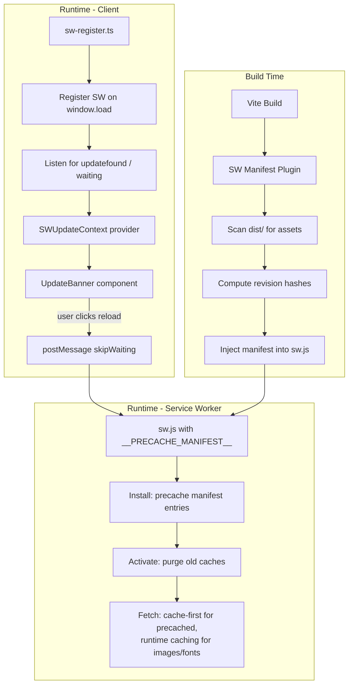

# Design Document: Offline Service Worker Strategy

## Overview

This design replaces the hand-maintained `public/sw.js` with a build-time generated service worker that precaches every app shell asset and provides a controlled update flow. The implementation uses a custom Vite plugin to produce a precache manifest at build time and injects it into the service worker output. On the client side, a lightweight registration module manages lifecycle events and surfaces an "update available" banner.

### Key Design Decisions

1. **Custom Vite plugin over vite-plugin-pwa / Workbox**: The project has simple caching needs (cache-first for static assets, offline fallback). A custom plugin keeps the dependency footprint minimal, avoids Workbox's 50 KB+ runtime, and gives full control over the cache versioning scheme. The plugin only needs to enumerate build output files and compute hashes.

2. **Single generated `sw.js` file**: Rather than importing a separate manifest module, the plugin injects the manifest array directly into the service worker source. This keeps the SW self-contained with no additional fetch needed at registration time.

3. **React context + hook for update state**: The update prompt state is managed via a lightweight context provider so any component can react to update availability without prop drilling. The banner itself is a standalone component rendered at the app root.

4. **No runtime routing library (e.g., Workbox routing)**: The fetch handler logic is straightforward enough to implement directly with a switch on URL patterns. This avoids adding a runtime dependency to the service worker.

## Architecture



## Components and Interfaces

### 1. Vite Plugin: `vite-plugin-sw-precache`

**Location:** `src/build/vite-plugin-sw-precache.ts`

```typescript
interface PrecacheEntry {
  url: string;       // Path relative to base, e.g. "/PWACharSheet/assets/index-BB2fNIh-.css"
  revision: string;  // Content hash (MD5 hex, 8 chars)
}

interface SWPrecachePluginOptions {
  swSrc: string;           // Path to SW source template (e.g. "src/sw.ts")
  swDest: string;          // Output filename in dist (e.g. "sw.js")
  include: RegExp[];       // File patterns to include
  exclude: RegExp[];       // File patterns to exclude
}

// Plugin export
export function swPrecachePlugin(options: SWPrecachePluginOptions): VitePlugin;
```

**Responsibilities:**
- Runs in the `closeBundle` hook (after all files are emitted)
- Walks the output directory recursively
- Filters files against `include`/`exclude` patterns
- Computes revision hashes: uses the filename hash if present (matches pattern `name-[hash].ext`), otherwise computes MD5 of file content
- Reads the SW source template, replaces `self.__PRECACHE_MANIFEST__` placeholder with the JSON array
- Writes the final `sw.js` to the dist directory

### 2. Service Worker: `src/sw.ts`

**Location:** `src/sw.ts` (compiled/injected at build time → `dist/sw.js`)

```typescript
// Injected by build plugin
declare const self: ServiceWorkerGlobalScope;
const PRECACHE_MANIFEST: PrecacheEntry[] = self.__PRECACHE_MANIFEST__ || [];
const CACHE_VERSION = 'v2';  // Bumped on breaking cache schema changes
const PRECACHE_NAME = `precache-${CACHE_VERSION}`;
const RUNTIME_IMAGE_CACHE = `images-${CACHE_VERSION}`;
const RUNTIME_FONT_CACHE = `fonts-${CACHE_VERSION}`;
const IMAGE_CACHE_LIMIT = 60;
```

**Event Handlers:**

| Event | Behavior |
|-------|----------|
| `install` | Open precache, diff against existing entries by revision, fetch only changed assets, call `event.waitUntil()` — does NOT call `skipWaiting()` |
| `activate` | Delete caches not matching current version, remove stale manifest entries from precache, call `clients.claim()` |
| `fetch` | Route by URL pattern: precached → cache-first, images → runtime cache-first (LRU 60), fonts → runtime cache-first, navigation → cached app shell / offline fallback |
| `message` | Listen for `{ type: 'SKIP_WAITING' }` → call `self.skipWaiting()` |

### 3. Service Worker Registration Module: `src/sw-register.ts`

```typescript
export interface SWUpdateState {
  updateAvailable: boolean;
  applying: boolean;
  error: string | null;
}

export type SWUpdateListener = (state: SWUpdateState) => void;

export function registerServiceWorker(baseUrl: string): {
  subscribe: (listener: SWUpdateListener) => () => void;
  applyUpdate: () => Promise<void>;
  dismiss: () => void;
};
```

**Responsibilities:**
- Registers SW after `window.load`
- Listens for `updatefound` → tracks installing worker's `statechange`
- Detects `registration.waiting` on initial check
- Notifies subscribers when a waiting worker is detected
- `applyUpdate()`: posts `SKIP_WAITING` message, starts 5s timeout, listens for `controllerchange` → reloads page
- `dismiss()`: hides prompt for current session

### 4. React Integration: `src/hooks/useSWUpdate.ts` + `src/components/shared/UpdateBanner.tsx`

```typescript
// Context
interface SWUpdateContextValue {
  updateAvailable: boolean;
  applying: boolean;
  error: string | null;
  applyUpdate: () => void;
  dismiss: () => void;
}

// Hook
export function useSWUpdate(): SWUpdateContextValue;
```

**UpdateBanner** renders a fixed-position, non-modal banner at the bottom of the viewport with:
- Message: "A new version is available"
- "Reload" button (primary action)
- "Dismiss" button (secondary action)
- Error state with retry affordance
- ARIA role="status" for accessibility

### 5. Build Integration

The existing `vite.config.ts` gains the plugin:

```typescript
import { swPrecachePlugin } from './src/build/vite-plugin-sw-precache';

export default defineConfig({
  plugins: [
    react(),
    swPrecachePlugin({
      swSrc: 'src/sw.ts',
      swDest: 'sw.js',
      include: [/\.html$/, /\.css$/, /\.js$/, /\.woff2?$/],
      exclude: [/\.map$/, /sw\.js$/],
    }),
  ],
  // ...
});
```

## Data Models

### Precache Manifest Entry

```typescript
interface PrecacheEntry {
  url: string;       // Absolute path from site root, e.g. "/PWACharSheet/assets/index-BB2fNIh-.css"
  revision: string;  // 8-character hex hash
}
```

### Cache Storage Layout

| Cache Name | Contents | Strategy |
|---|---|---|
| `precache-v2` | All manifest entries (HTML, CSS, JS, fonts) | Cache-first, updated on SW install |
| `images-v2` | Runtime-cached images (max 60) | Cache-first with LRU eviction |
| `fonts-v2` | Runtime-cached font files not in manifest | Cache-first, no eviction |

### Revision Hash Map (in SW memory)

During installation, the SW maintains an in-memory map of `url → revision` from the manifest to diff against previously cached entries. This map is derived from `PRECACHE_MANIFEST` at install time and does not persist beyond the install event.

### Message Protocol

```typescript
// Client → SW
interface SkipWaitingMessage {
  type: 'SKIP_WAITING';
}
```


## Correctness Properties

*A property is a characteristic or behavior that should hold true across all valid executions of a system — essentially, a formal statement about what the system should do. Properties serve as the bridge between human-readable specifications and machine-verifiable correctness guarantees.*

### Property 1: Manifest file type filtering

*For any* set of files in a build output directory, the generated precache manifest SHALL include exactly those files matching extensions `.html`, `.css`, `.js`, `.woff2`, or `.woff`, and SHALL exclude all `.map` files and files with other extensions.

**Validates: Requirements 1.1, 1.2, 1.6**

### Property 2: Manifest entry URL format

*For any* file included in the manifest and any configured base path, the entry's `url` field SHALL equal the base path concatenated with the file's relative path from the output directory, and the `revision` field SHALL be a non-empty hexadecimal string.

**Validates: Requirements 1.3**

### Property 3: Revision hash derivation

*For any* filename containing a content hash segment (matching pattern `name-[hexhash].ext`), the manifest entry SHALL use the embedded hash as its revision. *For any* filename without such a segment, the manifest entry SHALL use a hash computed from the file's content.

**Validates: Requirements 1.4**

### Property 4: Install caches all manifest entries

*For any* precache manifest where all network fetches succeed, after the install event completes, the precache cache SHALL contain a response for every URL in the manifest.

**Validates: Requirements 2.1**

### Property 5: Install fails on any non-ok fetch

*For any* precache manifest where at least one entry's fetch returns a non-ok status or throws a network error, the install event SHALL reject (preventing activation).

**Validates: Requirements 2.2**

### Property 6: Differential install fetches only changed entries

*For any* pair of old and new precache manifests, the install event SHALL fetch only those entries whose URL is new or whose revision differs from the previously cached version, and SHALL skip entries with matching revisions already in cache.

**Validates: Requirements 2.3**

### Property 7: Activation removes stale caches and entries

*For any* set of existing cache names and a current cache version identifier, activation SHALL delete all caches whose names do not end with the current version. Additionally, *for any* set of previously cached URLs and a current precache manifest, activation SHALL remove cached entries whose URLs are absent from the current manifest.

**Validates: Requirements 2.4, 6.1, 6.2**

### Property 8: Cache-first serving for precached URLs

*For any* fetch request whose URL matches an entry in the precache manifest and whose response exists in the precache cache, the service worker SHALL respond with the cached response without issuing a network request.

**Validates: Requirements 3.1**

### Property 9: Request routing by file extension

*For any* same-origin request URL with an image extension (svg, png, jpg, webp, ico), the service worker SHALL route it to the image cache-first strategy. *For any* same-origin request URL with a font extension (woff2, woff, ttf, otf), the service worker SHALL route it to the font cache-first strategy.

**Validates: Requirements 7.1, 7.2**

### Property 10: Image cache LRU eviction

*For any* sequence of image cache insertions, when the image cache contains 60 entries and a new entry is added, the least-recently-used entry SHALL be evicted before the new entry is stored, maintaining a maximum of 60 entries.

**Validates: Requirements 7.3**

### Property 11: Cross-origin request passthrough

*For any* request whose origin differs from the service worker's origin, the service worker SHALL not intercept, cache, or modify the request.

**Validates: Requirements 7.5**

## Error Handling

### Build-Time Errors

| Scenario | Behavior |
|---|---|
| SW source template not found | Plugin throws with descriptive error, Vite build fails |
| Output directory empty or missing | Plugin logs warning, generates empty manifest |
| File read error during hashing | Plugin throws, Vite build fails |

### Service Worker Install Errors

| Scenario | Behavior |
|---|---|
| Any manifest asset fetch fails (non-ok or network error) | Install event rejects → SW does not activate, previous version remains in control |
| Cache storage quota exceeded | Install event rejects (browser throws) → same fallback as above |

### Service Worker Activate Errors

| Scenario | Behavior |
|---|---|
| Cache deletion fails | Log error to console, resolve activate event successfully (Req 6.3) |
| `clients.claim()` fails | Log error, activation still succeeds |

### Service Worker Fetch Errors

| Scenario | Behavior |
|---|---|
| Precached asset missing from cache + network failure | Return 503 Service Unavailable (Req 3.3) |
| Runtime cached asset miss + network failure | Return 503 Service Unavailable (Req 7.4) |
| Navigation request offline, no cached app shell | Serve `offline.html` fallback (Req 3.5) |
| Navigation request offline, no fallback available | Return 503 Service Unavailable |

### Client-Side Registration Errors

| Scenario | Behavior |
|---|---|
| `navigator.serviceWorker` not available | Skip registration, app works without caching (Req 8.5) |
| `register()` rejects | Log to console, app continues normally (Req 8.5) |
| `skipWaiting` message sent but worker doesn't activate in 5s | Show error state in UpdateBanner, suggest manual reload (Req 4.6) |
| `postMessage` fails (worker terminated) | Catch error, show error state with manual reload suggestion |

## Testing Strategy

### Unit Tests (Vitest)

Unit tests cover specific examples, edge cases, and integration points:

- **Vite Plugin**: Test with mock file system — verify manifest output for known file sets, edge cases (empty dir, only .map files, mixed extensions)
- **SW Install Handler**: Mock `caches` and `fetch` APIs — test install with known manifests, verify failure on bad responses
- **SW Fetch Handler**: Mock `caches.match` — test routing decisions for known URLs (navigation, JS, images, fonts, cross-origin)
- **SW Message Handler**: Verify `skipWaiting()` called on correct message type
- **Registration Module**: Mock `navigator.serviceWorker` — test lifecycle event wiring, timeout behavior, error handling
- **UpdateBanner Component**: Render with React Testing Library — verify UI states (hidden, visible, error, applying)

### Property-Based Tests (fast-check)

Property-based tests verify universal correctness guarantees across randomized inputs. The project already uses `fast-check` (v4.8.0).

**Configuration:**
- Minimum 100 iterations per property
- Each test tagged with: `Feature: offline-sw-strategy, Property {N}: {title}`

**Properties to implement:**
1. Manifest file type filtering (generate random file listings)
2. Manifest entry URL format (generate random paths + base configs)
3. Revision hash derivation (generate filenames with/without hashes)
4. Install caches all entries (generate random manifests with mock fetch)
5. Install fails on non-ok fetch (generate manifests with random failures)
6. Differential install (generate old/new manifest pairs)
7. Activation stale cache removal (generate cache name sets + version)
8. Cache-first serving for precached URLs (generate URL sets)
9. Request routing by extension (generate URLs with various extensions)
10. Image cache LRU eviction (generate insertion sequences)
11. Cross-origin passthrough (generate URLs with different origins)

### Integration Tests

- **End-to-end build**: Run `vite build` with the plugin, verify `dist/sw.js` contains valid manifest
- **SW lifecycle in browser**: Use Playwright or manual testing to verify install → waiting → activate flow

### Test File Organization

```
src/
  build/
    __tests__/
      vite-plugin-sw-precache.test.ts         # Unit tests for plugin
      vite-plugin-sw-precache.property.test.ts # Properties 1-3
  sw/
    __tests__/
      sw-install.test.ts                       # Unit tests for install
      sw-install.property.test.ts              # Properties 4-6
      sw-fetch.test.ts                         # Unit tests for fetch
      sw-fetch.property.test.ts                # Properties 8-9, 11
      sw-activate.test.ts                      # Unit tests for activate
      sw-activate.property.test.ts             # Property 7
      sw-cache-lru.property.test.ts            # Property 10
  hooks/
    __tests__/
      useSWUpdate.test.ts                      # Unit tests for hook/registration
  components/shared/
    __tests__/
      UpdateBanner.test.tsx                    # Unit tests for banner component
```
