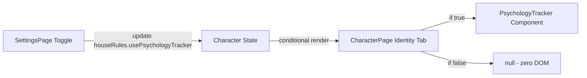

# Design Document: Optional Psychology Tracking

## Overview

This feature makes the Psychology Tracker (Archives of the Empire Vol. II) an opt-in mechanic controlled by a boolean flag in `houseRules`. It follows the established pattern used by Yenlui Balance and Grudge Book: a toggle in the Settings page's "Optional Mechanics" section controls visibility, and the component on the Identity tab renders zero DOM elements when disabled.

The implementation is minimal — a single boolean field addition, one new toggle in the Settings page, and a conditional wrapper around the existing `PsychologyTracker` component. No new components are created; the existing component and its data (`psychologyTraits`, `brokenTally`) remain untouched.

## Architecture

The feature touches three layers:

1. **Data Layer** — Add `usePsychologyTracker: boolean` to the `HouseRules` interface and `BLANK_CHARACTER` defaults.
2. **Settings UI** — Add a toggle row in the existing "Optional Mechanics" `CollapsibleSection` on `SettingsPage.tsx`.
3. **Identity Tab UI** — Wrap the existing `PsychologyTracker` rendering in `CharacterPage.tsx` with a conditional check on `houseRules.usePsychologyTracker`.



No new data flows, state managers, or storage mechanisms are introduced. The existing `update('houseRules.usePsychologyTracker', value)` pattern (same as Yenlui/Grudge toggles) propagates the change through React state, triggering an immediate re-render of the Identity tab.

## Components and Interfaces

### Modified: `HouseRules` interface (`src/types/character.ts`)

```typescript
export interface HouseRules {
  rangedDamageSBMode: RangedDamageSBMode;
  impaleCritsOnTens: boolean;
  min1Wound: boolean;
  advantageCap: number;
  useGroupAdvantage: boolean;
  useYenlui: boolean;
  useGrudgeBook: boolean;
  usePsychologyTracker: boolean;  // NEW
}
```

### Modified: `BLANK_CHARACTER` (`src/types/character.ts`)

```typescript
houseRules: {
  // ... existing fields ...
  usePsychologyTracker: false,  // NEW — defaults to OFF
}
```

### Modified: `SettingsPage.tsx`

Add a toggle row inside the existing "Optional Mechanics" `CollapsibleSection`, following the exact pattern of the Yenlui Balance and Grudge Book toggles:

```tsx
{/* Psychology Tracker */}
<div className={styles.ruleItem}>
  <div className={styles.toggleRow}>
    <div className={styles.toggleInfo}>
      <div className={styles.ruleLabel}>Psychology Tracker</div>
      <div className={styles.ruleDesc} style={!character.houseRules.usePsychologyTracker ? { color: 'var(--text-muted)' } : undefined}>
        Track phobias, animosity, hatred, and trauma (Archives Vol. II)
      </div>
    </div>
    <button
      type="button"
      onClick={() => update('houseRules.usePsychologyTracker', !character.houseRules.usePsychologyTracker)}
      className={character.houseRules.usePsychologyTracker ? styles.toggleBtnOn : styles.toggleBtnOff}
    >
      {character.houseRules.usePsychologyTracker ? 'ON' : 'OFF'}
    </button>
  </div>
</div>
```

### Modified: `CharacterPage.tsx` (Identity tab section)

Wrap the existing Psychology Tracker `CollapsibleSection` with the house rule guard:

```tsx
{/* Psychology Tracker (Archives Vol. II) — only when enabled */}
{character.houseRules.usePsychologyTracker && (
  <CollapsibleSection title="Psychology Tracker" storageKey="collapsible-psychology-tracker" defaultExpanded={true}>
    <PsychologyTracker
      psychologyTraits={character.psychologyTraits ?? []}
      brokenTally={character.brokenTally ?? 0}
      wpValue={character.chars.WP.i + character.chars.WP.a + character.chars.WP.b}
      onAddTrait={...}
      onRemoveTrait={...}
      onIncrementBrokenTally={...}
    />
  </CollapsibleSection>
)}
```

## Data Models

### Field Addition

| Field | Type | Default | Location |
|-------|------|---------|----------|
| `usePsychologyTracker` | `boolean` | `false` | `character.houseRules` |

### Migration / Backward Compatibility

No explicit migration is needed. The existing `character-manager.ts` load path uses:

```typescript
const merged = { ...structuredClone(BLANK_CHARACTER), ...parsed };
```

This spread merges `BLANK_CHARACTER` defaults first, then overlays the saved data. Since old characters lack `usePsychologyTracker`, the merged result picks up `false` from `BLANK_CHARACTER.houseRules`. The same deep-merge pattern in `export-import.ts` and `migration.ts` ensures imported/migrated characters also receive the default.

### Data Preservation

The toggle only controls **visibility**. It does not modify:
- `character.psychologyTraits` (array of `PsychologyTrait`)
- `character.brokenTally` (number)

These fields persist on the character object regardless of the toggle state.

## Correctness Properties

*A property is a characteristic or behavior that should hold true across all valid executions of a system — essentially, a formal statement about what the system should do. Properties serve as the bridge between human-readable specifications and machine-verifiable correctness guarantees.*

### Property 1: Missing field defaults to false on load

*For any* character data object that does not contain a `usePsychologyTracker` field in its `houseRules`, loading that character through the merge logic SHALL produce a character with `houseRules.usePsychologyTracker === false`.

**Validates: Requirements 1.3**

### Property 2: Toggle off/on round-trip preserves psychology data

*For any* character with arbitrary `psychologyTraits` (0 or more entries of any valid type/target/rating) and any `brokenTally` value ≥ 0, toggling `usePsychologyTracker` from `true` to `false` and back to `true` SHALL result in identical `psychologyTraits` array and `brokenTally` value.

**Validates: Requirements 4.1, 4.2**

## Error Handling

This feature has minimal error surface:

| Scenario | Handling |
|----------|----------|
| Character loaded without `usePsychologyTracker` field | Deep merge with `BLANK_CHARACTER` provides `false` default — no error |
| `psychologyTraits` is `undefined` on character | Existing `?? []` fallback in CharacterPage handles this gracefully |
| `brokenTally` is `undefined` on character | Existing `?? 0` fallback handles this gracefully |
| Toggle clicked rapidly | React state batching ensures consistent final state |

No new error states are introduced. The feature reuses the same defensive patterns (`?? []`, `?? 0`) already applied throughout the codebase.

## Testing Strategy

### Unit Tests (Example-Based)

| Test | Validates |
|------|-----------|
| `BLANK_CHARACTER.houseRules.usePsychologyTracker` equals `false` | Req 1.2 |
| Settings page renders "Psychology Tracker" toggle in Optional Mechanics section | Req 2.1, 2.2 |
| Toggle shows "OFF" when `usePsychologyTracker` is `false` | Req 2.3 |
| Toggle shows "ON" when `usePsychologyTracker` is `true` | Req 2.4 |
| Clicking toggle calls `update` with opposite boolean value | Req 2.5 |
| Identity tab renders PsychologyTracker when flag is `true` | Req 3.1 |
| Identity tab renders zero DOM elements for tracker when flag is `false` | Req 3.2 |
| Toggling on renders tracker without page refresh | Req 3.3 |
| Toggling off removes tracker without page refresh | Req 3.4 |

### Property-Based Tests

Property-based tests use `fast-check` (already in devDependencies) with Vitest. Each test runs a minimum of 100 iterations.

| Property | Tag | Validates |
|----------|-----|-----------|
| Missing field defaults to false | Feature: optional-psychology-tracking, Property 1: Missing field defaults to false on load | Req 1.3 |
| Toggle round-trip preserves data | Feature: optional-psychology-tracking, Property 2: Toggle off/on round-trip preserves psychology data | Req 4.1, 4.2 |

**Generator strategy for Property 1**: Generate random partial character objects with varying `houseRules` sub-objects that omit `usePsychologyTracker`. Pass through the merge logic.

**Generator strategy for Property 2**: Generate random arrays of `PsychologyTrait` objects (varying length 0–10, random types from the 4 valid values, random target strings, optional ratings) and random non-negative `brokenTally` integers. Verify data identity after toggle cycle.
