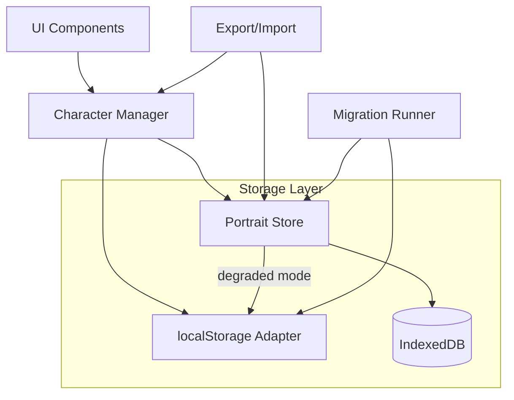
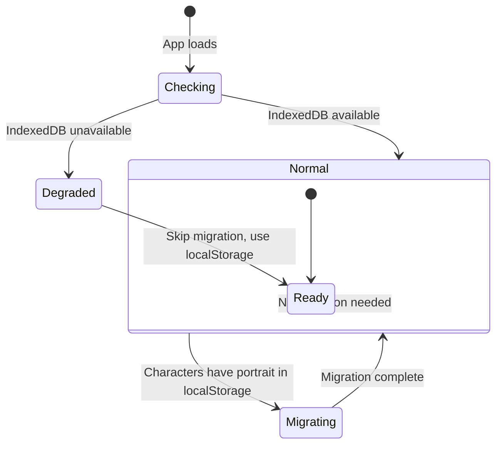

# Design Document: Portrait IndexedDB Migration

## Overview

This design migrates character portrait images from localStorage (where they are stored as base64-encoded strings inside each character's JSON) to IndexedDB (where they are stored as Blobs keyed by character ID). The migration happens transparently on first load after the update, and the system gracefully degrades when IndexedDB is unavailable.

The architecture introduces a new `PortraitStore` module that encapsulates all IndexedDB operations for portraits, and a `PortraitMigrationRunner` that handles the one-time data migration. The existing `character-manager.ts` and `export-import.ts` modules are updated to coordinate between localStorage and IndexedDB.

### Key Design Decisions

1. **Blob storage over base64 in IndexedDB** — Storing raw Blobs reduces storage footprint by ~33% compared to base64 and avoids encoding/decoding overhead during display.
2. **Object URL for rendering** — Portraits are surfaced to the UI via `URL.createObjectURL()`, which is fast and avoids holding large strings in memory.
3. **Graceful degradation** — When IndexedDB is unavailable, the system reverts to legacy localStorage behavior, ensuring the app never breaks.
4. **Non-blocking migration** — Migration runs at app startup before rendering character data, but individual character failures don't block other characters or the app.

## Architecture



### Module Responsibilities

| Module | Responsibility |
|--------|---------------|
| `portrait-store.ts` | IndexedDB database lifecycle, CRUD operations for portrait Blobs, degraded-mode detection and fallback |
| `portrait-migration.ts` | One-time migration of base64 portraits from localStorage to IndexedDB |
| `character-manager.ts` | Orchestrates character load/save, coordinates localStorage and PortraitStore |
| `export-import.ts` | Reads portrait from IndexedDB during export (as base64), routes imported portrait to IndexedDB |

## Components and Interfaces

### PortraitStore (`src/storage/portrait-store.ts`)

```typescript
/** Result of a portrait operation */
export type PortraitResult<T> =
  | { ok: true; value: T }
  | { ok: false; error: string };

export interface IPortraitStore {
  /** Initialize the store — opens IndexedDB, determines availability */
  init(): Promise<void>;

  /** Whether the store is operating in degraded (localStorage fallback) mode */
  isDegraded(): boolean;

  /** Save a portrait Blob for a character */
  savePortrait(characterId: string, blob: Blob): Promise<PortraitResult<void>>;

  /** Retrieve a portrait as an object URL, or null if none exists */
  getPortraitURL(characterId: string): Promise<PortraitResult<string | null>>;

  /** Retrieve the raw portrait Blob (used by export) */
  getPortraitBlob(characterId: string): Promise<PortraitResult<Blob | null>>;

  /** Delete a portrait for a character */
  deletePortrait(characterId: string): Promise<PortraitResult<void>>;

  /** Revoke a previously created object URL (cleanup) */
  revokeURL(url: string): void;
}
```

**Database schema:**
- Database name: `wfrp4e-portraits`
- Database version: `1`
- Object store name: `portraits`
- Key path: none (out-of-line keys using character ID as key)
- Value: `Blob` (the raw image data)

### PortraitMigrationRunner (`src/storage/portrait-migration.ts`)

```typescript
export interface MigrationResult {
  /** Number of characters successfully migrated */
  migrated: number;
  /** Number of characters skipped (no portrait or already migrated) */
  skipped: number;
  /** Character IDs that failed to migrate */
  failed: string[];
}

/** Run portrait migration. Safe to call multiple times (idempotent). */
export function runPortraitMigration(
  portraitStore: IPortraitStore
): Promise<MigrationResult>;
```

### Updated Character Manager Interface

```typescript
// New async functions added to character-manager.ts

/** Load a character with portrait merged from IndexedDB */
export async function loadCharacterWithPortrait(id: string): Promise<Character | null>;

/** Save a character, routing portrait to IndexedDB if present */
export async function saveCharacterWithPortrait(
  id: string,
  character: Character,
  portraitBlob?: Blob
): Promise<StorageWriteResult>;

/** Delete a character and its portrait */
export async function deleteCharacterFull(id: string): Promise<boolean>;
```

### Updated Export/Import Interface

```typescript
// New async export function
export async function exportToJSONWithPortrait(character: Character, characterId: string): Promise<string>;

// Updated import function
export async function importFromJSONWithPortrait(json: string): Promise<{
  success: boolean;
  character?: Character;
  error?: string;
}>;
```

### Helper: Base64 ↔ Blob Conversion (`src/storage/portrait-codec.ts`)

```typescript
/** Convert a base64 data-URL string to a Blob */
export function base64ToBlob(dataUrl: string): Blob | null;

/** Convert a Blob to a base64 data-URL string */
export function blobToBase64(blob: Blob): Promise<string>;

/** Validate that a string is a valid base64 image data-URL */
export function isValidPortraitDataUrl(value: string): boolean;
```

## Data Models

### IndexedDB Schema

```
Database: "wfrp4e-portraits" (version 1)
└── Object Store: "portraits"
    ├── Key: character UUID (string)
    └── Value: Blob (image/jpeg | image/png | image/webp, ≤2 MB)
```

### Character JSON in localStorage (post-migration)

The `portrait` field is removed from the character's localStorage JSON after migration. The `Character` TypeScript type retains the optional `portrait?: string` field for backward compatibility with exports/imports, but it is not persisted to localStorage.

### State Transitions



## Correctness Properties

*A property is a characteristic or behavior that should hold true across all valid executions of a system — essentially, a formal statement about what the system should do. Properties serve as the bridge between human-readable specifications and machine-verifiable correctness guarantees.*

### Property 1: Portrait storage round-trip

*For any* valid portrait Blob (JPEG, PNG, or WebP; ≤ 2 MB) and any character ID, storing the portrait via `savePortrait` and then retrieving it via `getPortraitBlob` should return a Blob with identical size and type to the original.

**Validates: Requirements 1.1, 1.2, 1.3**

### Property 2: Portrait save overwrites previous

*For any* character ID and any sequence of two or more valid portrait Blobs saved sequentially, `getPortraitBlob` should return only the last-saved Blob (matching its size and type), and no trace of previous portraits should remain.

**Validates: Requirements 1.2, 7.1**

### Property 3: Migration moves portrait from localStorage to IndexedDB

*For any* character whose localStorage JSON contains a non-empty `portrait` base64 string, after `runPortraitMigration` completes successfully, the portrait should be retrievable from the Portrait_Store as a Blob, and the character's localStorage JSON should no longer contain the `portrait` field.

**Validates: Requirements 2.1, 2.2, 3.3**

### Property 4: Migration is idempotent and selective

*For any* set of characters (some with portraits in localStorage, some without), running `runPortraitMigration` multiple times should produce the same final state as running it once: characters with portraits are migrated exactly once, characters without portraits are never modified, and no additional writes occur on subsequent runs.

**Validates: Requirements 2.3, 2.6, 2.7**

### Property 5: Migration fault isolation

*For any* set of N characters with portraits where one specific character's IndexedDB write fails, the remaining N-1 characters should still be successfully migrated, the failed character's localStorage JSON should remain unchanged with its portrait field intact, and the migration should report the failure.

**Validates: Requirements 2.4**

### Property 6: Character save excludes portrait from localStorage

*For any* character object that has a `portrait` field with a non-empty value, when saved via the Character_Manager, the JSON written to localStorage should not contain base64 image data in the `portrait` field.

**Validates: Requirements 3.1, 3.2**

### Property 7: Character load merges portrait from IndexedDB

*For any* character with a portrait stored in the Portrait_Store, loading the character via `loadCharacterWithPortrait` should return a character object whose portrait field contains a non-empty object URL string (starting with "blob:").

**Validates: Requirements 3.4**

### Property 8: Character deletion removes both stores

*For any* character that has both a localStorage entry and a portrait in IndexedDB, deleting via `deleteCharacterFull` should result in both the localStorage key being removed and the portrait being absent from IndexedDB.

**Validates: Requirements 1.5, 3.6**

### Property 9: Degraded mode stores portrait in localStorage

*For any* portrait Blob and character ID, when the Portrait_Store is in degraded mode, saving a portrait should persist the portrait as a base64 string within the Character_JSON in localStorage rather than in IndexedDB.

**Validates: Requirements 4.2**

### Property 10: Export round-trip preserves portrait data

*For any* character with a portrait stored in IndexedDB, exporting via `exportToJSONWithPortrait` and then importing via `importFromJSONWithPortrait` should result in the same portrait being retrievable from the Portrait_Store (matching size and type of the original Blob).

**Validates: Requirements 5.1, 6.1**

### Property 11: Import routes portrait to IndexedDB and excludes from localStorage

*For any* valid character JSON string containing a non-empty base64 portrait field, importing via `importFromJSONWithPortrait` should result in the portrait being stored in the Portrait_Store and the Character_JSON in localStorage not containing the portrait data.

**Validates: Requirements 6.1**

### Property 12: Portrait update/removal does not write to localStorage

*For any* portrait save or delete operation on the Portrait_Store, the `localStorage.setItem` function should not be invoked (the character's localStorage entry and lastModified timestamp remain unchanged).

**Validates: Requirements 7.3**

## Error Handling

| Scenario | Behavior |
|----------|----------|
| IndexedDB unavailable at init | Portrait_Store enters degraded mode; logs single console warning; all portrait ops fall back to localStorage |
| IndexedDB write fails (quota, transaction error) | `savePortrait` returns `{ ok: false, error: '...' }`; caller surfaces error to UI |
| IndexedDB read fails | `getPortraitURL` returns `{ ok: false, error: '...' }`; character loads with empty portrait |
| Migration write fails for one character | That character is skipped; others continue; failure is recorded in `MigrationResult.failed` |
| Invalid base64 during import | Portrait is discarded; import continues without portrait; no Portrait_Store entry created |
| Object URL leak prevention | `revokeURL` is called when component unmounts or portrait changes; tracked via React effect cleanup |
| Portrait removal for non-existent entry | Treated as successful no-op; no error surfaced |

### Error Surface Strategy

- **User-visible errors**: Only portrait save/update failures show a toast notification ("Portrait could not be saved").
- **Silent failures**: Migration failures for individual characters are logged to console but don't interrupt the user.
- **Degraded mode**: A one-time console warning is logged. No user-facing indicator (the app works the same, just without IndexedDB optimization).

## Testing Strategy

### Property-Based Tests (fast-check)

The project already uses `fast-check` (v4.8.0) with `vitest`. Property-based tests will be used to verify the correctness properties defined above. Each property test will:
- Run a minimum of 100 iterations
- Use `fake-indexeddb` to provide a real IndexedDB implementation in the jsdom test environment
- Be tagged with a comment referencing the design property
- Tag format: `Feature: portrait-indexeddb-migration, Property {number}: {title}`

**Testing library**: `fast-check` (already installed)  
**IndexedDB mock**: `fake-indexeddb` (to be added as dev dependency)

### Unit Tests (example-based)

Unit tests cover specific scenarios and edge cases not well-suited to property-based testing:

- Portrait retrieval returns null for non-existent character (Req 1.4)
- IndexedDB failure returns error indication without throwing (Req 1.6)
- Database uses single object store (Req 1.7)
- IndexedDB entirely unavailable skips migration (Req 2.5)
- Portrait_Store failure during load returns character with empty portrait (Req 3.5)
- IndexedDB availability detection on init (Req 4.1)
- Prior-migrated character with unavailable IndexedDB loads with empty portrait (Req 4.4)
- Degraded mode logs single warning per session (Req 4.5)
- Export with no portrait sets field to empty string (Req 5.2)
- Export format backward compatibility (Req 5.4)
- Export failure falls back to empty portrait (Req 5.5)
- Import with empty/null/undefined portrait creates no entry (Req 6.2)
- Import when IndexedDB unavailable retains portrait in localStorage (Req 6.3)
- Import without portrait field (Req 6.4)
- Import with invalid base64 discards portrait (Req 6.5)
- Portrait write failure shows error, leaves previous unchanged (Req 7.4)
- Removal of non-existent portrait is successful no-op (Req 7.5)

### Integration Tests

- Full app startup flow: migration runs, characters load with portraits from IndexedDB
- Export → Import round-trip across "devices" (different IndexedDB instances)
- Degraded mode end-to-end: IndexedDB unavailable, full character lifecycle works via localStorage

### Test File Organization

```
src/storage/__tests__/
  portrait-store.test.ts              # Unit tests for PortraitStore
  portrait-store.property.test.ts     # Property tests for Properties 1, 2, 9
  portrait-migration.test.ts          # Unit tests for migration
  portrait-migration.property.test.ts # Property tests for Properties 3, 4, 5
  portrait-codec.test.ts              # Unit tests for base64 ↔ Blob conversion
  portrait-codec.property.test.ts     # Property test for round-trip (used by Property 10)
  character-manager.portrait.test.ts  # Unit + property tests for Properties 6, 7, 8, 12
  export-import.portrait.test.ts      # Unit + property tests for Properties 10, 11
```
