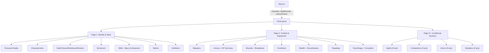

# Design Document: Print Layout Redesign

## Overview

This design refactors the existing `PrintLayout` component to fully meet the WFRP 4e character sheet print requirements. The redesign focuses on:

1. **Conditional section rendering** — sections like Spells, Mutations, Companions, and Ammo only render when the character has relevant data
2. **Improved page-break strategy** — CSS-driven page breaks that keep logical sections together and prevent mid-table splits
3. **Complete combat reference** — conditions display, wound breakdown, and full weapon/armour details
4. **Skills calculation display** — showing linked characteristic + advances = total for every skill
5. **Enhanced WFRP theming** — ornamental borders, Cinzel headers, parchment tones, and decorative dividers

The existing component already handles most essential content rendering. This redesign extends it with missing sections (conditions, companions, ammo, mutations detail), improves the page break logic, and adds thematic decorations.

## Architecture

### Component Structure

The `PrintLayout` remains a single component file with internal helper functions for section rendering. This avoids the complexity of a multi-component tree for a purely presentational, non-interactive output. The component is structured as:

```
PrintLayout.tsx
├── PrintLayout (main export)
│   ├── Page 1: Identity + Stats + Skills + Talents
│   ├── Page 2: Combat (Weapons, Armour, Wounds, Conditions)
│   └── Page 3+ (conditional): Spells, Companions, Ammo, Mutations
└── Helper functions (renderSkillsSection, renderConditionalSections, etc.)
```

### Data Flow



### Design Decisions

1. **Single component, no sub-components**: The print layout is purely presentational with no state or interaction. Splitting into sub-components adds import/export overhead without benefit for a hidden DOM tree that renders once.

2. **Internal render helpers**: Functions like `renderConditions()`, `renderCompanions()`, `renderAmmo()` keep the JSX readable while avoiding prop-drilling overhead.

3. **Props unchanged**: The existing `PrintLayoutProps` interface (`character`, `totalWounds`, `armourPoints`) already provides all needed data. No new props are required since companion, spell, ammo, condition, and mutation data all live on the `Character` object.

4. **CSS Module for print styles**: Continue using `PrintLayout.module.css` with `@media print` rules in `App.css` for visibility toggling.

## Components and Interfaces

### PrintLayout Component

```typescript
interface PrintLayoutProps {
  character: Character;
  totalWounds: number;
  armourPoints: ArmourPoints;
}
```

No interface changes needed. All data is accessed through the existing `Character` type.

### Internal Render Helpers

```typescript
// Renders a single skill row with char value + advances = total
function renderSkillRow(skill: Skill, chars: Record<CharacteristicKey, CharacteristicValue>): JSX.Element

// Renders conditions section (only if conditions exist with level > 0)
function renderConditions(conditions: Condition[]): JSX.Element | null

// Renders companion stat blocks (only if companions array is non-empty)
function renderCompanions(companions: Companion[]): JSX.Element | null

// Renders ammo section (only if ammo array is non-empty)
function renderAmmo(ammo: AmmoItem[]): JSX.Element | null

// Renders mutations section (only if mutations array is non-empty)
function renderMutations(mutations: MutationEntry[]): JSX.Element | null

// Renders spells section (only if spells array is non-empty)
function renderSpells(spells: SpellItem[]): JSX.Element | null
```

### Skill Total Calculation

The skill total is calculated inline as:

```typescript
const charValue = chars[skill.c as CharacteristicKey];
const total = charValue ? (charValue.i + charValue.a + charValue.b) + skill.a : skill.a;
```

This gives the full characteristic value (initial + advances + bonus) plus skill advances, matching WFRP 4e rules where skill total = characteristic + advances.

Note: The existing implementation uses `getBonus()` (tens digit only) for the skill total column. The redesign corrects this to use the full characteristic value, since WFRP 4e skill tests roll against the full characteristic + advances value, not the bonus.

### Conditional Section Rendering Logic

```typescript
// Sections render only when data is present
const hasSpells = character.spells.length > 0;
const hasCompanions = character.companions.length > 0;
const hasAmmo = character.ammo.length > 0;
const hasMutations = character.mutations.length > 0;
const hasConditions = character.conditions.some(c => c.level > 0);
```

## Data Models

### Existing Types Used (no changes)

| Type | Source | Usage in Print Layout |
|------|--------|----------------------|
| `Character` | `src/types/character.ts` | Top-level character data |
| `ArmourPoints` | `src/types/character.ts` | Pre-calculated AP per location |
| `CharacteristicKey` | `src/types/character.ts` | Characteristic abbreviations |
| `CharacteristicValue` | `src/types/character.ts` | `{ i, a, b }` for each characteristic |
| `Skill` | `src/types/character.ts` | `{ n, c, a }` — name, char, advances |
| `Talent` | `src/types/character.ts` | `{ n, lvl, desc }` |
| `WeaponItem` | `src/types/character.ts` | Weapon details |
| `ArmourItem` | `src/types/character.ts` | Armour piece details |
| `SpellItem` | `src/types/character.ts` | Spell details |
| `AmmoItem` | `src/types/character.ts` | Ammo with name, quantity, max, enc, qualities |
| `Companion` | `src/types/character.ts` | Full companion stat block |
| `MutationEntry` | `src/types/character.ts` | `{ id, type, name, effect }` |
| `Condition` | `src/types/character.ts` | `{ name, level, duration?, source? }` |
| `Trapping` | `src/types/character.ts` | `{ name, enc, quantity }` |

### Calculation Dependencies

| Function | Source | Purpose |
|----------|--------|---------|
| `getBonus(value)` | `src/logic/calculators.ts` | Tens digit of characteristic (for wound breakdown) |
| `calculateMaxEncumbrance(chars, strongBackLevel)` | `src/logic/calculators.ts` | Max encumbrance = SB + TB + Strong Back |

### CSS Page-Break Strategy

The CSS uses the following approach for clean printing:

```css
/* Force page break after page 1 */
.pageBreak {
  page-break-after: always;
}

/* Prevent section boxes from splitting across pages */
.sectionBox {
  break-inside: avoid;
  page-break-inside: avoid;
}

/* Prevent table rows from splitting */
.tbl tr {
  break-inside: avoid;
  page-break-inside: avoid;
}

/* Page 2+ sections that may overflow use avoid-break */
.pageSheet {
  /* No forced break — content flows naturally */
}

/* Conditional page 3 starts on new page when content overflows */
.conditionalPage {
  page-break-before: auto;
  break-before: auto;
}
```

The strategy:
1. **Page 1** always breaks after — it contains identity, characteristics, skills, and talents
2. **Page 2** contains combat and equipment data; sections use `break-inside: avoid` so they won't split
3. **Overflow pages** (3+) form automatically when conditional content (spells, companions) pushes beyond page 2. The browser's print engine handles pagination, with `break-inside: avoid` on each section box ensuring clean splits.

### A4 Sizing

```css
@page {
  size: A4;
  margin: 1cm;
}

.page {
  width: 190mm; /* A4 width minus 2×1cm margins */
  font-size: 9px;
}
```

## Correctness Properties

*A property is a characteristic or behavior that should hold true across all valid executions of a system — essentially, a formal statement about what the system should do. Properties serve as the bridge between human-readable specifications and machine-verifiable correctness guarantees.*

### Property 1: Conditional sections are omitted when data is empty

*For any* character where `spells.length === 0`, the rendered output SHALL NOT contain a Spells section; where `mutations.length === 0`, no Mutations section; where `companions.length === 0`, no Companions section; and where `ammo.length === 0`, no Ammo section.

**Validates: Requirements 1.3, 1.4, 8.2**

### Property 2: Non-essential content is excluded from print output

*For any* character (regardless of what non-essential data is populated), the rendered PrintLayout output SHALL NOT contain advancement log entries, session history, house rules settings, XP totals, combat state metadata, estate ledger entries, endeavour records, or character portrait images.

**Validates: Requirements 1.2**

### Property 3: Skill total calculation correctness

*For any* skill with a valid linked characteristic, the displayed skill total SHALL equal the characteristic's current value (initial + advances + bonus) plus the skill's advance value. Formally: `total = (chars[skill.c].i + chars[skill.c].a + chars[skill.c].b) + skill.a`.

**Validates: Requirements 5.3, 5.4**

### Property 4: Wound breakdown calculation correctness

*For any* character, the wound breakdown SHALL display SB equal to `floor(S_total / 10)`, TB×2 equal to `2 * floor(T_total / 10)`, WPB equal to `floor(WP_total / 10)`, and Hardy equal to `hardyLevel * floor(T_total / 10)`, where each `X_total = chars[X].i + chars[X].a + chars[X].b`.

**Validates: Requirements 6.4, 6.5**

### Property 5: Weapon fields completeness

*For any* weapon in a character's weapons array, the rendered weapon row SHALL contain the weapon's name, group, encumbrance, range/reach, damage value, and qualities.

**Validates: Requirements 6.1**

### Property 6: Spell fields completeness when present

*For any* character with spells (spells.length > 0), the rendered Spells section SHALL display each spell with its name, casting number, range, target, duration, and effect.

**Validates: Requirements 8.1**

### Property 7: Companion stat block completeness

*For any* character with companions (companions.length > 0), the rendered output SHALL display each companion's name, species, characteristics (M, WS, BS, S, T, I, Ag, Dex, Int, WP, Fel), wounds, traits, and trained skills.

**Validates: Requirements 1.5**

### Property 8: No interactive elements in print output

*For any* character, the rendered PrintLayout output SHALL contain zero interactive HTML elements (no `<button>`, `<input>`, `<select>`, `<textarea>`, or elements with `contenteditable`).

**Validates: Requirements 9.3**

## Error Handling

The PrintLayout component is a pure presentational component with no user interaction, network calls, or side effects. Error scenarios are minimal:

| Scenario | Handling |
|----------|----------|
| Missing characteristic key on a skill | Default to 0 via optional chaining: `chars[skill.c as CharacteristicKey]` returns undefined → total defaults to `skill.a` only |
| Empty arrays (weapons, armour, trappings) | Render section with empty table body — shows column headers but no rows |
| Undefined optional fields (e.g., `weapon.rangeReach`) | Use fallback: `w.rangeReach \|\| w.maxR \|\| ''` |
| `NaN` from malformed enc values | `parseFloat(enc) \|\| 0` ensures numeric safety |
| Companion with missing trained skills | Render `trained.join(', ')` — empty array produces empty string |
| Character with no name | Display "Unnamed Character" as fallback |

No error boundaries are needed within PrintLayout since it renders inside the app-level ErrorBoundary and produces no side effects.

## Testing Strategy

### Unit Tests (Example-Based)

Unit tests verify specific rendering scenarios with concrete character data:

1. **Page structure**: Verify page 1 contains identity/stats/skills/talents, page 2 contains combat/equipment
2. **Section ordering**: Verify character name appears first on page 1
3. **CSS class application**: Verify page-break class on page 1 container
4. **Section headers**: Verify each section box has a labeled header element
5. **AP summary table**: Verify all 7 hit locations with dice roll ranges
6. **Empty state rendering**: Character with no spells/companions/ammo renders without those sections
7. **Skill display structure**: Basic and advanced skills in separate labeled sections

### Property-Based Tests

Property-based tests verify universal properties across randomized character data using `fast-check`.

Each property test runs a minimum of 100 iterations with generated Character data.

**Library**: `fast-check` (already suitable for TypeScript/Vitest environment)

**Tag format**: `Feature: print-layout-redesign, Property {N}: {title}`

Properties to implement:
- Property 1: Conditional section omission
- Property 2: Non-essential content exclusion
- Property 3: Skill total calculation correctness
- Property 4: Wound breakdown calculation correctness
- Property 5: Weapon fields completeness
- Property 6: Spell fields completeness
- Property 7: Companion stat block completeness
- Property 8: No interactive elements

**Generator strategy**: Build an `Arbitrary<Character>` generator that produces valid Character objects with randomized:
- Characteristic values (i, a, b each 0-99)
- Skill arrays with random advances (0-50) and valid linked characteristics
- Weapon/armour/spell/ammo/companion arrays of random length (0-5)
- Condition arrays with random levels (0-3)
- Mutation arrays of random length (0-3)

**Testing approach**: Render `PrintLayout` with `@testing-library/react`'s `render()`, then query the resulting DOM for structural assertions. Since this is a pure rendering component, no mocking of external services is needed.

### Integration / Visual Tests

- Manual print preview verification for A4 sizing, page breaks, and visual theming
- Browser print-to-PDF for checking no content clipping
- Verify `@media print` rules show/hide correct elements

