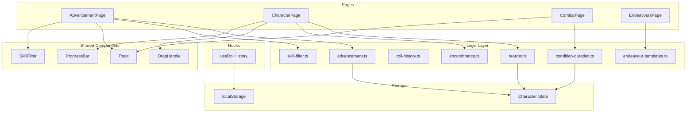

# Design Document: Quality-of-Life Improvements

## Overview

This design covers eight independent quality-of-life enhancements to the WFRP4e Character Sheet PWA. Each feature addresses a specific user friction point identified through usage patterns. The improvements are architecturally independent — they share existing infrastructure (Toast, localStorage, character state) but can be implemented and tested in isolation.

The features span multiple application pages (Advancement, Character, Combat, Endeavours) and touch the logic layer, hooks, shared components, and page components. The design follows existing conventions: pure logic functions in `src/logic/`, React hooks in `src/hooks/`, shared UI in `src/components/shared/`, and page-level composition in `src/components/pages/`.

## Architecture



### Design Decisions

1. **Pure logic extraction**: All business logic (XP calculations, filtering, reordering, condition decrement, encumbrance classification, template data) lives in pure functions in `src/logic/`. This enables property-based testing without React rendering overhead.

2. **Reuse existing Toast**: The app already has a `Toast` component with `message`, `duration`, and `action` props. XP feedback reuses this with `duration=3000`.

3. **Existing `useRollHistory` already implements persistence**: The hook already persists to localStorage with a 50-entry cap. No new logic is needed — the requirement is already met by the current implementation.

4. **Generic reorder utility**: A single `reorderArray(arr, fromIndex, toIndex)` function serves both weapons and trappings lists, avoiding duplication.

5. **Condition duration decrement as pure function**: The decrement logic is a pure transform on the conditions array, making it easy to property-test independently of React state.

6. **Encumbrance classification as pure function**: A `getEncumbranceLevel(current, max)` function returns a severity enum, decoupled from rendering.

7. **Endeavour templates as static data + lookup**: Template definitions live in a data file, with a lookup function that takes `(templateType, statusTier)` and returns populated fields.

## Components and Interfaces

### New Logic Functions

#### `src/logic/advancement.ts` (additions)

```typescript
/** Format the insufficient-XP feedback message. */
export function formatXpFeedback(cost: number, available: number): string;

/** Calculate cumulative cost from current advances to next tier boundary. */
export function calculateTierBoundaryCost(
  type: 'skill' | 'characteristic',
  currentAdvances: number,
  inCareer: boolean
): { targetAdvances: number; totalCost: number };

/** Apply bulk advancement to a character, returning updated character and log entries. */
export function applyBulkAdvancement(
  character: Character,
  skillIndex: number,
  isBasic: boolean,
  inCareer: boolean
): { character: Character; entries: AdvancementEntry[] } | { error: string; cost: number; available: number };
```

#### `src/logic/reorder.ts` (new file)

```typescript
/** Move an element from one index to another, returning a new array. */
export function reorderArray<T>(arr: T[], fromIndex: number, toIndex: number): T[];
```

#### `src/logic/condition-duration.ts` (new file)

```typescript
export interface DecrementResult {
  conditions: Condition[];
  expiredNames: string[];  // conditions whose duration hit 0
}

/** Decrement duration of all conditions with positive integer durations. */
export function decrementConditionDurations(conditions: Condition[]): DecrementResult;
```

#### `src/logic/encumbrance.ts` (new file)

```typescript
export type EncumbranceLevel = 'neutral' | 'warning' | 'danger' | 'critical';

/** Classify encumbrance severity based on current/max ratio. */
export function getEncumbranceLevel(current: number, max: number): EncumbranceLevel;

/** Format encumbrance display string. */
export function formatEncumbrance(current: number, max: number): string;
```

#### `src/logic/endeavour-templates.ts` (new file)

```typescript
export interface EndeavourTemplate {
  type: string;
  notes: string;
  cost: Record<string, string> | null;  // keyed by tier: "Brass 1", "Silver 2", etc.
}

export const ENDEAVOUR_TEMPLATES: EndeavourTemplate[];

/** Look up template and populate fields based on status tier. */
export function applyEndeavourTemplate(
  templateType: string,
  statusTier: string | undefined
): { type: string; notes: string; cost: string; warning?: string };
```

### New/Modified Shared Components

#### `src/components/shared/ProgressBar.tsx` (new)

```typescript
export interface ProgressBarProps {
  current: number;
  max: number;
  level: EncumbranceLevel;
  label: string;
  ariaLabel: string;
}
```

#### `src/components/shared/DragHandle.tsx` (new)

```typescript
export interface DragHandleProps {
  onMoveUp: () => void;
  onMoveDown: () => void;
  isFirst: boolean;
  isLast: boolean;
  itemLabel: string;  // for aria-label
}
```

### Modified Pages

- **AdvancementPage**: Add skill search input (reusing existing `SkillFilter` component which already exists), add "Advance to next tier" button per skill row, add XP insufficient Toast feedback with shake animation.
- **CharacterPage** (Gear tab): Add `ProgressBar` for encumbrance, add `DragHandle` to weapon/trapping rows.
- **CombatPage**: Call `decrementConditionDurations()` when round counter advances, show removal prompt for expired conditions.
- **EndeavoursPage**: Add template picker in the entry creation flow, call `applyEndeavourTemplate()` to populate fields.

## Data Models

### Existing Models (no changes needed)

The `Character` interface already supports all required data:
- `xpCur: number` — available XP for advancement feedback
- `conditions: Condition[]` — with optional `duration?: string` field
- `weapons: WeaponItem[]` — ordered array for drag-reorder
- `trappings: Trapping[]` — ordered array for drag-reorder
- `status: string` — status tier for endeavour cost lookup
- `endeavours: DowntimePeriod[]` — with `EndeavourEntry` containing type, notes, cost
- `combatState.currentRound: number` — round counter for condition decrement

### Condition Duration Field

The existing `Condition.duration` is typed as `string | undefined`. The decrement logic will parse it as an integer when present. Non-numeric or absent durations are left unchanged.

```typescript
// Existing type - no change
export interface Condition {
  name: string;
  level: number;
  duration?: string;   // parsed as integer for auto-decrement
  source?: string;
}
```

### Endeavour Template Static Data

```typescript
// Template definitions (subset shown)
export const ENDEAVOUR_TEMPLATES: EndeavourTemplate[] = [
  {
    type: 'Training',
    notes: 'Spend time training a skill or learning from a tutor. Advance one skill by 1 if you have a suitable trainer.',
    cost: { 'Brass': '—', 'Silver': '—', 'Gold': '—' },  // Training has no standard monetary cost
  },
  {
    type: 'Income',
    notes: 'Work during downtime to earn money based on your career and status tier.',
    cost: null,  // Income generates money, no cost
  },
  {
    type: 'Research',
    notes: 'Spend time in a library or with scholars. Make an Intelligence test to gain information on a topic.',
    cost: { 'Brass': '—', 'Silver': '1d10 s', 'Gold': '1 GC' },
  },
  {
    type: 'Crafting',
    notes: 'Create an item using a Trade skill. Duration and cost depend on item complexity.',
    cost: { 'Brass': 'Varies', 'Silver': 'Varies', 'Gold': 'Varies' },
  },
  {
    type: 'Healing',
    notes: 'Recover from injuries or seek medical treatment. Heal 1 wound per day of rest, or seek a physician.',
    cost: { 'Brass': '—', 'Silver': '6d', 'Gold': '1 GC' },
  },
  {
    type: 'Socialising',
    notes: 'Spend time making contacts, gathering rumours, or building relationships in your social circle.',
    cost: { 'Brass': '1d10 d', 'Silver': '1d10 s', 'Gold': '1d10 GC' },
  },
];
```

## Correctness Properties

*A property is a characteristic or behavior that should hold true across all valid executions of a system — essentially, a formal statement about what the system should do. Properties serve as the bridge between human-readable specifications and machine-verifiable correctness guarantees.*

### Property 1: XP Feedback Decision Correctness

*For any* advancement attempt with a given cost and available XP: if `available < cost`, the feedback message SHALL contain both the cost and available values as substrings; if `available >= cost`, no feedback message SHALL be produced.

**Validates: Requirements 1.1, 1.3**

### Property 2: Skill Filter AND Composition

*For any* skill array, search text, and career-only flag combination, the filter function SHALL return exactly the skills whose names contain the search text (case-insensitive) AND (if career-only is enabled) are marked as in-career. No matching skill SHALL be omitted, and no non-matching skill SHALL be included.

**Validates: Requirements 2.2, 2.4**

### Property 3: Roll History Persistence Round-Trip

*For any* sequence of roll history entries (up to 50), persisting to localStorage and then loading SHALL return an equivalent ordered list of entries.

**Validates: Requirements 3.1, 3.3**

### Property 4: Roll History Maximum Length Invariant

*For any* sequence of roll additions, the roll history length SHALL never exceed 50 entries, and when the limit is reached, the oldest entries SHALL be the ones discarded.

**Validates: Requirements 3.2**

### Property 5: Array Reorder Preserves Elements

*For any* array of items and valid (fromIndex, toIndex) pair, reordering SHALL produce a permutation containing exactly the same elements, with the moved item at the target position and all other elements maintaining their relative order.

**Validates: Requirements 4.3, 4.4**

### Property 6: Bulk Advancement Cumulative Cost Equals Sum of Individual Costs

*For any* skill type, current advance count (0–24), and career status, the cumulative cost to the next tier boundary SHALL equal the sum of calling `getAdvancementCost()` for each individual advance in that range.

**Validates: Requirements 5.2**

### Property 7: Bulk Advancement Atomicity

*For any* bulk advancement where available XP >= cumulative cost, after application: the skill's advance count SHALL equal the next tier boundary, the character's XP SHALL be reduced by exactly the cumulative cost, and exactly (boundary - startAdvances) log entries SHALL be created.

**Validates: Requirements 5.3, 5.5**

### Property 8: Condition Duration Decrement Correctness

*For any* array of conditions, round advancement SHALL decrement the parsed integer duration by 1 for each condition with a positive integer duration, SHALL leave conditions with no duration or non-positive duration unchanged, and SHALL report exactly the condition names whose duration reached 0.

**Validates: Requirements 6.1, 6.5, 6.6**

### Property 9: Encumbrance Level Classification

*For any* non-negative current and positive maximum encumbrance values, the classification function SHALL return: "neutral" when ratio < 0.5, "warning" when 0.5 ≤ ratio < 0.75, "danger" when 0.75 ≤ ratio < 1.0, and "critical" when ratio ≥ 1.0.

**Validates: Requirements 7.2, 7.3, 7.4, 7.5**

### Property 10: Encumbrance Display Contains Numeric Values

*For any* non-negative current and positive maximum encumbrance values, the formatted display string SHALL contain both the current and maximum values as substrings.

**Validates: Requirements 7.7**

### Property 11: Endeavour Template Notes Non-Empty

*For any* valid template type from the defined set (Training, Income, Research, Crafting, Healing, Socialising), applying the template SHALL produce a non-empty notes string.

**Validates: Requirements 8.3**

### Property 12: Endeavour Template Cost Lookup

*For any* valid template type that has an associated cost and any valid status tier string, applying the template SHALL populate the cost field with a non-empty string. When no status tier is provided, the cost field SHALL be empty.

**Validates: Requirements 8.4, 8.6**

## Error Handling

| Scenario | Handling |
|----------|----------|
| localStorage unavailable (roll history) | Graceful fallback to in-memory mode; no user-visible error |
| localStorage quota exceeded | Silent catch; continue with in-memory state |
| Invalid drag indices (out of bounds) | Return original array unchanged |
| Condition duration is non-numeric string | Treat as "no duration" — skip decrement |
| Condition duration is 0 or negative | Skip decrement (only positive integers decremented) |
| Status tier not set for endeavour cost | Leave cost empty, display advisory note |
| Bulk advancement with XP < cost | Display Toast with cost/available info, no state change |
| Empty skill search (cleared) | Show full list (respecting career toggle) |

## Testing Strategy

### Property-Based Tests (fast-check, minimum 100 iterations each)

The project already uses `fast-check` (v4.8.0) with `vitest` (v4.1.2). Each property from the Correctness Properties section will be implemented as a single property-based test.

**Test files:**
- `src/logic/__tests__/advancement.xp-feedback.property.test.ts` — Properties 1, 6, 7
- `src/logic/__tests__/skill-filter.property.test.ts` — Property 2
- `src/hooks/__tests__/useRollHistory.property.test.ts` — Properties 3, 4
- `src/logic/__tests__/reorder.property.test.ts` — Property 5
- `src/logic/__tests__/condition-duration.property.test.ts` — Property 8
- `src/logic/__tests__/encumbrance.property.test.ts` — Properties 9, 10
- `src/logic/__tests__/endeavour-templates.property.test.ts` — Properties 11, 12

**Configuration:**
- Each property test runs minimum 100 iterations
- Each test tagged: `// Feature: quality-of-life-improvements, Property N: <title>`

### Unit Tests (example-based)

- Toast auto-dismiss timing (3 seconds)
- Shake animation CSS class application
- Search input placeholder and aria-label presence
- Drag handle rendering per item
- Keyboard reorder accessibility
- Condition removal prompt display/confirm/decline
- Template selector listing all 6 types
- Template fields remain editable after population
- Encumbrance progress bar real-time updates
- Roll history clear removes all entries

### Integration Tests

- AdvancementPage: full flow of attempting advance with insufficient XP
- CharacterPage Gear tab: drag-reorder weapon, verify persisted order
- CombatPage: round advance → condition decrement → removal prompt flow
- EndeavoursPage: select template → verify populated fields → edit fields
