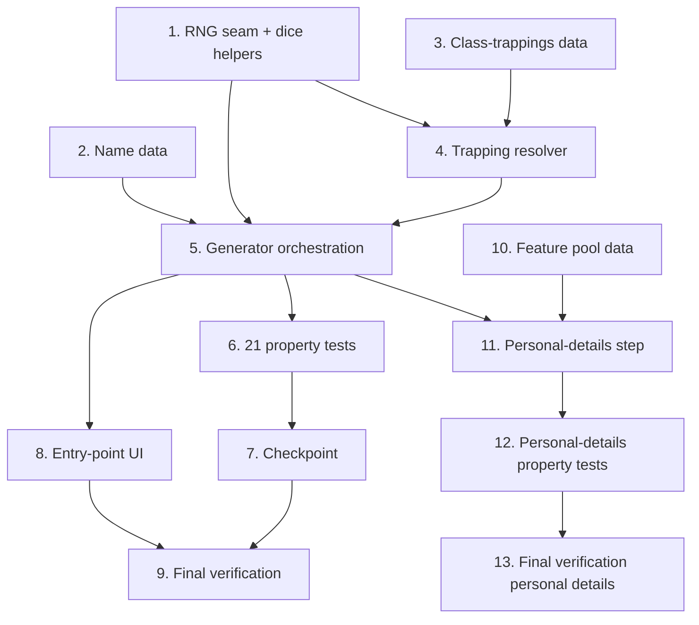

# Implementation Plan

## Overview

Build the Random Character Generator as pure, additive modules first (RNG seam → curated
data → trapping resolver → generator), then prove correctness with the 21 property-based
tests from the design, then wire the two entry-point UI surfaces, and finish with a full
verification pass. Every task is additive and independently verifiable: after each task run
`npx tsc --build --force --noEmit` and the full test suite (`vitest --run`); existing
assertions stay UNCHANGED and new tests are additive only. The project `fix-errors` steering
rule applies — any tsc/lint/test/build error a task surfaces is fixed at its root cause as
part of that task. Any code touching a WFRP4e mechanic cites the Core page in a comment
(`rules-compliance` rule); curated name data carries the flavour / no-mechanical-effect note.

Confirmed interpretation decisions baked into these tasks (no longer open):

- Career-randomization Bonus XP = **+50** → total unspent XP = **95** (`xpCur = xpTotal = 95`,
  `xpSpent = 0`). (Design "Resolved open question"; Core p.30–31.)
- Extra Points split = `floor(extraPoints / 2)` to Fate, remainder to Resilience. (Design §9.)
- Career skill advances = **+5 to each of the 8 level-1 career skills** (sums to 40; matches
  the Core p.35 worked example). Not randomized. (Design §7.)

## Tasks

- [x] 1. Add the RNG seam and dice helpers
  - Create `src/logic/random-character-generator.ts` with the `RNG` type (`() => number`,
    float in `[0, 1)`, `Math.random`-compatible) and the pure dice helpers `rollD10(rng)`
    (1..10), `roll2d10(rng)` (2..20), `rollD100(rng)` (1..100), and `pick<T>(rng, items)`
    (uniform choice; defensive guard throws a developer error on an empty array per the design
    Error Handling table). Export the helpers for unit testing.
  - Cite Core pages in comments (Core p.33 for 2d10; Core p.24 / p.30 for d100).
  - Add a small deterministic seeded RNG (e.g. mulberry32) in a **test** utility only — never
    in production code (Design "The RNG seam").
  - _Requirements: 1.5_ · Design "The RNG seam"
  - [x] 1.1 Write seeded-RNG unit tests for the dice helpers
    - Assert `rollD10`/`roll2d10`/`rollD100` produce only in-range integers across the seam's
      full `[0, 1)` output (including boundary inputs 0 and ~0.999…), `pick` returns a member of
      the input list, and `pick` on an empty array throws the documented developer error.
    - _Requirements: 1.5_

- [x] 2. Create the curated name data
  - Create `src/data/character-names.ts` exporting `NAME_POOLS: Record<string, string[]>` with a
    non-empty pool for every `SPECIES_OPTIONS` entry (including Dwarf/High-Elf variant keys, via
    their own pool or a documented key-normalisation to a base-species pool) plus
    `FALLBACK_NAME_POOL: string[]` for any unmatched key.
  - Add the mandatory source note: names are curated flavour with **no mechanical effect** and
    are **not** a rulebook table (Req 2.4, 13.2).
  - _Requirements: 2.2, 2.3, 2.4, 13.2_ · Design "Data Models → Name_Pool"
  - [x] 2.1 Write name-pool coverage unit tests
    - Assert every `SPECIES_OPTIONS` key resolves (dedicated → normalised → fallback) to a
      non-empty pool, and that variant keys normalise as documented.
    - _Requirements: 2.2, 2.3_

- [x] 3. Create the class-trappings data
  - Create `src/data/class-trappings.ts` exporting `CLASS_TRAPPINGS: Record<string, string[]>`
    transcribed verbatim from Core p.37 for all 8 classes (Academics, Burghers, Courtiers,
    Peasants, Rangers, Riverfolk, Rogues, Warriors), with dice-rolled quantities expressed as
    entries the resolver/generator can roll.
  - Document the Starting Wealth rule in a comment: `Brass 2d10 d / Silver 1d10 ss / Gold 1 GC`
    **per Status Level (Standing)** (Core p.37).
  - _Requirements: 11.2, 11.8_ · Core p.37 · Design "Data Models → Class_Trappings"
  - [x] 3.1 Write class-trappings shape/coverage unit tests
    - Assert all 8 class keys exist with non-empty string arrays matching the Core p.37 lists.
    - _Requirements: 11.2_

- [x] 4. Create the trapping resolver
  - Create `src/logic/trapping-resolver.ts` exporting the `ResolvedTrapping` discriminated union
    (`weapon` | `armour` | `trapping`), `resolveTrapping(entry, rng): ResolvedTrapping[]`, and
    the `AMBIGUOUS_MAP` with each ⚠ judgment-call entry flagged in a comment (Req 13.3).
  - Implement the design resolution order: split `" or "` / `" and "`; `AMBIGUOUS_MAP` lookup;
    exact `WEAPONS` match (full stat block); exact `ARMOURS` match (full stat block); fallback to
    a named trapping `{ name, enc: '0', quantity: 1 }` (quantity phrases like "10 arrows" may set
    a sensible quantity).
  - Cite Core p.36–37 for the trapping sources in comments.
  - _Requirements: 11.3, 11.4, 11.5, 11.6, 11.7_ · Design "resolveTrapping" + "AMBIGUOUS_MAP"
  - [x] 4.1 Write trapping-resolver unit tests
    - Cover weapon routing, armour routing, named-trapping routing, `" or "` single-pick and
      `" and "` multi-resolve splitting, each `AMBIGUOUS_MAP` ⚠ entry resolving to its documented
      concrete item, and the fallback (unknown name → named trapping, quantity ≥ 1).
    - _Requirements: 11.3, 11.4, 11.5, 11.6, 11.7_

- [x] 5. Implement the generator orchestration and step helpers
  - In `src/logic/random-character-generator.ts`, implement `generateRandomCharacter(rng): Character`
    as a pure function over `structuredClone(BLANK_CHARACTER)` (`_v: 8`), composing the step
    helpers below. Each helper cites its Core page in a comment; reuse existing helpers
    (`getEligibleCareers`, `rollRandomTalent`, `ensureCareerSkillsExist`, `resolveSkillChar`-style
    resolution, `SPECIES_DATA`, `CAREER_SCHEMES`, `WEAPONS`, `ARMOURS`). Never set `wCur`.
    - `rollSpecies` — d100 → Species_Data key, Human → `"Human / Reiklander"`; +20 XP (Core p.24).
    - `pickEligibleCareer` — `getEligibleCareers(species)` filtered to `level1`; set class/career/
      careerPath/careerLevel/status; +50 XP (Core p.30–31; confirmed interpretation).
    - `rollCharacteristics` + `assignByRearrange` — 2d10 ×10, highest rolls → advance-scheme chars,
      add species modifier; +25 XP (Core p.33).
    - `distributeCharAdvances` — exactly 5 advances round-robin across advance-scheme chars only
      (Core p.34).
    - `pickSpeciesSkills` — 3×+5 / 3×+3 disjoint, Basic/Advanced resolution; set `speciesSkills`
      (Core p.35).
    - `resolveSpeciesTalents` — fixed talents + `" or "` single-pick + random slots via
      `rollRandomTalent` with bounded dup-reroll; set `speciesTalents` (Core p.35).
    - `distributeCareerSkillAdvances` — 40 advances as +5 to each of the 8 career skills (≤10 cap),
      then `ensureCareerSkillsExist` (Core p.35).
    - `pickCareerTalent` — exactly one of the four level-1 career talents (Core p.35).
    - `buildDerived` — Fate(+split)/Fortune, Resilience(+split)/Resolve, Movement w=2×/r=4×,
      `woundsUseSB`, `speciesExtraPoints`; extra-points split = `floor(extraPoints/2)` to Fate,
      remainder to Resilience (Core p.33–34; confirmed interpretation).
    - `assembleGear` — `[...(level1.trappings ?? []), ...CLASS_TRAPPINGS[class]]` → `resolveTrapping`,
      routed into weapons/armour/trappings (Core p.36–37).
    - `rollStartingWealth` — parse `status` → tier/standing → wD/wSS/wGC per Status Level; unparseable
      status → zero wealth, commented, no throw (Core p.37).
    - XP: `xpCur = xpTotal = 95`, `xpSpent = 0` (Core p.24/p.30–31/p.33). Leave `wCur` unset for
      backfill (Core p.36–37).
  - _Requirements: 1.1, 1.3, 1.4, 3.1, 3.2, 3.3, 4.1, 4.2, 4.3, 5.1, 5.2, 5.3, 5.4, 5.5, 5.6, 6.1, 6.2, 6.3, 6.4, 7.1, 7.2, 7.3, 7.4, 7.5, 8.1, 8.2, 8.3, 8.4, 9.1, 9.2, 9.3, 9.4, 9.5, 9.6, 10.1, 10.2, 10.3, 10.4, 11.1, 11.8, 12.1, 12.2, 13.1_ · Design "Algorithm Detail"
  - [x] 5.1 Write generator edge-case unit tests
    - Species-mapping band edges (rolls 90/91/94/95/98/99/100); a species key with no dedicated
      name pool → fallback used, non-empty name; unparseable status → zero wealth, no throw;
      High-Elf elite careers (no `level1`) excluded from the eligible set.
    - _Requirements: 2.3, 3.3, 4.2, 11.8_

- [x] 6. Prove correctness with property-based tests
  - Reuse the project's existing property-testing library; configure **≥100 iterations** per
    property with a fresh seeded RNG per seed. Tag each test
    `Feature: random-character-generator, Property N — <property text>`. Implement each design
    property as a SINGLE property test.
  - [x] 6.1 Property 1 — determinism under a seeded RNG
    - **Property 1: Determinism under a seeded RNG**
    - **Validates: Requirements 1.5**
  - [x] 6.2 Property 2 — well-formed identity
    - **Property 2: Well-formed identity**
    - **Validates: Requirements 1.3, 1.4, 4.3**
  - [x] 6.3 Property 3 — species mapping follows the Random Species Table
    - **Property 3: Species mapping follows the Random Species Table**
    - **Validates: Requirements 3.1, 3.2, 3.3**
  - [x] 6.4 Property 4 — career is eligible and startable
    - **Property 4: Career is eligible and startable**
    - **Validates: Requirements 4.1, 4.2**
  - [x] 6.5 Property 5 — characteristic initials are in-range rolls plus species modifier
    - **Property 5: Characteristic initials are in-range rolls plus species modifier**
    - **Validates: Requirements 5.1, 5.3, 5.6**
  - [x] 6.6 Property 6 — rearrange assigns highest rolls to advance-scheme chars
    - **Property 6: Rearrange assigns the highest rolls to advance-scheme characteristics**
    - **Validates: Requirements 5.2**
  - [x] 6.7 Property 7 — characteristic advances are legal
    - **Property 7: Characteristic advances are legal**
    - **Validates: Requirements 5.4, 5.5**
  - [x] 6.8 Property 8 — species skill allocation is legal
    - **Property 8: Species skill allocation is legal**
    - **Validates: Requirements 6.1, 6.2, 6.3**
  - [x] 6.9 Property 9 — species lists are copied verbatim
    - **Property 9: Species lists are copied verbatim**
    - **Validates: Requirements 6.4, 7.5**
  - [x] 6.10 Property 10 — species talents resolved with unique results
    - **Property 10: Species talents resolved with unique results**
    - **Validates: Requirements 7.1, 7.2, 7.3, 7.4**
  - [x] 6.11 Property 11 — career skill advances are legal and complete
    - **Property 11: Career skill advances are legal and complete**
    - **Validates: Requirements 8.1, 8.2, 8.4**
  - [x] 6.12 Property 12 — exactly one career talent is chosen
    - **Property 12: Exactly one career talent is chosen**
    - **Validates: Requirements 8.3**
  - [x] 6.13 Property 13 — derived Fate/Resilience and Movement
    - **Property 13: Derived Fate/Resilience and Movement**
    - **Validates: Requirements 9.1, 9.2, 9.3, 9.4, 9.5, 9.6**
  - [x] 6.14 Property 14 — Bonus XP is 95 and unspent
    - **Property 14: Bonus XP is 95 and unspent**
    - **Validates: Requirements 10.1, 10.2, 10.3, 10.4**
  - [x] 6.15 Property 15 — granted trappings resolve to items on the character
    - **Property 15: Granted trappings resolve to items present on the character**
    - **Validates: Requirements 11.1, 11.2**
  - [x] 6.16 Property 16 — ambiguous/generic trappings resolve to one concrete item
    - **Property 16: Ambiguous and generic trappings resolve to a single concrete item**
    - **Validates: Requirements 11.3, 11.4**
  - [x] 6.17 Property 17 — resolved weapons and armour carry full stat blocks
    - **Property 17: Resolved weapons and armour carry full stat blocks**
    - **Validates: Requirements 11.5, 11.6, 11.7**
  - [x] 6.18 Property 18 — starting wealth matches Status Tier and Standing
    - **Property 18: Starting wealth matches Status Tier and Standing**
    - **Validates: Requirements 11.8**
  - [x] 6.19 Property 19 — name belongs to the species' name pool
    - **Property 19: Name belongs to the species' name pool**
    - **Validates: Requirements 2.1, 2.3**
  - [x] 6.20 Property 20 — every species has a resolvable, non-empty name pool
    - **Property 20: Every species has a resolvable, non-empty name pool**
    - **Validates: Requirements 2.2**
  - [x] 6.21 Property 21 — wounds are left for backfill and compute to a correct maximum
    - **Property 21: Wounds are left for backfill and compute to a correct maximum**
    - **Validates: Requirements 12.1, 12.2**

- [x] 7. Checkpoint — pure/data/logic layer complete
  - Ensure all tests pass, ask the user if questions arise.

- [x] 8. Wire the entry-point UI
  - [x] 8.1 Add the control to `WelcomeScreen` ('initial' mode)
    - Add a focusable `<button type="button">` labelled "Create Random Character" alongside the
      existing wizard/quick-start controls, styled with the existing button classes, with an
      accessible name conveying purpose and participating in the surface's focus handling. Add an
      `onRandomCharacter` prop and invoke it on activation.
    - _Requirements: 1.1, 14.1, 14.2, 14.3_ · Design "Entry-point controls (UI)"
  - [x] 8.2 Add the control to `NewCharacterChoice`
    - Add the same focusable, accessibly-named "Create Random Character" button, surfaced through a
      new `onRandomCharacter` prop, consistent with the modal's existing controls and focus handling.
    - _Requirements: 1.1, 14.1, 14.2, 14.3_ · Design "Entry-point controls (UI)"
  - [x] 8.3 Wire `App.tsx` to the generator and completion path
    - For both entry points, build the production RNG (`Math.random`), call
      `generateRandomCharacter(Math.random)`, and route the result through the existing
      completion/persistence path (the `onComplete`-equivalent used by the wizard), relying on the
      existing wound backfill so `wCur` is set to the wound maximum. No change to wizard/Quick Start.
    - _Requirements: 1.1, 1.2, 12.1, 12.2_ · Design "Modified files" + "Preview surface decision"
  - [x] 8.4 Write entry-point component tests
    - WelcomeScreen 'initial' mode and NewCharacterChoice render a focusable "Create Random
      Character" button with the correct accessible name; activating it invokes the handler with a
      `Character`; the control participates in focus handling; the control displays no
      calculated-total value (satisfies Req 15.3, no Tooltip obligation).
    - _Requirements: 1.1, 1.2, 14.1, 14.2, 14.3, 15.3_

- [x] 9. Final verification
  - `npx tsc --build --force --noEmit` reports zero errors; eslint is clean with no new
    react-refresh warnings; the production build (`npm run build`) is clean; the full suite
    (`vitest --run`) is green with all pre-existing assertions UNCHANGED (new tests additive only).
    Fix any surfaced error at its root cause (`fix-errors` rule).
  - Confirm a generated character opens in the sheet ready-to-play with `wCur` backfilled to the
    wound maximum, and that the non-goals held (no wizard/Quick Start behaviour change, no Bonus_XP
    spent, no multi-level advancement, no pre-constraint pickers).
  - _Requirements: 1.2, 12.1, 12.2_ · Design "Testing Strategy → Verification" + "Non-Goals"

- [x] 10. Create the curated distinguishing-feature data (non-Dwarf)
  - Create `src/data/distinguishing-features.ts` exporting `FEATURE_POOLS: Record<string, string[]>`
    with a non-empty pool for every non-Dwarf `SpeciesGroup` (`Human`, `Halfling`, `High_Elf`,
    `Wood_Elf`, `Ogre`), plus `FALLBACK_FEATURE_POOL: string[]` and a `resolveFeaturePool(group)` helper
    (dedicated → fallback).
  - Add the mandatory source note: non-Dwarf distinguishing features are curated flavour with **no
    mechanical effect** and are **not** a rulebook table (Req 16.7). Dwarf features come from the
    official d100 table, not this file.
  - _Requirements: 16.6, 16.7_ · Design "Data Models → Feature_Pool"
  - [x] 10.1 Write feature-pool coverage unit tests
    - Assert every non-Dwarf `SpeciesGroup` resolves to a non-empty pool of non-empty strings and an
      unknown group falls back to `FALLBACK_FEATURE_POOL`.
    - _Requirements: 16.6_

- [x] 11. Add the personal-details step to the generator
  - In `src/logic/random-character-generator.ts`, add `buildPersonalDetails(rng, char, species)` and
    call it from `generateRandomCharacter`. Reuse the existing pure logic in
    `src/logic/personal-details.ts` (`getSpeciesGroup`, `generateAge`, `generateHeight`,
    `humanHeightNeedsBonus`, `lookupHairColour`, `lookupEyeColour`, `formatVariegatedEyes`,
    `lookupDwarfAlternateTable`) and the `AGE_FORMULAS`/`HEIGHT_FORMULAS` data — route every d10/d100
    through the RNG seam (NO `Math.random`). Dwarf `distinguishingFeature` from
    `lookupDwarfAlternateTable(...).feature`; non-Dwarf from `pick(rng, resolveFeaturePool(group))`.
    Set `age`/`height`/`hair`/`eyes`/`distinguishingFeature`. If `getSpeciesGroup` is undefined, leave
    fields blank, no throw. Cite Core p.24–25 and dwarfguide p.40 in comments.
  - _Requirements: 16.1, 16.2, 16.3, 16.4, 16.5, 16.6, 16.8, 16.9_ · Design "Algorithm Detail §11a"
  - [x] 11.1 Write personal-details generator unit tests
    - Human bonus-die path; High-Elf/Wood-Elf two-roll variegated eyes; Dwarf feature from the d100
      table; non-Dwarf feature from the pool; undefined species group leaves fields blank without
      throwing.
    - _Requirements: 16.1, 16.3, 16.4, 16.5, 16.6_

- [x] 12. Prove personal-details correctness with property-based tests
  - [x] 12.1 Property 22 — personal details are populated and race-appropriate
    - **Property 22: Personal details are populated and race-appropriate**
    - **Validates: Requirements 16.1, 16.2, 16.4, 16.5, 16.6**
  - [x] 12.2 Property 23 — personal details are deterministic under a seeded RNG
    - **Property 23: Personal details are deterministic under a seeded RNG**
    - **Validates: Requirements 16.8, 16.9**

- [x] 13. Final verification (personal details)
  - `npx tsc --build --force --noEmit` zero errors; eslint clean; `npm run build` clean; full
    `vitest --run` green with pre-existing assertions UNCHANGED (new tests additive only). Fix any
    surfaced error at its root cause (`fix-errors` rule). Confirm a generated character now opens with
    non-empty age/height/hair/eyes and a race-appropriate distinguishing feature.
  - _Requirements: 16.1, 16.8_

## Task Dependency Graph

```json
{
  "waves": [
    { "id": 0, "tasks": ["1", "2", "3"] },
    { "id": 1, "tasks": ["1.1", "2.1", "3.1", "4"] },
    { "id": 2, "tasks": ["4.1", "5"] },
    { "id": 3, "tasks": ["5.1", "6.1", "6.2", "6.3", "6.4", "6.5", "6.6", "6.7", "6.8", "6.9", "6.10", "6.11", "6.12", "6.13", "6.14", "6.15", "6.16", "6.17", "6.18", "6.19", "6.20", "6.21", "8.1", "8.2"] },
    { "id": 4, "tasks": ["8.3"] },
    { "id": 5, "tasks": ["8.4"] },
    { "id": 6, "tasks": ["10"] },
    { "id": 7, "tasks": ["10.1", "11"] },
    { "id": 8, "tasks": ["11.1", "12.1", "12.2"] },
    { "id": 9, "tasks": ["13"] }
  ]
}
```



## Notes

- Tasks marked with `*` are optional test sub-tasks and may be skipped for a faster MVP; the
  generator (task 5) is a strong PBT fit, so the task 6 property tests are the central correctness
  guarantee and are strongly recommended.
- Each task is additive and independently verifiable: after each task run
  `npx tsc --build --force --noEmit` and `vitest --run`; existing assertions stay unchanged.
- Pure/data/logic tasks (1–6) precede UI (8). The generator (5) depends on 1–4; the property tests
  (6) and the UI wiring (8) depend on 5; final verification (9) is last.
- Any code touching a WFRP4e mechanic cites the Core page in a comment (`rules-compliance` rule);
  the name data carries the flavour / no-mechanical-effect source note (Req 2.4, 13.2).
- Any tsc/lint/test/build error a task surfaces is fixed at its root cause before that task is
  considered complete (`fix-errors` rule).
- Confirmed interpretations are fixed defaults: career Bonus XP +50 (total 95), extra-points split
  `floor(/2)`→Fate / remainder→Resilience, and +5×8 career skill advances.
