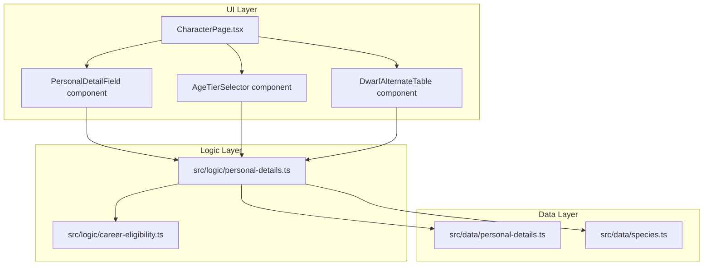
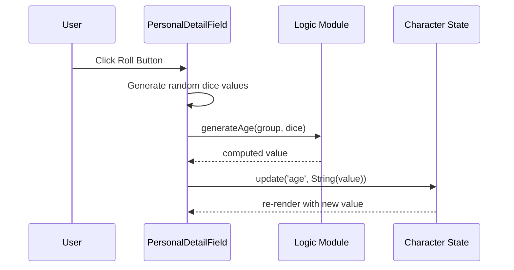

# Design Document: Random Personal Details

## Overview

This feature adds species-specific random generation and manual selection of character personal details (age, height, eye colour, hair colour, distinguishing features) to the WFRP4e PWA character sheet. The implementation follows the existing architecture: pure logic modules in `src/logic/` with static data tables in `src/data/`, consumed by React components on the Identity tab.

The design separates concerns into three layers:
1. **Data layer** — Static lookup tables for eye/hair colour and Dwarf features (`src/data/personal-details.ts`)
2. **Logic layer** — Pure functions for species group mapping, dice formula computation, table lookups, and height formatting (`src/logic/personal-details.ts`)
3. **UI layer** — Enhanced personal detail fields with roll buttons, dropdowns, and conditional controls

All randomisation logic accepts injected dice values for deterministic testing, following the existing `dice-roller.ts` pattern.

## Architecture



### Key Design Decisions

1. **Inject dice values** — All generation functions accept arrays of pre-rolled d10/d100 values rather than calling `Math.random()` internally. The UI layer calls `Math.random()` at the call site and passes values in. This makes all logic pure and deterministically testable.

2. **Reuse existing species helpers** — The `isDwarfSpecies`, `isHighElfSpecies`, `isWoodElfSpecies`, `isHalflingSpecies`, `isHumanSpecies`, `isOgreSpecies` functions from `career-eligibility.ts` already implement the case-insensitive prefix matching needed for species group resolution.

3. **Single data module** — All lookup tables (eye colour, hair colour, Dwarf alternate table, distinguishing features) live in one `src/data/personal-details.ts` file since they are thematically related and jointly consumed.

4. **Composable UI** — Each personal detail field gets a wrapper component (`PersonalDetailField`) that combines the existing `EditableField` with a roll button and optional dropdown, keeping the `CharacterPage` layout clean.

## Components and Interfaces

### Data Module: `src/data/personal-details.ts`

```typescript
export type SpeciesGroup = 'Human' | 'Dwarf' | 'Halfling' | 'High_Elf' | 'Wood_Elf' | 'Ogre';

export interface ColourTableEntry {
  min: number;  // minimum 2d10 sum for this row
  max: number;  // maximum 2d10 sum for this row
  value: string;
}

export type ColourTable = Record<SpeciesGroup, ColourTableEntry[]>;

export const EYE_COLOUR_TABLE: ColourTable = { /* ... */ };
export const HAIR_COLOUR_TABLE: ColourTable = { /* ... */ };

export interface DwarfAlternateRow {
  min: number;
  max: number;
  hair: string;
  eyes: string;
  feature: string;
}

export const DWARF_ALTERNATE_TABLE: DwarfAlternateRow[] = [ /* 20 rows, 5-point bands */ ];
export const DWARF_DISTINGUISHING_FEATURES: string[] = [ /* 20 unique features */ ];

export interface HighElfAgeTier {
  label: string;
  base: number;
  diceCount: number;
}

export const HIGH_ELF_AGE_TIERS: HighElfAgeTier[] = [
  { label: 'Time of Ending', base: 30, diceCount: 10 },
  { label: 'Time of Steel', base: 120, diceCount: 9 },
  { label: 'Time of Incursion', base: 200, diceCount: 15 },
  { label: 'Time of Voyages', base: 320, diceCount: 30 },
  { label: 'Time of the Sage', base: 580, diceCount: 30 },
];

export interface AgeFormula {
  base: number;
  diceCount: number;
}

export const AGE_FORMULAS: Record<SpeciesGroup, AgeFormula> = {
  Human: { base: 15, diceCount: 1 },
  Dwarf: { base: 15, diceCount: 10 },
  Halfling: { base: 15, diceCount: 5 },
  High_Elf: { base: 30, diceCount: 10 },  // default Time of Ending
  Wood_Elf: { base: 30, diceCount: 10 },
  Ogre: { base: 15, diceCount: 5 },
};

export interface HeightFormula {
  baseFeet: number;
  baseInches: number;
  diceCount: number;
}

export const HEIGHT_FORMULAS: Record<SpeciesGroup, HeightFormula> = {
  Human: { baseFeet: 4, baseInches: 9, diceCount: 2 },
  Dwarf: { baseFeet: 4, baseInches: 3, diceCount: 1 },
  Halfling: { baseFeet: 3, baseInches: 1, diceCount: 1 },
  High_Elf: { baseFeet: 5, baseInches: 11, diceCount: 1 },
  Wood_Elf: { baseFeet: 5, baseInches: 11, diceCount: 1 },
  Ogre: { baseFeet: 7, baseInches: 7, diceCount: 1 },
};
```

### Logic Module: `src/logic/personal-details.ts`

```typescript
import type { SpeciesGroup, HighElfAgeTier } from '../data/personal-details';

/**
 * Map a species string to its SpeciesGroup. Returns undefined for unknown species.
 * Uses existing species detection helpers from career-eligibility.ts.
 */
export function getSpeciesGroup(species: string): SpeciesGroup | undefined;

/**
 * Generate a random age given species group, d10 values, and optional High Elf tier.
 * Returns the computed age as a number.
 * @param group - The species group
 * @param dice - Array of d10 results (each 1-10), length must match formula diceCount
 * @param tier - Optional High Elf age tier (defaults to Time of Ending)
 */
export function generateAge(
  group: SpeciesGroup,
  dice: number[],
  tier?: HighElfAgeTier
): number;

/**
 * Generate a random height string.
 * @param group - The species group
 * @param dice - Array of d10 results (each 1-10)
 * @param bonusDie - Optional bonus d10 for Human height rule (1-10 or undefined)
 * @returns Formatted height string like "5'7\""
 */
export function generateHeight(
  group: SpeciesGroup,
  dice: number[],
  bonusDie?: number
): string;

/**
 * Determine whether a Human height roll triggers the bonus die.
 * Returns true if either die in the pair equals 10.
 */
export function humanHeightNeedsBonus(dice: [number, number]): boolean;

/**
 * Format a total inches value as feet'inches" string.
 * Ensures inches portion is always 0-11.
 */
export function formatHeight(totalInches: number): string;

/**
 * Look up eye colour from the table for a given species and 2d10 sum.
 */
export function lookupEyeColour(group: SpeciesGroup, roll: number): string;

/**
 * Look up hair colour from the table for a given species and 2d10 sum.
 */
export function lookupHairColour(group: SpeciesGroup, roll: number): string;

/**
 * Combine two eye colours into variegated format.
 * Returns "{first} flecked with {second}" if different, or just the colour if same.
 */
export function formatVariegatedEyes(first: string, second: string): string;

/**
 * Get deduplicated dropdown options for eye colour by species group.
 */
export function getEyeColourOptions(group: SpeciesGroup): string[];

/**
 * Get deduplicated dropdown options for hair colour by species group.
 */
export function getHairColourOptions(group: SpeciesGroup): string[];

/**
 * Look up all three values from the Dwarf alternate d100 table.
 * Applies regional modifier to hair/eye lookup only.
 * @param roll - 1d100 result (1-100)
 * @param variant - Species variant string (for detecting Norse/southern holds)
 */
export function lookupDwarfAlternateTable(
  roll: number,
  variant: string
): { hair: string; eyes: string; feature: string };

/**
 * Get the regional modifier for a Dwarf species variant.
 * Norse = -5, southern holds = +5, others = 0.
 */
export function getDwarfRegionalModifier(variant: string): number;
```

### UI Components

#### `PersonalDetailField` — Wrapper Component

A compound component that renders:
- The existing `EditableField` for free-text input
- A dice roll button (🎲 icon)
- An optional dropdown for manual selection (eye/hair colour)

Props:
```typescript
interface PersonalDetailFieldProps {
  label: string;
  value: string;
  onSave: (value: string) => void;
  onRoll: () => void;
  dropdownOptions?: string[];
  onDropdownSelect?: (value: string) => void;
  disabled?: boolean;
}
```

#### `AgeTierSelector` — High Elf Age Tier Picker

A small select element shown only for High Elf characters, rendered inline with the age field. Tracks the selected tier in local component state (not persisted to character data).

#### `DwarfAlternateRoll` — Dwarf d100 Alternate Table

A button + optional feature confirmation UI shown only for Dwarf characters. Rolls d100, applies regional modifier, updates hair/eyes, and offers the distinguishing feature for optional storage.

## Data Models

### Character Interface (unchanged)

The existing `Character` interface fields are reused without modification:
- `age: string` — Stores numeric age as string (e.g. "23")
- `height: string` — Stores formatted height (e.g. "5'7\"")
- `hair: string` — Stores hair colour string
- `eyes: string` — Stores eye colour string

No schema migration needed. The feature adds generation logic on top of existing storage.

### Lookup Table Structure

Eye and hair colour tables use range-based lookup (2d10 sum, range 2-20):

| 2d10 Sum | Human Eyes | Dwarf Eyes | Halfling Eyes | High Elf Eyes | Wood Elf Eyes | Ogre Eyes |
|----------|-----------|-----------|--------------|--------------|--------------|-----------|
| 2        | Free Choice | Copper | Dark Brown | Silver | Dark Brown | Grey |
| 3        | Grey | Dark Brown | Hazel | Grey | Hazel | Brown |
| ... | ... | ... | ... | ... | ... | ... |
| 20       | Black | Black | Green | Starlit Blue | Pale Blue | Yellow |

Dwarf alternate table uses d100 with 5-point bands (1-5, 6-10, ..., 96-100), each row containing hair colour, eye colour, and distinguishing feature.

### State Flow



## Correctness Properties

*A property is a characteristic or behavior that should hold true across all valid executions of a system — essentially, a formal statement about what the system should do. Properties serve as the bridge between human-readable specifications and machine-verifiable correctness guarantees.*

### Property 1: Species Group Mapping Correctness

*For any* species string, `getSpeciesGroup` SHALL return the correct `SpeciesGroup` based on case-insensitive prefix matching: strings containing "dwarf" map to Dwarf, strings starting with "high elf" or "high elves" map to High_Elf, strings containing "halfling" map to Halfling, "Wood Elf" maps to Wood_Elf, "Ogre" maps to Ogre, strings containing "human" or "reiklander" map to Human, and all other strings return undefined.

**Validates: Requirements 1.2, 1.4, 1.7, 1.8**

### Property 2: Age Formula Range Invariant

*For any* species group, optional High Elf age tier, and array of d10 values (each in range 1–10) with length matching the formula's dice count, `generateAge` SHALL return a value equal to `base + sum(dice)`, which is always within the range `[base + diceCount, base + diceCount * 10]`.

**Validates: Requirements 2.1, 2.2, 2.3, 2.4, 2.5, 2.6, 2.7, 3.3, 3.4, 3.5, 3.6, 3.7**

### Property 3: Height Formatting Invariant

*For any* total inches value (positive integer), `formatHeight` SHALL produce a string in the format `X'Y"` where Y (the inches portion) is always in the range 0–11, and the total inches equals `X * 12 + Y`.

**Validates: Requirements 4.8, 4.9**

### Property 4: Human Height Bonus Rule

*For any* pair of d10 values (each 1–10) representing Human initial height dice, `humanHeightNeedsBonus` SHALL return true if and only if at least one die equals 10. For non-Human species, `generateHeight` SHALL never incorporate a bonus die regardless of dice values.

**Validates: Requirements 5.1, 5.2, 5.3**

### Property 5: Colour Table Lookup Completeness

*For any* species group and any 2d10 sum (integer in range 2–20), `lookupEyeColour` and `lookupHairColour` SHALL each return a non-empty string that is a member of the corresponding species column in the colour table.

**Validates: Requirements 6.1, 6.2, 6.3, 6.4, 6.5, 6.6, 6.7, 8.1, 8.2, 8.3, 8.4, 8.5, 8.6, 8.7**

### Property 6: Variegated Eye Colour Formatting

*For any* two non-empty eye colour strings, `formatVariegatedEyes` SHALL return the single colour when both strings are identical, or `"{first} flecked with {second}"` when they differ.

**Validates: Requirements 7.2, 7.3, 7.5**

### Property 7: Dropdown Options Deduplication

*For any* species group, `getEyeColourOptions` and `getHairColourOptions` SHALL return arrays with no duplicate entries, where every entry appears in the corresponding colour table for that species, and every unique value from the table appears in the options array.

**Validates: Requirements 9.1, 9.2**

### Property 8: Dwarf Alternate Table Regional Modifier

*For any* d100 value (1–100) and any Dwarf species variant, `lookupDwarfAlternateTable` SHALL apply the regional modifier (Norse: -5, southern holds: +5, others: 0) to the lookup index for hair and eye colour only (clamped to 1–100), while always using the unmodified d100 value for the distinguishing feature lookup.

**Validates: Requirements 10.2, 10.3, 10.4, 11.2**

## Error Handling

| Scenario | Handling |
|----------|----------|
| Species string is empty or unknown | `getSpeciesGroup` returns `undefined`; UI disables roll buttons and dropdowns |
| Dice array length mismatch | Logic functions validate array length matches formula's `diceCount`; throw if mismatched (developer error) |
| d10 value outside 1–10 | Clamp to [1, 10] before computation |
| 2d10 sum outside 2–20 | Clamp to [2, 20] before table lookup |
| d100 outside 1–100 | Clamp to [1, 100] before Dwarf table lookup |
| Regional modifier pushes value below 1 or above 100 | Clamp modified value to [1, 100] |
| Species changes while values exist | Retain existing field values; reset dropdown selection state only |

## Testing Strategy

### Property-Based Tests (fast-check)

The project already uses `fast-check` (v4.8.0). Each correctness property maps to a property-based test with minimum 100 iterations.

**Test file**: `src/logic/__tests__/personal-details.property.test.ts`

- **Property 1**: Generate arbitrary species strings (with case/prefix variations) and verify mapping
- **Property 2**: Generate species groups + d10 arrays and verify age = base + sum(dice)
- **Property 3**: Generate arbitrary positive integers and verify format invariant
- **Property 4**: Generate d10 pairs and verify bonus detection logic
- **Property 5**: Generate species groups + integers in [2,20] and verify lookup returns table member
- **Property 6**: Generate pairs of colour strings and verify format rule
- **Property 7**: For each species group, verify options are deduplicated and complete
- **Property 8**: Generate d100 values + Dwarf variants and verify modifier application

**Configuration**: Each test runs `fc.assert(fc.property(...), { numRuns: 100 })` minimum.

**Tag format**: `Feature: random-personal-details, Property N: <title>`

### Unit Tests (Example-Based)

**Test file**: `src/logic/__tests__/personal-details.test.ts`

- Specific species key mappings (all keys from `SPECIES_DATA`)
- High Elf age tier defaults to Time of Ending
- Human Free Choice eye colour (roll = 2)
- Edge cases: empty species, boundary dice values (1, 10)
- Height formatting edge cases: exactly 12 inches converts to 1'0"

### Component Tests

**Test file**: `src/components/__tests__/PersonalDetailField.test.tsx`

- Roll button disabled when species is empty
- Dropdown disabled when species is empty
- Roll button triggers generation and updates character
- High Elf age tier selector visibility
- Dwarf alternate table visibility
- Variegated eye option visibility for Elf species
- Free-text override after roll
