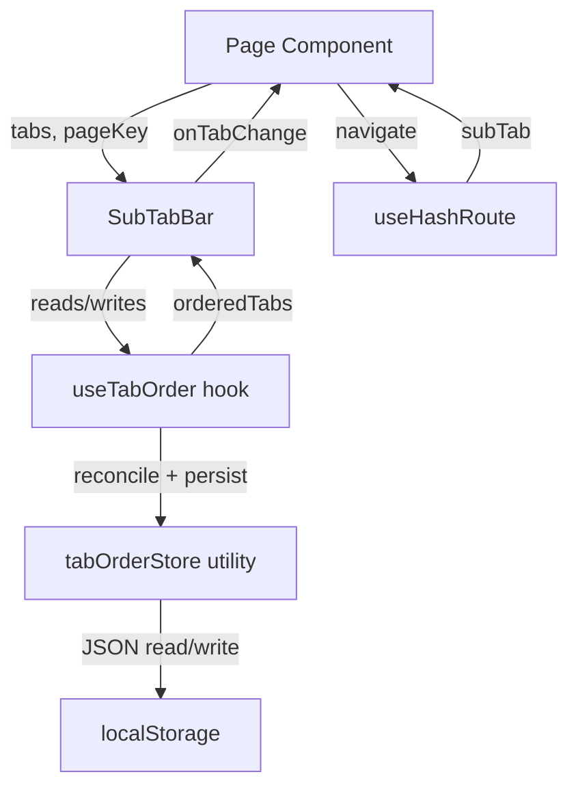
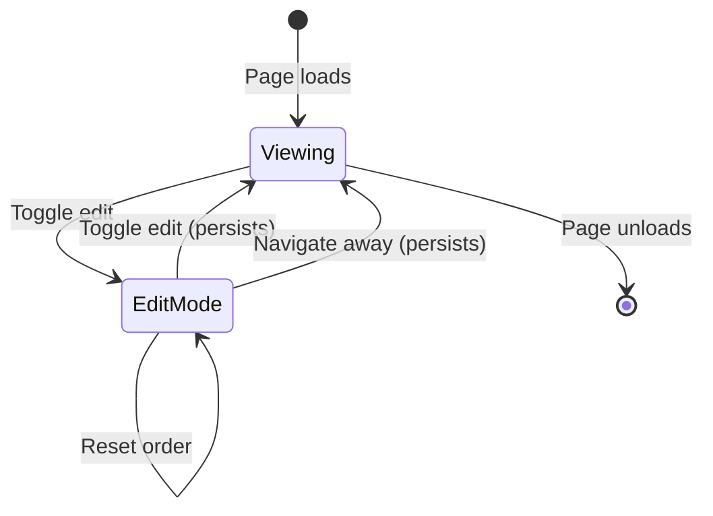

# Design Document: Reorderable Sub-Tabs

## Overview

This design extends the existing `SubTabBar` component to support user-driven tab reordering via an edit mode with arrow buttons. The solution adds a lightweight persistence layer backed by localStorage, a reconciliation algorithm that handles tab list changes between app versions, and accessible reorder controls that work with keyboard and touch input.

The design prioritizes minimal disruption to the existing architecture. The current `SubTabBar` remains the single rendering component but gains optional edit mode behavior controlled by a new custom hook. Persistence logic is isolated in a pure utility module, keeping the component testable and side-effect-free.

## Architecture



**Key architectural decisions:**

1. **Hook-based state management (`useTabOrder`)**: Encapsulates edit mode state, reorder logic, and persistence triggers. Pages pass their `pageKey` and `defaultTabs` array; the hook returns the ordered tabs and reorder controls.

2. **Pure utility module (`tabOrderStore`)**: Handles serialization, validation, reconciliation, and localStorage I/O. Fully unit-testable without DOM or React dependencies.

3. **Extended `SubTabBar` props**: The component receives optional edit-mode props. When absent, it behaves exactly as today (backward compatible). When present, it renders reorder controls.

4. **URL routing unchanged**: Hash routing continues using tab IDs. Reordering only affects display order, never URL semantics.

## Components and Interfaces

### `tabOrderStore` — Pure Utility Module

**Location:** `src/logic/tab-order-store.ts`

```typescript
/** Persisted tab order for a single page */
export interface TabOrderEntry {
  pageKey: string;
  order: string[];  // tab IDs in user-preferred sequence
}

/** Read stored order, returning null if absent or invalid */
export function loadTabOrder(pageKey: string): string[] | null;

/** Write order to localStorage. Returns false if write fails. */
export function saveTabOrder(pageKey: string, order: string[]): boolean;

/** Remove stored order for a page (reset) */
export function removeTabOrder(pageKey: string): void;

/**
 * Reconcile a stored order against the current default tabs.
 * - Removes IDs not in defaults
 * - Deduplicates (keeps first occurrence)
 * - Appends new IDs in their default relative order
 * Returns the reconciled order, or null if result matches defaults exactly.
 */
export function reconcileTabOrder(
  stored: string[],
  defaults: string[]
): string[];

/** Validate raw localStorage value. Returns parsed array or null. */
export function validateStoredValue(raw: unknown): string[] | null;
```

**Storage key format:** `tabOrder:<pageKey>` (e.g., `tabOrder:character`)

### `useTabOrder` — React Hook

**Location:** `src/hooks/useTabOrder.ts`

```typescript
export interface UseTabOrderOptions {
  pageKey: string;
  defaultTabs: { id: string; label: string }[];
}

export interface UseTabOrderResult {
  /** Tabs in current display order */
  orderedTabs: { id: string; label: string }[];
  /** Whether edit mode is active */
  isEditMode: boolean;
  /** Enter/exit edit mode */
  toggleEditMode: () => void;
  /** Move tab at index one position left */
  moveLeft: (index: number) => void;
  /** Move tab at index one position right */
  moveRight: (index: number) => void;
  /** Reset to default order */
  resetOrder: () => void;
  /** Whether current order matches defaults */
  isDefaultOrder: boolean;
  /** Whether last save failed (for showing transient warning) */
  saveError: boolean;
}

export function useTabOrder(options: UseTabOrderOptions): UseTabOrderResult;
```

**Behavior:**
- On mount: loads stored order, reconciles with defaults, persists if reconciliation changed anything
- `toggleEditMode()`: when exiting edit mode, persists current order
- `moveLeft`/`moveRight`: swaps adjacent items in the order array (in-memory only until edit mode exits)
- `resetOrder()`: calls `removeTabOrder`, reverts display to defaults
- Cleanup on unmount while in edit mode: persists current order

### Extended `SubTabBar` Component

**Location:** `src/components/shared/SubTabBar.tsx` (extended, backward compatible)

```typescript
export interface SubTabBarProps {
  tabs: { id: string; label: string }[];
  activeTab: string;
  onTabChange: (tabId: string) => void;
  /** Optional edit mode props — when omitted, component behaves as before */
  editMode?: {
    isActive: boolean;
    onToggle: () => void;
    onMoveLeft: (index: number) => void;
    onMoveRight: (index: number) => void;
    onReset: () => void;
    isDefaultOrder: boolean;
    saveError: boolean;
  };
}
```

**Rendering in edit mode:**
- Each tab shows left/right arrow buttons (using `lucide-react` ChevronLeft/ChevronRight icons)
- First tab's left-arrow is disabled; last tab's right-arrow is disabled
- Edit mode toggle button outside the tablist (using Pencil/Check icon)
- Reset button (using RotateCcw icon) adjacent to toggle, disabled when order matches default
- Tab clicks do not navigate while edit mode is active
- Moved tabs animate with CSS `transition: transform 150ms ease`

### Page Integration Pattern

Each page that uses SubTabBar (CharacterPage, RetinuePage, EstatePage) will:

```typescript
const { orderedTabs, isEditMode, toggleEditMode, moveLeft, moveRight, resetOrder, isDefaultOrder, saveError } = useTabOrder({
  pageKey: 'character',
  defaultTabs: [
    { id: 'identity', label: 'Identity' },
    { id: 'abilities', label: 'Abilities' },
    { id: 'gear', label: 'Gear & Wealth' },
    { id: 'notes', label: 'Notes' },
  ],
});

<SubTabBar
  tabs={orderedTabs}
  activeTab={activeSubTab}
  onTabChange={(tab) => navigate('character', tab)}
  editMode={{
    isActive: isEditMode,
    onToggle: toggleEditMode,
    onMoveLeft: moveLeft,
    onMoveRight: moveRight,
    onReset: resetOrder,
    isDefaultOrder,
    saveError,
  }}
/>
```

## Data Models

### localStorage Schema

**Key pattern:** `tabOrder:<pageKey>`

**Value:** JSON-serialized `string[]` of tab IDs

Example stored values:
```json
// tabOrder:character
["abilities", "identity", "gear", "notes"]

// tabOrder:retinue
["companions", "hirelings"]

// tabOrder:estate (not present = use defaults)
```

### Validation Rules

A stored value is valid if:
1. It parses as valid JSON
2. The parsed value is an array
3. Every element is a non-empty string
4. No empty/whitespace-only strings

Invalid values are discarded silently and the default order is used.

### Reconciliation Algorithm

```
Input: stored[] (from localStorage), defaults[] (from source code)
Output: reconciled[]

1. Deduplicate stored (keep first occurrence)
2. Filter stored to only IDs present in defaults
3. Compute newIds = defaults IDs not in filtered stored, preserving relative order
4. reconciled = filtered stored ++ newIds
5. Return reconciled
```

### State Transitions



## Correctness Properties

*A property is a characteristic or behavior that should hold true across all valid executions of a system — essentially, a formal statement about what the system should do. Properties serve as the bridge between human-readable specifications and machine-verifiable correctness guarantees.*

### Property 1: Serialization Round-Trip

*For any* valid tab order array (non-empty array of unique non-empty strings) and any valid page key, saving the order to the Tab_Order_Store and then loading it back SHALL produce an identical array.

**Validates: Requirements 1.1, 1.2**

### Property 2: Invalid Storage Values Fall Back to Defaults

*For any* stored value that is not valid JSON, or is not an array, or contains elements that are not non-empty strings, the Tab_Order_Store SHALL return null (triggering default order fallback) when loading that page key.

**Validates: Requirements 1.3**

### Property 3: Page Independence

*For any* two distinct page keys and any two valid tab order arrays, saving an order for one page key and then loading from the other page key SHALL not return the first page's order.

**Validates: Requirements 1.4**

### Property 4: Navigation Suppressed in Edit Mode

*For any* tab list and any tab clicked while edit mode is active, the onTabChange callback SHALL not be invoked.

**Validates: Requirements 2.3**

### Property 5: Move Swaps Adjacent Tabs

*For any* tab order array of length ≥ 2 and any valid index, calling moveLeft on index > 0 SHALL swap the elements at index and index−1 (and no other elements change), and calling moveRight on index < length−1 SHALL swap the elements at index and index+1 (and no other elements change).

**Validates: Requirements 3.2, 3.3**

### Property 6: Boundary Arrows Disabled

*For any* non-empty tab list rendered in edit mode, the left-arrow button on the first tab SHALL have aria-disabled="true" and be non-interactive, and the right-arrow button on the last tab SHALL have aria-disabled="true" and be non-interactive.

**Validates: Requirements 3.4, 3.5, 7.6**

### Property 7: Focus Follows Moved Tab

*For any* tab moved via an arrow button (left or right), after the move completes, document.activeElement SHALL be the same type of arrow button (left or right) on that same tab in its new position.

**Validates: Requirements 3.8, 7.5**

### Property 8: Reset Restores Default Order

*For any* non-default tab order, invoking the reset action SHALL produce a tab order identical to the default order while the active tab selection remains unchanged.

**Validates: Requirements 4.2**

### Property 9: Reset Button Disabled When at Default

*For any* tab order that is identical to the default order, the reset button SHALL be disabled. For any tab order that differs from the default order, the reset button SHALL be enabled.

**Validates: Requirements 4.5**

### Property 10: Reconciliation Correctness

*For any* stored tab order array and any default tab array, after reconciliation: (a) the result contains exactly the set of IDs from the defaults, (b) IDs that existed in both stored and defaults appear in their stored relative order, (c) IDs that are new (in defaults but not stored) are appended at the end in their default relative order, and (d) no duplicates exist in the result.

**Validates: Requirements 5.1, 5.2, 5.5**

### Property 11: Hash Routes Use Tab IDs Regardless of Display Order

*For any* tab ordering and any active tab, the URL hash SHALL contain the tab's ID string, and when a hash containing a valid tab ID is provided, that tab SHALL be activated regardless of its display position in the current order.

**Validates: Requirements 6.1, 6.2, 6.5**

### Property 12: Edit Mode Does Not Update URL Hash

*For any* sequence of tab reorder operations (moveLeft, moveRight, reset) performed while in edit mode, the URL hash SHALL remain unchanged from its value at the time edit mode was entered.

**Validates: Requirements 6.6**

### Property 13: Arrow Button Aria-Labels Contain Direction and Tab Label

*For any* tab list rendered in edit mode, each left-arrow button's aria-label SHALL contain the word "left" and the tab's label text, and each right-arrow button's aria-label SHALL contain the word "right" and the tab's label text.

**Validates: Requirements 7.1**

### Property 14: Move Announcements via Aria-Live

*For any* tab move operation, the aria-live region SHALL contain text that includes the moved tab's label and its new 1-based numeric position within 200 milliseconds of the move completing.

**Validates: Requirements 7.2**

### Property 15: DOM Focus Order Matches Visual Display Order

*For any* tab order in edit mode, the DOM sequence of focusable tab-related elements SHALL match the current visual display order of the tabs.

**Validates: Requirements 7.7**


## Error Handling

### localStorage Failures

| Scenario | Behavior |
|----------|----------|
| `localStorage.getItem` throws | Return `null`, use default order |
| Stored value is invalid JSON | Return `null`, use default order |
| Stored value is wrong shape | Return `null`, use default order |
| `localStorage.setItem` throws (quota exceeded) | Set `saveError` flag to `true`, keep in-memory order intact, show transient toast message |
| `localStorage.removeItem` throws | Silently ignore, in-memory state reflects reset |

### Edge Cases

| Scenario | Behavior |
|----------|----------|
| Tab list is empty | SubTabBar renders nothing; edit mode controls are hidden |
| Single tab | SubTabBar renders one tab; in edit mode, both arrows disabled, reset disabled if order matches default |
| All stored IDs are obsolete | Reconciliation returns default order |
| Duplicate IDs in storage | Deduplicate keeping first occurrence before reconciliation |
| Active tab removed by reconciliation | Fall back to first tab in reconciled order |
| Page unmount during edit mode | Persist current order in cleanup effect |

### Error Communication

- **Save failures**: A transient toast (using existing `Toast` component) appears with message "Tab order could not be saved" and auto-dismisses after 5 seconds
- **No error surfaced for**: invalid stored data (silent fallback), reconciliation changes (transparent to user)

## Testing Strategy

### Property-Based Tests (fast-check)

The project already uses `fast-check` (v4.8.0) with `vitest`. Each property from the Correctness Properties section will be implemented as a property-based test with a minimum of 100 iterations.

**Tag format:** `Feature: reorderable-sub-tabs, Property {number}: {property_text}`

**Test files:**
- `src/logic/__tests__/tab-order-store.property.test.ts` — Properties 1, 2, 3, 5, 10 (pure logic)
- `src/hooks/__tests__/useTabOrder.property.test.tsx` — Properties 4, 8, 9, 12 (hook behavior)
- `src/components/shared/__tests__/SubTabBar.reorder.property.test.tsx` — Properties 6, 7, 13, 14, 15 (component rendering)

**Property test library:** `fast-check` (already installed)  
**Minimum iterations:** 100 per property test  
**Each test references its design property via comment tag**

### Unit Tests (vitest + @testing-library/react)

Specific examples and integration points:

- `tabOrderStore`: Specific known input/output pairs for `validateStoredValue`, `reconcileTabOrder`
- `useTabOrder`: Save failure scenario (mock localStorage throw), unmount persistence
- `SubTabBar` in edit mode: Toggle rendering, reset button announcement, animation class presence, 44px touch targets at mobile viewport
- Hash routing: URL not changing during edit mode, correct tab activation with reordered tabs

### Integration Tests

- Full page render (CharacterPage, RetinuePage, EstatePage) with reordered tabs: verify SubTabBar displays tabs in custom order and tab content renders correctly
- Hash navigation with custom order: navigate via URL hash, verify correct panel displays regardless of display position
- Cross-page independence: reorder tabs on CharacterPage, verify RetinuePage remains at default order
