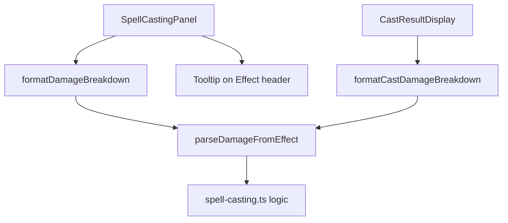

# Design Document: Spell Damage Clarity

## Overview

This feature enhances the spell damage display in two areas of the UI: the Spell Table (in `SpellCastingPanel`) and the Cast Result Dialog (`CastResultDisplay`). Currently, spells show raw effect text like "Magic missile Dmg +4" without explaining that total damage = modifier + casting SL. This design introduces:

1. A **damage formula annotation** rendered below magic missile effect text in the spell table
2. A **step-by-step damage breakdown** in the cast result dialog
3. A **tooltip on the Effect column header** explaining the damage convention

The changes are purely presentational — no game logic changes. The existing `parseDamageFromEffect` and `computeMagicMissileDamage` functions already contain the calculation logic; this feature surfaces that information to the user.

## Architecture

The feature follows the existing component architecture:



**Key architectural decisions:**

1. **Pure formatting functions** — All new logic lives in pure utility functions (`formatDamageBreakdown`, `formatCastDamageBreakdown`) that transform data into display strings. No side effects.
2. **Co-located with existing logic** — Formatting functions are added to `spell-casting.ts` since they depend on the same parsing logic already there.
3. **Minimal component changes** — `SpellCastingPanel` and `CastResultDisplay` receive small, targeted edits to call the new formatters.

## Components and Interfaces

### New Functions (in `src/logic/spell-casting.ts`)

```typescript
/**
 * Formats the damage formula for display in the spell table.
 * Returns null for non-magic-missile spells.
 *
 * Examples:
 *   "Dmg +4"  → "Dmg: 4 + SL"
 *   "Dmg WPB" → "Dmg: WPB(4) + SL"  (if wpBonus=4)
 *   "Dmg TB"  → "Dmg: TB(3) + SL"   (if tbBonus=3)
 *   "Healing" → null
 */
export function formatDamageBreakdown(
  spell: SpellItem,
  wpBonus: number,
  tbBonus: number,
): string | null;

/**
 * Formats the damage breakdown for the cast result dialog.
 * Shows the full arithmetic: modifier + SL(X) = Total
 * or modifier + SL(X) + Overcast(Y) = Total when overcast applies.
 *
 * Examples:
 *   (4, 3, 0) → "4 + SL(3) = 7"
 *   (4, 3, 2) → "4 + SL(3) + Overcast(2) = 9"
 */
export function formatCastDamageBreakdown(
  damageModifier: number,
  castingSL: number,
  overcastBonus?: number,
): string;
```

### Modified Components

**SpellCastingPanel.tsx** — Changes to the Effect cell:
- Call `formatDamageBreakdown(spell, wpBonus, tbBonus)` for each spell row
- If result is non-null, render a secondary line below the effect text with the formula
- Add an info icon (from `lucide-react`) next to the "Effect" column header with a tooltip

**CastResultDisplay.tsx** — Changes to the magic missile section:
- Replace the simple `Damage: {damage}` text with the output of `formatCastDamageBreakdown`
- Pass the overcast damage allocation (if any) to include in the breakdown

### Tooltip Component

A lightweight inline tooltip using CSS and `aria-describedby` for accessibility:
- Triggered on hover, focus, and tap (mobile)
- Uses existing CSS module pattern
- No external tooltip library needed — keeps bundle size minimal

## Data Models

No new data models are introduced. The feature uses existing interfaces:

- **SpellItem** — `{ name, cn, range, target, duration, effect, memorized? }` — unchanged
- **CastingResult** — `{ isMagicMissile, hitLocation, damage, slAchieved, overcastSlots, ... }` — unchanged
- **Character** — `{ chars: { WP: { i, a, b }, T: { i, a, b } } }` — read-only access to compute bonuses

The `formatDamageBreakdown` function needs the resolved WPB and TB values. These are computed in the component from `character.chars.WP` and `character.chars.T` using the existing `getBonus()` utility (from `calculators.ts`), which returns `Math.floor(value / 10)`.

## Correctness Properties

*A property is a characteristic or behavior that should hold true across all valid executions of a system — essentially, a formal statement about what the system should do. Properties serve as the bridge between human-readable specifications and machine-verifiable correctness guarantees.*

### Property 1: Damage formula formatting resolves correct modifier

*For any* magic missile spell effect text matching one of the recognized patterns ("Dmg +N", "Dmg WPB", "Dmg TB") and any valid character bonus values (wpBonus ≥ 0, tbBonus ≥ 0), `formatDamageBreakdown` SHALL return a string of the form "Dmg: <resolved_value> + SL" where `<resolved_value>` equals:
- N for "Dmg +N" patterns
- "WPB(X)" where X = wpBonus for "Dmg WPB" patterns
- "TB(X)" where X = tbBonus for "Dmg TB" patterns

**Validates: Requirements 1.2, 1.3, 1.4**

### Property 2: Non-magic-missile spells produce no breakdown

*For any* spell whose effect text does not match the magic missile detection criteria (does not contain "dmg", "damage", or "magic missile" case-insensitive), `formatDamageBreakdown` SHALL return null.

**Validates: Requirements 1.5**

### Property 3: Cast result breakdown arithmetic is correct (without overcast)

*For any* damage modifier (0 ≤ M ≤ 20) and casting SL (0 ≤ SL ≤ 10), `formatCastDamageBreakdown(M, SL)` SHALL return a string matching the format "M + SL(X) = T" where T = M + X and X = SL.

**Validates: Requirements 2.2**

### Property 4: Cast result breakdown arithmetic is correct (with overcast)

*For any* damage modifier (0 ≤ M ≤ 20), casting SL (0 ≤ SL ≤ 10), and overcast bonus (1 ≤ O ≤ 7), `formatCastDamageBreakdown(M, SL, O)` SHALL return a string matching the format "M + SL(X) + Overcast(Y) = T" where T = M + X + Y, X = SL, and Y = O.

**Validates: Requirements 2.3**

## Error Handling

This feature is purely presentational with no failure modes that require recovery:

| Scenario | Handling |
|----------|----------|
| `parseDamageFromEffect` returns 0 (no match) | `formatDamageBreakdown` returns `"Dmg: 0 + SL"` — still valid |
| Spell effect text is empty string | `isMagicMissile` returns false → no breakdown shown |
| WPB or TB is 0 | Displays "WPB(0) + SL" or "TB(0) + SL" — correct per game rules |
| Overcast bonus is 0 or undefined | `formatCastDamageBreakdown` omits the overcast component |
| `damage` is null in CastingResult | Magic missile section not rendered (existing guard) |

No new error states are introduced. The existing null checks in `CastResultDisplay` (the `isMagicMissile && castSuccess` guard) already prevent rendering when data is unavailable.

## Testing Strategy

### Property-Based Tests (fast-check, vitest)

The feature's pure formatting functions are ideal for property-based testing. Each property test runs minimum 100 iterations.

- **Library**: `fast-check` (already in devDependencies)
- **Runner**: `vitest` (already configured)
- **Tag format**: `Feature: spell-damage-clarity, Property N: <text>`

Property tests cover:
1. `formatDamageBreakdown` correctly resolves all effect patterns
2. `formatDamageBreakdown` returns null for non-magic-missile spells
3. `formatCastDamageBreakdown` produces correct arithmetic without overcast
4. `formatCastDamageBreakdown` produces correct arithmetic with overcast

### Unit Tests (example-based, vitest)

- Tooltip renders on hover/focus/tap with correct text (Requirement 3.2, 3.3)
- Help indicator icon is present in Effect column header (Requirement 3.1)
- Integration: SpellCastingPanel renders breakdown below effect text for magic missile spells
- Integration: CastResultDisplay shows formatted breakdown instead of plain number

### Accessibility Testing

- Tooltip is keyboard-accessible (focus triggers display)
- `aria-describedby` links the help icon to tooltip content
- Screen readers announce the tooltip content
