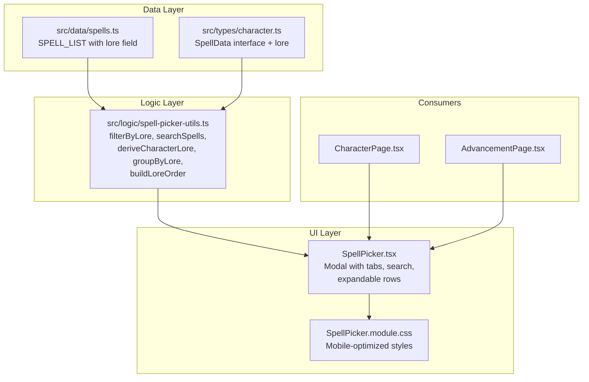

# Design Document: Spell Picker Improvements

## Overview

This feature replaces the generic flat-list `Picker` usage for spell selection with a dedicated `SpellPicker` component that provides lore-based grouping, filter tabs, text search, inline detail preview, character lore relevance, and already-known spell indication. The existing `Picker` component remains unchanged for other use cases (talents, trappings, careers). The new `SpellPicker` is a purpose-built modal that extends the same visual language but adds specialized spell-browsing behaviour.

### Key Design Decisions

1. **New dedicated component** rather than extending the generic `Picker` — the spell picker has enough unique behaviour (filter tabs, expandable detail, lore pre-selection, already-known marking) that it warrants its own component rather than overcomplicating the generic one.
2. **Lore tag added to `SpellData` type and static data** — a `lore` field is added to each entry in `SPELL_LIST`. This is a data-layer change that propagates zero runtime cost.
3. **Pure logic extraction** — filtering, grouping, lore-matching, and relevance detection are implemented as pure utility functions in a dedicated module (`src/logic/spell-picker-utils.ts`), making them independently testable with property-based tests.
4. **CSS Modules for styling** — consistent with the rest of the project.

## Architecture



### Data Flow

1. `SpellPicker` receives `spells: SpellData[]` (the full `SPELL_LIST`), the character's talent list, and the character's existing spell list.
2. On mount, `deriveCharacterLore(talents)` determines the character's lore(s) and pre-selects the appropriate filter tab.
3. User interactions (tab selection, text search) feed into pure filter functions that produce the displayed subset.
4. Selecting a spell fires `onSelect(spell)` — the same callback pattern as the generic `Picker`.

## Components and Interfaces

### New Component: `SpellPicker`

**File:** `src/components/shared/SpellPicker.tsx`

```typescript
interface SpellPickerProps {
  spells: SpellData[];
  characterTalents: Talent[];
  knownSpellNames: Set<string>;
  onSelect: (spell: SpellData) => void;
  onClose: () => void;
  title?: string;
}
```

**Internal state:**
- `activeLore: string | null` — the currently selected lore filter tab (`null` = "All")
- `searchText: string` — current text search input
- `expandedSpell: string | null` — name of the spell currently expanded for detail preview

### New Logic Module: `src/logic/spell-picker-utils.ts`

```typescript
/** Canonical lore ordering for display */
export const LORE_DISPLAY_ORDER: string[];

/** Derive the character's primary lore from their talents */
export function deriveCharacterLore(talents: Talent[]): string | null;

/** Filter spells by a lore category (null = all) */
export function filterByLore(spells: SpellData[], lore: string | null): SpellData[];

/** Filter spells by name search (case-insensitive substring match) */
export function searchSpells(spells: SpellData[], query: string): SpellData[];

/** Compose lore filter + text search */
export function filterSpells(
  spells: SpellData[],
  lore: string | null,
  query: string
): SpellData[];

/** Group spells by lore, preserving LORE_DISPLAY_ORDER */
export function groupByLore(spells: SpellData[]): { lore: string; spells: SpellData[] }[];

/** Get the list of lore tabs to display based on available spells */
export function getAvailableLores(spells: SpellData[]): string[];
```

### Modified Type: `SpellData`

```typescript
// In src/types/character.ts
export interface SpellData {
  name: string;
  cn: string;
  range: string;
  target: string;
  duration: string;
  effect: string;
  lore: string;  // NEW — lore category tag
}
```

### New CSS Module: `SpellPicker.module.css`

Provides styles for:
- Full-viewport modal on mobile (`< 768px`)
- Horizontally-scrollable lore filter tabs with momentum scrolling
- Sticky group headers
- Expandable spell detail rows
- Already-known spell visual treatment (muted + checkmark)
- 44px minimum tap targets

## Data Models

### Lore Categories (Canonical List)

```typescript
export const LORE_CATEGORIES = [
  "Petty",
  "Arcane",
  "Arcane Utility",
  "Lore of Beasts",
  "Lore of Death",
  "Lore of Fire",
  "Lore of Heavens",
  "Lore of Metal",
  "Lore of Life",
  "Lore of Light",
  "Lore of Shadows",
  "Blessings",
  "Lore of Hedgecraft",
  "Lore of Witchcraft",
  "Lore of Daemonology",
  "Lore of Necromancy",
  "Chaos",
  "Elven Petty",
  "Elven Arcane",
  "High Magic",
  "Magic of Vaul",
  "Magic of Mathlann",
  "Magic of Hoeth",
  "Miracles of Manann",
  "Miracles of Morr",
  "Miracles of Myrmidia",
] as const;
```

### Talent-to-Lore Mapping

The `deriveCharacterLore` function recognises these talent patterns:

| Talent Pattern | Derived Lore |
|---|---|
| `Arcane Magic (Fire)` / `Arcane Magic (Aqshy)` | `"Lore of Fire"` |
| `Arcane Magic (Beasts)` / `Arcane Magic (Ghur)` | `"Lore of Beasts"` |
| `Arcane Magic (Death)` / `Arcane Magic (Shyish)` | `"Lore of Death"` |
| `Arcane Magic (Heavens)` / `Arcane Magic (Azyr)` | `"Lore of Heavens"` |
| `Arcane Magic (Metal)` / `Arcane Magic (Chamon)` | `"Lore of Metal"` |
| `Arcane Magic (Life)` / `Arcane Magic (Ghyran)` | `"Lore of Life"` |
| `Arcane Magic (Light)` / `Arcane Magic (Hysh)` | `"Lore of Light"` |
| `Arcane Magic (Shadows)` / `Arcane Magic (Ulgu)` | `"Lore of Shadows"` |
| `Arcane Magic (Hedgecraft)` | `"Lore of Hedgecraft"` |
| `Arcane Magic (Witchcraft)` | `"Lore of Witchcraft"` |
| `Arcane Magic (Daemonology)` | `"Lore of Daemonology"` |
| `Arcane Magic (Necromancy)` | `"Lore of Necromancy"` |
| `Chaos Magic (*)` | `"Chaos"` |
| `Invoke (Manann)` | `"Miracles of Manann"` |
| `Invoke (Morr)` | `"Miracles of Morr"` |
| `Invoke (Myrmidia)` | `"Miracles of Myrmidia"` |
| `Petty Magic` (alone, no arcane) | `"Petty"` |

### Lore Display Order

Spells are grouped in this fixed order:
1. Petty
2. Arcane
3. Arcane Utility
4. College Lores (alphabetically: Beasts, Death, Fire, Heavens, Life, Light, Metal, Shadows)
5. Supplemental lores (Hedgecraft, Witchcraft, Daemonology, Necromancy, Chaos)
6. Elven (Elven Petty, Elven Arcane, High Magic, Magic of Vaul, Magic of Mathlann, Magic of Hoeth)
7. Blessings
8. Miracles (Manann, Morr, Myrmidia)


## Correctness Properties

*A property is a characteristic or behavior that should hold true across all valid executions of a system — essentially, a formal statement about what the system should do. Properties serve as the bridge between human-readable specifications and machine-verifiable correctness guarantees.*

### Property 1: Every spell has a valid lore category

*For any* spell entry in SPELL_LIST, its `lore` field must be a non-empty string that is a member of the canonical LORE_CATEGORIES set.

**Validates: Requirements 1.2, 1.3**

### Property 2: Group assignment correctness

*For any* list of spells with lore tags, when grouped by `groupByLore`, every spell within a group must have a `lore` field value that matches that group's label, and the total count of spells across all groups must equal the input list length (no spells lost or duplicated).

**Validates: Requirements 2.1, 2.3**

### Property 3: Group ordering preserves canonical order

*For any* subset of spells from the spell list, when grouped by `groupByLore`, the resulting group labels must appear in the same relative order as the canonical LORE_DISPLAY_ORDER array.

**Validates: Requirements 2.4**

### Property 4: Lore filter returns only matching spells

*For any* valid lore category and any spell list, `filterByLore(spells, lore)` returns only spells whose `lore` field equals the given category. When the lore parameter is null, it returns the complete input list unchanged.

**Validates: Requirements 3.2, 3.3**

### Property 5: Available lores matches unique lores in data

*For any* list of spells, `getAvailableLores(spells)` returns exactly the set of unique `lore` values present in that list, with no extra or missing entries.

**Validates: Requirements 3.4**

### Property 6: Text search filters by case-insensitive name match

*For any* query string and any spell list, `searchSpells(spells, query)` returns exactly those spells whose `name.toLowerCase()` contains `query.toLowerCase()`. An empty query returns all spells unchanged.

**Validates: Requirements 4.2, 4.4**

### Property 7: Filter composition is equivalent to sequential application

*For any* lore category (or null), any query string, and any spell list, `filterSpells(spells, lore, query)` produces the same result as `searchSpells(filterByLore(spells, lore), query)`.

**Validates: Requirements 4.3**

### Property 8: Lore derivation from talents

*For any* talent list, `deriveCharacterLore(talents)` returns a non-null lore string if and only if at least one talent matches the patterns "Arcane Magic (X)", "Chaos Magic (X)", "Invoke (X)", or "Petty Magic". When no talent matches, it returns null.

**Validates: Requirements 5.1, 5.4, 5.5**

### Property 9: Known spells are never excluded from filtered results

*For any* spell list, lore filter, and search query, the set of spells returned by `filterSpells` is independent of which spells are in the character's known set — known status does not affect filtering or grouping output.

**Validates: Requirements 8.1, 8.3**

## Error Handling

| Scenario | Handling |
|---|---|
| `SPELL_LIST` entry missing `lore` field | TypeScript compilation error prevents this; runtime fallback: treat as "Petty" |
| Character has no talents at all | `deriveCharacterLore([])` returns `null`; picker defaults to "All" tab |
| Talent has malformed parenthetical (e.g., "Arcane Magic ()") | Regex match fails gracefully; function returns `null` |
| Search query with regex-special characters | Search uses `String.includes()`, not regex; no escaping needed |
| Spell list is empty | `groupByLore([])` returns `[]`; UI shows "No spells found" empty state |
| Very long spell effect text in detail preview | CSS `word-break: break-word` and max-height with scroll on mobile |

## Testing Strategy

### Property-Based Tests (fast-check)

The project already uses `fast-check` with `vitest`. Each correctness property above maps to a property-based test in `src/logic/__tests__/spell-picker-utils.property.test.ts`.

- **Library:** fast-check (already in devDependencies)
- **Runner:** vitest (already configured)
- **Minimum iterations:** 100 per property
- **Tag format:** `Feature: spell-picker-improvements, Property {N}: {title}`

Tests will use arbitraries to generate:
- Random spell lists with varying lore assignments
- Random search strings (including empty, whitespace, unicode)
- Random talent lists with and without lore-granting patterns
- Random subsets of the canonical spell list

### Unit Tests (Example-Based)

Located in `src/components/shared/__tests__/SpellPicker.test.tsx`:

- Render test: picker opens with lore tabs visible
- Render test: clicking a tab shows only matching spells
- Render test: expanding a spell shows detail fields
- Render test: already-known spells display with disabled styling
- Render test: tapping known spell does not fire onSelect
- Render test: search input filters displayed spells
- Render test: empty results show "No spells found" message

Located in `src/logic/__tests__/spell-picker-utils.test.ts`:

- Specific examples for `deriveCharacterLore`: "Arcane Magic (Fire)" → "Lore of Fire"
- Specific examples for `deriveCharacterLore`: "Petty Magic" alone → "Petty"
- Specific examples for `deriveCharacterLore`: "Invoke (Morr)" → "Miracles of Morr"
- Edge case: talent "Arcane Magic" without parenthetical → null

### Integration Tests

- Mobile viewport render: verify full-height modal, 44px tap targets
- Scroll lock: verify body overflow hidden when picker open
- Pre-selection: verify character with "Arcane Magic (Fire)" opens to "Lore of Fire" tab
