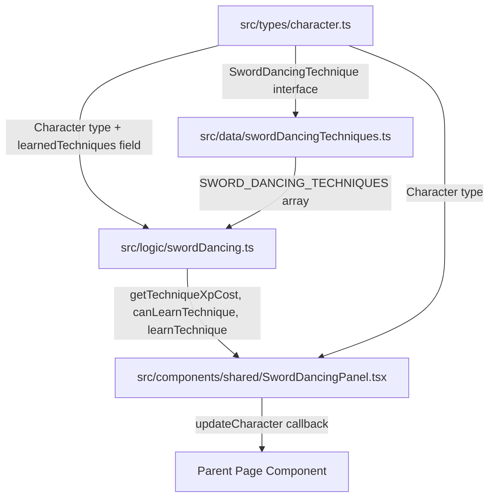

# Design Document: Sword-dancing Techniques

## Overview

This feature adds the Sword-dancing techniques subsystem to the WFRP 4e character sheet PWA. It follows the same architectural pattern as the existing Rune subsystem (data catalogue → logic functions → UI components) to maintain consistency.

The system allows characters with the "Sword-dancing" talent to learn up to 10 canonical techniques at escalating XP costs. The first technique ("Ritual of Cleansing") is granted free with the talent; subsequent techniques cost `N × 100` XP where N is the number of techniques already known.

### Key Design Decisions

- **Follow the Rune pattern**: The Rune subsystem (`src/data/runes.ts`, `src/logic/runes.ts`, `RuneLearningPanel.tsx`) provides a proven pattern for "learn items for XP cost, track on character state." This feature mirrors that structure.
- **Type in `src/types/character.ts`**: The `SwordDancingTechnique` interface lives alongside other shared types to avoid circular imports, consistent with how `RuneDefinition` is exported from its data module.
- **Optional field with backward compatibility**: `learnedTechniques?: string[]` on `Character` — undefined is treated as `[]` to support loading older saves.
- **Pure logic functions**: All state transformations are pure functions returning new `Character` objects, matching the existing immutable update pattern.

## Architecture



The architecture has three layers:

1. **Data Layer** (`src/data/swordDancingTechniques.ts`) — Static technique definitions
2. **Logic Layer** (`src/logic/swordDancing.ts`) — Pure functions for cost calculation, validation, and state transformation
3. **UI Layer** (`src/components/shared/SwordDancingPanel.tsx`) — React component for display and interaction

## Components and Interfaces

### SwordDancingPanel (React Component)

```typescript
interface SwordDancingPanelProps {
  character: Character;
  updateCharacter: (mutator: (char: Character) => Character) => void;
}
```

Responsibilities:
- Display learned and unlearned techniques in order
- Show XP cost for the next technique
- Provide "Learn" buttons with confirmation
- Disable actions when prerequisites are not met
- Only render when character has the "Sword-dancing" talent

The component follows the same structure as `RuneLearningPanel`:
- Uses `Card` and `SectionHeader` shared components
- Displays current XP badge
- Lists techniques with learned/available/unavailable states
- Uses CSS Modules for styling (`SwordDancingPanel.module.css`)

### Logic Functions

```typescript
// src/logic/swordDancing.ts

export function getTechniqueById(id: string): SwordDancingTechnique | undefined;
export function getTechniqueXpCost(knownCount: number): number;
export function canLearnTechnique(techniqueId: string, character: Character): { canLearn: boolean; error?: string };
export function learnTechnique(character: Character, techniqueId: string): Character;
export function hasSwordDancingTalent(character: Character): boolean;
export function getLearnedTechniques(character: Character): string[];
```

## Data Models

### SwordDancingTechnique Interface

Added to `src/types/character.ts`:

```typescript
export interface SwordDancingTechnique {
  id: string;          // kebab-case identifier, e.g. "ritual-of-cleansing"
  name: string;        // Display name, e.g. "Ritual of Cleansing"
  sl: number;          // Target Success Levels required (1-4)
  description: string; // Effect description
  order: number;       // Learning sequence position (1-10)
}
```

### Character Type Extension

Added to the `Character` interface:

```typescript
export interface Character {
  // ... existing fields ...
  learnedTechniques?: string[];  // Array of technique ids
}
```

The field is optional (`?`) for backward compatibility. Logic functions use `character.learnedTechniques ?? []` to handle undefined.

### Static Data Array

`src/data/swordDancingTechniques.ts` exports:

```typescript
export const SWORD_DANCING_TECHNIQUES: SwordDancingTechnique[] = [
  { id: "ritual-of-cleansing", name: "Ritual of Cleansing", sl: 1, order: 1, description: "..." },
  { id: "flight-of-the-phoenix", name: "Flight of the Phoenix", sl: 1, order: 2, description: "..." },
  { id: "path-of-the-sun", name: "Path of the Sun", sl: 1, order: 3, description: "..." },
  { id: "path-of-frost", name: "Path of Frost", sl: 1, order: 4, description: "..." },
  { id: "path-of-the-storm", name: "Path of the Storm", sl: 1, order: 5, description: "..." },
  { id: "path-of-the-rain", name: "Path of the Rain", sl: 2, order: 6, description: "..." },
  { id: "shadows-of-loec", name: "Shadows of Loec", sl: 2, order: 7, description: "..." },
  { id: "path-of-the-hawk", name: "Path of the Hawk", sl: 3, order: 8, description: "..." },
  { id: "path-of-falling-water", name: "Path of Falling Water", sl: 3, order: 9, description: "..." },
  { id: "final-stroke-of-the-master", name: "Final Stroke of the Master", sl: 4, order: 10, description: "..." },
];
```

### Advancement Log Entry

When a technique is learned, an `AdvancementEntry` is created:

```typescript
{
  timestamp: Date.now(),
  type: 'technique',
  name: technique.name,
  from: 0,
  to: 1,
  xpCost: calculatedCost,
  careerLevel: character.careerLevel,
  inCareer: true,
}
```

## Correctness Properties

*A property is a characteristic or behavior that should hold true across all valid executions of a system — essentially, a formal statement about what the system should do. Properties serve as the bridge between human-readable specifications and machine-verifiable correctness guarantees.*

### Property 1: XP cost scales linearly with known technique count

*For any* valid count of known techniques N (where 1 ≤ N ≤ 9), `getTechniqueXpCost(N)` SHALL return exactly `N * 100`.

**Validates: Requirements 4.1, 4.3, 8.2**

### Property 2: Learning a technique produces correct state transformation

*For any* character that has the Sword-dancing talent, has sufficient XP, and has not already learned a given technique, calling `learnTechnique(character, techniqueId)` SHALL produce a new character where: (a) `xpCur` is decreased by exactly `getTechniqueXpCost(knownCount)`, (b) `xpSpent` is increased by the same amount, (c) `learnedTechniques` contains the new technique id, and (d) `advancementLog` has a new entry with type "technique" and the correct XP cost.

**Validates: Requirements 5.1, 5.2, 5.3, 8.3**

### Property 3: Guard conditions prevent invalid learning

*For any* character state and technique id, `canLearnTechnique` SHALL return `{ canLearn: false }` when any of the following hold: (a) the character lacks the "Sword-dancing" talent, (b) the character has insufficient XP for the next technique cost, or (c) the technique id is already in `learnedTechniques`.

**Validates: Requirements 5.4, 5.5, 5.6, 8.4, 8.5, 8.6**

### Property 4: Technique lookup round-trip

*For any* technique in the `SWORD_DANCING_TECHNIQUES` array, looking up that technique by its `id` using `getTechniqueById` SHALL return the original technique object with identical `name`, `sl`, `order`, and `description` fields.

**Validates: Requirements 8.7**

### Property 5: Adding learnedTechniques preserves all other character fields

*For any* valid `Character` object, the `learnTechnique` function SHALL not modify any field other than `xpCur`, `xpSpent`, `learnedTechniques`, and `advancementLog`. All other fields SHALL remain strictly equal to their original values.

**Validates: Requirements 3.3, 9.1**

## Error Handling

| Scenario | Handler | Behavior |
|----------|---------|----------|
| Character lacks Sword-dancing talent | `canLearnTechnique` | Returns `{ canLearn: false, error: "Requires Sword-dancing talent." }` |
| Insufficient XP | `canLearnTechnique` | Returns `{ canLearn: false, error: "Insufficient XP. Need X, have Y." }` |
| Technique already learned | `canLearnTechnique` | Returns `{ canLearn: false, error: "This technique is already known." }` |
| Unknown technique id | `getTechniqueById` | Returns `undefined` |
| Unknown technique id | `canLearnTechnique` | Returns `{ canLearn: false, error: "Unknown technique." }` |
| `learnedTechniques` undefined on loaded character | `getLearnedTechniques` | Returns `[]` (empty array) |

All error states are handled gracefully without throwing exceptions. The UI disables learn buttons and displays the error message from `canLearnTechnique` when learning is not possible.

## Testing Strategy

### Dual Testing Approach

**Property-Based Tests** (using `fast-check` with Vitest):
- Minimum 100 iterations per property test
- Each test references its design document property via tag comment
- Tag format: `Feature: sword-dancing-techniques, Property N: <property_text>`
- Tests focus on the pure logic functions in `src/logic/swordDancing.ts`

**Unit Tests** (example-based with Vitest):
- Verify all 10 techniques exist with correct static data
- Verify UI component renders correctly with various character states
- Verify backward compatibility (loading characters without `learnedTechniques`)
- Verify the "Sword-dancing" talent entry in `TALENT_DB` remains unchanged

### Test File Structure

```
src/logic/__tests__/swordDancing.test.ts        — Unit tests for logic functions
src/logic/__tests__/swordDancing.property.test.ts — Property-based tests
src/components/__tests__/SwordDancingPanel.test.tsx — Component tests
```

### Property Test Configuration

- Library: `fast-check` (already available in the project ecosystem via Vitest)
- Iterations: 100 minimum per property
- Generators: Custom arbitraries for `Character` objects with varying XP, talents, and learnedTechniques states

### What Each Test Type Covers

| Test Type | Covers |
|-----------|--------|
| Property tests | XP cost formula, state transformation correctness, guard conditions, round-trip lookup, field preservation |
| Unit tests | Static data integrity (all 10 techniques), specific edge cases, backward compatibility |
| Component tests | Conditional rendering, button enable/disable states, learn flow with confirmation |
