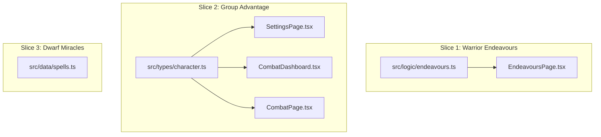
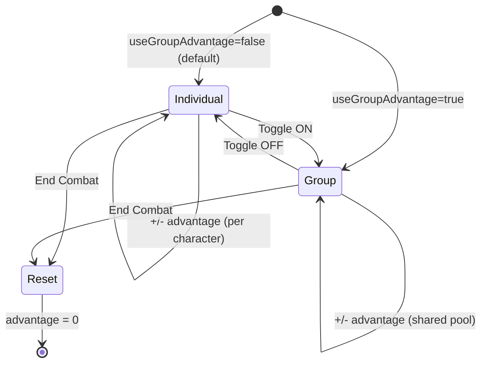

# Design Document: Tier 1 Content Gaps

## Overview

This feature addresses three content gaps in the WFRP 4e character sheet PWA by integrating material from two expansion sourcebooks:

1. **Warrior Endeavours** — Add five new class-specific endeavours for Warriors from Up in Arms Appendix II
2. **Group Advantage Toggle** — Add a house rule toggle that switches advantage tracking from per-character to a shared party pool (Up in Arms Appendix I)
3. **Dwarf Deity Miracles** — Add miracles for all seven Dwarf Ancestor Gods from the Dwarf Players Guide Chapter VI

All three items extend existing data structures and UI patterns. No new pages, routes, or major architectural changes are needed.

## Architecture

The changes are isolated to three vertical slices with minimal coupling between them:



**Key architectural decisions:**

- **No new components** — The Group Advantage toggle reuses the existing toggle pattern in SettingsPage. The CombatDashboard conditionally changes its label text based on the house rule flag.
- **No new storage field** — Group Advantage reuses the existing `character.advantage` numeric field. The semantics change from "individual" to "group" based on the `useGroupAdvantage` flag, but the underlying storage is identical.
- **Data-only changes for miracles** — Adding spell entries to `SPELL_LIST` requires no UI changes since the spell picker already displays all entries from that array.
- **Backward compatibility by default** — The new `useGroupAdvantage` field defaults to `false`. Existing saved characters missing this field will behave identically to before via nullish coalescing.

## Components and Interfaces

### Modified Interfaces

#### `HouseRules` (src/types/character.ts)

```typescript
export interface HouseRules {
  rangedDamageSBMode: RangedDamageSBMode;
  impaleCritsOnTens: boolean;
  min1Wound: boolean;
  advantageCap: number;
  useGroupAdvantage: boolean;  // NEW — defaults to false
}
```

#### `BLANK_CHARACTER` default update

```typescript
houseRules: {
  rangedDamageSBMode: 'none',
  impaleCritsOnTens: false,
  min1Wound: true,
  advantageCap: 10,
  useGroupAdvantage: false,  // NEW
}
```

### Modified Modules

#### `src/logic/endeavours.ts`

The `CLASS_ENDEAVOURS` record for the `"Warriors"` key will be expanded:

```typescript
Warriors: ['Combat Training', 'Drill', 'Challenge', 'Seek Patronage', 'Establish Contacts', 'Tournament'],
```

#### `src/components/pages/SettingsPage.tsx`

A new toggle item will be added within the House Rules card, using the existing `toggleRow` / `toggleBtnOn` / `toggleBtnOff` pattern:

```tsx
{/* Group Advantage */}
<div className={styles.ruleItem}>
  <div className={styles.toggleRow}>
    <div className={styles.toggleInfo}>
      <div className={styles.ruleLabel}>Group Advantage</div>
      <div className={styles.ruleDesc}>Party shares a single advantage pool (Up in Arms)</div>
    </div>
    <button
      type="button"
      onClick={() => update('houseRules.useGroupAdvantage', !character.houseRules.useGroupAdvantage)}
      className={character.houseRules.useGroupAdvantage ? styles.toggleBtnOn : styles.toggleBtnOff}
    >
      {character.houseRules.useGroupAdvantage ? 'ON' : 'OFF'}
    </button>
  </div>
</div>
```

#### `src/components/combat/CombatDashboard.tsx`

The Advantage section will conditionally display "Group Advantage" vs "Advantage" based on a new `useGroupAdvantage` prop:

```tsx
// In CombatDashboardProps:
useGroupAdvantage?: boolean;

// In the label rendering:
<span className={styles.label}>
  {useGroupAdvantage ? 'Group Advantage' : 'Advantage'}
</span>
```

The increment/decrement/reset logic remains unchanged — it already operates on the same `advantage` field and respects `advantageCap`.

#### `src/components/pages/CombatPage.tsx`

Pass the new prop through from character data:

```tsx
<CombatDashboard
  // ...existing props
  useGroupAdvantage={character.houseRules?.useGroupAdvantage ?? false}
/>
```

The `endCombat` function already resets `advantage` to 0, so no changes needed for combat-end behavior.

#### `src/data/spells.ts`

New miracle entries will be appended after the existing "MIRACLES OF MYRMIDIA" section. Each deity gets a comment header and entries following the established `SpellData` format:

```typescript
// MIRACLES OF GRUNGNI
{name:"...",cn:"4",range:"...",target:"...",duration:"...",effect:"..."},
// ...

// MIRACLES OF VALAYA
// ...

// MIRACLES OF GRIMNIR
// ...

// MIRACLES OF GAZUL
// ...

// MIRACLES OF SMEDNIR
// ...

// MIRACLES OF THUNGNI
// ...

// MIRACLES OF MORGRIM
// ...
```

Each miracle entry will have:
- `cn` > "0" (distinguishing from Blessings)
- Concise `effect` descriptions matching the terse style of existing entries
- Data extracted from `dwarfguide.md` Chapter VI miracle tables

## Data Models

### Warrior Endeavours Data

No new data model. The existing `CLASS_ENDEAVOURS` record adds five new string entries to the `"Warriors"` key array:

| Endeavour | Source |
|-----------|--------|
| Combat Training | Already exists (retained) |
| Drill | Up in Arms |
| Challenge | Up in Arms |
| Seek Patronage | Up in Arms |
| Establish Contacts | Up in Arms |
| Tournament | Up in Arms |

### Group Advantage State

No new fields on `Character`. The feature reuses:
- `character.advantage: number` — stores the advantage value (individual or group)
- `character.houseRules.useGroupAdvantage: boolean` — determines interpretation

State transitions:



### Dwarf Miracle Spell Data

Each miracle follows the existing `SpellData` interface:

```typescript
interface SpellData {
  name: string;    // e.g., "Forge Blessing"
  cn: string;      // e.g., "6" (always > "0" for miracles)
  range: string;   // e.g., "Touch", "WP yards"
  target: string;  // e.g., "1", "AoE WPB yds"
  duration: string; // e.g., "WPB rounds", "Instant"
  effect: string;  // Concise effect description
}
```

Miracles are stored as entries in the flat `SPELL_LIST` array, organized by comment section headers. No separate data structure or index is needed since the existing spell picker and character spell list handle them identically to arcane spells.


## Correctness Properties

*A property is a characteristic or behavior that should hold true across all valid executions of a system — essentially, a formal statement about what the system should do. Properties serve as the bridge between human-readable specifications and machine-verifiable correctness guarantees.*

### Property 1: Advantage cap is universally enforced

*For any* non-negative advantage value and any positive advantage cap, calling `incrementAdvantage(value, cap)` SHALL produce a result that is at most equal to `cap`. This holds regardless of whether the advantage represents individual or group mode.

**Validates: Requirements 3.3**

### Property 2: Missing useGroupAdvantage defaults to false

*For any* character data object that does not contain the `useGroupAdvantage` field in its `houseRules`, the application SHALL resolve the field value to `false` via nullish coalescing without throwing an error.

**Validates: Requirements 2.2, 12.1**

### Property 3: Dwarf miracle data integrity

*For any* spell entry in `SPELL_LIST` that belongs to a Dwarf Ancestor God miracle section (Grungni, Valaya, Grimnir, Gazul, Smednir, Thungni, or Morgrim), the entry SHALL have all six `SpellData` fields (`name`, `cn`, `range`, `target`, `duration`, `effect`) as non-empty strings, and the `cn` field SHALL parse to an integer greater than 0.

**Validates: Requirements 4.1, 4.2, 4.3, 4.4, 5.1, 5.2, 5.3, 5.4, 6.1, 6.2, 6.3, 6.4, 7.1, 7.2, 7.3, 7.4, 8.1, 8.2, 8.3, 8.4, 9.1, 9.2, 9.3, 9.4, 10.1, 10.2, 10.3, 10.4, 11.3**

### Property 4: Miracle name normalization

*For any* Dwarf miracle entry in `SPELL_LIST`, the `name` field SHALL contain no leading/trailing whitespace, no consecutive internal spaces, and no OCR/formatting artifacts (e.g., no stray punctuation from PDF extraction).

**Validates: Requirements 11.5**

## Error Handling

### Backward Compatibility

The primary error scenario is loading saved character data that predates the `useGroupAdvantage` field:

- **Strategy**: Use nullish coalescing (`character.houseRules?.useGroupAdvantage ?? false`) wherever the field is read.
- **No migration needed**: The field defaults to `false`, which preserves existing behavior exactly.
- **TypeScript enforcement**: The field is added as required on the `HouseRules` interface, with `BLANK_CHARACTER` providing the default. Existing serialized data may omit it, so all read sites use defensive access.

### Invalid Advantage State

If somehow `advantage` becomes negative (e.g., from external JSON manipulation):
- `decrementAdvantage` already floors at 0
- `incrementAdvantage` will correct by incrementing from current value toward cap

### Spell Data Errors

Miracle data is static and compile-time checked against the `SpellData` interface. No runtime error handling is needed — TypeScript type checking catches malformed entries at build time.

## Testing Strategy

### Unit Tests (Example-Based)

| Test | What it verifies |
|------|-----------------|
| Warriors endeavour list contains all 6 entries | Req 1.1, 1.2 |
| BLANK_CHARACTER.houseRules.useGroupAdvantage is false | Req 2.1 |
| SettingsPage renders Group Advantage toggle | Req 2.3 |
| Toggle ON calls update with true | Req 2.4 |
| Toggle OFF calls update with false | Req 2.5 |
| CombatDashboard shows "Advantage" when useGroupAdvantage=false | Req 3.1 |
| CombatDashboard shows "Group Advantage" when useGroupAdvantage=true | Req 3.2 |
| End combat resets advantage to 0 in group mode | Req 3.5 |
| SPELL_LIST contains Grungni miracles by name | Req 4.1 |
| SPELL_LIST contains Valaya miracles by name | Req 5.1 |
| SPELL_LIST contains Grimnir miracles by name | Req 6.1 |
| SPELL_LIST contains Gazul miracles by name | Req 7.1 |
| SPELL_LIST contains Smednir miracles by name | Req 8.1 |
| SPELL_LIST contains Thungni miracles by name | Req 9.1 |
| SPELL_LIST contains Morgrim miracles by name | Req 10.1 |

### Property-Based Tests (fast-check, min 100 iterations)

| Property | Tag | What it verifies |
|----------|-----|-----------------|
| Property 1 | Feature: tier1-content-gaps, Property 1: Advantage cap is universally enforced | incrementAdvantage never exceeds cap for any value/cap combo |
| Property 2 | Feature: tier1-content-gaps, Property 2: Missing useGroupAdvantage defaults to false | Nullish coalescing resolves correctly for any partial HouseRules object |
| Property 3 | Feature: tier1-content-gaps, Property 3: Dwarf miracle data integrity | All Dwarf miracle entries have valid, non-empty SpellData fields with cn > 0 |
| Property 4 | Feature: tier1-content-gaps, Property 4: Miracle name normalization | All miracle names are clean (no artifacts, no extra spaces) |

**Test framework**: Vitest + fast-check (both already installed)
**Configuration**: Each property test runs minimum 100 iterations
**Tag format**: `// Feature: tier1-content-gaps, Property N: <title>`

### Smoke Tests

- TypeScript compilation passes after all changes (`tsc --noEmit`)
- Existing test suite passes without regression (`vitest --run`)
- Vite build succeeds (`vite build`)
