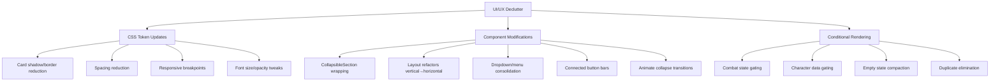

# Design Document: UI/UX Declutter

## Overview

This design covers a comprehensive UI/UX decluttering pass on the WFRP 4e character sheet PWA. The goal is to reduce visual noise, improve information density, and implement progressive disclosure patterns across all major pages — without removing any functionality.

The changes fall into three categories:

1. **CSS-only adjustments** — spacing, shadows, borders, font sizes, opacity, responsive breakpoints
2. **Component restructuring** — wrapping sections in `CollapsibleSection`, converting layouts (vertical → horizontal), adding dropdown menus, connected button bars
3. **Conditional rendering** — hiding irrelevant sections based on character state, combat state, or data emptiness

All existing functionality is preserved. Controls and information are reorganized, collapsed, or hidden behind interactions — nothing is removed.

## Architecture

### Design Principles

1. **Progressive Disclosure**: Secondary information hides behind a single interaction (tap/hover). Primary data is always visible.
2. **Contextual Visibility**: Components render only when relevant to the current character/state. Zero DOM output when not applicable.
3. **Compact-First Mobile**: The mobile viewport (< 768px) drives layout decisions. Desktop gets enhanced layouts via media queries.
4. **Existing Patterns**: All changes use existing shared components (`CollapsibleSection`, `Card`, `SectionHeader`, `EmptyState`) and the established CSS Module approach. No new architectural patterns introduced.

### Change Strategy



### Affected Components

| Component | Change Type | Requirements |
|-----------|-------------|--------------|
| `Card` | CSS only | 4.1, 4.2, 4.5, 7.1 |
| `SectionHeader` | CSS only | 4.3 |
| `EmptyState` | CSS + props | 4.4, 15.1, 15.3, 15.5 |
| `CollapsibleSection` | CSS (animation) | 2.4 |
| `CombatDashboard` | Restructure + CSS | 1.1–1.5, 9.1–9.3 |
| `CombatPage` | Conditional + layout | 2.1–2.5, 7.4, 8.1–8.4, 14.1 |
| `CharacterPage` | Conditional + layout | 3.1–3.5, 8.5–8.6, 14.2, 14.4 |
| `SettingsPage` | Restructure | 5.1–5.5 |
| `AdvancementPage` | Layout + CSS | 6.1–6.5, 9.5 |
| `InitiativeTracker` | Layout refactor | 10.1–10.4 |
| `WeaponCards` | Layout + conditional | 11.1–11.3, 8.2 |
| `ArmourMap` | Layout + conditional | 11.4–11.5 |
| `SpellCastingPanel` | Layout + conditional | 12.1–12.4, 8.1 |
| `SubTabBar` | CSS + conditional | 13.2–13.3 |
| `Navigation` | CSS | 13.1, 13.4 |

## Components and Interfaces

### 1. Card Component Updates

**File**: `src/components/shared/Card.module.css`

Current state:
```css
border: 1px solid var(--card-border);
box-shadow: 0 2px 8px var(--shadow);
padding: 16px;
```

Updated state:
```css
border: 1px solid color-mix(in srgb, var(--card-border) 50%, transparent);
box-shadow: 0 1px 3px var(--shadow);
padding: 16px;
gap: 12px; /* consistent gap between adjacent cards */
```

Mobile override (`max-width: 767px`):
```css
padding: 12px;
```

**Rationale**: Softer borders and flatter shadows reduce visual chrome while maintaining separation. The `color-mix` function provides 50% opacity on the border color without adding a separate variable.

### 2. CollapsibleSection Animation Enhancement

**File**: `src/components/shared/CollapsibleSection.tsx` + `.module.css`

Current behavior: Content appears/disappears instantly via conditional rendering (`{expanded && ...}`).

New behavior: Content wraps in a `div` with `max-height` transition for smooth expand/collapse.

```typescript
// Instead of conditional rendering, always render content with overflow control
<div
  className={expanded ? styles.contentExpanded : styles.contentCollapsed}
  aria-hidden={!expanded}
>
  {children}
</div>
```

```css
.contentCollapsed {
  max-height: 0;
  overflow: hidden;
  transition: max-height 150ms ease-out;
}

.contentExpanded {
  max-height: 2000px; /* generous upper bound */
  overflow: visible;
  transition: max-height 150ms ease-out;
  padding-top: 12px;
}
```

**Rationale**: CSS `max-height` transition is the lightest approach. No JavaScript measurement needed. The 150ms ease-out matches the requirement exactly.

### 3. CombatDashboard Restructure

**File**: `src/components/combat/CombatDashboard.tsx` + `.module.css`

#### Layout Changes:
- **Primary row** (always visible): Wounds progress bar + advantage counter + active condition badges + Fortune/Resolve inline
- **Actions group** (combat-only): Round counter, engaged toggle — collapsed when `!combatActive`
- **Spacing**: Max 8px gap between Status and Actions groups on mobile
- **Wound controls**: −/+/Full rendered as connected button bar (no gaps, shared border-radius on ends only)
- **Advantage controls**: −/+/Reset rendered as connected button bar matching wound controls

#### Condition Tooltip (Mobile):
When a condition badge is tapped on mobile, show effect text in a bottom-anchored sheet/tooltip rather than inline expansion:

```typescript
interface ConditionTooltipProps {
  conditionName: string;
  effectText: string;
  onClose: () => void;
}
```

This uses a fixed-position bottom sheet pattern (existing `Toast`-like component positioning) to avoid layout shift.

### 4. CombatPage Progressive Disclosure

**File**: `src/components/pages/CombatPage.tsx`

Wrap these sections in `CollapsibleSection` with `defaultExpanded={false}`:
- Attack Flow
- Quick Roll
- Take Damage
- Fortune/Resolve Panel (since dashboard shows compact version)

Conditional rendering (zero DOM when condition false):
- `character.spells.length === 0 && !hasSpellcasterTalent` → hide SpellCastingPanel entirely
- `weapons.length === 0` → show compact "Add Weapon" prompt instead of empty card
- `ammoItems.length === 0` → hide Ammo Tracker section entirely
- `rollHistory.length === 0` → hide Roll History section entirely

Two-column layout for desktop (`min-width: 1025px`):
```css
.combatTwoColumn {
  display: grid;
  grid-template-columns: 1fr 1fr;
  gap: 16px;
  align-items: start;
}
```

### 5. CharacterPage Hierarchy

**File**: `src/components/pages/CharacterPage.tsx`

#### Identity Tab:
- Portrait + Personal Details: always visible
- Deity Selector, Grudge Panel, Yenlui Panel, Magical Burnout, Wound Maximum: each wrapped in `CollapsibleSection`
- Grudge Panel: conditionally rendered only if `character.species === 'Dwarf'` (zero DOM otherwise)
- Yenlui Panel: conditionally rendered only if `character.species === 'Elf'` variants AND `houseRules.yenluiBalance` enabled

#### Abilities Tab:
- Characteristic table: Current value and CB columns get `font-weight: 700; font-size: 18px`
- Skill tables: row height reduced to `padding: 6px 8px`
- Advanced Skills: count badge in header when > 20 skills
- "Add from Rulebook" + "Add Custom" → single "Add" button with dropdown menu

#### Gear Tab:
- Trappings use card-grid layout (CSS Grid, `grid-template-columns: repeat(auto-fill, minmax(160px, 1fr))`)
- Empty state: single-line prompt with inline add button

### 6. Settings Page Consolidation

**File**: `src/components/pages/SettingsPage.tsx`

- House rules split into two `CollapsibleSection` groups:
  - "Combat Rules" (Ranged Damage SB, Impale Crits, Min 1 Wound, Advantage Cap, Group Advantage)
  - "Optional Mechanics" (Yenlui Balance, Grudge Book)
- Inactive rule toggles: description text uses `color: var(--text-muted)`
- Export section: single "Export" button → dropdown with "Copy to Clipboard" and "Download File"
- "Clear Sheet" button → moved inside "Danger Zone" `CollapsibleSection` (default collapsed)
- Quick Actions: compact inline chips instead of full-width list items

### 7. Advancement Page Streamlining

**File**: `src/components/pages/AdvancementPage.tsx`

- "Other Skills" section: default collapsed via `CollapsibleSection`
- Unaffordable advance buttons: `opacity: 0.4; pointer-events: none` (no hover effect)
- Career progress checklist: horizontal flex-row with wrap for characteristic badges
- When all requirements met: checklist at `opacity: 0.6`, "Advance Career Level" button highlighted
- XP card: display values as large text (24px), editable only via "Edit" toggle
- Skill +1/+5 buttons: single segmented control

### 8. Initiative Tracker Compaction

**File**: `src/components/combat/InitiativeTracker.tsx` + `.module.css`

- Combatant entries → horizontal scrollable chip row (`display: flex; overflow-x: auto; gap: 6px`)
- Active combatant → highlighted border/background (remove ▶ character)
- No combatants → render only add form in single row (name + init + button inline), no empty-state paragraph
- "Next Turn" button → inline with combatant row (same flex container)
- Form inputs → 32px height

### 9. Weapon/Armour Card Compaction

**Files**: `src/components/combat/WeaponCards.tsx`, `src/components/combat/ArmourMap.tsx`

#### WeaponCards:
- Primary row: name + damage + range/reach (single dense line)
- Secondary line (hover/tap): weapon group + qualities
- "⚒ Add Runes" hidden when runes = 0, shown in overflow menu or on card expand
- Footnote → behind help icon tooltip (`HelpPopover` component)

#### ArmourMap:
- Worn armour list items: name + AP + locations on single line
- Qualities/rune info on tap/hover (reveal)
- More than 4 items → cap at 3, "Show all (N)" toggle

### 10. Spell Casting Panel Declutter

**File**: `src/components/shared/SpellCastingPanel.tsx`

- Default view: compact list (spell name + CN only)
- Tap to expand → full spell card details
- Magic Saturation: collapsed to single-line current value, full selector on tap
- Expanded spell: Cast/Channel buttons highlighted; metadata in `color: var(--text-muted); font-size: 13px`
- "Manage Spells" toggle → compact icon button

### 11. Navigation Streamlining

**Files**: `src/components/layout/Navigation.tsx` + `.module.css`, `src/components/shared/SubTabBar.tsx` + `.module.css`

- Bottom bar height → 48px total on mobile
- SubTabBar edit pencil icon → hidden by default, shown via long-press/context menu
- SubTabBar on mobile → text-only (no icons), compact tabs
- "More" overflow menu → reduced padding (8px vertical), no icons

### 12. Duplicate Information Elimination

- Combat Page active → hide full `FortuneResolvePanel` (dashboard has compact version)
- Roll History panel → render only on Abilities sub-tab
- Advancement career selection → collapse duplicate class/level/status into summary line
- Character Page wound max card → render only on Identity tab

### 13. Responsive Space Optimization

Global responsive changes (`max-width: 767px`):
- Card padding: 12px (from 16px) — already partially done, standardize
- Wound progress bar: `width: 100%` instead of fixed
- Characteristics table: hide "T. Bonus" column, "Show Details" toggle reveals it
- All interactive buttons: minimum tap target 44×44px (add padding where needed)

Desktop enhancement (`min-width: 1025px`):
- Combat Page two-column grid layout

## Data Models

No new data models are introduced. All changes operate on existing `Character` state shape and localStorage keys.

The only new persisted state is additional `CollapsibleSection` storage keys for newly wrapped sections:
- `collapsible-fortune-resolve-combat`
- `collapsible-deity-selector`
- `collapsible-grudge-panel`
- `collapsible-yenlui-panel`
- `collapsible-magical-burnout`
- `collapsible-wound-max`
- `collapsible-other-skills`
- `collapsible-danger-zone`
- `collapsible-combat-rules`
- `collapsible-optional-mechanics`

These follow the existing `storageKey` pattern used by `CollapsibleSection` and are scoped per character via the existing `{characterId}-` prefix convention.

## Error Handling

This feature introduces no new error-prone paths. Existing error handling remains:

- **localStorage failures**: `CollapsibleSection` already handles `QuotaExceededError` gracefully (falls back to in-memory state)
- **Missing data**: Conditional rendering guards (`character.spells?.length`, `weapons.length === 0`) handle undefined/empty data safely
- **CSS fallbacks**: `color-mix()` is supported in all modern browsers (Chrome 111+, Firefox 113+, Safari 16.2+). For older browsers, the border remains visible at full opacity as a graceful degradation
- **Animation edge cases**: The `max-height` transition approach handles dynamic content gracefully. If content exceeds 2000px, it still appears correctly — only the animation timing may feel slightly off for very tall sections

## Testing Strategy

### Why Property-Based Testing Does Not Apply

This feature is a UI decluttering pass consisting of:
- CSS styling adjustments (spacing, opacity, shadows)
- Conditional rendering based on boolean state
- Layout restructuring (vertical → horizontal, list → grid)
- Component composition changes (wrapping in CollapsibleSection)

These are UI rendering and layout changes with no complex data transformations, parsers, serializers, or business logic algorithms. There are no universal input/output properties to validate across a wide input space. The correctness of this feature is best verified through:

1. Visual inspection and snapshot tests
2. Example-based unit tests for conditional rendering logic
3. Component tests verifying DOM output given specific props

### Unit Testing Strategy

Tests use **Vitest** + **@testing-library/react** (already configured in the project).

#### Conditional Rendering Tests
- Verify `SpellCastingPanel` renders nothing when character has no spells/talents
- Verify `GrudgePanel` renders nothing when species ≠ Dwarf
- Verify `YenluiPanel` renders nothing when species ≠ Elf or house rule disabled
- Verify `AmmoTracker` renders nothing when ammo items empty
- Verify `RollHistory` renders nothing when history empty
- Verify `FortuneResolvePanel` hidden on Combat Page when dashboard active
- Verify `RollHistoryPanel` hidden on non-Abilities sub-tabs

#### Layout/State Tests
- Verify `CollapsibleSection` animation classes toggle correctly
- Verify `CombatDashboard` Actions group hidden when combat not active
- Verify `InitiativeTracker` renders horizontal chip layout
- Verify `WeaponCards` shows compact "Add Weapon" prompt when weapons empty
- Verify `AdvancementPage` "Other Skills" section starts collapsed
- Verify `SettingsPage` "Danger Zone" starts collapsed

#### Interaction Tests
- Verify connected button bar (wound controls) renders as single group
- Verify dropdown menus open on click (Export, Add button)
- Verify "Show all" toggle in armour list expands hidden items
- Verify spell card expands on tap to show full details

### Responsive Testing
- Verify Card padding changes at 767px breakpoint
- Verify two-column layout activates at 1025px breakpoint
- Verify navigation bottom bar height at mobile sizes
- Verify minimum 44×44px tap targets on interactive elements

### Manual Testing Checklist
- Visual regression check across all pages on 375px, 768px, and 1440px viewports
- Verify no functionality is lost (all actions still reachable)
- Verify localStorage persistence works for new CollapsibleSection keys
- Verify smooth collapse/expand animation timing feels natural
- Accessibility: screen reader announces collapsed/expanded state correctly
