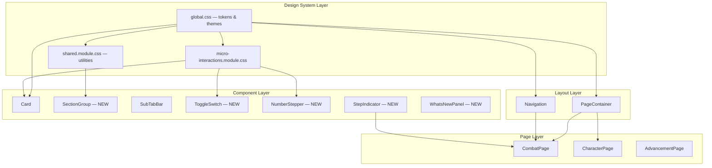

# Design Document: UI/UX Modernization

## Overview

This design covers a comprehensive visual and interaction modernization of the WFRP4e Character Sheet PWA. The changes span seven categories:

1. **Spacing & Grouping** — Vertical rhythm tokens, section group regions
2. **Navigation** — Mobile scrollable bar, badges, collapsible sidebar
3. **Surfaces & Depth** — Card elevation hierarchy, domain tints
4. **Typography** — Font restriction, weight variation, size minimums
5. **Combat UX** — Progressive disclosure, sticky dashboard, step indicator, semantic colors
6. **Form & Input** — Toggle switches, input focus animations, mobile steppers
7. **Micro-interactions & Feedback** — Entrance animations, wound flash, advantage pulse, dice roll, changelog

All changes extend the existing CSS custom property design system, respect theme variants (dark, light, high-contrast, old-guy), and honor `prefers-reduced-motion`. Implementation uses CSS Modules for component styles and the existing shared module pattern for reusable utilities.

## Architecture



### Design Decisions

| Decision | Rationale |
|----------|-----------|
| Extend `global.css` tokens rather than new file | Single source of truth for theme-aware tokens, consistent with existing pattern |
| New components as separate CSS Module + TSX pairs | Matches existing component architecture (Card, EmptyState, SubTabBar) |
| CSS `@keyframes` in component modules | Keeps animations co-located with their trigger context; shared ones in `micro-interactions.module.css` |
| `position: sticky` for combat dashboard | Native browser support, no JS scroll listeners needed, performant |
| CSS Grid for two-column layouts | Already used implicitly; explicit grid is the standard approach for this type of layout |
| localStorage for sidebar state and changelog version | Matches existing persistence pattern (theme, tab order already use localStorage) |
| `prefers-reduced-motion` as CSS media query | Zero-JS approach, declarative, already established in codebase |

## Components and Interfaces

### New Components

#### SectionGroup

```typescript
// src/components/shared/SectionGroup.tsx
interface SectionGroupProps {
  children: ReactNode;
  className?: string;
}
```

A background region wrapper that provides visual grouping. Pure presentational — renders a `<section>` with `var(--bg-secondary)` background, `var(--radius-lg)` border-radius, and `var(--card-gap)` padding.

#### ToggleSwitch

```typescript
// src/components/shared/ToggleSwitch.tsx
interface ToggleSwitchProps {
  checked: boolean;
  onChange: (checked: boolean) => void;
  label: string;        // accessible label
  disabled?: boolean;
}
```

Renders a `<button role="switch" aria-checked={checked}>` with pill track and circular knob. Supports keyboard (Space/Enter), 44px touch target, 200ms transitions, and reduced-motion bypass.

#### NumberStepper

```typescript
// src/components/shared/NumberStepper.tsx
interface NumberStepperProps {
  value: number;
  onChange: (value: number) => void;
  min?: number;
  max?: number;
  label: string;        // accessible label for the input
}
```

Wraps a number input with +/− buttons. Rendered only on mobile (`useMediaQuery`). Each button meets 44×44px. Respects min/max constraints.

#### StepIndicator

```typescript
// src/components/combat/StepIndicator.tsx
interface StepIndicatorProps {
  steps: string[];      // e.g. ['Weapon', 'Roll', 'Damage', 'Result']
  currentStep: number;  // 0-indexed
}
```

Horizontal bar with connected segments. Uses `var(--accent-gold)` for current, `var(--success)` for completed, muted for upcoming. No animation when reduced-motion active.

#### WhatsNewPanel

```typescript
// src/components/shared/WhatsNewPanel.tsx
interface WhatsNewPanelProps {
  version: string;
  entries: { title: string; description: string }[];
  onDismiss: () => void;
}
```

Modal-like overlay shown when `localStorage.getItem('ack-version') !== currentVersion`. Dismiss stores version. 44px dismiss button.

### Modified Components

#### Card (enhanced)
- Add `--elevation-1` as default shadow
- Remove explicit border (rely on background contrast + shadow)
- Add hover lift with `translateY(-2px)` and increased shadow
- Gate hover animations behind `prefers-reduced-motion`

#### Navigation (enhanced)
- Mobile: Replace overflow popover with horizontal scroll `overflow-x: auto`
- Mobile: Auto-scroll active item into view on mount via `scrollIntoView`
- Desktop: Add collapse toggle → 56px icon-only mode with tooltips
- Persist collapsed state to `localStorage`
- Render badge dots for unspent XP (Advancement) and active endeavours

#### PageContainer (enhanced)
- Add `--section-gap` between child section groups
- Increase max-width to 1200px at ≥1400px viewport
- Apply domain background tints via `data-domain` attribute

#### SubTabBar (typography fix)
- Switch font from `var(--font-heading)` to `var(--font-body)` for tab labels

#### CombatPage (restructured)
- Add segmented control for Attack/Defend/Status modes
- Render sticky compact CombatDashboard in Attack/Defend modes
- Desktop ≥1025px: Two-column fixed-scrollable layout
- Apply `--domain-combat` tint

#### CombatDashboard (compact mode)
- New `compact` prop renders 56px sticky strip with wounds/advantage/conditions
- Full mode when Status tab selected

#### AttackFlow (enhanced)
- Add StepIndicator at top
- Apply `--combat-damage` tint on damage results

#### ArmourMap (enhanced)
- Add tappable hit location buttons (44px targets, ARIA labels)
- Highlight selected location with gold border + 15% background

#### EmptyState (enhanced)
- Add `tip` prop for contextual guidance text
- Section-specific icons and tips

#### CharacterPage (desktop layout)
- CSS Grid two-column at ≥1025px

## Data Models

No new data models are introduced. This feature modifies visual presentation and interaction patterns only. State changes are limited to:

| State | Storage | Scope |
|-------|---------|-------|
| Sidebar collapsed | `localStorage('nav-collapsed')` | App-level |
| Acknowledged changelog version | `localStorage('ack-version')` | App-level |
| Combat mode selection | React component state | Session (combat duration) |

### New CSS Custom Properties (added to `:root` in global.css)

```css
/* Spacing tokens */
--section-gap: 24px;
--card-gap: 16px;

/* Elevation */
--elevation-0: none;
--elevation-1: 0 2px 8px var(--shadow);
--elevation-2: 0 1px 3px var(--shadow);

/* Semantic combat colors */
--combat-damage: var(--danger);
--combat-defense: var(--accent-gold);
--combat-healing: var(--success);

/* Success accent */
--accent-success: #4caf50;  /* tuned per theme */

/* Domain tints */
--domain-combat: rgba(200, 80, 80, 0.03);
--domain-character: transparent;
--domain-advancement: rgba(76, 120, 200, 0.03);
```

Each token is overridden per `[data-theme]` block. High-contrast theme sets domain tints to `transparent`.


## Error Handling

| Scenario | Handling |
|----------|----------|
| localStorage unavailable (private browsing) | Sidebar defaults to expanded; changelog shows every time. Use try/catch around `getItem`/`setItem`. |
| Missing CSS custom property (theme override gap) | All new tokens have fallback values in `:root` so even if a theme variant doesn't override, the default applies. |
| Navigation badge data unavailable | Badge dot simply not rendered (conditional render on truthy value). No error thrown. |
| `scrollIntoView` not supported | Feature detection: if `element.scrollIntoView` is undefined, skip auto-scroll. Graceful degradation. |
| `prefers-reduced-motion` not supported | All animations have CSS defaults (they play). The media query is additive removal only. |
| Combat mode state lost on unmount | Expected behavior — mode resets when leaving combat page. No persistence needed since combat sessions are short-lived. |
| Stepper buttons at min/max | Buttons are disabled (opacity reduced, pointer-events: none) when value is at boundary. |

## Testing Strategy

### Why Property-Based Testing Does Not Apply

This feature is a **UI/UX modernization** consisting primarily of:
- CSS custom property additions and theme overrides
- Layout changes (CSS Grid, Flexbox, position: sticky)
- Visual micro-interactions (CSS animations, transitions)
- Component rendering variations (compact vs full, mobile vs desktop)
- Simple boolean/enum state management

There are no pure functions with meaningful input variation, no parsers/serializers, no algorithmic transformations, and no data processing logic. The "logic" is limited to trivial conditionals (badge shows when XP > 0, sidebar collapsed boolean, combat mode enum). PBT is not cost-effective here — running 100 iterations of "is badge visible when XP is 5" adds no value over a single example test.

### Recommended Testing Approach

**Unit Tests (example-based):**
- ToggleSwitch: renders on/off states, keyboard activation (Space/Enter), ARIA attributes
- NumberStepper: increment/decrement, min/max boundary behavior, mobile-only rendering
- StepIndicator: renders correct step states (current, completed, upcoming)
- WhatsNewPanel: shows when version mismatch, hides after dismiss, localStorage interaction
- Navigation badges: conditional rendering based on XP/endeavour data
- Sidebar collapse: toggle state, localStorage persistence, tooltip display
- Combat mode segmented control: mode switching, correct panel visibility
- SectionGroup: renders children with correct CSS class

**Visual Regression / Snapshot Tests:**
- Card elevation hover states across themes
- Two-column layout breakpoints (1025px, 1400px)
- Mobile scrollable nav rendering
- Domain background tints per theme
- Typography hierarchy (Cinzel restricted usage)
- Combat semantic color tints

**Integration Tests:**
- Combat page mode switching renders correct sub-components
- Desktop two-column combat layout with sticky sidebar
- Navigation auto-scroll to active item on mobile
- Wound counter flash triggers on value change
- Advantage pulse triggers on value change
- Dice roll animation sequence (300ms delay → result)
- Hit location tappable selection communicates to TakeDamagePanel

**Accessibility Tests:**
- Toggle switch `role="switch"` and `aria-checked` states
- Hit location buttons have correct ARIA labels
- All touch targets meet 44px minimum
- Focus styles visible in all themes
- `prefers-reduced-motion: reduce` suppresses all animations
- Badge dot contrast meets WCAG AA in all themes
- `--text-muted` meets 4.5:1 contrast ratio against `--card-bg`

**Test Tools:**
- Vitest + @testing-library/react for unit and integration tests
- CSS Module mocking for style assertions
- `matchMedia` mocking for responsive breakpoint tests
- `prefers-reduced-motion` media query mocking for animation suppression tests
