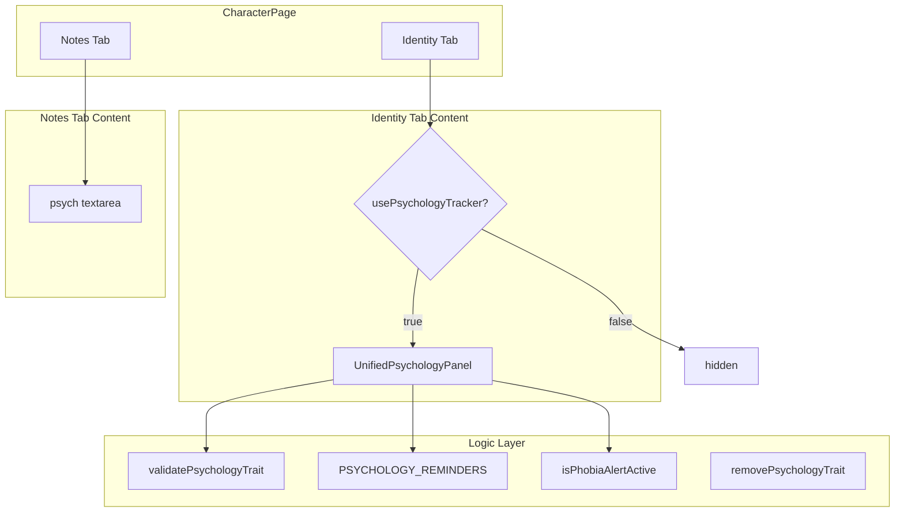

# Design Document: Unified Psychology Panel

## Overview

This design consolidates two overlapping React components — `PsychologyTracker` (Identity tab) and `PsychologyPanel` (Notes tab) — into a single `UnifiedPsychologyPanel` component. Both currently operate on the same `character.psychologyTraits` array but offer different type subsets, different UX patterns, and live on different tabs.

The unified component merges:
- **All 8 psychology types** (from the existing `PsychologyType` union)
- **Broken Tally + WP threshold mechanic** (from PsychologyTracker)
- **Rule reminders** (from PsychologyPanel, extended to all 8 types)
- **Unified validation** (combining both components' requirements)

The component lives on the Identity tab only, gated by `houseRules.usePsychologyTracker`. The freeform `character.psych` textarea stays on the Notes tab unchanged.

### Design Decisions

1. **Single component replaces two**: Rather than abstracting a shared base, we create one component that does everything. This eliminates prop-passing inconsistencies and duplicated state management.
2. **Extend existing logic module**: The `src/logic/psychology.ts` module already has `validatePsychologyTrait()` and `PSYCHOLOGY_REMINDERS`. We extend both to handle Phobia and Trauma (currently missing from reminders/validation).
3. **Keep the same data shape**: No schema migration needed — `PsychologyTrait` and `character.psychologyTraits` remain unchanged.
4. **Props interface mirrors PsychologyTracker's pattern**: Individual callback props (`onAddTrait`, `onRemoveTrait`, `onIncrementBrokenTally`) rather than passing the full `Character` + `updateCharacter`. This keeps the component testable without needing a full character context.

## Architecture



The architecture is simple: one component, one logic module, one data array. The `CharacterPage` orchestrates the connection between the component and the character state.

## Components and Interfaces

### UnifiedPsychologyPanel Component

**Location:** `src/components/pages/UnifiedPsychologyPanel.tsx`

```typescript
import type { PsychologyTrait } from '../../types/character';

export interface UnifiedPsychologyPanelProps {
  psychologyTraits: PsychologyTrait[];
  brokenTally: number;
  wpValue: number;
  onAddTrait: (type: string, target: string, rating?: number) => void;
  onRemoveTrait: (id: string) => void;
  onIncrementBrokenTally: () => void;
}
```

**Internal structure (sections rendered top-to-bottom):**

1. **Summary Bar** — Broken Tally value + increment button, WP threshold display
2. **Phobia Acquisition Alert** — conditional banner when `brokenTally >= wpValue`
3. **Trait List** — each trait shows type, target, rating, rule reminder, and remove button
4. **Add Trait Form** — collapsible form with type dropdown (all 8), conditional fields, rule reminder preview

### Updated Logic Module

**Location:** `src/logic/psychology.ts`

```typescript
// Extended PSYCHOLOGY_REMINDERS (add Phobia and Trauma)
export const PSYCHOLOGY_REMINDERS: Record<PsychologyType, string> = {
  Animosity: "Must pass Cool Test or verbally abuse/hinder target",
  Hatred: "Must pass Cool Test or attack target in melee; +1 SL on hit",
  Fear: "Must pass Cool Test or gain Broken condition",
  Terror: "Must pass Cool Test or gain Broken condition and Fatigued conditions equal to Terror rating",
  Frenzy: "Must pass Cool Test to resist; +1 SL on melee, immune to psychology, cannot Flee or Disengage",
  Prejudice: "Must pass Cool Test or verbally abuse target; will not assist target willingly",
  Phobia: "Must pass Cool Test when confronted with phobia source or gain Broken condition",
  Trauma: "Must pass Cool Test when reminded of trauma or suffer penalties at GM discretion",
};

// Extended validatePsychologyTrait (add Phobia and Trauma requiring target)
export function validatePsychologyTrait(
  type: PsychologyType | '',
  target: string,
  rating?: number
): boolean {
  if (!type) return false;
  if (type === 'Fear' || type === 'Terror') {
    return rating !== undefined && rating > 0;
  }
  if (type === 'Animosity' || type === 'Hatred' || type === 'Prejudice' || type === 'Phobia' || type === 'Trauma') {
    return target.trim().length > 0;
  }
  // Frenzy: no additional fields
  return true;
}
```

### Constant: ALL_PSYCHOLOGY_TYPES

```typescript
export const ALL_PSYCHOLOGY_TYPES: PsychologyType[] = [
  'Animosity', 'Hatred', 'Fear', 'Terror', 'Frenzy', 'Prejudice', 'Phobia', 'Trauma'
];
```

### Field Requirement Helpers

```typescript
export function requiresTarget(type: PsychologyType | ''): boolean {
  return type === 'Animosity' || type === 'Hatred' || type === 'Prejudice' 
      || type === 'Phobia' || type === 'Trauma';
}

export function requiresRating(type: PsychologyType | ''): boolean {
  return type === 'Fear' || type === 'Terror';
}
```

## Data Models

No schema changes. The unified panel reads and writes the existing data structures:

### PsychologyTrait (unchanged)

```typescript
export interface PsychologyTrait {
  id: string;
  type: PsychologyType;
  target: string;      // For Animosity, Hatred, Prejudice, Phobia, Trauma
  rating?: number;     // For Fear, Terror
}
```

### PsychologyType (unchanged)

```typescript
export type PsychologyType = 
  'Animosity' | 'Hatred' | 'Fear' | 'Terror' | 'Frenzy' | 'Prejudice' | 'Phobia' | 'Trauma';
```

### Character fields used (unchanged)

| Field | Type | Purpose |
|-------|------|---------|
| `character.psychologyTraits` | `PsychologyTrait[]` (optional) | Stored trait list |
| `character.brokenTally` | `number` (optional) | Broken counter |
| `character.chars.WP` | `{i, a, b}` | Willpower for threshold |
| `character.houseRules.usePsychologyTracker` | `boolean` | Visibility gate |
| `character.psych` | `string` | Freeform textarea (stays on Notes tab) |


## Correctness Properties

*A property is a characteristic or behavior that should hold true across all valid executions of a system — essentially, a formal statement about what the system should do. Properties serve as the bridge between human-readable specifications and machine-verifiable correctness guarantees.*

### Property 1: Validation correctness by type category

*For any* `PsychologyType` and arbitrary `target` string and `rating` number, `validatePsychologyTrait(type, target, rating)` SHALL return `true` if and only if:
- The type is non-empty, AND
- If the type is in `{Animosity, Hatred, Prejudice, Phobia, Trauma}`, then `target.trim().length > 0`
- If the type is in `{Fear, Terror}`, then `rating !== undefined && rating > 0`
- If the type is `Frenzy`, no additional constraint

**Validates: Requirements 2.2, 2.3, 2.4, 8.1, 8.2, 8.3**

### Property 2: Trait removal preserves other traits

*For any* array of `PsychologyTrait` objects and any `id` present in that array, calling `removePsychologyTrait(traits, id)` SHALL produce an array that:
- Does not contain any trait with that `id`
- Contains all traits from the original array whose `id` differs from the removed one
- Preserves relative order of remaining traits

**Validates: Requirements 2.5**

### Property 3: Phobia alert biconditional

*For any* non-negative `brokenTally` and positive `wpValue`, `isPhobiaAlertActive(brokenTally, wpValue)` SHALL return `true` if and only if `brokenTally >= wpValue`.

**Validates: Requirements 3.3, 3.4**

### Property 4: Rule reminders completeness

*For any* valid `PsychologyType` value, `PSYCHOLOGY_REMINDERS[type]` SHALL be a non-empty string.

**Validates: Requirements 4.1, 4.3**

### Property 5: Trait creation round-trip validation

*For any* valid trait creation input (type, target, rating) that passes `validatePsychologyTrait`, constructing a `PsychologyTrait` with those fields and then re-validating with `validatePsychologyTrait(trait.type, trait.target, trait.rating)` SHALL return `true`.

**Validates: Requirements 2.1, 7.1, 8.4**

## Error Handling

| Scenario | Behavior |
|----------|----------|
| Empty type selection | Submit button disabled; `validatePsychologyTrait` returns `false` |
| Missing target for target-requiring types | Submit button disabled; no trait created |
| Non-positive or missing rating for Fear/Terror | Submit button disabled; no trait created |
| Remove non-existent trait ID | `removePsychologyTrait` returns original array unchanged (filter is a no-op) |
| `psychologyTraits` is `undefined` on character | Component receives `[]` via `character.psychologyTraits ?? []` in CharacterPage |
| `brokenTally` is `undefined` on character | Component receives `0` via `character.brokenTally ?? 0` in CharacterPage |
| WP characteristic is 0 (edge case) | Alert triggers immediately (0 >= 0 is true); this is correct per rules |

No error toasts or modals needed — validation is inline via disabled submit button and the logic module functions return `false` for invalid inputs.

## Testing Strategy

### Property-Based Tests (fast-check, minimum 100 iterations each)

The project already uses `fast-check` (v4.8.0) with `vitest` for property-based testing. Each property test must reference its design document property via a tag comment.

| Property | Test File | What's Generated |
|----------|-----------|-----------------|
| Property 1: Validation correctness | `src/logic/__tests__/psychology.validation.property.test.ts` | Random PsychologyType × random strings × random numbers |
| Property 2: Trait removal | `src/logic/__tests__/psychology.removal.property.test.ts` | Random trait arrays (0–20 items) × random valid IDs |
| Property 3: Phobia alert | Already tested in `src/logic/__tests__/psychology.property.test.ts` | Random (brokenTally, wpValue) pairs |
| Property 4: Reminders completeness | `src/logic/__tests__/psychology.reminders.property.test.ts` | All 8 PsychologyType values (exhaustive, small domain) |
| Property 5: Round-trip validation | `src/logic/__tests__/psychology.roundtrip.property.test.ts` | Random valid type/target/rating combos that pass validation |

**Tag format:** `// Feature: unified-psychology-panel, Property {N}: {title}`

### Unit Tests (example-based, vitest + @testing-library/react)

| Scenario | Test File |
|----------|-----------|
| Form shows all 8 types in dropdown | `src/components/pages/__tests__/UnifiedPsychologyPanel.test.tsx` |
| Frenzy submits without target/rating | Same file |
| Broken Tally displays and increment calls callback | Same file |
| Alert banner renders when threshold reached | Same file |
| Rule reminder preview on type selection | Same file |
| Conditional visibility (toggle on/off) | `src/components/pages/__tests__/UnifiedPsychologyPanel.visibility.test.tsx` |
| Freeform psych textarea remains on Notes tab | Same file |

### Integration Considerations

- The existing property tests for `psychologyToggle.roundTrip` and `psychologyToggle.backfill` remain valid since the data schema is unchanged.
- The existing `PsychologyTracker.test.tsx` and `PsychologyTracker.visibility.test.tsx` tests will be migrated to test `UnifiedPsychologyPanel` instead (rename imports, adjust for new features).
- No E2E tests needed — this is a single-page component swap with no navigation or async data flow.

### Files to Delete After Migration

- `src/components/pages/PsychologyTracker.tsx`
- `src/components/pages/PsychologyTracker.module.css`
- `src/components/shared/PsychologyPanel.tsx`
- `src/components/shared/PsychologyPanel.module.css`
- `src/components/pages/__tests__/PsychologyTracker.test.tsx` (replaced by new test file)
