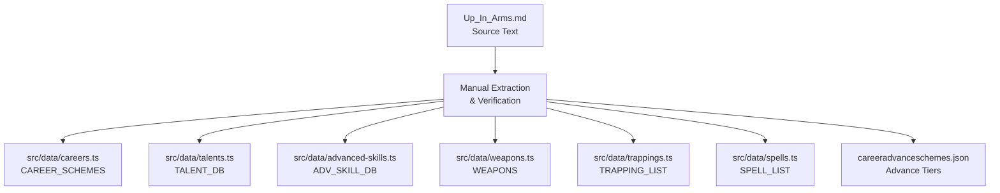

# Design Document: Up in Arms Content Integration

## Overview

This feature integrates content from the WFRP 4e "Up in Arms" expansion book into the existing character sheet PWA. The integration adds 15 new careers, new talents, advanced skills, weapons (melee, ranged, ammunition), trappings, and Miracles of Myrmidia to the application's static data modules.

The approach follows the established pattern from the Dwarf Players Guide (DPG) and High Elf Players Guide integrations — appending entries to existing TypeScript arrays/records while maintaining type safety, ordering conventions, and cross-referential integrity.

**Key Design Decision:** All data is stored as static TypeScript constants (no runtime fetching or database). This keeps the PWA fully offline-capable and ensures type checking at compile time.

## Architecture

The data integration is purely additive — no new modules, components, or runtime logic are created. Content flows from the source markdown file into existing data modules:



All modules are consumed by existing UI components (career selection, weapon cards, spell lists, trapping inventory) without modification — the components already iterate over these arrays/records.

## Components and Interfaces

No new interfaces or components are required. The existing TypeScript interfaces are used directly:

### WeaponData (src/types/character.ts)

```typescript
interface WeaponData {
  name: string;
  group: string;       // "Basic", "Cavalry", "Fencing", "Brawling", "Flail", "Parry", "Polearm", "Two-Handed", "Blackpowder", "Engineering", "Sling", "Bow", "Crossbow", "Throwing", "Entangling", "Explosives"
  enc: string;
  rangeReach?: string; // Melee only: "Personal", "Very Short", "Short", "Average", "Medium", "Long", "Very Long"
  damage: string;      // e.g. "+SB+4", "+9"
  qualities: string;   // Comma-separated: "Impale, Damaging"
  maxR?: string;       // Ranged only: maximum range
  optR?: string;       // Ranged only: optimum range
  rangeMod?: string;   // Ranged only: range modifier
  reload?: string;     // Ranged only: reload actions required
}
```

**Melee weapon entries** use `rangeReach` and omit `maxR/optR/rangeMod/reload`.  
**Ranged weapon entries** use `maxR/optR/rangeMod` and optionally `reload`, omitting `rangeReach`.

### SpellData (src/types/character.ts)

```typescript
interface SpellData {
  name: string;
  cn: string;        // Casting Number as string ("0" for petty/blessings, "4"+ for lore spells)
  range: string;
  target: string;
  duration: string;
  effect: string;    // Concise mechanical summary
}
```

### TrappingData (src/types/character.ts)

```typescript
interface TrappingData {
  name: string;
  enc: string;       // Encumbrance as string ("0", "1", "2", "3")
}
```

### CareerScheme (src/types/character.ts)

```typescript
interface CareerScheme {
  class: string;     // One of 8 career classes
  level1?: CareerLevel;
  level2: CareerLevel;
  level3: CareerLevel;
  level4: CareerLevel;
  level5?: CareerLevel;
}

interface CareerLevel {
  title: string;
  status: string;          // e.g. "Silver 2", "Gold 1"
  characteristics: CharacteristicKey[];  // Cumulative across levels
  skills: string[];        // Alphabetically sorted, cumulative
  talents: string[];       // Alphabetically sorted, cumulative
}
```

### TalentData (src/data/talents.ts)

```typescript
interface TalentData {
  name: string;
  max: string;       // e.g. "WS Bonus", "2", "1"
  desc: string;      // Concise description
}
```

### AdvancedSkillData (src/data/advanced-skills.ts)

```typescript
interface AdvancedSkillData {
  n: string;         // Skill name with specialization: "Lore (Warfare)"
  c: string;         // Linked characteristic: "Int", "WS", "BS", etc.
}
```

## Data Models

### Career Data Pattern

Each career is a key-value pair in `CAREER_SCHEMES`. Levels are cumulative — level 2 includes all level 1 skills/talents/characteristics plus additions:

```typescript
"Archer": {
  class: "Warriors",
  level1: {
    title: "Bowman",
    status: "Silver 1",
    characteristics: ["BS", "S", "I", "Ag"],
    skills: ["Athletics", "Endurance", "Melee (Basic)", "Outdoor Survival", "Perception", "Ranged (Bow)", "Stealth (Rural)", "Trade (Fletcher)"],
    talents: ["Accurate Shot", "Fast Shot", "Hunter's Eye", "Marksman"]
  },
  level2: { /* includes all level1 content + additions */ },
  level3: { /* includes all level2 content + additions */ },
  level4: { /* includes all level3 content + additions */ }
}
```

### Weapon Data Patterns

**New melee weapons** (Up in Arms introduces Basic weapons like Axe, Mace, Sword, and new groups like Brawling extras):

```typescript
{name:"Axe",group:"Basic",enc:"1",rangeReach:"Average",damage:"+SB+5",qualities:"Hack"},
{name:"Spiked Gauntlet",group:"Brawling",enc:"0",rangeReach:"Personal",damage:"+SB+2",qualities:"Pummel"},
```

**New ranged weapons** (Blackpowder variants, Engineering weapons):

```typescript
{name:"Repeater Handgun",group:"Engineering",enc:"2",damage:"+8",maxR:"60",optR:"20",rangeMod:"4",reload:"0",qualities:"Dangerous, Repeater 6"},
{name:"Arquebus",group:"Blackpowder",enc:"3",damage:"+10",maxR:"300",optR:"100",rangeMod:"20",reload:"4",qualities:"Accurate, Dangerous, BP, Impale, Penetrating"},
```

**Ammunition entries** follow the ranged pattern with group "Ammunition" or are appended as notes. Based on the existing pattern (Arrow (12), Bolt (12), etc. are in trappings), ammunition that is a consumable goes in TRAPPING_LIST. However, ammunition with weapon-like stats (damage modifiers) goes in WEAPONS with a suitable group.

**Design Decision:** Ammunition entries that modify weapon damage or have their own stat lines (like specialty arrows and blackpowder rounds) will be added to the WEAPONS array with group "Ammunition" so they can be referenced by the combat system. Simple consumable ammunition (already present as "Arrow (12)", "Bolt (12)" in TRAPPING_LIST) stays in trappings.

### Trapping Data Pattern

Simple `{name, enc}` objects appended to the array:

```typescript
{name:"Theodolite",enc:"3"},
{name:"Compass",enc:"0"},
{name:"Bandoleer",enc:"1"},
```

### Spell Data Pattern (Miracles of Myrmidia)

Miracles are divine spells with CN > 0, grouped under a section comment:

```typescript
// MIRACLES OF MYRMIDIA
{name:"Command the Legion",cn:"6",range:"WP yards",target:"AoE WPB yds",duration:"WPB rounds",effect:"Allies gain +10 WS and +10 BS"},
{name:"Quick Strike",cn:"4",range:"You",target:"You",duration:"Instant",effect:"Free melee attack at +20 WS"},
```

### Advance Scheme Pattern (careeradvanceschemes.json)

Nested under the career class, using the career name as key:

```json
{
  "careers": {
    "Warriors": {
      "Archer": {
        "advance_scheme": {
          "WS": null,
          "BS": "T1",
          "S": "T2",
          "T": "T3",
          "I": "T1",
          "Agi": "T1",
          "Dex": null,
          "Int": "T4",
          "WP": null,
          "Fel": null
        }
      }
    }
  }
}
```

### Data Extraction Strategy

Data is manually extracted from `Up_In_Arms.md` in the project root:

1. **Career tables**: Extract level titles, status, characteristics, skills, and talents from the career description sections. Cross-reference advance scheme tables for tier data.
2. **Weapons/Armour tables**: Extract from "The Quartermaster's Store" chapter tables. Map column headers to interface fields.
3. **Talents**: Extract name, max, and description from the Talents chapter.
4. **Skills**: Identify skills referenced in careers that don't exist in `ADV_SKILL_DB` and add them.
5. **Miracles**: Extract from the Myrmidia section with CN, range, target, duration, and effect.

**OCR/formatting normalization rules:**
- "Twohanded" → "Two-Handed"
- Remove accented characters from data fields (keep only in descriptive text)
- Normalize whitespace and quote characters
- Verify skill/talent name case matches existing database entries exactly

### New Weapon Qualities

Up in Arms introduces these new weapon qualities that must be used consistently:
- **Unbalanced** — weapon is unwieldy
- **Slash** — deals slash damage (format: "Slash 2A")
- **Spread** — area effect for firearms (format: "Spread 3")
- **Trip** — can trip opponents

These follow the existing pattern of comma-separated qualities with optional numeric parameters (e.g., "Shield 2", "Blast 3", "Repeater 6").

## Correctness Properties

*A property is a characteristic or behavior that should hold true across all valid executions of a system — essentially, a formal statement about what the system should do. Properties serve as the bridge between human-readable specifications and machine-verifiable correctness guarantees.*

### Property 1: Career Level Structural Integrity

*For any* career in CAREER_SCHEMES, each defined level (level1 through level4) SHALL have a non-empty title string, a non-empty status string, a non-empty characteristics array containing only valid CharacteristicKey values, a non-empty skills array, and a non-empty talents array.

**Validates: Requirements 1.3, 2.4, 2.5**

### Property 2: Career Level Alphabetical Ordering

*For any* career in CAREER_SCHEMES and *for any* level within that career, the skills array SHALL be sorted in alphabetical order AND the talents array SHALL be sorted in alphabetical order.

**Validates: Requirements 1.5, 1.6**

### Property 3: Career Level Cumulative Progression

*For any* career in CAREER_SCHEMES that has levels N and N+1, level N+1's skills array SHALL be a superset of level N's skills array, level N+1's talents array SHALL be a superset of level N's talents array, AND level N+1's characteristics array SHALL be a superset of level N's characteristics array.

**Validates: Requirements 2.1, 2.2, 2.3**

### Property 4: Advance Scheme Value Validity

*For any* career advance scheme entry in careeradvanceschemes.json, every characteristic value SHALL be either null or one of the strings "T1", "T2", "T3", "T4".

**Validates: Requirements 3.3**

### Property 5: Talent Structural Integrity and Ordering

*For any* talent in TALENT_DB, it SHALL have a non-empty name, a non-empty max string, and a non-empty desc string. Furthermore, the TALENT_DB array SHALL be sorted alphabetically by name.

**Validates: Requirements 4.2, 4.5**

### Property 6: Advanced Skill Structural Integrity and Grouping

*For any* skill in ADV_SKILL_DB, it SHALL have a non-empty name (n field) and a valid characteristic abbreviation (c field from the set WS, BS, S, T, I, Ag, Dex, Int, WP, Fel). Furthermore, skills sharing a common prefix (e.g., "Lore (", "Trade (") SHALL appear in alphabetical order within their group.

**Validates: Requirements 5.2, 5.4**

### Property 7: Career Cross-Reference Integrity

*For any* career in CAREER_SCHEMES and *for any* level within that career, every talent name that appears in the talents array SHALL have a matching entry (by exact name) in TALENT_DB.

**Validates: Requirements 6.8**

### Property 8: Weapon Structural Integrity

*For any* weapon in WEAPONS, it SHALL have a non-empty name, a group from the set of valid weapon groups, a defined enc field, a defined damage field, and a defined qualities field. Additionally, weapons in melee groups (Basic, Cavalry, Fencing, Brawling, Flail, Parry, Polearm, Two-Handed, Engineering with rangeReach) SHALL have a non-empty rangeReach field, and weapons in ranged groups (Sling, Bow, Crossbow, Blackpowder, Throwing, Entangling, Explosives, Engineering without rangeReach) SHALL have a defined maxR field.

**Validates: Requirements 8.14, 8.15, 6.10**

### Property 9: Trapping Structural Integrity

*For any* trapping in TRAPPING_LIST, it SHALL have a non-empty name string and a defined enc string value.

**Validates: Requirements 9.2, 9.4**

### Property 10: Spell Structural Integrity

*For any* spell in SPELL_LIST, it SHALL have a non-empty name, a defined cn string, a non-empty range, a non-empty target, a non-empty duration, and a non-empty effect.

**Validates: Requirements 10.2, 10.6**

## Error Handling

This feature involves static data only — there is no runtime error handling to design. Errors are caught at:

1. **Compile time**: TypeScript type checking ensures all entries conform to their interfaces. Missing or malformed fields cause build failures.
2. **Test time**: Property-based and example-based tests verify data integrity, cross-references, and ordering constraints.
3. **Data extraction time**: OCR artifacts and formatting issues are caught during manual review against the source text.

If a career references a talent or skill that doesn't exist in the respective database, the cross-reference property test (Property 7) will fail, flagging the issue before deployment.

## Testing Strategy

The project uses **Vitest** with existing test infrastructure in `src/data/__tests__/static-data.test.ts`.

### Dual Testing Approach

**Property-based tests** (using `fast-check` with Vitest):
- Verify universal invariants over entire data arrays (Properties 1–10)
- Minimum 100 iterations per property test
- Each test tagged with: `Feature: up-in-arms-content, Property {N}: {description}`
- Properties iterate over all entries in each data array, so a single run covers all items

**Example-based unit tests** (standard Vitest assertions):
- Verify completeness: all 15 named careers exist with correct class assignment
- Spot-check specific values: career level titles, status tiers, advance scheme tier values
- Verify specific weapons exist with correct stats
- Verify specific trappings exist with correct enc values
- Verify all Miracles of Myrmidia exist with CN > "0"
- Verify new talents (Crew Commander, Demolisher, Flee!) exist

### Test File Organization

Tests will be added to `src/data/__tests__/static-data.test.ts` following the existing pattern established by the DPG and High Elf sections:

```typescript
// ─── Up in Arms — Careers ──────────────────────────────────────
describe('Up in Arms — Careers', () => { /* ... */ });

// ─── Up in Arms — Weapons ──────────────────────────────────────
describe('Up in Arms — Weapons', () => { /* ... */ });

// ─── Up in Arms — Trappings ────────────────────────────────────
describe('Up in Arms — Trappings', () => { /* ... */ });

// ─── Up in Arms — Miracles ─────────────────────────────────────
describe('Up in Arms — Miracles', () => { /* ... */ });

// ─── Up in Arms — Talents ──────────────────────────────────────
describe('Up in Arms — Talents', () => { /* ... */ });
```

### Property Test Configuration

Property tests use `fast-check` (already available in the project or to be added as a dev dependency):

```typescript
import * as fc from 'fast-check';

// Feature: up-in-arms-content, Property 2: Career Level Alphabetical Ordering
it('all career levels have alphabetically sorted skills and talents', () => {
  for (const [name, scheme] of Object.entries(CAREER_SCHEMES)) {
    const levels = [scheme.level1, scheme.level2, scheme.level3, scheme.level4].filter(Boolean);
    for (const level of levels) {
      expect([...level!.skills].sort()).toEqual(level!.skills);
      expect([...level!.talents].sort()).toEqual(level!.talents);
    }
  }
});
```

Note: For this data-integration feature, the "property tests" iterate over all data entries deterministically rather than using random generation — the data arrays themselves serve as the input domain. `fast-check` can be used to sample random entries for cross-reference checks, but the primary value is in exhaustive iteration over the finite datasets.

### Non-Regression

All existing tests in `static-data.test.ts` must continue passing. The new data is purely additive and should not modify any existing entries (except talent description updates per Requirement 4.3, which are controlled changes).
