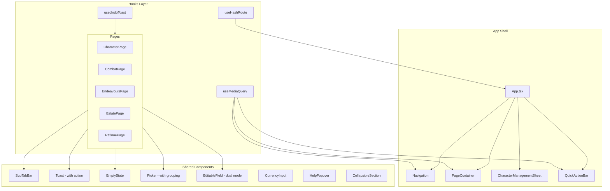

# Design Document: UX Improvements

## Overview

This design covers a comprehensive UX improvement pass for the WFRP 4e character sheet PWA. The improvements span five areas: mobile interaction patterns (character switching, navigation overflow, quick actions), edit friction reduction (always-editable numeric fields, combined currency input), discoverability and feedback (contextual help, status cycling hints, undo toasts), code quality (dead CSS removal, unused prop cleanup, shared components), and navigation/state management (hash routing, collapsible combat panels, responsive viewport hook).

The design targets the existing React 19 + TypeScript + Vite + CSS Modules stack with no new runtime dependencies. Property-based testing uses the existing `fast-check` library already in devDependencies.

## Architecture

### High-Level Architecture



### Design Principles

1. **No new runtime dependencies** — all improvements use React 19 features and the existing CSS Modules architecture
2. **Mobile-first** — responsive behaviour defaults to mobile layout, desktop enhancements added via the `useMediaQuery` hook
3. **Progressive enhancement** — features degrade gracefully when localStorage is unavailable
4. **Colocation** — each component's styles remain in a co-located `.module.css` file
5. **Pure logic layer** — all testable business logic (currency parsing, slot calculation, session auto-increment) lives in `src/logic/` as pure functions

### Routing Strategy

The app currently uses in-memory state for page selection (`useState<PageSection>`). Hash routing will wrap this state with `window.location.hash` synchronisation, using a custom `useHashRoute` hook. No external routing library is needed given the flat page structure.

Hash format: `#<page>` or `#<page>/<subtab>` (e.g., `#combat`, `#character/gear`, `#estate/holdings`).

## Components and Interfaces

### New Hooks

#### `useMediaQuery(query: string): boolean`

Reactive viewport detection hook using `window.matchMedia`. Returns a boolean that updates synchronously when the media query match state changes.

```typescript
interface UseMediaQueryOptions {
  // No options needed — debouncing handled internally
}

function useMediaQuery(query: string): boolean;

// Usage:
const isMobile = useMediaQuery('(max-width: 767px)');
```

**Implementation notes:**
- Uses `matchMedia(query).matches` for initial value (synchronous, before first paint)
- Subscribes via `MediaQueryList.addEventListener('change', handler)`
- Debounces rapid changes by ≤100ms using `setTimeout`
- Cleans up listener on unmount
- Replaces all existing `window.innerWidth` checks across Navigation, CombatPage, Period Header

#### `useHashRoute(): { page: PageSection; subTab: string | null; navigate: (page, subTab?) => void }`

Manages URL hash synchronisation with app navigation state.

```typescript
function useHashRoute(defaultPage?: PageSection): {
  page: PageSection;
  subTab: string | null;
  navigate: (page: PageSection, subTab?: string) => void;
};
```

**Implementation notes:**
- Parses hash on mount and on `hashchange` event
- Validates page against known `PageSection` values
- Falls back to `'character'` for invalid pages
- Falls back to page default sub-tab for invalid sub-tabs
- Calls `history.replaceState` to avoid polluting back-button history

#### `useUndoToast(): { show: (message, item, restore) => void; pending: UndoPending | null }`

Manages undo state for single-item deletions.

```typescript
interface UndoPending<T = unknown> {
  message: string;
  item: T;
  index: number;
  restore: (item: T, index: number) => void;
}

function useUndoToast(): {
  show: (message: string, item: unknown, index: number, restore: (item: unknown, index: number) => void) => void;
  dismiss: () => void;
  undo: () => void;
  pending: UndoPending | null;
};
```

### New Shared Components

#### `SubTabBar`

Location: `src/components/shared/SubTabBar.tsx`

```typescript
interface SubTabBarProps {
  tabs: { id: string; label: string }[];
  activeTab: string;
  onTabChange: (tabId: string) => void;
}
```

Replaces local sub-tab markup in CharacterPage, EstatePage, RetinuePage.

#### `EmptyState`

Location: `src/components/shared/EmptyState.tsx`

```typescript
interface EmptyStateProps {
  icon: LucideIcon;
  heading: string;
  description?: string;
  action?: { label: string; onClick: () => void };
}
```

Renders centred icon + heading + optional description + optional action button. Uses `role="status"` for accessibility.

#### `CurrencyInput`

Location: `src/components/shared/CurrencyInput.tsx`

```typescript
interface CurrencyInputProps {
  onSubmit: (deltas: { gc: number; ss: number; d: number }) => void;
}
```

Parses a free-text string into denomination deltas. Delegates parsing to a pure function in `src/logic/currency.ts`.

#### `HelpPopover`

Location: `src/components/shared/HelpPopover.tsx`

```typescript
interface HelpPopoverProps {
  concept: string;
  children: string; // max 280 chars explanatory text
}
```

Renders an info icon button that toggles a positioned popover with help text.

#### `CollapsibleSection`

Location: `src/components/shared/CollapsibleSection.tsx`

```typescript
interface CollapsibleSectionProps {
  title: string;
  storageKey: string; // for localStorage persistence
  defaultExpanded?: boolean;
  children: React.ReactNode;
}
```

Used by CombatPage panels. Persists expanded/collapsed state per character.

#### Enhanced `Toast` (backward-compatible)

Extended props:

```typescript
interface ToastProps {
  message: string | null;
  duration?: number;
  action?: { label: string; onAction: () => void };
}
```

When `action` is provided, renders a button alongside the message text. Tapping the action button invokes `onAction`, dismisses the toast, and cancels the timer. The container uses `aria-live="assertive"` when an action is present.

#### Enhanced `Picker` (backward-compatible)

Extended props:

```typescript
interface PickerProps<T> {
  items: T[];
  getLabel: (item: T) => string;
  getGroup?: (item: T) => string; // NEW — optional grouping
  isDisabled?: (item: T) => boolean;
  onSelect: (item: T) => void;
  onClose: () => void;
  title?: string;
}
```

When `getGroup` is provided, items are rendered under non-selectable group headers with `role="group"` and `aria-label`. Groups appear in first-seen order. Search filters across all groups, hiding empty group headers.

#### Enhanced `EditableField` (dual mode)

The existing EditableField gains a `mode` prop:

```typescript
interface EditableFieldProps {
  label: string;
  value: string | number;
  type?: 'text' | 'number';
  mode?: 'tap-to-edit' | 'always-editable'; // NEW — defaults to 'tap-to-edit'
  onSave: (value: string | number) => void;
  style?: CSSProperties;
}
```

When `mode` is `'always-editable'` (used for numeric fields like wounds, advantage, currency, slots), the field renders as a native `<input type="number">` at all times without the tap-to-activate wrapper. On blur, it invokes `onSave`. Coerces empty/non-numeric to 0.

### Navigation Overflow

The `Navigation` component adds mobile overflow behaviour:

- Mobile bottom bar shows 4 primary tabs + 1 "More" button
- Primary tabs: Character, Combat, Retinue, Settings
- Overflow tabs: Estate, Endeavours, Advancement
- "More" button shows active page icon when an overflow page is selected
- Overflow popover positioned above the nav bar, dismissed on outside tap

### Character Name Header (Mobile)

`PageContainer` already renders a character name header on mobile via `CharacterNameHeader`. The improvement adds:
- Minimum 44×44px tap target
- Downward chevron icon
- Tap opens `CharacterManagementSheet` (already implemented)
- Characters sorted by `lastModified` descending in the sheet

### Quick Actions Bar (Mobile)

Location: `src/components/shared/QuickActionBar.tsx`

```typescript
interface QuickAction {
  id: string;
  skillName: string;
  icon?: string;
}

interface QuickActionBarProps {
  actions: QuickAction[];
  onTrigger: (action: QuickAction) => void;
}
```

Positioned fixed above the bottom nav bar. Only renders when `isMobile` and at least one action is configured. Max 6 actions configured via Settings page.

### Contextual Move Buttons (Endeavour Entries)

On desktop (≥768px), move buttons (↑↓) use `opacity: 0` + `pointer-events: none` by default, revealed on row `:hover` or `:focus-within`. Buttons remain in DOM and tab order at all viewport widths. On mobile (<768px), buttons are always visible.

CSS transition: `opacity 150ms ease` with no layout shift (buttons occupy space via `visibility` technique or flex gap that collapses via `width: 0` + `overflow: hidden` on desktop when hidden, expanding on hover/focus).

## Data Models

### New localStorage Keys

| Key | Format | Purpose |
|-----|--------|---------|
| `wfrp-panelState-{charId}` | `Record<string, boolean>` | Combat panel collapsed states per character |
| `wfrp-quickActions` | `QuickAction[]` | User-configured quick action skills (max 6) |
| `wfrp-hint-dismissed-{hintId}` | `"true"` | Dismissal records for contextual hints |
| `wfrp-hideUntrainedSkills` | `"true" \| "false"` | Already exists — no change |

### Currency Parsing Data Model

```typescript
// src/logic/currency.ts

interface CurrencyDelta {
  gc: number;
  ss: number;
  d: number;
}

/**
 * Parse a currency input string into denomination deltas.
 * Tokens: optional sign (+ or -), integer (0–999999), case-insensitive suffix (GC, SS, D).
 * Multiple tokens for the same denomination are summed.
 * Returns null if no valid tokens found.
 */
function parseCurrencyInput(input: string): CurrencyDelta | null;

/**
 * Apply currency deltas to current values, clamping each to minimum 0.
 */
function applyCurrencyDelta(current: CurrencyDelta, delta: CurrencyDelta): CurrencyDelta;
```

### Hash Route Mapping

```typescript
const VALID_PAGES: PageSection[] = ['character', 'combat', 'retinue', 'estate', 'endeavours', 'advancement', 'settings'];

const PAGE_DEFAULT_SUBTABS: Record<string, string> = {
  character: 'identity',
  estate: 'wealth',
  retinue: 'hirelings',
};
```

### Slot Calculation (already implemented)

The existing `parseStatusTier` and `getDefaultSlots` functions in `src/logic/endeavours.ts` already implement the smart slot auto-calculation. The design merely ensures this is surfaced with an info tooltip.

### Session Auto-Increment

The `createDowntimePeriod` function will be extended:

```typescript
function createDowntimePeriod(
  status: string,
  existingPeriods: DowntimePeriod[],
): DowntimePeriod;
```

Auto-populates `sessionNumber` = `max(existing sessionNumbers) + 1` when at least one period has a numeric `sessionNumber`.


## Correctness Properties

*A property is a characteristic or behavior that should hold true across all valid executions of a system — essentially, a formal statement about what the system should do. Properties serve as the bridge between human-readable specifications and machine-verifiable correctness guarantees.*

### Property 1: Character list sorted by last modified descending

*For any* array of character summaries with arbitrary `lastModified` timestamps, the Character Management Sheet SHALL display them in strictly descending order by `lastModified` value.

**Validates: Requirements 1.3**

### Property 2: Numeric EditableField saves correctly on blur

*For any* numeric value (including 0, negative numbers, and large integers) typed into a numeric EditableField, blurring the field SHALL invoke `onSave` with that numeric value; and *for any* non-numeric string (including empty string, whitespace, and alphabetic characters), blurring SHALL invoke `onSave` with the value 0.

**Validates: Requirements 3.3, 3.5**

### Property 3: EditableField keyboard commit and revert

*For any* initial saved value and any draft value typed into an EditableField, pressing Enter SHALL invoke `onSave` with the draft value, and pressing Escape SHALL revert the displayed value to the last saved value without invoking `onSave`.

**Validates: Requirements 3.4**

### Property 4: Undo restores item at original index

*For any* list of items and any valid deletion index within that list, performing a delete followed by an undo SHALL restore the item at exactly the same index position it occupied before deletion, and the resulting list SHALL be identical to the original list.

**Validates: Requirements 4.2**

### Property 5: Currency input parsing

*For any* valid input string containing one or more denomination tokens (optional sign, integer 0–999999, case-insensitive suffix GC/SS/D), the parser SHALL produce a `CurrencyDelta` where each denomination's value equals the algebraic sum of all tokens for that denomination, correctly respecting positive and negative signs, and handling repeated denominations by summing them.

**Validates: Requirements 5.2, 5.6, 5.7**

### Property 6: Currency delta application with clamping

*For any* current currency values (gc, ss, d ≥ 0) and any `CurrencyDelta`, applying the delta SHALL produce values where each denomination equals `max(0, current + delta)` — never yielding a negative value.

**Validates: Requirements 5.3, 5.4**

### Property 7: Help content length constraint

*For any* registered help content entry in the contextual help system, the explanatory text length SHALL be at most 280 characters.

**Validates: Requirements 6.2**

### Property 8: Status cycling title attribute correctness

*For any* entry status value in {pending, in_progress, completed}, the status button's title attribute SHALL contain the current state name and the next state name following the cycle order: pending → in_progress → completed → pending.

**Validates: Requirements 8.3**

### Property 9: Combat panel state persistence round-trip

*For any* character ID and any mapping of panel names to boolean (expanded/collapsed) states, saving the state to localStorage and then loading it for the same character ID SHALL produce an identical mapping.

**Validates: Requirements 9.2**

### Property 10: SubTabBar invokes callback with correct tab id

*For any* array of tab definitions and any selected tab index, clicking that tab SHALL invoke the `onTabChange` callback with exactly the `id` string of the clicked tab.

**Validates: Requirements 13.2**

### Property 11: Hash routing round-trip

*For any* valid page name and optional valid sub-tab name, formatting the hash string and then parsing it back SHALL produce the same page and sub-tab values. The hash format SHALL be `#<page>` when no sub-tab is specified and `#<page>/<subtab>` when a sub-tab is specified.

**Validates: Requirements 14.1, 14.2**

### Property 12: Picker group ordering preserves first-seen order

*For any* array of items and a grouping function, the Picker SHALL render group headers in the exact order that each group label first appears when iterating the items array from start to end. Every item SHALL appear under its correct group header.

**Validates: Requirements 15.1**

### Property 13: Picker search filters correctly across groups

*For any* search string and any grouped item set, the Picker SHALL show only items whose label contains the search string (case-insensitive), and SHALL hide any group header whose group contains zero matching items after filtering.

**Validates: Requirements 15.3**

### Property 14: Slot calculation from status tier

*For any* status string, if it contains "Gold" (case-insensitive) the slot count SHALL be 3, if it contains "Silver" the slot count SHALL be 2, if it contains "Brass" the slot count SHALL be 1, and if it contains none of these keywords the slot count SHALL be 1 with `statusWarning` set to true.

**Validates: Requirements 19.1, 19.2**

### Property 15: Session number auto-increment

*For any* non-empty array of downtime periods where at least one period has a defined numeric `sessionNumber`, creating a new period SHALL auto-populate its `sessionNumber` with a value equal to the maximum `sessionNumber` across all existing periods plus 1.

**Validates: Requirements 20.1**

### Property 16: Last session label displays maximum session number

*For any* non-empty set of periods where at least one has a defined `sessionNumber`, the "Last session" label SHALL display a value equal to the maximum `sessionNumber` across all periods.

**Validates: Requirements 20.3**

### Property 17: Quick actions list capped at maximum

*For any* sequence of add-action operations on the quick actions configuration, the resulting list SHALL never exceed 6 items regardless of how many additions are attempted.

**Validates: Requirements 21.3**

## Error Handling

### localStorage Failures

All localStorage reads/writes are wrapped in try/catch:
- **Read failures**: Use default values (e.g., all panels expanded, no dismissal records, no quick actions)
- **Write failures**: Silently swallow errors; the app continues functioning without persistence
- **Quota exceeded**: Same as write failure — features degrade to session-only state

### Currency Input Validation

- Invalid input (no parseable tokens): Display inline error message, retain previous values unchanged
- Partial valid input (some tokens valid, some not): Only valid tokens are applied (generous parsing)
- Overflow (value > 999999 per token): Clamp individual token values to 999999

### Hash Routing Fallbacks

- Invalid page in hash: Navigate to default (Character page)
- Invalid sub-tab in hash: Navigate to page's default sub-tab
- Malformed hash (no `#` prefix, special characters): Treat as empty hash → Character page

### Undo Timer Race Conditions

- Multiple rapid deletions: Each new deletion supersedes the previous (previous item permanently discarded)
- Component unmount during timer: Timer cleanup in `useEffect` return function prevents stale state updates
- Undo after page navigation: If user navigates away, undo opportunity is lost (timer continues but restore may no-op if context changed)

### Responsive Hook Edge Cases

- SSR / no `window`: Hook returns `false` (desktop default) when `window` is undefined
- matchMedia unsupported: Falls back to `window.innerWidth < 768` one-time check
- Rapid orientation changes: Debounce ensures final state is correct within 100ms

## Testing Strategy

### Unit Tests (Example-Based)

Unit tests cover specific UI interactions, rendering conditions, and edge cases:

- **EditableField**: Renders correctly in both modes, handles Enter/Escape
- **Toast with action**: Renders button when action provided, invokes callback, auto-dismiss cancellation
- **EmptyState**: Renders with/without optional props, correct role attribute
- **SubTabBar**: Renders tabs with correct active styling, sticky positioning on mobile
- **Navigation overflow**: Shows/hides overflow popover, correct tab grouping
- **CharacterManagementSheet**: Opens on header tap, sorts characters
- **Picker grouping**: Renders group headers, hides empty groups on search
- **CollapsibleSection**: Toggles state, persists to localStorage
- **CurrencyInput**: Validation message on invalid input, clears on valid submit
- **HelpPopover**: Opens/closes, dismissal persistence
- **QuickActionBar**: Renders configured actions, hides when empty
- **Period Header layout**: Two-row mobile, single-row desktop
- **Move button visibility**: Hidden on desktop default, visible on hover/focus-within, always visible on mobile
- **Hash routing edge cases**: Invalid page, invalid sub-tab, empty hash

### Property-Based Tests (fast-check)

Property-based tests use the `fast-check` library (already in devDependencies) with minimum 100 iterations per property. Each property test is tagged with a comment referencing the design property.

**Target modules for PBT:**
- `src/logic/currency.ts` — Properties 5, 6 (parsing and delta application)
- `src/logic/endeavours.ts` — Properties 14, 15, 16 (slot calculation, session increment, max session)
- `src/logic/hash-route.ts` — Property 11 (round-trip)
- `src/logic/panel-state.ts` — Property 9 (round-trip)
- `src/logic/undo.ts` — Property 4 (restore at index)
- `src/components/shared/SubTabBar.tsx` — Property 10 (callback correctness)
- `src/components/shared/Picker.tsx` — Properties 12, 13 (grouping and filtering)
- `src/logic/help-content.ts` — Property 7 (length constraint)
- Character sorting logic — Property 1
- Quick actions config — Property 17

**Tag format:** `// Feature: ux-improvements, Property N: <property text>`

**Configuration:** Each property test runs with `{ numRuns: 100 }` minimum.

### Integration / Smoke Tests

- **Dead CSS removal**: Build the project, verify no references to App.css or index.css in bundle
- **Unused prop removal**: TypeScript compilation succeeds with `--noEmit`
- **Responsive hook integration**: Mount app, resize viewport, verify layout changes
- **Full page rendering**: Each page section loads without errors after all changes

### Test File Locations

Tests follow existing project conventions:
- `src/logic/__tests__/currency.property.test.ts`
- `src/logic/__tests__/endeavours.property.test.ts`
- `src/logic/__tests__/hash-route.property.test.ts`
- `src/logic/__tests__/panel-state.property.test.ts`
- `src/logic/__tests__/undo.property.test.ts`
- `src/components/shared/__tests__/SubTabBar.property.test.tsx`
- `src/components/shared/__tests__/Picker.grouping.property.test.tsx`
- `src/hooks/__tests__/useMediaQuery.test.ts`
