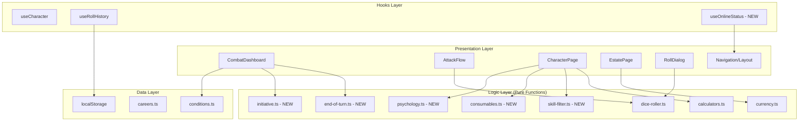

# Design Document: UX Polish and Functionality

## Overview

This design covers 22 UX polish and functionality improvements for the WFRP 4e Character Sheet PWA. The improvements are organized into five categories:

1. **Visual Polish** — Condition color-coding, wound escalation indicators, roll animations, state change transitions
2. **Combat Enhancements** — Opposed tests, end-of-turn automation, two-weapon fighting, initiative tracking
3. **Automation** — Wound/AP auto-calculation, consumable dose tracking
4. **Mobile Experience** — Haptic feedback, offline indicator, roll history persistence
5. **Quality of Life** — Skill filtering, session notes, spell effects, ledger history, psychology traits, currency input

All features build on the existing React/TypeScript PWA architecture using Vite, CSS Modules, and the existing hooks/logic layer pattern. No new external dependencies are required — the existing `fast-check` library handles property-based testing, and `lucide-react` provides icons.

## Architecture



### Design Decisions

1. **Pure logic extraction**: All new computations (end-of-turn processing, initiative sorting, skill filtering, consumable clamping) are implemented as pure functions in the `src/logic/` directory, separate from React components. This enables property-based testing without DOM dependencies.

2. **CSS Modules for animations**: All visual polish (animations, transitions, color-coding) uses CSS Modules with `@keyframes` and CSS transitions. No JavaScript animation libraries. Respects `prefers-reduced-motion` via CSS media queries.

3. **localStorage for persistence**: Roll history persistence uses the same localStorage pattern already established by `useCharacterManager` and `character-manager.ts`.

4. **No new state management**: All new state lives within existing component state or the `Character` type definition. The existing `update`/`updateCharacter` pattern handles all mutations.

5. **Progressive enhancement**: Haptic feedback and offline indicators use feature detection (`navigator.vibrate`, `navigator.onLine`) with graceful fallback — no errors on unsupported devices.

## Components and Interfaces

### New Logic Modules

#### `src/logic/end-of-turn.ts`

```typescript
export interface EndOfTurnEffect {
  type: 'damage' | 'remove_condition';
  condition: string;
  amount?: number;
  description: string;
}

export interface EndOfTurnResult {
  newWounds: number;
  removedConditions: string[];
  effects: EndOfTurnEffect[];
  roundAdvanced: number;
}

/**
 * Process end-of-turn effects for a character.
 * - Bleeding: reduce wounds by level
 * - Ablaze: reduce wounds by level
 * - Stunned/Surprised: auto-remove
 * - Wounds floor at 0
 * - Skip all damage if wounds already at 0
 */
export function processEndOfTurn(
  currentWounds: number,
  conditions: { name: string; level: number }[],
  currentRound: number
): EndOfTurnResult;
```

#### `src/logic/initiative.ts`

```typescript
export interface Combatant {
  id: string;
  name: string;
  initiative: number;
}

/**
 * Sort combatants by initiative descending.
 * For equal initiatives, maintains insertion order (stable sort).
 */
export function sortByInitiative(combatants: Combatant[]): Combatant[];

/**
 * Advance active index to next combatant, wrapping at end.
 */
export function nextTurn(activeIndex: number, totalCombatants: number): number;
```

#### `src/logic/skill-filter.ts`

```typescript
export interface SkillFilterOptions {
  searchText: string;
  trainedOnly: boolean;
}

/**
 * Filter skills by name (case-insensitive) and optionally by trained status.
 * Returns a subset of the input skills matching all active criteria.
 */
export function filterSkills(
  skills: { n: string; a: number }[],
  options: SkillFilterOptions
): { n: string; a: number }[];
```

#### `src/logic/consumables.ts`

```typescript
export interface Consumable {
  id: string;
  name: string;
  currentDoses: number;
  maxDoses: number;
  effect: string;
}

/**
 * Decrement dose count, flooring at 0.
 */
export function decrementDose(consumable: Consumable): Consumable;

/**
 * Increment dose count, capping at maxDoses.
 */
export function incrementDose(consumable: Consumable): Consumable;
```

#### `src/logic/psychology.ts`

```typescript
export type PsychologyType = 'Animosity' | 'Hatred' | 'Fear' | 'Terror' | 'Frenzy' | 'Prejudice';

export interface PsychologyTrait {
  id: string;
  type: PsychologyType;
  target: string;     // For Animosity, Hatred, Prejudice: text target
  rating?: number;    // For Fear, Terror: numeric rating
}

export const PSYCHOLOGY_REMINDERS: Record<PsychologyType, string>;

/**
 * Validate a psychology trait has all required fields.
 */
export function validatePsychologyTrait(
  type: PsychologyType | '',
  target: string,
  rating?: number
): boolean;
```

### New Hook

#### `src/hooks/useOnlineStatus.ts`

```typescript
/**
 * Hook that tracks online/offline status via navigator.onLine and
 * online/offline events. Returns boolean isOnline.
 */
export function useOnlineStatus(): boolean;
```

### Modified Roll History Hook

The existing `useRollHistory` hook will be enhanced to persist to localStorage:

```typescript
// Enhanced useRollHistory with localStorage persistence
export function useRollHistory(): UseRollHistoryResult;
// - Persists most recent 50 entries to localStorage key 'wfrp-roll-history'
// - Restores on mount
// - Trims oldest entries when exceeding 50
```

### New UI Components

| Component | Location | Purpose |
|-----------|----------|---------|
| `OfflineIndicator` | `src/components/shared/OfflineIndicator.tsx` | Small chip showing offline status |
| `InitiativeTracker` | `src/components/combat/InitiativeTracker.tsx` | Combatant list with turn tracking |
| `ConsumablesPanel` | `src/components/shared/ConsumablesPanel.tsx` | Dose-tracked consumables list |
| `PsychologyPanel` | `src/components/shared/PsychologyPanel.tsx` | Psychology traits manager |
| `SessionNotesPanel` | `src/components/shared/SessionNotesPanel.tsx` | Timestamped session log |
| `LedgerPanel` | `src/components/shared/LedgerPanel.tsx` | Transaction history with entry form |
| `SkillFilter` | `src/components/shared/SkillFilter.tsx` | Search input + Trained Only toggle |

### Modified Existing Components

| Component | Changes |
|-----------|---------|
| `CombatDashboard` | Add condition color-coding, wound escalation visuals, state transitions, end-of-turn button, initiative tracker integration |
| `AttackFlow` | Add off-hand toggle, Dual Wielder detection, second attack support |
| `RollDialog` | Add opposed test mode, roll animations, haptic feedback |
| `CharacterPage` | Add wound formula breakdown, AP auto-calculation, consumables, psychology, career skill highlighting, spell expand, skill filter |
| `EstatePage` | Integrate CurrencyInput, add LedgerPanel |
| `PageContainer` | Add OfflineIndicator |

## Data Models

### Character Type Extensions

The following fields are added to the `Character` interface:

```typescript
// In src/types/character.ts — additions to Character interface
interface Character {
  // ... existing fields ...

  // Consumables (Requirement 10)
  consumables?: Consumable[];

  // Psychology traits (Requirement 11)  
  psychologyTraits?: PsychologyTrait[];

  // Initiative tracker state (Requirement 19) — stored in combatState or separate
  initiativeList?: Combatant[];
  activeInitiativeIndex?: number;
}
```

### localStorage Keys

| Key | Purpose | Max Size |
|-----|---------|----------|
| `wfrp-roll-history` | Persisted roll results | 50 entries (~25KB) |

### Condition Color Map

```typescript
export const CONDITION_COLORS: Record<string, { bg: string; text: string; hue: number }> = {
  Bleeding:     { bg: '#dc2626', text: '#fff', hue: 0 },
  Ablaze:       { bg: '#ea580c', text: '#fff', hue: 20 },
  Poisoned:     { bg: '#16a34a', text: '#fff', hue: 142 },
  Stunned:      { bg: '#ca8a04', text: '#000', hue: 45 },
  Surprised:    { bg: '#ca8a04', text: '#000', hue: 45 },
  Fatigued:     { bg: '#ea580c', text: '#fff', hue: 25 },
  Prone:        { bg: '#6b7280', text: '#fff', hue: 220 },
  Broken:       { bg: '#7c3aed', text: '#fff', hue: 263 },
  Blinded:      { bg: '#374151', text: '#fff', hue: 215 },
  Deafened:     { bg: '#374151', text: '#fff', hue: 215 },
  Entangled:    { bg: '#92400e', text: '#fff', hue: 30 },
  Unconscious:  { bg: '#111827', text: '#fff', hue: 220 },
};
```

## Correctness Properties

*A property is a characteristic or behavior that should hold true across all valid executions of a system — essentially, a formal statement about what the system should do. Properties serve as the bridge between human-readable specifications and machine-verifiable correctness guarantees.*

### Property 1: Wound Maximum Formula Correctness

*For any* valid characteristic values (S, T, WP each in range 0-99), any Hardy talent level (0-5), and any woundsUseSB boolean, computing wound maximum SHALL produce the value: (woundsUseSB ? floor(S/10) : 0) + 2×floor(T/10) + floor(WP/10) + Hardy×floor(T/10), and the formula breakdown components SHALL sum to that total.

**Validates: Requirements 3.1, 3.2, 3.3, 3.6**

### Property 2: Condition Intensity Scaling

*For any* stackable condition with level L (where 1 < L ≤ maxLevel), the rendered badge opacity or intensity value SHALL be greater than the intensity at level 1 and proportional to L/maxLevel.

**Validates: Requirements 1.2**

### Property 3: Career Skill Highlighting Set

*For any* valid career scheme and career level, the set of highlighted skills SHALL be exactly the intersection of the character's skill list and the current career level's skill list from the Career_Scheme data.

**Validates: Requirements 5.1**

### Property 4: Session Notes Chronological Ordering

*For any* sequence of note additions, the displayed log SHALL be ordered by timestamp descending (newest first), and the most recently added note SHALL always appear at index 0 with a timestamp ≤ Date.now().

**Validates: Requirements 6.1, 6.3**

### Property 5: Opposed Test Net SL

*For any* player target number (1-200) and opponent target number (1-200) and corresponding roll values, the calculated net SL SHALL equal player SL minus opponent SL.

**Validates: Requirements 7.6**

### Property 6: Opposed Test Tie Resolution

*For any* opposed test result where net SL equals zero, the declared winner SHALL be the side whose roll value is higher. If both roll values are equal and net SL is zero, the result SHALL be a tie.

**Validates: Requirements 7.5**

### Property 7: End-of-Turn Condition Damage

*For any* combination of current wounds (≥0), Bleeding level (0-10), and Ablaze level (0-10): if current wounds > 0, the resulting wounds SHALL equal max(0, currentWounds - bleedingLevel - ablazeLevel); if current wounds = 0, the resulting wounds SHALL remain 0.

**Validates: Requirements 8.3, 8.4, 8.7, 8.8**

### Property 8: AP Computation Invariant

*For any* set of worn armour items, the computed AP for each body location SHALL equal the sum of AP values (applying the flexible/non-flexible stacking rule) of all armour items whose locations field covers that body location.

**Validates: Requirements 9.1, 9.2, 9.6**

### Property 9: Consumable Dose Clamping

*For any* consumable with maxDoses M and currentDoses D, after any number of increment/decrement operations, the resulting currentDoses SHALL always be in the range [0, M].

**Validates: Requirements 10.6, 10.7**

### Property 10: Psychology Trait Validation

*For any* combination of psychology type and field values, validation SHALL return true only when type is non-empty AND (for Fear/Terror: rating is a positive number) AND (for Animosity/Hatred/Prejudice: target is a non-empty string).

**Validates: Requirements 11.3**

### Property 11: Treasury Delta Application

*For any* valid treasury balance and currency delta, if applying the delta would result in any denomination going below 0, the operation SHALL be rejected; otherwise, the resulting balance SHALL equal the original plus the delta for each denomination.

**Validates: Requirements 12.3**

### Property 12: Roll History Persistence Invariant

*For any* sequence of N roll additions (N ≥ 0) and simulated page reloads, the persisted history SHALL contain exactly min(N, 50) entries representing the most recent rolls in chronological order (newest first).

**Validates: Requirements 18.1, 18.3, 18.5**

### Property 13: Initiative Sort Invariant

*For any* list of combatants with initiative values, the sorted list SHALL have each combatant's initiative value less than or equal to the previous combatant's initiative value (descending order).

**Validates: Requirements 19.3, 19.8**

### Property 14: Initiative Turn Cycling

*For any* initiative list of N combatants (N > 0), calling nextTurn N times from any starting index SHALL return to the original index (complete cycle).

**Validates: Requirements 19.5**

### Property 15: Off-Hand Penalty Computation

*For any* base target number T, when the off-hand toggle is active and the character does NOT have Dual Wielder, the modified target SHALL equal T - 20. When the character HAS Dual Wielder, the modified target SHALL equal T.

**Validates: Requirements 20.1**

### Property 16: Ledger Chronological Ordering

*For any* ledger array with multiple entries, the displayed order SHALL be descending by timestamp (newest first).

**Validates: Requirements 21.1**

### Property 17: Ledger Amount Validation

*For any* ledger entry submission, if the total amount (GC + SS + D converted to a single value) is zero or negative, the form SHALL reject the submission. Only strictly positive amounts SHALL be accepted.

**Validates: Requirements 21.3**

### Property 18: Ledger Treasury Impact

*For any* ledger entry with type 'income' and amount A, the treasury SHALL increase by A. For any entry with type 'expense' and amount A, the treasury SHALL decrease by A.

**Validates: Requirements 21.5, 21.6**

### Property 19: Skill Filter Subset Invariant

*For any* filter text F and skill list S, the filtered result R SHALL satisfy: (a) R is a subset of S, and (b) every skill in R has a name containing F (case-insensitive), and (c) every skill in S whose name contains F (case-insensitive) is in R.

**Validates: Requirements 22.2, 22.6**

### Property 20: Combined Skill Filter Intersection

*For any* filter text F, trained-only toggle T, and skill list S, the filtered result SHALL equal the intersection of {skills matching F by name} and {skills with advances > 0 if T is active, otherwise all skills}.

**Validates: Requirements 22.4**

## Error Handling

| Scenario | Handling Strategy |
|----------|-------------------|
| `navigator.vibrate` undefined | Feature-detect before calling; skip silently |
| localStorage full/unavailable | Catch quota errors; fall back to in-memory only for roll history |
| Invalid career scheme data | Remove highlighting; display skills without accent |
| Condition with unknown name | Render badge without color-coding (use neutral grey fallback) |
| Zero-division in wound percentage | Guard `totalWounds <= 0` → treat as 0% |
| Empty consumable name on add | Disable submit button; show validation inline |
| Negative currency delta exceeding balance | Reject delta; show "Insufficient funds" message |
| Initiative list with duplicate values | Stable sort preserves insertion order |
| prefers-reduced-motion | All animations gated by `@media (prefers-reduced-motion: no-preference)` |
| Offline during save | Data is localStorage-only already; no network calls affected |

## Testing Strategy

### Property-Based Testing

This feature is suitable for property-based testing. The logic layer contains multiple pure functions with universal properties that hold across wide input ranges.

**Library**: `fast-check` (already in devDependencies)
**Runner**: `vitest` with minimum 100 iterations per property
**Tag format**: `Feature: ux-polish-and-functionality, Property {N}: {title}`

Property tests target the pure logic modules:
- `src/logic/calculators.ts` — wound formula (Property 1)
- `src/logic/end-of-turn.ts` — condition damage (Property 7)
- `src/logic/initiative.ts` — sort and cycling (Properties 13, 14)
- `src/logic/skill-filter.ts` — filtering invariants (Properties 19, 20)
- `src/logic/consumables.ts` — dose clamping (Property 9)
- `src/logic/psychology.ts` — validation (Property 10)
- `src/logic/dice-roller.ts` — opposed test (Properties 5, 6)
- `src/logic/currency.ts` — treasury delta (Properties 11, 17, 18)
- `src/hooks/useRollHistory.ts` — persistence invariant (Property 12)

### Unit Testing (Example-Based)

Unit tests cover:
- Condition color map correctness (all 12 conditions mapped)
- CSS contrast ratio verification for condition badges
- Roll animation class application (critical glow, fumble shake)
- `prefers-reduced-motion` suppression
- Specific UI interactions (expand spell, add consumable, career change)
- Haptic feedback API calls (mock `navigator.vibrate`)
- Offline indicator show/hide on events
- Ledger entry display formatting
- Off-hand toggle with/without Dual Wielder talent

### Integration Testing

- End-of-turn button: full flow from button press through wound update and condition removal
- CurrencyInput on EstatePage: delta submission updates treasury
- Initiative tracker: add/remove combatants during combat, clear on combat end
- Roll history: persist → reload → restore cycle

### CSS/Visual Testing

- Wound threshold state transitions at exact boundary values (50%, 25%, 0)
- Animation timing within 200-400ms range
- Condition badge contrast ratio >= 4.5:1
- Offline indicator positioning (non-overlapping with interactive content)
