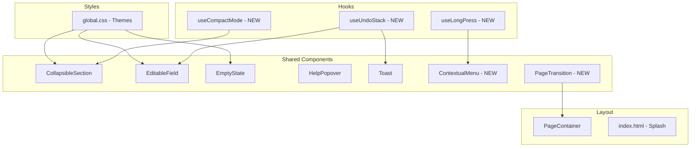

# Design Document: UX Polish Improvements

## Overview

This design covers 12 UX polish improvements for the WFRP4e PWA Character Sheet. The improvements span animation quality, form validation feedback, undo support, contextual help, touch interactions, display density, accessibility contrast fixes, loading experience, and rendering quality. Each improvement targets an existing component or introduces a lightweight new one, keeping the architecture flat and the bundle size small.

The overarching design philosophy is:
- **Progressive enhancement** — animations and haptics degrade gracefully when unavailable
- **Respect user preferences** — `prefers-reduced-motion` disables all animations
- **Leverage CSS where possible** — avoid JS-driven animations for layout transitions
- **Minimal new dependencies** — no new runtime libraries; use existing React 19, CSS modules, and `lucide-react`

## Architecture



## Components and Interfaces

### 1. CollapsibleSection (Modified)

**Current**: Uses `max-height` transition with a fixed 2000px cap.
**New**: CSS Grid `grid-template-rows` animation (0fr ↔ 1fr) for true intrinsic height animation.

```typescript
// No interface changes — internal CSS-only refactor
// CollapsibleSection.module.css changes:
// .content { display: grid; grid-template-rows: 0fr; transition: grid-template-rows 200ms ease; }
// .content[data-expanded="true"] { grid-template-rows: 1fr; }
// .contentInner { overflow: hidden; }
```

**Reduced-motion**: A `@media (prefers-reduced-motion: reduce)` rule sets `transition-duration: 0s`.

### 2. PageTransition (New Component)

A wrapper around `PageContainer`'s children that applies a crossfade on page change.

```typescript
interface PageTransitionProps {
  pageKey: string;       // current page identifier (triggers transition on change)
  children: ReactNode;
}
```

**Implementation approach**: Uses a CSS class toggle (`opacity: 0` → `opacity: 1`) with `transition: opacity 200ms ease`. On `pageKey` change, the outgoing content gets `opacity: 0`, then after the transition duration, the incoming content renders with `opacity: 1`. Uses `useRef` to track the previous page key and a `requestAnimationFrame` to coordinate.

**Cancellation**: If `pageKey` changes mid-transition, the ongoing transition is cancelled (class immediately set to incoming state) and the new transition begins.

**Reduced-motion**: Transition duration set to 0ms, resulting in immediate swap.

### 3. EditableField (Modified)

Extended with validation error states and escape-to-revert hint.

```typescript
interface EditableFieldProps {
  label: string;
  value: string | number;
  type?: 'text' | 'number';
  mode?: 'tap-to-edit' | 'always-editable';
  required?: boolean;                    // NEW — enables empty-on-blur validation
  onSave: (value: string | number) => void;
  style?: CSSProperties;
}
```

**Validation logic**:
- `type="number"`: After parsing, if `Number.isNaN(parsed)`, set error state with message "Must be a number"
- `required=true`: On blur, if trimmed value is empty, set error state with message "Required"
- Error state clears immediately when input becomes valid (on `onChange`)
- Invalid values are never passed to `onSave`

**Accessibility**:
- Error input gets `aria-invalid="true"`
- Error message rendered in a `<span>` with unique ID, referenced via `aria-describedby`
- Error message container has `role="alert"` for live announcement

**Escape-to-revert hint**:
- After entering edit mode, a 1-second `setTimeout` shows a small hint ("Esc to revert") below the input
- Hint is a `<span>` with muted styling
- A session counter (stored in a module-level `Map<string, number>`) tracks how many times the user has used Escape. After 3 uses, the hint is suppressed for the session

### 4. useUndoStack Hook (New)

```typescript
interface UndoEntry {
  field: string;           // dot-notation path (e.g., "chars.WS.a")
  previousValue: unknown;
  newValue: unknown;
  timestamp: number;
}

interface UseUndoStackResult {
  push: (entry: Omit<UndoEntry, 'timestamp'>) => void;
  undo: () => UndoEntry | null;
  canUndo: boolean;
  clear: () => void;
}

function useUndoStack(maxSize?: number): UseUndoStackResult;
// Default maxSize = 10
```

**Integration**:
- The `update` function in `useCharacter` is wrapped at the `AppWithCharacter` level to push entries onto the undo stack before applying
- A global `keydown` listener for `Ctrl+Z` / `Cmd+Z` fires `undo()` only when `document.activeElement` is not an input/textarea/contenteditable
- On undo, the `update` function is called with the `previousValue` for the stored `field`
- A toast is shown: "Reverted {fieldLabel} to {value}"
- Stack is cleared on character switch (listen to `characterId` change)

### 5. ContextualMenu Component (New)

```typescript
interface ContextualMenuProps {
  x: number;
  y: number;
  items: Array<{ label: string; icon?: LucideIcon; onAction: () => void }>;
  onDismiss: () => void;
}
```

**Positioning**: Uses `position: fixed` with `top`/`left` set to touch coordinates. A `useEffect` measures the menu DOM element and adjusts if it overflows the viewport (clamps to `window.innerWidth - menuWidth` and `window.innerHeight - menuHeight`).

**Dismissal**: Click/tap outside, Escape key, or browser back gesture (via `popstate` event).

**Haptic feedback**: Calls `navigator.vibrate?.(10)` on mount (short 10ms vibration).

### 6. useLongPress Hook (New)

```typescript
interface UseLongPressOptions {
  threshold?: number;   // default 500ms
  onLongPress: (e: TouchEvent) => void;
}

function useLongPress(options: UseLongPressOptions): {
  onTouchStart: (e: React.TouchEvent) => void;
  onTouchEnd: (e: React.TouchEvent) => void;
  onTouchMove: (e: React.TouchEvent) => void;
};
```

**Behavior**:
- On `touchstart`, start a timer for `threshold` ms
- On `touchend` before threshold, clear timer (normal tap)
- On `touchmove` (if moved > 10px from start point), clear timer (scroll/swipe discrimination)
- On timer fire, call `onLongPress` with the original event
- Only registers handlers if `'ontouchstart' in window` (no desktop registration)

### 7. useCompactMode Hook (New)

```typescript
type DisplayMode = 'compact' | 'expanded';

function useCompactMode(): {
  mode: DisplayMode;
  toggle: () => void;
};
```

Persists to `localStorage` under key `wfrp-display-mode`. Defaults to `'expanded'`.

### 8. Compact Mode Toggle (CharacterPage)

A `ToggleSwitch` or icon button in the Character page header area. When in compact mode:
- Only renders: character name, species, career, current/max wounds, a single row of characteristic values, and equipped weapons summary
- Hides: full characteristics table, all skills, talents, trappings, notes sections
- Transition between modes uses the same `grid-template-rows` animation as CollapsibleSection

### 9. EmptyState Usage Audit

The existing `EmptyState` component already supports `icon`, `heading`, `description`, and `action`. The design change is ensuring every list section uses it when empty. Affected sections:
- Talents, Trappings, Spells, Prayers, Weapons, Armour, Injuries, Diseases, Corruption, Mutations, Session Notes

Each section provides a contextual icon (from `lucide-react`), a heading (e.g., "No Talents"), a description (e.g., "Talents are gained through career advances"), and an action button where applicable (e.g., "Add Talent").

### 10. Contextual Help Tooltips

The existing `HelpPopover` component already handles the core pattern. The design change is:
- Adding `HelpPopover` instances next to: Advantage tracking, Corruption/Mutation, Channelling, Overcast allocation, Fortune/Resolve spending
- The existing dismissal persistence (`localStorage` key per concept) satisfies requirement 7.3
- Content is capped at 2 sentences per the requirement

### 11. WCAG AA Color Contrast Fix

**Current `--text-muted` in dark theme**: `#908070`
- Contrast against `--bg-primary` (#121212): ~3.8:1 (FAILS)
- Contrast against `--card-bg` (#1e1e1e): ~3.3:1 (FAILS)

**New `--text-muted` in dark theme**: `#a89880` (achieves ~5.0:1 against #121212, ~4.5:1 against #1e1e1e)

**Old Guy theme `--text-muted`**: Currently `#9a8a7a` → update to `#a89880` for consistency.

**Audit other themes**:
- Light theme: verify against light backgrounds
- High-contrast theme: already designed for maximum contrast, likely passes

### 12. Splash Screen

Inline HTML/CSS in `index.html` rendered before any `<script>` executes:

```html
<div id="splash" style="...">
  <svg><!-- app icon inline --></svg>
  <p>WFRP 4e Character Sheet</p>
  <div class="pulse-loader"></div>
</div>
```

**Theme awareness**: The existing inline script that reads `localStorage('wfrp-theme')` already sets `data-theme` on `<html>`. The splash CSS uses `var(--bg-primary)` and `var(--parchment)` with fallback values for the default dark theme.

**Removal**: In `main.tsx` (or a small inline script after React mounts), the splash element fades out (`opacity: 0` transition 300ms) then is removed from DOM via `element.remove()`.

### 13. Old Guy Mode: Zoom → Transform Scale

**Current**: `[data-theme="old-guy"] #root { zoom: 1.2; }`

**New approach**:
```css
[data-theme="old-guy"] #root {
  transform: scale(1.2);
  transform-origin: top left;
  width: calc(100% / 1.2);    /* 83.33% — prevents horizontal overflow */
  min-height: calc(100vh / 1.2); /* ensures full viewport coverage */
}
```

This replaces `zoom` (non-standard, causes subpixel blurring in some browsers) with `transform: scale` which uses GPU compositing and produces sharper text rendering.

**Touch targets**: Since `transform: scale(1.2)` scales everything up, elements that are 44px before scaling become 52.8px visually. The base CSS already ensures minimum 44px touch targets, so after scaling they exceed the requirement.

## Data Models

### UndoEntry

```typescript
interface UndoEntry {
  field: string;           // dot-notation path into Character object
  previousValue: unknown;  // value before the edit
  newValue: unknown;       // value after the edit (for toast display)
  timestamp: number;       // Date.now() at time of edit
}
```

### CompactModePreference

```typescript
// Stored in localStorage as plain string: "compact" | "expanded"
// Key: "wfrp-display-mode"
```

### EscHintSessionState

```typescript
// Module-level Map (not persisted — session only)
// Map<fieldId, dismissCount>
// When dismissCount >= 3, hint is suppressed
```

### ContextualMenuItem

```typescript
interface ContextualMenuItem {
  label: string;
  icon?: LucideIcon;
  onAction: () => void;
  destructive?: boolean;  // renders in --danger color
}
```

## Correctness Properties

*A property is a characteristic or behavior that should hold true across all valid executions of a system — essentially, a formal statement about what the system should do. Properties serve as the bridge between human-readable specifications and machine-verifiable correctness guarantees.*

### Property 1: Non-numeric input detection

*For any* string that cannot be parsed as a finite number (i.e., `!Number.isFinite(Number(input))`), when entered into a numeric EditableField, the component SHALL display an error state and NOT call `onSave`.

**Validates: Requirements 3.1, 3.5**

### Property 2: Error clearance on valid input

*For any* EditableField in an error state, when the user provides a valid input (non-empty for required fields, parseable number for numeric fields), the error state SHALL be removed immediately on the same change event.

**Validates: Requirements 3.3**

### Property 3: Undo reverts most recent change

*For any* sequence of character data edits, pressing Ctrl+Z (outside an active input) SHALL restore the most recently changed field to its previous value, and the character state after undo SHALL equal the state before that edit was applied.

**Validates: Requirements 4.1**

### Property 4: Undo stack capacity invariant

*For any* sequence of N edits (where N > 10), the undo stack SHALL contain exactly `min(N, maxSize)` entries, where `maxSize >= 10`. Performing undo `min(N, maxSize)` times SHALL revert the character to the state from `min(N, maxSize)` edits ago.

**Validates: Requirements 4.2**

### Property 5: Long-press threshold discrimination

*For any* touch interaction on a card element, the contextual menu SHALL appear if and only if the touch duration is >= 500ms AND the touch point has not moved more than 10px from its start position. Touches shorter than 500ms or with movement > 10px SHALL NOT trigger the menu.

**Validates: Requirements 8.1, 8.4**

### Property 6: Contextual menu viewport containment

*For any* touch coordinates (x, y) that trigger a contextual menu, the menu's final rendered position SHALL be contained entirely within the viewport boundaries (0 ≤ left, top ≥ 0, right ≤ window.innerWidth, bottom ≤ window.innerHeight).

**Validates: Requirements 8.2**

### Property 7: WCAG AA contrast compliance for text-muted

*For any* theme (dark, light, high-contrast, old-guy), the `--text-muted` color value SHALL achieve a contrast ratio of at least 4.5:1 against both `--bg-primary` and `--card-bg` background colors for that theme.

**Validates: Requirements 10.1, 10.2, 10.3**

### Property 8: All text colors meet WCAG AA contrast

*For any* text color CSS variable (`--text-primary`, `--text-secondary`, `--text-muted`, `--parchment`) in any theme, the contrast ratio against its typical background (`--bg-primary`, `--card-bg`) SHALL be at least 4.5:1.

**Validates: Requirements 10.4**

### Property 9: Display mode persistence round-trip

*For any* display mode value ("compact" or "expanded"), writing it to localStorage and reading it back SHALL produce the same value. On app reload, the Character page SHALL render in the persisted mode.

**Validates: Requirements 9.4**

### Property 10: Invalid values never saved to store

*For any* invalid input (non-numeric string in a number field, or empty value in a required field), the `onSave` callback SHALL NOT be invoked, and the character data store SHALL remain unchanged.

**Validates: Requirements 3.5**

## Error Handling

| Scenario | Handling |
|----------|----------|
| localStorage unavailable (quota/private browsing) | Undo stack, compact mode, and hint counters operate in-memory only; no error shown to user |
| `navigator.vibrate` unsupported | Haptic call is a no-op via optional chaining (`navigator.vibrate?.(10)`) |
| Transition interrupted by rapid navigation | Ongoing transition is cancelled; new page renders immediately |
| Touch event listeners on non-touch device | `useLongPress` checks `'ontouchstart' in window` before registering; desktop uses existing button controls |
| Splash screen removal fails | Splash has `pointer-events: none` after fade; a 2-second fallback timeout force-removes it |
| `prefers-reduced-motion` changes mid-session | CSS media query handles this automatically — no JS listener needed |
| Invalid input in always-editable mode | Coerces to 0 (existing behavior) but now shows brief flash of error state before correction |

## Testing Strategy

### Unit Tests (Example-Based)

- CollapsibleSection: verify grid-template-rows classes are applied correctly for expanded/collapsed states
- CollapsibleSection: verify reduced-motion media query removes transitions
- PageTransition: verify crossfade class application on page key change
- PageTransition: verify cancellation on rapid navigation
- EditableField: verify error message rendering and aria attributes
- EditableField: verify escape-to-revert hint timing and suppression
- ContextualMenu: verify positioning, dismissal, and haptic feedback call
- Splash screen: verify DOM removal after React mount
- Old Guy Mode: verify transform-based scaling CSS is applied

### Property-Based Tests (fast-check)

The project uses `fast-check` (already in devDependencies) and `vitest` for property-based testing.

**Configuration**: Each property test runs a minimum of 100 iterations.

Each test is tagged with a comment referencing its design property:
- **Feature: ux-polish-improvements, Property 1**: Non-numeric input detection
- **Feature: ux-polish-improvements, Property 2**: Error clearance on valid input
- **Feature: ux-polish-improvements, Property 3**: Undo reverts most recent change
- **Feature: ux-polish-improvements, Property 4**: Undo stack capacity invariant
- **Feature: ux-polish-improvements, Property 5**: Long-press threshold discrimination
- **Feature: ux-polish-improvements, Property 6**: Contextual menu viewport containment
- **Feature: ux-polish-improvements, Property 7**: WCAG AA contrast for text-muted
- **Feature: ux-polish-improvements, Property 8**: All text colors meet WCAG AA
- **Feature: ux-polish-improvements, Property 9**: Display mode persistence round-trip
- **Feature: ux-polish-improvements, Property 10**: Invalid values never saved

### Integration Tests

- Full page render with empty sections → verify EmptyState components appear
- Character switch → verify undo stack is cleared
- Help tooltip dismissal persistence across re-renders
- Compact/expanded mode toggle renders correct content subset

### Accessibility Tests

- Verify `aria-invalid`, `aria-describedby`, and `role="alert"` on validation errors
- Verify focus management after contextual menu dismiss
- Verify all color contrast ratios pass automated WCAG AA checks
- Note: Full WCAG validation requires manual testing with assistive technologies and expert accessibility review
