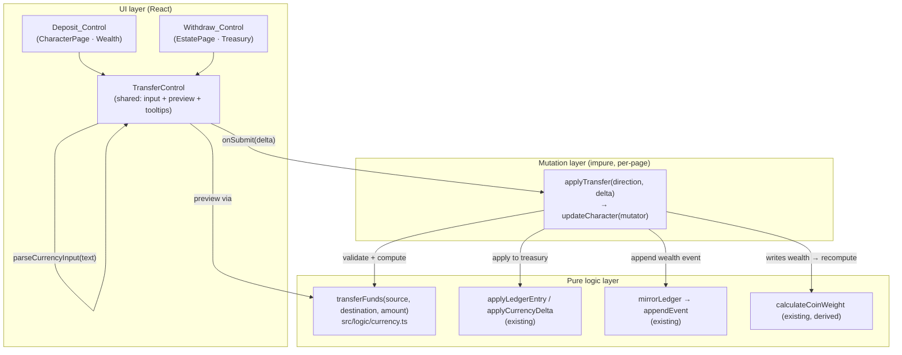

# Design Document

## Overview

This feature adds the ability to move coin between a character's **Personal_Wealth** (`character.wGC`/`wSS`/`wD`) and the estate **Treasury** (`character.estate.treasury.{gc,ss,d}`) in both directions, per denomination, with no conversion between denominations. A **Deposit** moves coin from Personal_Wealth into Treasury (initiated on the Character page "Wealth" section); a **Withdrawal** moves coin from Treasury into Personal_Wealth (initiated on the Estate page "Treasury" panel).

The design is deliberately thin because almost everything it needs already exists:

- **Pure math** already lives in `src/logic/currency.ts` (`validateTreasuryDelta`, `applyCurrencyDelta`, `isValidLedgerAmount`). The one new piece of pure logic is `transferFunds`, which composes those helpers into a two-pool move and returns a typed result. No new game mechanic is introduced.
- **Atomic persistence + logging** already has an established pattern in `LedgerPanel.tsx`: build the new `LedgerEntry`, apply it to the treasury with `applyLedgerEntry`, write `estate.ledger` + treasury in one `updateCharacter` closure, then `mirrorLedger(...)` to append the `wealth` event to `character.eventLog`. This feature reuses that pattern exactly, extended to also touch personal wealth.
- **Coin encumbrance** is already a derived value: `useCharacter` recomputes `coinWeight = calculateCoinWeight(wGC, wSS, wD)` via `useMemo` whenever personal wealth changes, and it never reads the treasury. Requirement 5 is therefore satisfied by existing derived calculation — no new code.
- **Tooltips** reuse the shared `Tooltip` + `TooltipTriggerCell` components already used for the encumbrance/coin-weight breakdowns on the Character page.

### Rulebook compliance (steering: rules-compliance)

This is bookkeeping over the player's own coin between two pools the character already controls. The two rulebook-relevant behaviours it touches are **preserved from existing logic, not redefined**:

- **Coin encumbrance** stays `Math.floor((gc + ss + d) / 200)` (`calculateCoinWeight`, Core p.293 coin weight: 1 Enc per 200 coins). No new formula.
- **No automatic denomination conversion.** Core p.293 (1 GC = 20 ss = 240 d) is the *display/summary* convention only; the app never silently converts a player's coin. `transferFunds` moves each denomination by exactly its own counted amount, matching how `applyCurrencyDelta` already behaves. Source citations will be repeated in code comments where the logic lives.

Any ambiguity here is flagged rather than guessed (see "Design Decisions").

### Requirements coverage map

| Design section | Requirements satisfied |
| --- | --- |
| Transfer_Service (`transferFunds`) | 1.2, 1.4 (logic), 2.2, 2.4 (logic), 4.1, 4.2, 6.4 (logic) |
| Atomic character mutation (`applyTransfer` mutator) | 1.3, 2.3, 3.1, 3.2, 3.3, 3.4, 7.1, 7.2 |
| Deposit_Control (Character page) | 1.1, 1.4 (UI), 6.1, 6.2, 6.3, 6.4 (UI) |
| Withdraw_Control (Estate page) | 2.1, 2.4 (UI), 6.1, 6.2, 6.3, 6.4 (UI) |
| Shared TransferControl component | 6.1, 6.2, 6.3 |
| Logging (LedgerEntry + wealth event) | 3.1, 3.2, 3.3, 3.4 |
| Derived coin encumbrance (existing) | 5.1, 5.2 |

## Architecture

Three layers, mirroring the existing separation in the codebase:



Data flow at a glance:

1. The user types an amount into the shared **TransferControl**. On every change it calls the existing `parseCurrencyInput` to get a `CurrencyDelta` (Req 6.1) and calls `transferFunds` to compute a **preview** of the resulting source and destination balances (Req 6.2), with per-balance breakdown tooltips (Req 6.3).
2. On submit, the owning page's `applyTransfer(direction, delta)` runs `transferFunds`. On failure it sets an inline error and does nothing else (Req 1.4, 2.4, 6.4, 7.2). On success it performs a **single `updateCharacter` mutation** that writes both pools, appends the `LedgerEntry`, and mirrors the `wealth` event (Req 1.3, 2.3, 3.1–3.3, 7.1).
3. Because personal wealth changed, `useCharacter`'s `coinWeight` `useMemo` recomputes automatically (Req 5.1, 5.2). No explicit call is needed.

## Components and Interfaces

### 1. Transfer_Service — `transferFunds` (pure, `src/logic/currency.ts`)

A pure function that validates and computes a coin move between two pools. It composes the existing validators rather than duplicating them.

```ts
/** Why a transfer was rejected. Discriminates the failure branch of TransferResult. */
export type TransferFailureReason = 'zero-amount' | 'insufficient-funds';

/** Result of transferFunds: either the two new balances, or a typed failure. */
export type TransferResult =
  | { ok: true; source: CurrencyDelta; destination: CurrencyDelta }
  | { ok: false; reason: TransferFailureReason };

/**
 * Move `amount` from `source` to `destination`, per denomination, with no
 * conversion between denominations (Core p.293: the app never auto-converts a
 * player's coin; each denomination moves by exactly its own counted amount).
 *
 * Validation (order matters — zero is checked before funds):
 *  - Rejects a zero/empty amount (total <= 0) with reason 'zero-amount'
 *    (reuses isValidLedgerAmount semantics). (Req 6.4)
 *  - Rejects if `source` cannot cover `amount` in EVERY denomination with
 *    reason 'insufficient-funds' (reuses validateTreasuryDelta with a negated
 *    delta: applying −amount to source must stay >= 0). (Req 1.4, 2.4)
 *
 * On success returns:
 *  - source:      applyCurrencyDelta(source, negate(amount))   // subtract
 *  - destination: applyCurrencyDelta(destination, amount)      // add
 * (Req 1.2, 2.2, 4.1, 4.2)
 *
 * Pure: never mutates its arguments.
 */
export function transferFunds(
  source: CurrencyDelta,
  destination: CurrencyDelta,
  amount: CurrencyDelta,
): TransferResult;
```

**Reuse, not duplication (steering: rules-compliance, fix-errors):**
- Zero check → the same `total > 0` rule as `isValidLedgerAmount`.
- Coverage check → `validateTreasuryDelta(source, negate(amount))` (the existing "would any denomination go below 0?" guard). This keeps the negative-balance rule in one place.
- Balance math → `applyCurrencyDelta` for both subtract (with a negated amount) and add. Because `applyCurrencyDelta` clamps at 0, and we only reach it after the coverage check passes, no clamping actually occurs on success — but reusing it keeps a single source of truth for the arithmetic.

`amount` is assumed non-negative (it comes from `parseCurrencyInput`, but transfers only ever submit positive magnitudes; the control constrains input to positive tokens). A defensive note: if an amount contains a negative token, the zero/coverage checks still produce a well-defined result, and the property tests exercise the non-negative domain that the UI can actually produce.

### 2. Atomic mutation — `applyTransfer` (per-page handler)

Each page owns a small `applyTransfer` handler wired to its `updateCharacter`. It is the only impure part. It follows the `LedgerPanel.handleSubmit` pattern exactly, extended to move personal wealth too.

```ts
type TransferDirection = 'deposit' | 'withdraw';

// Pseudocode — lives in the page (or a tiny shared helper); NOT implemented here.
function applyTransfer(direction: TransferDirection, amount: CurrencyDelta) {
  const wealth   = { gc: char.wGC || 0, ss: char.wSS || 0, d: char.wD || 0 };
  const treasury = { gc: est.treasury.gc || 0, ss: est.treasury.ss || 0, d: est.treasury.d || 0 };

  // Source/destination depend on direction:
  //   deposit  → source = wealth,   destination = treasury  (Req 1.2)
  //   withdraw → source = treasury, destination = wealth    (Req 2.2)
  const [source, destination] = direction === 'deposit'
    ? [wealth, treasury] : [treasury, wealth];

  const result = transferFunds(source, destination, amount);
  if (!result.ok) {
    setError(result.reason === 'zero-amount'
      ? 'Enter an amount greater than zero.'
      : 'Insufficient funds — this transfer would overdraw the source.');
    return; // Req 1.4, 2.4, 3.4, 6.4, 7.2 — nothing changes anywhere
  }
  setError(null);

  // Map results back to the two pools by direction.
  const newWealth   = direction === 'deposit' ? result.source : result.destination;
  const newTreasury = direction === 'deposit' ? result.destination : result.source;

  // The LedgerEntry is written from the TREASURY's perspective (see §Logging):
  //   deposit  → treasury GAINS coin  → type 'income'
  //   withdraw → treasury LOSES coin   → type 'expense'
  const entry: LedgerEntry = {
    timestamp: Date.now(),
    type: direction === 'deposit' ? 'income' : 'expense',
    description: direction === 'deposit'
      ? 'Transfer: Personal Wealth → Treasury'
      : 'Transfer: Treasury → Personal Wealth',
    amount, // exact delta moved, per denomination
  };

  // SINGLE mutation: both pools + ledger + event log (Req 7.1).
  updateCharacter((c) => {
    const withPoolsAndLedger: Character = {
      ...c,
      wGC: newWealth.gc, wSS: newWealth.ss, wD: newWealth.d,
      estate: {
        ...c.estate,
        treasury: newTreasury,
        ledger: [...(c.estate.ledger ?? []), entry],
      },
    };
    // Display/audit mirror → appends the 'wealth' eventLog event. (Req 3.3)
    return mirrorLedger(withPoolsAndLedger, entry);
  });
}
```

Key points:
- **One `updateCharacter` call** builds the whole next character (both pools, ledger, event log) so the four artefacts move together (Req 7.1). If `transferFunds` fails we return before calling `updateCharacter`, so nothing changes (Req 3.4, 7.2).
- **Coin encumbrance recompute is automatic**: writing `wGC/wSS/wD` triggers the existing `coinWeight` memo in `useCharacter`; treasury is not part of that memo (Req 5.1, 5.2).
- We deliberately set the ledger `type` and `treasury` consistently with `applyLedgerEntry` semantics (income = +treasury, expense = −treasury) so the ledger's own view of the treasury stays coherent with the balance we wrote. See Design Decisions for the rationale on why we write `treasury` directly from `transferFunds` rather than via `applyLedgerEntry`.

### 3. Shared UI — `TransferControl` (recommended)

**Recommendation: add one small shared `src/components/shared/TransferControl.tsx`** used by both surfaces. The Deposit and Withdraw controls need identical behaviour (parse input, preview both pools per denomination, breakdown tooltips, inline error, submit) and differ only in labels, direction, and which pool is source. A shared component removes duplication and guarantees the two surfaces behave identically (steering: fix-errors favours not duplicating logic that must stay in sync).

```ts
export interface TransferControlProps {
  /** Direction determines source/destination labelling and mapping. */
  direction: 'deposit' | 'withdraw';
  /** Current source-pool balance (deposit: personal wealth; withdraw: treasury). */
  source: CurrencyDelta;
  /** Current destination-pool balance. */
  destination: CurrencyDelta;
  /** Human labels for the two pools, e.g. { source: 'Wealth', destination: 'Treasury' }. */
  labels: { source: string; destination: string };
  /** Called with the parsed delta when the user submits a valid amount. */
  onSubmit: (amount: CurrencyDelta) => void;
  /** Inline error to display (owned by the page's applyTransfer). */
  error?: string | null;
}
```

Internal behaviour:
- Reuses the parsing behaviour of `CurrencyInput` (`parseCurrencyInput`) for the amount field (Req 6.1). The transfer field accepts a positive amount (e.g. `2GC 5SS 10D`); tokens are summed per denomination as `parseCurrencyInput` already does.
- On each change, computes `preview = transferFunds(source, destination, parsedAmount)`. When `preview.ok`, renders, **per denomination**, the resulting `Source` and `Destination` balances (Req 6.2). When not ok (zero/insufficient), the preview shows the current balances unchanged and the submit path surfaces the reason.
- Each resulting balance is rendered through `TooltipTriggerCell` + `Tooltip`; the tooltip body shows the additive breakdown in the form **`current +/- transferred = result`** (Req 6.3, steering: calculated-total-tooltips). Deposits show source as `current − transferred = result` and destination as `current + transferred = result`; withdrawals invert which pool is `−`/`+`. Zero components are shown so all contributing factors are visible.
- Renders `error` inline via a `role="alert"` paragraph (matches `CurrencyInput`/EstatePage `treasuryError` styling) (Req 1.4, 2.4 UI).
- Touch targets (input, submit button, tooltip trigger cells) are ≥44px (steering: ui-layout).

**Deposit_Control** = `TransferControl` mounted in the Character page **Wealth** section (`<SectionHeader icon={Coins} title="Wealth" />`), directly under the existing `CurrencyInput`, with `direction="deposit"`, `source={personal wealth}`, `destination={estate.treasury}`, `labels={{ source: 'Wealth', destination: 'Treasury' }}` (Req 1.1). CharacterPage already receives `updateCharacter`; `applyTransfer` and its error state are added there.

**Withdraw_Control** = `TransferControl` mounted in the Estate page **Treasury** panel (the `styles.treasuryPanel` block, beside the existing `CurrencyInput`/`treasuryError`), with `direction="withdraw"`, `source={estate.treasury}`, `destination={personal wealth}`, `labels={{ source: 'Treasury', destination: 'Wealth' }}` (Req 2.1). EstatePage already has `updateCharacter` and a `treasuryError` state pattern to follow.

## Data Models

No new persisted types. The feature reuses existing shapes:

- **`CurrencyDelta`** (`src/logic/currency.ts`): `{ gc: number; ss: number; d: number }` — the amount and both pool balances.
- **`Character.wGC / wSS / wD`** (`number`) — Personal_Wealth.
- **`Character.estate.treasury`** (`{ d: number; ss: number; gc: number }`) — Treasury.
- **`LedgerEntry`** (`src/types/character.ts`): `{ timestamp: number; type: string; description: string; amount: { d; ss; gc } }`. `type` is a free string but is used as `'income' | 'expense'` throughout (`applyLedgerEntry`, `mirrorLedger`, `LedgerPanel`); transfers use those two values.
- **`LogEvent`** (category `'wealth'`) with **`WealthEventPayload`** `{ entryType: string; description: string; amount: { d; ss; gc } }` — produced by `mirrorLedger` via `appendEvent`.

New **non-persisted** types (local to `currency.ts`): `TransferFailureReason` and `TransferResult` (see Transfer_Service above).

## Correctness Properties

*A property is a characteristic or behavior that should hold true across all valid executions of a system — essentially, a formal statement about what the system should do. Properties serve as the bridge between human-readable specifications and machine-verifiable correctness guarantees.*

This feature uses property-based testing because `transferFunds` is a pure function over a large input space (three denominations, two pools, arbitrary amounts) with clear universal invariants. The UI, logging, and encumbrance-recompute criteria are verified by render/example tests instead (see Testing Strategy), per the prework classification.

### Property 1: Successful transfer subtracts from source, adds to destination, and conserves total coin

*For any* source balance, destination balance, and non-zero amount the source can cover in every denomination, `transferFunds` returns `ok: true` where, per denomination, `source − amount` equals the new source balance and `destination + amount` equals the new destination balance; consequently the per-denomination sum `source + destination` is unchanged. (A withdrawal is `transferFunds(treasury, wealth, amount)`, so this single property covers both directions.)

**Validates: Requirements 1.2, 2.2**

### Property 2: Each denomination moves independently with no conversion

*For any* source balance, destination balance, and coverable non-zero amount, each denomination (GC, SS, D) of both resulting balances changes by exactly the amount specified for that denomination and by nothing derived from the other denominations — i.e. no coin is converted between denominations.

**Validates: Requirements 4.1, 4.2**

### Property 3: Insufficient funds are rejected and leave inputs unchanged

*For any* source balance, destination balance, and amount that exceeds the source in at least one denomination, `transferFunds` returns `ok: false` with reason `'insufficient-funds'` and does not mutate the source or destination arguments.

**Validates: Requirements 1.4, 2.4**

### Property 4: Zero amounts are rejected and leave inputs unchanged

*For any* source and destination balance and any amount that totals zero across all denominations, `transferFunds` returns `ok: false` with reason `'zero-amount'` and does not mutate its arguments.

**Validates: Requirements 6.4**

### Property 5: Deposit then withdraw of the same amount is an identity (round-trip)

*For any* personal wealth and treasury balances and any amount the wealth can cover, depositing the amount (wealth → treasury) and then withdrawing the same amount (treasury → wealth) restores both pools to their original per-denomination balances.

**Validates: Requirements 1.2, 2.2, 4.1**

## Error Handling

- **Zero amount (Req 6.4):** `transferFunds` returns `{ ok: false, reason: 'zero-amount' }`. The control shows an inline `role="alert"` message ("Enter an amount greater than zero.") and no mutation runs (Req 7.2).
- **Insufficient funds (Req 1.4, 2.4):** `transferFunds` returns `{ ok: false, reason: 'insufficient-funds' }`. The owning surface shows an inline error — the Character Wealth section for a deposit, the Estate Treasury panel for a withdrawal — and no mutation runs (Req 3.4, 7.2).
- **Malformed input:** if `parseCurrencyInput` returns `null` (no valid tokens), the control shows the same "invalid format" guidance `CurrencyInput` already uses and does not call `onSubmit`.
- **Mirror safety:** `mirrorLedger` already wraps summary construction in try/catch and never throws into the authoritative write, so a logging hiccup cannot corrupt the pool/ledger update. This preserves atomicity (Req 7.1).
- **Missing fields:** balances are read with `|| 0` fallbacks (matching existing handlers) so a character lacking a field is treated as zero rather than `NaN`.

## Testing Strategy

Conventions follow the existing project setup: **Vitest** + **fast-check** for property tests (see `src/logic/__tests__/ledger-currency.property.test.ts`) and **@testing-library/react** for render tests. Property tests run **≥100 iterations** (`{ numRuns: 100 }` or more) and are tagged `Feature: wealth-treasury-transfer, Property {n}: {text}`.

### Property tests — `transferFunds` (`src/logic/__tests__/transfer-funds.property.test.ts`)

One property-based test per correctness property, reusing the `CurrencyDelta` arbitraries style already in `ledger-currency.property.test.ts`:

- **Property 1** — generate `source`, `destination`, and a coverable non-zero `amount` (e.g. generate `amount` then derive a `source` that covers it, or `fc.pre` on coverage); assert `ok`, per-denomination subtract/add, and conservation of `source+destination`. (Req 1.2, 2.2)
- **Property 2** — same generation; assert each denomination changed by exactly its own amount and there is no cross-denomination coupling (perturbing one denomination's amount changes only that denomination). (Req 4.1, 4.2)
- **Property 3** — generate an `amount` that overdraws the `source` in ≥1 denomination; assert `{ ok: false, reason: 'insufficient-funds' }` and that the input objects are structurally unchanged. (Req 1.4, 2.4)
- **Property 4** — generate a zero-total `amount`; assert `{ ok: false, reason: 'zero-amount' }` and inputs unchanged. (Req 6.4)
- **Property 5** — generate wealth/treasury and a coverable amount; deposit then withdraw; assert both pools return to originals. (Req 1.2, 2.2, 4.1)

### Unit / example tests — `transferFunds`

A few concrete cases for readability and edge coverage: exact-balance transfer (source hits zero), single-denomination transfer, and the precedence case where an amount is both zero and "over" (zero-check wins → `'zero-amount'`).

### Render tests — Deposit_Control (`CharacterPage`)

- Deposit control is present in the Wealth section (Req 1.1).
- Submitting a coverable amount triggers a single mutation that lowers personal wealth, raises treasury, appends one `income` `LedgerEntry` ("Personal Wealth → Treasury"), and appends one `wealth` event (Req 1.2, 1.3, 3.1, 3.3, 7.1).
- Submitting an over-amount shows an inline error and leaves wealth, treasury, ledger, and eventLog unchanged (Req 1.4, 3.4, 7.2).
- Typing an amount shows the per-denomination resulting source/destination preview (Req 6.2) and each resulting balance exposes a breakdown tooltip reading `current +/- transferred = result` (Req 6.3).
- After a deposit, the displayed coin weight equals `calculateCoinWeight(newWealth)` (Req 5.1); a treasury-only change does not alter coin weight (Req 5.2).

### Render tests — Withdraw_Control (`EstatePage`)

- Withdraw control is present in the Treasury panel (Req 2.1).
- Submitting a coverable amount triggers a single mutation lowering treasury, raising personal wealth, appending one `expense` `LedgerEntry` ("Treasury → Personal Wealth") and one `wealth` event (Req 2.2, 2.3, 3.2, 3.3, 7.1).
- Submitting an over-amount shows an inline error in the Treasury panel and changes nothing (Req 2.4, 3.4, 7.2).
- Zero amount is blocked with an inline message and no mutation (Req 6.4).
- Preview + tooltip breakdown behave as on the deposit side (Req 6.2, 6.3).

### Shared component test — `TransferControl`

- Parses input via `parseCurrencyInput` (Req 6.1); invalid input does not submit.
- Preview numbers equal `transferFunds` output; tooltip shows the additive breakdown (Req 6.2, 6.3).
- Touch targets ≥44px (steering: ui-layout) — asserted via computed style or a shared control class already sized for touch.

## Design Decisions

1. **Write `treasury` directly from `transferFunds` rather than through `applyLedgerEntry`.** `applyLedgerEntry(treasury, amount, type)` and `transferFunds`' destination/source arithmetic must agree. Rather than compute the treasury twice (once for the pool write, once via the ledger helper) and risk divergence, the mutator writes the treasury value that `transferFunds` produced and records a `LedgerEntry` whose `type`/`amount` are *consistent* with that write (`income` when treasury gained, `expense` when it lost). `applyLedgerEntry` remains the source of truth for standalone ledger entries in `LedgerPanel`; here `transferFunds` is the source of truth for the two-pool move. This keeps one arithmetic path per operation.

2. **Ledger direction mapping (Req 3.1, 3.2).** `LedgerEntry.type` is `'income' | 'expense'` from the **Treasury's** perspective (that is how `LedgerPanel`, `applyLedgerEntry`, and the financial summary already interpret it). A **deposit** increases the treasury → `income`; a **withdrawal** decreases it → `expense`. The `description` names the direction explicitly ("Personal Wealth → Treasury" / "Treasury → Personal Wealth") so the human-readable ledger and the mirrored event summary are unambiguous regardless of the income/expense tag.

3. **Shared `TransferControl`.** Chosen over duplicating logic in each page (see Components §3) to keep the two surfaces behaviourally identical and reduce the chance of one drifting from the other.

4. **Flagged ambiguity (steering: rules-compliance).** The requirements do not state whether the transfer input should accept signed tokens (e.g. `-5SS`) like the existing `CurrencyInput`, or only positive magnitudes. This design treats a transfer amount as a **positive magnitude** (you choose a direction via the control, not via the sign), which is the least surprising reading of "deposit/withdraw an amount". If the intended behaviour is signed input, this is a small change to the control and `transferFunds`' domain — raised here rather than decided silently.

