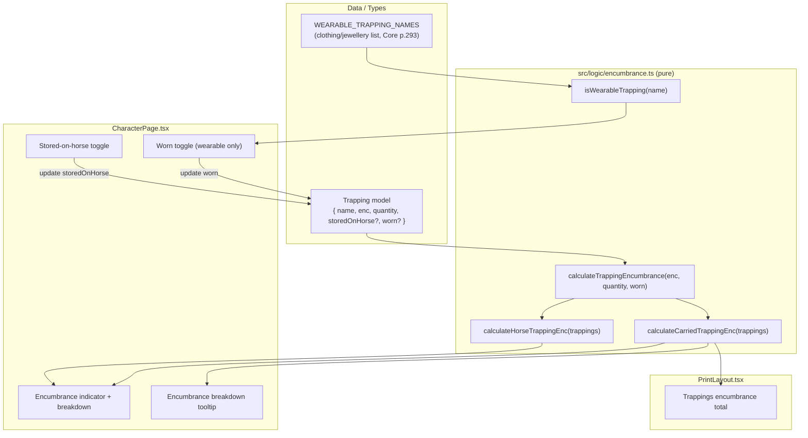

# Design Document

## Overview

This feature adds a "Worn" toggle to wearable trappings (clothing and jewellery) so their effective Encumbrance is reduced by 1 per item (minimum 0) when worn, per the WFRP4e "Worn Items" rule (Core p.293). The reduction must appear consistently in the character page encumbrance total, the encumbrance breakdown tooltip, the pack-animal ("stored on horse") accounting, and the print layout.

### Rulebook basis (Core p.293, "Worn Items")

> "Worn items such as armour, clothing, and jewellery all have their Encumbrance dropped by 1, which often means they count as Encumbrance 0 when worn."

The application already implements this rule for armour via `calculateArmourEncumbrance(enc, worn)` in `src/logic/encumbrance.ts`:

```ts
// Core p.293: worn items have Enc reduced by 1, minimum 0
export function calculateArmourEncumbrance(enc: string, worn: boolean | undefined): number {
  const baseEnc = parseFloat(enc) || 0;
  if (worn === false) return baseEnc;
  return Math.max(0, baseEnc - 1);
}
```

This feature extends the same rule to trappings, with two differences from armour:

1. Trappings have a `quantity`, so the worn reduction is applied **per item** and then multiplied by quantity.
2. The Worn toggle is only offered for **wearable** trappings (clothing/jewellery), determined by a name-based classifier, because the rulebook restricts the reduction to "armour, clothing, and jewellery".

### Key design decisions

- **Single source of truth for trapping encumbrance.** Today the carried total is computed inline in three places (`CharacterPage.tsx` encumbrance indicator, `CharacterPage.tsx` encumbrance breakdown, `PrintLayout.tsx`) with **inconsistent** logic — the print layout does not exclude `storedOnHorse` items and none apply a worn reduction. To satisfy Requirement 5.4 (Character_Page total must equal Print_Layout total), the design introduces shared pure functions in `src/logic/encumbrance.ts` and uses them everywhere. See the [Pre-existing inconsistency](#pre-existing-inconsistency-print-layout) note.
- **Mirror existing patterns.** The `worn` field, the classifier, and the toggle mirror the existing armour `worn` toggle and the existing trapping "stored on horse" checkbox for consistency (Requirements 3, 6, 8).
- **No migration required.** `worn` is an optional boolean; a loaded trapping without the field is `undefined`, which the calculation treats as not worn. This preserves backward compatibility (Requirement 7) using the same approach the armour `worn` field already relies on.

### Bulky flaw — flagged out of scope

The requirements flag the *Bulky* flaw (Core p.293: "Bulky clothing and armour are Enc 1 even when worn") as a potential out-of-scope item because trappings have no quality/flaw field. This design **excludes** Bulky handling for trappings: the per-item worn floor is 0, matching both the existing armour behaviour and the requirements' recommendation. If the user later wants Bulky support, the floor in `calculateTrappingEncumbrance` would change from 0 to 1 for Bulky items — a localized change.

## Architecture

The feature spans four layers. Only the data model and the logic layer contain new game rules; the UI and print layers consume the shared logic.



### Mutual exclusivity (Requirement 6)

`worn` and `storedOnHorse` are mutually exclusive. Rather than storing this invariant only at write time, the design enforces it in two complementary ways:

- **On write** (Requirements 6.1, 6.2): setting one flag to `true` clears the other, handled by a small helper used by both toggle handlers.
- **On read** (Requirement 6.3): the calculation treats a trapping with both flags `true` as **stored on horse and not worn**, so even a malformed loaded character behaves correctly and consistently everywhere.

## Components and Interfaces

### 1. Data model change (`src/types/character.ts`)

Add an optional `worn` field to the `Trapping` interface:

```ts
export interface Trapping {
  name: string;
  enc: string;
  quantity: number;
  storedOnHorse?: boolean;
  worn?: boolean; // Core p.293 Worn Items: reduces per-item Enc by 1 (min 0)
}
```

No change to `BLANK_CHARACTER` is required (trappings start empty), and no migration is needed (see Data Models → Backward compatibility).

### 2. Worn classifier (`src/logic/encumbrance.ts`)

A pure, name-based, case-insensitive classifier. The wearable set is derived from the clothing/jewellery examples in the "Worn Items" rule (Core p.293) plus the wearable items present in `src/data/trappings.ts`.

```ts
// Core p.293 "Worn Items": clothing and jewellery worn on the body.
// Names are compared case-insensitively against the trimmed trapping name.
export const WEARABLE_TRAPPING_NAMES: readonly string[] = [
  'Boots',
  'Cloak',
  'Clothing',
  'Coat',
  'Hat',
  'Hood or Mask',
  'Silk Underwear',
  'Practical Robes',
  'Standard Robes',
  'Elaborate Robes',
];

export function isWearableTrapping(name: string): boolean {
  const normalized = name.trim().toLowerCase();
  return WEARABLE_TRAPPING_NAMES.some((n) => n.toLowerCase() === normalized);
}
```

Notes:
- The list is defined against rulebook clothing/jewellery names. The current data set has no distinct jewellery entries (flagged in requirements); if jewellery entries are added to `trappings.ts`, their names are added here.
- Custom user-entered trappings are classified by the same name rule, so a custom item literally named "Cloak" is wearable.

### 3. Trapping encumbrance calculation (`src/logic/encumbrance.ts`)

```ts
/**
 * Per-item then quantity-multiplied effective encumbrance for one trapping.
 * Core p.293: worn items have per-item Enc reduced by 1, minimum 0.
 */
export function calculateTrappingEncumbrance(
  enc: string,
  quantity: number,
  worn: boolean | undefined,
): number {
  const baseEnc = parseFloat(enc) || 0;
  const qty = quantity || 1;
  const perItem = worn === true ? Math.max(0, baseEnc - 1) : baseEnc;
  return perItem * qty;
}

/** Effective read-time state: stored-on-horse wins over worn (Req 6.3). */
function isEffectivelyWorn(t: Trapping): boolean {
  return t.worn === true && t.storedOnHorse !== true;
}

/** Carried total: sum of effective enc for trappings NOT stored on horse (Req 4.6). */
export function calculateCarriedTrappingEnc(trappings: Trapping[]): number {
  return trappings
    .filter((t) => t.storedOnHorse !== true)
    .reduce(
      (sum, t) => sum + calculateTrappingEncumbrance(t.enc, t.quantity, isEffectivelyWorn(t)),
      0,
    );
}

/** Pack-animal total: sum of effective enc for trappings stored on horse. */
export function calculateHorseTrappingEnc(trappings: Trapping[]): number {
  return trappings
    .filter((t) => t.storedOnHorse === true)
    .reduce((sum, t) => sum + calculateTrappingEncumbrance(t.enc, t.quantity, false), 0);
}
```

A stored-on-horse trapping is never worn at read time (`isEffectivelyWorn` returns `false`), so `calculateHorseTrappingEnc` passes `false` — the pack total uses base Enc, which matches current behaviour and the mutual-exclusivity rule.

### 4. Mutual exclusivity helper + toggle wiring (`CharacterPage.tsx`)

Both toggles use the existing `update(path, value)` mechanism. To satisfy Requirements 6.1 and 6.2, setting one flag clears the other in the same update:

```ts
// Req 6.1 / 6.2: worn and storedOnHorse are mutually exclusive
function setWorn(i: number, value: boolean) {
  updateCharacter((c) => {
    const trappings = c.trappings.map((t, idx) =>
      idx === i ? { ...t, worn: value, storedOnHorse: value ? false : t.storedOnHorse } : t,
    );
    return { ...c, trappings };
  });
}

function setStoredOnHorse(i: number, value: boolean) {
  updateCharacter((c) => {
    const trappings = c.trappings.map((t, idx) =>
      idx === i ? { ...t, storedOnHorse: value, worn: value ? false : t.worn } : t,
    );
    return { ...c, trappings };
  });
}
```

The existing inline `update('trappings.${i}.storedOnHorse', ...)` calls are replaced with `setStoredOnHorse(i, ...)` so the exclusivity is enforced from both controls.

### 5. Worn toggle UI (`CharacterPage.tsx`)

The Worn toggle is a checkbox mirroring the existing "stored on horse" control (Requirement 8.1). It is rendered **only** when `isWearableTrapping(t.name)` is true (Requirements 2.4, 2.5), in both the trapping edit form and the trapping card action row, adjacent to the existing horse checkbox.

```tsx
{isWearableTrapping(t.name) && (
  <label
    className={styles.wornIndicator}
    aria-label={`Worn — reduces ${t.name || 'this trapping'}'s encumbrance by 1 per item (min 0)`}
    title="Worn — reduces encumbrance by 1 per item (min 0)"
  >
    <input
      type="checkbox"
      checked={!!t.worn}
      onChange={(e) => setWorn(i, e.target.checked)}
      className={styles.trappingWornCheckbox}
      disabled={trappingsDragState.status === 'dragging'}
    />
    <span className={styles.wornIcon} aria-hidden="true">👕</span>
  </label>
)}
```

- Accessible label identifies the control and its associated trapping (Requirement 8.2).
- `checked={!!t.worn}` reflects the current value (Requirement 8.3).
- Same control type/interaction as the horse checkbox (Requirement 8.1).

### 6. Encumbrance totals in `CharacterPage.tsx`

The three inline trapping sums are replaced with the shared helpers:

```ts
const eT = calculateCarriedTrappingEnc(character.trappings);   // was: filter + reduce
const eHorse = calculateHorseTrappingEnc(character.trappings); // was: filter + reduce
```

This covers the encumbrance progress indicator and the Wealth & Encumbrance breakdown (Requirements 3.3, 4.5, 4.6).

### 7. Encumbrance breakdown tooltip (`EncumbranceBreakdownContent`)

Per the calculated-totals steering rule, every displayed calculated total must have a Tooltip breakdown built with the shared `Tooltip` component (`src/components/shared/Tooltip.tsx`). The "Trappings" carried total is a calculated total whose per-item worn reduction must be visible (Requirements 5.2, 5.3).

The design adds a **Trappings breakdown** that lists each carried trapping with its effective contribution:

```
Cloak (Enc 1, worn) → 0 × 1 = 0
Backpack (Enc 2) → 2 × 1 = 2
Rope ×3 (Enc 1) → 1 × 3 = 3
Total: 5
```

Implementation:
- A new breakdown helper `getTrappingEncBreakdown(trappings)` in `src/logic/breakdown-helpers.ts` returns line items `{ name, baseEnc, worn, quantity, effective }[]` (carried trappings only) and a `total`, reusing `calculateTrappingEncumbrance`.
- A new `TrappingsBreakdownContent` component renders the lines, showing the "worn" marker and the effective (reduced) value rather than the base Enc (Requirement 5.3). Zero values are shown (steering guideline 4).
- The "Trappings" row in the Wealth & Encumbrance card becomes a `TooltipTriggerCell` opening a `Tooltip`, added to the `BreakdownTooltipState` discriminated union as `{ type: 'trappingEnc'; anchorEl }`, following the existing coin-weight/encumbrance tooltip pattern.

### 8. Print layout (`PrintLayout.tsx`)

Replace the current unfiltered inline sum with the shared helper so the printout applies the same worn reduction, quantity multiplication, and stored-on-horse exclusion as the character page (Requirements 5.1, 5.4):

```ts
// was: const eT = ch.trappings.reduce((s, t) => s + (parseFloat(t.enc) || 0) * (t.quantity || 1), 0);
const eT = calculateCarriedTrappingEnc(ch.trappings);
```

<a id="pre-existing-inconsistency-print-layout"></a>
**Pre-existing inconsistency (resolved by this feature):** the print layout previously summed *all* trappings including those stored on horse, whereas the character page excluded stored-on-horse items. Requirement 5.4 requires the two totals to be equal, so switching the print layout to `calculateCarriedTrappingEnc` both fixes the older bug and applies the new worn reduction. This intentionally changes the printed trappings total for any existing character that has stored-on-horse items; this is a correctness fix aligned with the character-page behaviour.

## Data Models

### Trapping (updated)

| Field           | Type      | Notes                                                                 |
|-----------------|-----------|-----------------------------------------------------------------------|
| `name`          | string    | Used by `isWearableTrapping` for classification.                      |
| `enc`           | string    | Base Encumbrance; parsed with `parseFloat`, invalid → 0.              |
| `quantity`      | number    | Multiplier; falsy → treated as 1.                                     |
| `storedOnHorse` | boolean?  | Excludes item from carried total; wins over `worn` at read time.      |
| `worn`          | boolean?  | **New.** `true` → per-item Enc reduced by 1 (min 0). Absent → not worn.|

### Wearable classification set

`WEARABLE_TRAPPING_NAMES` — clothing/jewellery names from Core p.293 and `src/data/trappings.ts`: Boots, Cloak, Clothing, Coat, Hat, Hood or Mask, Silk Underwear, Practical Robes, Standard Robes, Elaborate Robes. Compared case-insensitively (Requirement 2.3).

### Effective encumbrance model

For a single trapping with base Enc `E`, quantity `Q`:

- Per-item effective = `worn ? max(0, E − 1) : E` (Requirements 4.1, 4.2, 4.4).
- Total effective = per-item × `Q` (Requirement 4.3).
- Read-time worn = `worn === true AND storedOnHorse !== true` (Requirement 6.3).
- Carried total = Σ total-effective over trappings with `storedOnHorse !== true` (Requirements 4.5, 4.6).

### Backward compatibility

`worn` is optional. Characters saved before this feature have no `worn` field on their trappings; JSON round-trips leave it `undefined`, and the calculation treats `undefined`/`false` as not worn (Requirements 7.1, 7.2). The existing `deepMerge` migration path (`src/storage/migration.ts`) copies trapping arrays verbatim from source, so absent `worn` fields remain absent — no migration change is required. A character with no worn trappings therefore computes exactly the same carried total as before (Requirement 7.2), aside from the intentional stored-on-horse print-layout fix noted above.

Persistence round-trip (Requirements 1.2, 1.3, 1.5) is handled by the existing character save/load, which serializes the whole `Character` (including `trappings`) to `localStorage` as JSON; adding an optional boolean field participates in that round-trip automatically.

## Correctness Properties

*A property is a characteristic or behavior that should hold true across all valid executions of a system — essentially, a formal statement about what the system should do. Properties serve as the bridge between human-readable specifications and machine-verifiable correctness guarantees.*

The trapping encumbrance logic is pure and operates over a large input space (arbitrary enc strings, quantities, and worn/stored-on-horse flags), with clear invariants, a round-trip, and metamorphic relationships — a good fit for property-based testing. The UI presentation criteria (Requirements 2.4, 2.5, 3.1–3.3, 8.1–8.3) are covered by example/render tests in the Testing Strategy instead.

### Property 1: Effective encumbrance formula

*For any* Encumbrance string, quantity, and worn flag, `calculateTrappingEncumbrance(enc, quantity, worn)` SHALL equal `(worn === true ? max(0, base − 1) : base) × (quantity || 1)`, where `base = parseFloat(enc) || 0`; the per-item result SHALL never be negative, and a worn item with base 0 SHALL contribute 0.

**Validates: Requirements 4.1, 4.2, 4.3, 4.4**

### Property 2: Carried total sums non-horse effective values

*For any* list of trappings, `calculateCarriedTrappingEnc` SHALL equal the sum of `calculateTrappingEncumbrance` over exactly the trappings whose `storedOnHorse` is not true; adding, removing, or toggling a stored-on-horse trapping SHALL not change the carried total.

**Validates: Requirements 4.5, 4.6**

### Property 3: Character page total equals print layout total

*For any* list of trappings, the carried trappings encumbrance value used by the Character_Page SHALL equal the value used by the Print_Layout (both derived from the same shared calculation).

**Validates: Requirements 5.1, 5.4**

### Property 4: Breakdown tooltip uses effective values and totals match

*For any* list of trappings, the trappings breakdown's total SHALL equal `calculateCarriedTrappingEnc`, and each line item's displayed contribution SHALL equal that trapping's effective (worn-reduced, quantity-multiplied) encumbrance rather than its base encumbrance × quantity.

**Validates: Requirements 5.2, 5.3**

### Property 5: Worn and stored-on-horse are mutually exclusive

*For any* trapping, setting `worn` to true SHALL clear `storedOnHorse`, and setting `storedOnHorse` to true SHALL clear `worn` (so the two flags are never both true after either setter); and *for any* loaded trapping with both flags true, the calculation SHALL treat it as stored on horse and not worn.

**Validates: Requirements 6.1, 6.2, 6.3**

### Property 6: Wearable classifier equals case-insensitive membership

*For any* trapping name and *for any* re-casing of that name, `isWearableTrapping` SHALL return true if and only if the trimmed, lower-cased name is a member of `WEARABLE_TRAPPING_NAMES`, and the result SHALL be unchanged by case.

**Validates: Requirements 2.1, 2.2, 2.3**

### Property 7: Worn value survives save/load round-trip

*For any* list of trappings with arbitrary `worn` values (true, false, or absent), serializing then deserializing the trappings SHALL produce trappings whose `worn` values equal the values before serialization.

**Validates: Requirements 1.2, 1.3, 1.5**

### Property 8: Legacy equivalence when no trapping is worn

*For any* list of trappings in which no trapping is worn, `calculateCarriedTrappingEnc` SHALL equal the legacy carried total (the sum of `base × quantity` over trappings not stored on horse).

**Validates: Requirements 7.2**

## Error Handling

The feature is pure calculation plus small UI wiring; error handling focuses on defensive parsing and invalid state, consistent with the existing armour/encumbrance code.

- **Invalid or non-numeric `enc`.** `parseFloat(enc) || 0` yields 0 for empty or unparseable strings, matching existing weapon/armour/trapping sums. No throw.
- **Missing or invalid `quantity`.** `quantity || 1` treats 0, `NaN`, `undefined`, or negative-falsy as 1. (The edit form already clamps quantity to `min 1`.)
- **Absent `worn` / `storedOnHorse`.** Treated as `false` via strict `=== true` comparisons; no migration required (Requirement 7.1).
- **Both flags true on a loaded character.** Resolved deterministically at read time in favour of stored-on-horse (Requirement 6.3); no error surfaced to the user.
- **Non-wearable item carrying a stale `worn: true`.** If a user renames a wearable item to a non-wearable name while it is worn, the toggle disappears (Requirement 2.5) but the stored `worn` flag could remain. The read-time calculation still honours `worn` for encumbrance, which is harmless and rule-consistent (any item can be "worn" per the rulebook's intent); the classifier only gates whether the *toggle* is offered, not whether the reduction is computed. This is called out so implementers do not add surprising clearing logic on rename.

## Testing Strategy

### Dual approach

- **Property-based tests** verify the universal logic (Properties 1–8) using `fast-check`, which is already the project's PBT library (see existing `*.property.test.ts` files such as `encumbrance.wornToggle.property.test.ts`).
- **Unit / render tests** verify concrete UI behaviour and accessibility that are not universal properties.

### Property-based tests (fast-check)

- Library: `fast-check` (already a dependency). Do not hand-roll generators framework.
- Each property test runs a **minimum of 100 iterations** (`fc.assert(fc.property(...), { numRuns: 100 })` or the project default if ≥ 100).
- Each test is tagged with a comment referencing the design property, in the format:
  `// Feature: worn-trappings-encumbrance, Property N: <property text>`
- Each correctness property is implemented by a **single** property-based test:
  - P1 → `calculateTrappingEncumbrance` over `fc.record({ enc, quantity, worn })` with `enc` including "0", numeric strings, and junk strings; `worn` in `{true, false, undefined}`.
  - P2 → generated trapping lists with mixed `storedOnHorse`; assert equality to manual non-horse sum and invariance to horse-item changes.
  - P3 → generated trapping lists; assert the CharacterPage-side value equals the PrintLayout-side value (both `calculateCarriedTrappingEnc`).
  - P4 → generated trapping lists; assert `getTrappingEncBreakdown(...).total === calculateCarriedTrappingEnc(...)` and per-line effective values match `calculateTrappingEncumbrance`.
  - P5 → generated trappings; assert `setWorn`/`setStoredOnHorse` never leave both flags true, and `isEffectivelyWorn` is false when both are true.
  - P6 → generate names from the wearable set and arbitrary junk names, apply random re-casing; assert result equals case-insensitive membership and is case-invariant.
  - P7 → generated trapping lists; assert `JSON.parse(JSON.stringify(list))` preserves each `worn` value.
  - P8 → generated trapping lists with all `worn` falsy; assert equality to the legacy `base × qty` non-horse sum.

Suggested locations: `src/logic/__tests__/trappingEncumbrance.property.test.ts` (P1, P2, P3, P8), `src/logic/__tests__/wearableClassifier.property.test.ts` (P6), `src/logic/__tests__/trappingWornExclusivity.property.test.ts` (P5), `src/logic/__tests__/breakdown-helpers.trappingEnc.property.test.ts` (P4), and a serialization round-trip test (P7).

### Unit / render tests (Vitest + Testing Library)

- **Toggle visibility (Req 2.4, 2.5):** render a wearable trapping → worn checkbox present; render a non-wearable trapping → worn checkbox absent.
- **Toggle behaviour (Req 3.1, 3.2, 3.3):** clicking the toggle flips `worn` and the displayed carried total updates.
- **Mutual exclusivity via UI (Req 6.1, 6.2):** checking worn unchecks horse and vice-versa (example-level confirmation of P5).
- **Accessibility (Req 8.1, 8.2, 8.3):** the control is a checkbox mirroring the horse control, has an `aria-label` referencing the trapping, and its `checked` state reflects `worn`.
- **Backward compatibility (Req 7.1):** load a character whose trappings lack `worn`; assert the carried total is unchanged from the base-Enc computation.
- **Print consistency (Req 5.4) example:** an integration test asserting a sample character's printed trappings total equals the character-page total (complements property P3).

### Type-level / smoke

- Requirement 1.1 (the `worn` field exists) is confirmed by TypeScript compilation.

### Test data note

Generators must include `enc` values of `"0"` (worn floor), non-numeric strings (defensive parse), quantities ≥ 1, and `worn`/`storedOnHorse` combinations including the both-true case, so edge cases 1.4, 4.4, and 7.1 are exercised without dedicated example tests.
