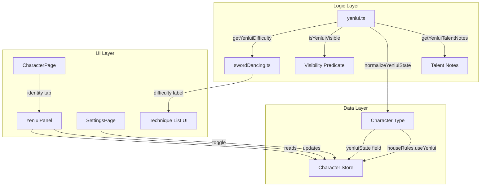

# Design Document: Yenlui Balance System

## Overview

The Yenlui Balance System adds spiritual balance tracking for Elven characters in the WFRP 4e character sheet PWA. "Yenlui" represents the inner harmony of an Elf's soul — a struggle between light and darkness that affects both roleplaying and mechanical outcomes (specifically sword-dancing difficulty).

The system is gated behind a house rule toggle (`useYenlui`) and species check (High Elf / Wood Elf only), ensuring it never clutters the experience for non-Elf characters or groups that don't use this optional rule.

### Key Design Decisions

1. **State stored on Character, not derived** — Yenlui state is a narrative-driven value set by the GM, not computed from other fields. It persists directly on the Character interface.
2. **Visibility logic as a pure predicate** — Panel visibility is determined by `useYenlui && isElf(species)`, reusing the existing `isElf()` utility from `src/logic/endeavours.ts`.
3. **No data clearing on hide** — Toggling the house rule off or changing species never clears the stored `yenluiState`. This prevents accidental data loss.
4. **Difficulty as a pure function** — Sword-dancing difficulty is computed from `yenluiState` and talent list, making it easily testable without UI rendering.

## Architecture



### Module Boundaries

| Module | Responsibility |
|--------|---------------|
| `src/types/character.ts` | Add `yenluiState` field, extend `HouseRules` |
| `src/logic/yenlui.ts` | Pure functions: visibility, difficulty, normalization, talent notes |
| `src/components/shared/YenluiPanel.tsx` | UI component: state display, controls, reference, talent notes |
| `src/components/shared/YenluiPanel.module.css` | Scoped styles |
| `src/components/pages/CharacterPage.tsx` | Render YenluiPanel between DeitySelector and Characteristics |
| `src/components/pages/SettingsPage.tsx` | Add useYenlui toggle in House Rules section |

## Components and Interfaces

### Data Model Extension

```typescript
// In src/types/character.ts

export type YenluiState = 'light' | 'balanced' | 'dark';

export interface HouseRules {
  rangedDamageSBMode: RangedDamageSBMode;
  impaleCritsOnTens: boolean;
  min1Wound: boolean;
  advantageCap: number;
  useGroupAdvantage: boolean;
  useYenlui: boolean;  // NEW — defaults to false
}

export interface Character {
  // ... existing fields ...
  yenluiState?: YenluiState;  // NEW — undefined means "Unset"
}
```

### Logic Module: `src/logic/yenlui.ts`

```typescript
import type { Character, YenluiState } from '../types/character';
import { isElf } from './endeavours';

// Allowed values for validation
const VALID_STATES: YenluiState[] = ['light', 'balanced', 'dark'];

/** Normalize a potentially invalid stored value to a valid YenluiState or undefined */
export function normalizeYenluiState(value: unknown): YenluiState | undefined {
  if (typeof value === 'string' && VALID_STATES.includes(value as YenluiState)) {
    return value as YenluiState;
  }
  return undefined;
}

/** Determine if the Yenlui panel should be visible */
export function isYenluiVisible(character: Character): boolean {
  return character.houseRules.useYenlui === true && isElf(character.species);
}

/** Elf species constants for gating */
export const ELF_SPECIES = ['High Elf', 'Wood Elf'] as const;

export interface DifficultyInfo {
  label: string;
  modifier: string;
}

/** Compute sword-dancing difficulty based on Yenlui state and talents */
export function getYenluiDifficulty(character: Character): DifficultyInfo {
  // Sanctuary of the Mind at level 3+ negates the dark penalty
  const sanctuaryTalent = character.talents.find(t => t.n === 'Sanctuary of the Mind');
  if (sanctuaryTalent && sanctuaryTalent.lvl >= 3) {
    return { label: 'Challenging', modifier: '(+0)' };
  }

  if (character.yenluiState === 'dark') {
    return { label: 'Very Hard', modifier: '(-30)' };
  }

  return { label: 'Challenging', modifier: '(+0)' };
}

export interface TalentNote {
  talentName: string;
  note: string;
}

/** Get Yenlui-relevant talent notes for the character */
export function getYenluiTalentNotes(character: Character): TalentNote[] {
  const notes: TalentNote[] = [];

  if (character.talents.some(t => t.n === 'Blood of Aenarion')) {
    notes.push({
      talentName: 'Blood of Aenarion',
      note: 'Weekly Average (+20) Cool Test required or Yenlui shifts to Dark.',
    });
  }

  if (character.talents.some(t => t.n === 'Cadai Meditation')) {
    notes.push({
      talentName: 'Cadai Meditation',
      note: 'Daily meditation (1hr+) with Average (+20) Pray Test can shift Yenlui to Light.',
    });
  }

  const sanctuary = character.talents.find(t => t.n === 'Sanctuary of the Mind');
  if (sanctuary && sanctuary.lvl >= 3) {
    notes.push({
      talentName: 'Sanctuary of the Mind',
      note: 'Negates the -30 Yenlui (Dark) penalty to sword-dancing difficulty.',
    });
  }

  return notes;
}

/** State display metadata */
export const YENLUI_STATE_META: Record<string, { label: string; description: string }> = {
  light: {
    label: 'Light',
    description: 'Soul drawn toward purity, restraint, and the Cadai. Sword-dancing flows freely.',
  },
  balanced: {
    label: 'Balanced',
    description: 'Harmony between light and dark. The ideal Elven state of spiritual equilibrium.',
  },
  dark: {
    label: 'Dark',
    description: 'Soul drawn toward excess and the Cytharai. Sword-dancing suffers (-30 penalty).',
  },
};
```

### UI Component: `YenluiPanel`

```typescript
interface YenluiPanelProps {
  character: Character;
  updateCharacter: (mutator: (char: Character) => Character) => void;
}
```

The component:
- Receives the full character and the `updateCharacter` mutator (same pattern as `DeitySelector`)
- Internally calls `isYenluiVisible()` — renders `null` if not visible
- Displays current state with icon + label
- Provides 4 toggle buttons (Unset, Light, Balanced, Dark) for manual adjustment
- Shows collapsible reference section with Dark/Light influence sub-lists
- Shows talent integration notes when qualifying talents are present

### SettingsPage Toggle

A new toggle entry in the House Rules card following the same `toggleRow` pattern:
- Label: "Yenlui Balance (High Elf)"
- Description: "Track Elven spiritual balance (High Elf Player's Guide)"
- ON/OFF button calling `update('houseRules.useYenlui', !character.houseRules.useYenlui)`

## Data Models

### YenluiState Type

| Value | Meaning | Sword-Dancing Effect |
|-------|---------|---------------------|
| `undefined` | Unset / no active trait | No penalty (Challenging +0) |
| `'light'` | Soul drawn to Cadai | No penalty (Challenging +0) |
| `'balanced'` | Spiritual equilibrium | No penalty (Challenging +0) |
| `'dark'` | Soul drawn to Cytharai | -30 penalty (Very Hard) |

### HouseRules Extension

| Field | Type | Default | Purpose |
|-------|------|---------|---------|
| `useYenlui` | `boolean` | `false` | Enables/disables Yenlui panel system-wide |

### Character Extension

| Field | Type | Default | Purpose |
|-------|------|---------|---------|
| `yenluiState` | `YenluiState \| undefined` | `undefined` | Current spiritual balance |

### Storage & Migration

The `yenluiState` field is optional. Existing characters without the field will naturally have `undefined`, requiring no migration. The `useYenlui` house rule defaults to `false` in `BLANK_CHARACTER`, so existing users see no change until they enable it.

On deserialization, the `normalizeYenluiState()` function validates stored values. Any value not in the allowed set is treated as `undefined`, providing forward-compatible handling of corrupted data.

## Correctness Properties

*A property is a characteristic or behavior that should hold true across all valid executions of a system — essentially, a formal statement about what the system should do. Properties serve as the bridge between human-readable specifications and machine-verifiable correctness guarantees.*

### Property 1: Serialization Round-Trip

*For any* valid `yenluiState` value (including `undefined`), serializing a character to JSON and deserializing it back SHALL produce a character with the same `yenluiState` value.

**Validates: Requirements 1.3, 1.4**

### Property 2: Invalid Value Normalization

*For any* string that is not one of `'light'`, `'balanced'`, or `'dark'`, `normalizeYenluiState()` SHALL return `undefined`.

**Validates: Requirements 1.5**

### Property 3: Panel Visibility Predicate

*For any* character, the Yenlui panel is visible if and only if `houseRules.useYenlui` is `true` AND the character's species is an Elf species (`'High Elf'` or `'Wood Elf'`). For all other combinations, the panel SHALL not be rendered.

**Validates: Requirements 2.4, 2.5, 3.1, 3.2, 3.5**

### Property 4: State Preservation Invariant

*For any* character with any valid `yenluiState`, toggling `useYenlui` from `true` to `false` or changing species from an Elf species to a non-Elf species SHALL preserve the `yenluiState` value unchanged.

**Validates: Requirements 2.6, 3.3**

### Property 5: Correct State Label Display

*For any* valid `yenluiState` value (light, balanced, dark, or undefined), the panel SHALL display exactly one label from the set {"Light", "Balanced", "Dark", "Unset"} that corresponds to the stored value.

**Validates: Requirements 4.1**

### Property 6: State Transition Correctness

*For any* current `yenluiState` value and any target state different from the current value, selecting the target state SHALL update the stored `yenluiState` to the new value.

**Validates: Requirements 5.2**

### Property 7: Same-State Idempotence

*For any* active `yenluiState` value, selecting the same state that is already active SHALL not trigger a store update (no-op).

**Validates: Requirements 5.3**

### Property 8: Sword-Dancing Difficulty Computation

*For any* character with any `yenluiState` value and any talent configuration, `getYenluiDifficulty()` SHALL return `{ label: 'Very Hard', modifier: '(-30)' }` if and only if `yenluiState` is `'dark'` AND the character does not have "Sanctuary of the Mind" at level 3 or higher. In all other cases, it SHALL return `{ label: 'Challenging', modifier: '(+0)' }`.

**Validates: Requirements 6.1, 6.2, 6.3**

### Property 9: Independent Collapse Toggle

*For any* combination of collapse states for the Dark Influences and Light Influences sub-lists, toggling one list's visibility SHALL change only that list's state and leave the other list's collapse state unchanged.

**Validates: Requirements 7.4**

### Property 10: Talent Note Count Matches Qualifying Talents

*For any* combination of character talents, the number of talent notes rendered in the Yenlui panel SHALL equal the count of qualifying talents (Blood of Aenarion present, Cadai Meditation present, or Sanctuary of the Mind at level ≥ 3).

**Validates: Requirements 8.6**

### Property 11: Description Length Constraint

*For any* active `yenluiState` (light, balanced, or dark), the roleplaying description displayed SHALL be no more than 120 characters.

**Validates: Requirements 4.4**

## Error Handling

| Scenario | Handling |
|----------|----------|
| Invalid `yenluiState` in storage (e.g., corrupted JSON) | `normalizeYenluiState()` returns `undefined`; panel shows "Unset" |
| Missing `useYenlui` in legacy character data | Defaults to `false` via `BLANK_CHARACTER` merge on load |
| Species string not recognized | `isElf()` returns `false`; panel hidden |
| Talent with unexpected name casing | Exact string match (`t.n === 'Blood of Aenarion'`) — no fuzzy matching; talent note simply won't appear |
| `learnedTechniques` undefined (legacy) | Existing `getLearnedTechniques()` returns `[]`; no difficulty indicators shown |

No error dialogs or user-facing error messages are needed. All error conditions degrade gracefully to a hidden or neutral state.

## Testing Strategy

### Property-Based Tests (fast-check)

The project already uses `fast-check` (v4.8.0) with `vitest`. Property tests will live in `src/logic/__tests__/yenlui.property.test.ts`.

**Configuration:**
- Minimum 100 iterations per property (`{ numRuns: 100 }`)
- Each test tagged with: `Feature: yenlui-balance-system, Property {N}: {title}`
- Generators for `YenluiState`: `fc.constantFrom('light', 'balanced', 'dark', undefined)`
- Generators for species: `fc.constantFrom('Human / Reiklander', 'Dwarf', 'Halfling', 'High Elf', 'Wood Elf', '', 'Unknown')`
- Generator for invalid state values: `fc.string().filter(s => !['light', 'balanced', 'dark'].includes(s))`

**Properties to implement:**
1. Serialization round-trip
2. Invalid value normalization
3. Panel visibility predicate
4. State preservation invariant
5. Correct state label display
6. State transition correctness
7. Same-state idempotence
8. Sword-dancing difficulty computation
9. Independent collapse toggle
10. Talent note count matches qualifying talents
11. Description length constraint

### Unit Tests (vitest)

Located in `src/logic/__tests__/yenlui.test.ts` and `src/components/shared/__tests__/YenluiPanel.test.tsx`:

- Default `useYenlui` is `false` in BLANK_CHARACTER
- Settings toggle renders correct label and description
- Panel placement in identity tab (after DeitySelector, before Characteristics)
- Dark state shows "-30" warning indicator
- Unset state omits description area
- Collapsed reference section by default
- Talent notes show correct text for each qualifying talent
- Sanctuary of the Mind below level 3 shows no note
- No techniques → no difficulty indicators displayed
- Keyboard operability and accessible labels on controls
- 44×44px touch targets at mobile viewport

### Integration Tests

- Full character save/load cycle with `yenluiState` set
- Toggle house rule on/off and verify panel visibility in CharacterPage
- Switch species and verify panel show/hide behavior

### Accessibility

- All state buttons have `aria-label` identifying the state
- Visual indicators use both icon and text (not colour alone)
- Focus management follows existing Card/button patterns
- Touch targets ≥ 44×44 CSS pixels on mobile
